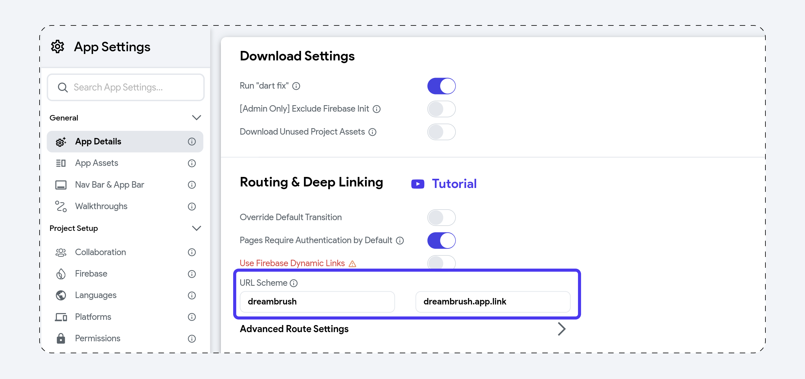
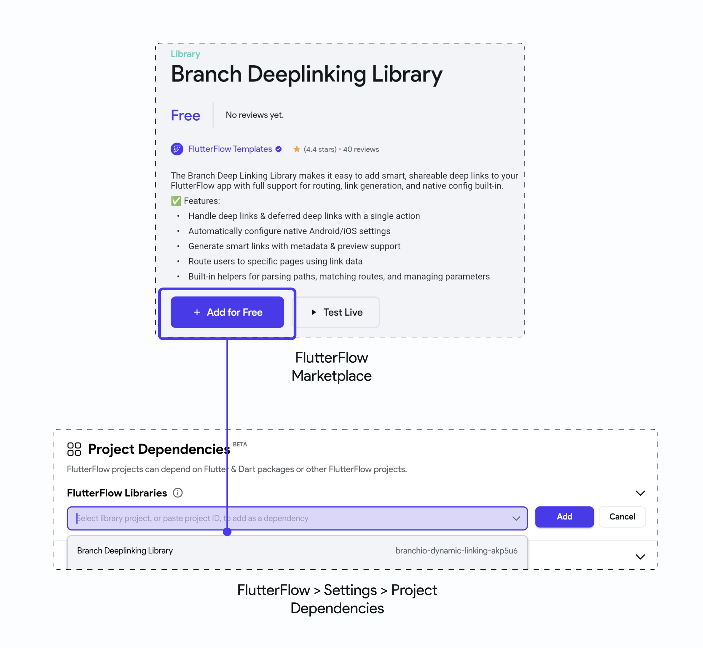

# Deep & Dynamic Linking

:::danger[Support for Dynamic Links]
On August 25th, 2025, Firebase Dynamic Links will be shut down. Read more about the [**announcement here**](https://firebase.google.com/support/dynamic-links-faq). It's recommended to start exploring alternative solutions like [**Branch.io**](#branch-deeplinking-library) for link management and deep linking.
:::

Adding deep and dynamic linking allows you to share a special type of link that takes the user right
inside the specific page of your app. You can also send the custom data with a link to load the page
content based on the data.

For example, you could share an interesting social media post with your friends, and they can
directly access its content without manually searching the post inside the app. It just works like
any website link would work.

The figure below illustrates how it works:

<figure>
    
  <figcaption class="centered-caption">Deep and Dynamic link flow</figcaption>
</figure>

When you click on the link, first, it checks if the app is installed. If not, the link opens the
Playstore or Appstore (based on your device) to install the app. After installing, if the page
requires authentication, you'll see a login page. After successful login, you can access the content
shared with you.

The best thing to note here is that even if the app has a different flow for accessing the page
content (e.g., Home Page -> All Posts -> Single Post), you can bypass the flow and directly open a
specific page (e.g., Single Post).

## Deep Link

The deep link allows you to create a URL that will open a specific page in your app. For the deep
links to work, you must have the app installed on your device.

### URL Scheme (structure)

The deep link consists of three parts. It begins with the scheme followed by the host and page name,
such as `designersapp://designersapp.com/profile`.


If the page name is not provided (i.e. `designersapp://mydesignersapp.com/)`It will open the app's
landing page.


### Adding Deep Link

Let's build an example of sharing and opening a profile page using the deep link. The example looks
like the below:

<figure>
    </img>
  <figcaption class="centered-caption">Sharing and opening a deep link</figcaption>
</figure>

The steps to add the deep link are as follows:

1. [Set URL scheme](#1-set-url-scheme)
2. [Setting page URL](#2-setting-page-url)
3. [Sharing deep link](#3-sharing-deep-link)
4. [Testing deep link](#4-testing-deep-link)

#### 1. Set URL scheme

In this step, You will set the URL scheme. To do that:

1. Navigate to **Settings & Integrations > General > App Details.**

2. If you want to add deep linking on multiple pages and all of them require users to log in, turn
   on the **Pages Requires Authentication by Default**.

3. In **URL scheme** fields, by default we add the values based on your project name. To change it,
   enter the **scheme** **name** (before "://") and **hostname** (after "://").

4. If you want users to navigate back to the home page instead of closing the app when they press
   the back button from a deep link page, enable the **Pages Are Subroutes of Root Page** option.


:::tip
We recommend enabling this option to increase user engagement with your app.
:::

#### 2. Setting page URL

The page URL points to the specific page in your app, which is used on the Web and for deep linking
on mobile.

To set the page URL:

1. Select the page that you would like to open via a deep link.

2. Move the **properties panel** on the right and open the **Route Settings** section.

3. By default, the Route is the current page name. Edit this if you want a different name in the
   page URL.

4. By default, the page does not require authentication when it opens via the deep link. However,
   checkmark the **Requires Authentication** if your app works only after login.

<figure>
    </img>
  <figcaption class="centered-caption">Setting page URL</figcaption>
</figure>

#### 3. Sharing deep link

You can share the deep link of the current page by adding
the [share action](share-action.md).

To share the deep link of the current page:

1. Select the page that you would like to open via a deep link.

2. From that page, select any widget (e.g. share button) from the widget tree or the canvas area.

3. Select **Actions** from the Properties Panel (the right menu), and click **Open**. This will open
   an **Action flow Editor** in a new popup window.

    1. Click on the **+ Add Action**.
    2. On the right side, search and select the **Share** action.
    3. Set the **Value Source** to **From Variable**.
    4. Set the **Source** to **Global Properties**.
    5. Set the **Available Options** to **Link To Current Page** and click **Close**.

<figure>
    </img>
  <figcaption class="centered-caption">Sharing deep link</figcaption>
</figure>

#### 4. Testing deep link

Deep links can not be tested in Run Mode. Instead, you will need to test the deep links on a real
device/emulator.

Before you test the deep link, you need to get it first. The easiest way to get it is to run the app
on a device/emulator, click on the share button and then copy the deep link.

Now, you can test the deep link in two ways:

<details>
<summary>Using CLI tools</summary>

If you have Android Studio with the SDK platform tools installed, you can run the following command
in the terminal and replace it with your deep link.

Copy

```
adb shell am start -a android.intent.action.VIEW \
    -c android.intent.category.BROWSABLE \
    -d "designersapp://designersapp.com/profile"
```

</details>

<details>
<summary>Using Firefox mobile browser</summary>

You can also test the deep link in a Firefox mobile browser. To do so, open the browser, paste the
URL in the search bar, open the options menu and click on the **Open in app**.

Here is how you do it:

<figure>
    </img>
  <figcaption class="centered-caption">Using Firefox mobile browser to open the deep link</figcaption>
</figure>
</details>

## Dynamic Links with Firebase Dynamic Links [Deprecated]

The dynamic link opens a specific page in your app. Unlike the deep link, the dynamic link survives
the app install. That means if the user has not installed the app, they can be taken to the
respective store to install the app. After the app is installed, users can be taken straight to the
intended app page.

For the dynamic link to work, you need to enable
the [deep link](#adding-deep-link). You can think of a
dynamic link as the additional benefit of the deep link.

:::note
FlutterFlow uses [**Firebase Dynamic Link**](https://firebase.google.com/docs/dynamic-links) (a
product
from Firebase) to create dynamic links.
:::

Let’s walk through an example of sharing and opening a profile page using a dynamic link. The example will look like this:

<figure>
    </img>
  <figcaption class="centered-caption">Dynamic link example</figcaption>
</figure>

The steps to add the dynamic link are as follows:

1. [Setting up a domain](#1-setting-up-a-domain)
2. [iOS setup](#2-ios-setup)
3. [Set URL scheme](#3-set-url-scheme)
4. [Setting page URL](#4-setting-page-url)
5. [Sharing dynamic link](#5-sharing-dynamic-link)
6. [Testing dynamic link](#6-testing-dynamic-link)

### 1. Setting up a domain

The dynamic link requires a domain name that will be used as the URL prefix in the link.

To set up the domain name, follow the steps below:

1. Open the [Firebase console](https://console.firebase.google.com/), and click on **Dynamic Link
   ** (on the left side menu).

2. Click on the **Get Started** button. This will open a popup.

3. Enter the domain name. If you don't own a domain, you can select the free **Google Provided
   Domain** that ends with a **page.link**. To set up your own domain, follow the
   guide [here](https://firebase.google.com/docs/dynamic-links/custom-domains).

4. If you chose Google Provided Domain, you could **Finish** the setup.

<figure>
    </img>>
  <figcaption class="centered-caption">Setting up a domain for the dynamic link</figcaption>
</figure>

### 2. iOS setup

You must complete additional configuration for the dynamic link to work on the iOS devices.

Setting up iOS includes:

#### 2.1 Add App Store and Team ID to the Firebase project

To add the App Store and Team ID to the Firebase project:

1. Open the [Firebase console](https://console.firebase.google.com/), and click on **Project
   Overview** (on the left side menu).

2. Select the iOS project and click on the Settings (gear) icon inside.

3. Scroll down to see your selected iOS project.

4. Find the **App Store ID** field, click on the edit icon (pencil icon), enter the ID, and click *
   *Save**. To know where is your App Store ID, click on the question mark icon beside the label.

5. Similarly, find the **Team ID** field, click on the edit icon (pencil icon), enter the ID, and
   click **Save**. To know where is your Team ID, click on the question mark icon beside the label.

<figure>
    </img>
  <figcaption class="centered-caption">Adding App Store and Team ID to the Firebase project</figcaption>
</figure>

#### 2.2 Adding Associated Domain capability to App Store

To add the Associated Domain capability on App Store:

1. Open the [Apple Developer homepage](https://developer.apple.com/account) and select *
   *Certificates, IDs & Profiles**.

2. Select **Identifiers** (far left menu) and then click on your app identifier.

3. Checkmark the **Associated Domains** and click **Save**.

<figure>
    </img>
  <figcaption class="centered-caption">Adding Associated Domain capability to App Store</figcaption>
</figure>

### 3. Set URL scheme

In this step, You will set the URL scheme. To do that:

1. Navigate to **Settings & Integrations > General > App Details.**

2. If you want to add deep linking on multiple pages and all of them require users to log in, turn
   on the **Pages Requires Authentication by Default**.

3. Also, turn on the **Use Firebase Dynamic Links**.

4. In **URL scheme** fields, by default, we add the values based on your project name. To change
   it, enter the **scheme** **name** (before `://`) and **hostname** (after `://`).

5. If you want users to navigate back to the home page instead of closing the app when they press
   the back button from a deep link page, enable the **Pages Are Subroutes of Root Page** option. *
   *Tip**: we recommend enabling this option to increase user engagement with your app.


### 4. Setting page URL

The page URL points to the specific page in your app, which is used on the Web and for deep linking
on mobile.

To set the page URL:

1. Select the page that you would like to open via a dynamic link.

2. Move the **properties panel** on the right and open the **Route Settings** section.

3. By default, the Route is the current page name. Edit this if you want a different name in the
   page URL.

4. By default, the page does not require authentication when it opens via the dynamic link.
   However, checkmark the **Requires Authentication** if your app works only after login.

<figure>
    </img>
  <figcaption class="centered-caption">Setting page URL</figcaption>
</figure>

### 5. Sharing dynamic link

You can share the dynamic link of the current page by adding the [**Generate Current Page Link
**](generate-current-page-link.md)
action and then sharing it using the [**Share Action**](share-action.md).

To share the dynamic link of the page:

1. Select the page that you would like to open via a deep link.

2. Select any widget (e.g., share button) from the widget tree or the canvas area.

3. First, add the action
   to [Generate Current Page Link](generate-current-page-link.md#defining-generate-current-page-link-action).

4. Now chain the next action to share the dynamic link.

5. To do that, click on the **+** button at the bottom of the box and select **Add Action**.

6. On the right side, search and select the **Share** action.

7. Set the **Value Source** to **From Variable**.

8. Set the **Source** to **Widget State**.

9. Set the **Available Options** to the **Current Page Link** and click **Close**.

<figure>
    </img>
  <figcaption class="centered-caption">Sharing dynamic link</figcaption>
</figure>

### 6. Testing dynamic link

Dynamic links can not be tested in Run Mode. Instead, you will need to test the links on a real
device/emulator.

Before you test the dynamic link, you need to get it first. The easiest way is to run the app on a
device/emulator. Click on the share button and then copy the dynamic link.

Now you can test the link in a Firefox mobile browser. To do so, open the browser and paste the URL
into the search bar.

Here is how you do it:

<figure>
    </img>
  <figcaption class="centered-caption">Testing Dynamic Link</figcaption>
</figure>

## Passing Data with a Link

In most cases, you might want to pass custom data with a link. For example, you send the product
page link with a discount code and share the profile page with its profile ID. Passing custom data
with the link can be used to retrieve the information required to display on the page.

<figure>
    </img>
  <figcaption class="centered-caption">Passing profile id in the link</figcaption>
</figure>

To pass custom data with the link, you need to have the following:

1. Make sure you have a parameter defined on a page you want to pass in a dynamic link.

<figure>
    
  <figcaption class="centered-caption">Adding parameter on page</figcaption>
</figure>

2. In the **Route Settings**, include a parameter as part of the route by prefixing it with a
   colon (**:**) for example, `profilePage/:profileId`.


<figure>
    
  <figcaption class="centered-caption">Including a parameter in the route</figcaption>
</figure>


That's all you need to pass custom data with a **Deep Link** or **Dynamic Link**.

## Deep Links with Branch.io

Since **Firebase Dynamic Links** have been deprecated and can no longer be used for new Firebase projects, we can integrate a powerful alternative: **[Branch.io](https://branch.io/)** — a cross-platform solution for deep linking and deferred linking.

With Branch, we can support robust deep linking inside FlutterFlow apps without writing a backend from scratch.


### Branch.io Configuration

Start by setting up your project in the [Branch Dashboard](https://dashboard.branch.io). Once you’ve created a project:

**1. Note down your Branch Key**  

Once you create a project, the first thing you’ll need to do is note down your **Branch Key**.  

<div style={{
    position: 'relative',
    paddingBottom: 'calc(56.67989417989418% + 41px)', // Keeps the aspect ratio and additional padding
    height: 0,
    width: '100%'
}}>
    <iframe 
        src="https://demo.arcade.software/7c9mN4P0ppY3qwczmMdh?embed&show_copy_link=true"
        title=""
        style={{
            position: 'absolute',
            top: 0,
            left: 0,
            width: '100%',
            height: '100%',
            colorScheme: 'light'
        }}
        frameborder="0"
        loading="lazy"
        webkitAllowFullScreen
        mozAllowFullScreen
        allowFullScreen
        allow="clipboard-write">
    </iframe>
</div>

<p>
</p>

This key uniquely identifies your app and will be required later when setting up your FlutterFlow configuration.

**2. Set up Redirect Links**  

In the Branch dashboard, you’ll find settings to define fallback URLs — these determine where users are sent if your app isn’t installed. Typically, you would redirect users to the App Store, Play Store, or a custom landing page.  

<div style={{
    position: 'relative',
    paddingBottom: 'calc(56.67989417989418% + 41px)', // Keeps the aspect ratio and additional padding
    height: 0,
    width: '100%'
}}>
    <iframe 
        src="https://demo.arcade.software/EtH2CeinH2NQpianzTIC?embed&show_copy_link=true"
        title=""
        style={{
            position: 'absolute',
            top: 0,
            left: 0,
            width: '100%',
            height: '100%',
            colorScheme: 'light'
        }}
        frameborder="0"
        loading="lazy"
        webkitAllowFullScreen
        mozAllowFullScreen
        allowFullScreen
        allow="clipboard-write">
    </iframe>
</div>

<p></p>

Setting up redirects is important because it ensures that your links don't break and that users always have a seamless experience, even if they need to install the app first.

**3. Create a Smart Link**  

After setting up your project and redirects, you can create a new Smart Link from the **Quick Links** tab in the Branch dashboard. Here you’ll be able to set a link title, alias, add analytics tags, and customize the social media preview (such as the image, title, and description).  

Once saved, Branch will generate a Smart Link that’s ready to use across your campaigns and app flows.

Here's a short demo:

<div style={{
    position: 'relative',
    paddingBottom: 'calc(56.67989417989418% + 41px)', // Keeps the aspect ratio and additional padding
    height: 0,
    width: '100%'
}}>
    <iframe 
        src="https://demo.arcade.software/w2egrzVVhzlcL1hTV6x7?embed&show_copy_link=true"
        title=""
        style={{
            position: 'absolute',
            top: 0,
            left: 0,
            width: '100%',
            height: '100%',
            colorScheme: 'light'
        }}
        frameborder="0"
        loading="lazy"
        webkitAllowFullScreen
        mozAllowFullScreen
        allowFullScreen
        allow="clipboard-write">
    </iframe>
</div>

### FlutterFlow Configuration Setup

To make **Branch Smart Links** work in your FlutterFlow app, you’ll need to update the native configuration files via the **Custom Code** tab in your project.

1. First, create environment variables for:
   - `branchHostUrl` (e.g., `brnch4.app.link`)
   - `branchKey` (your Branch key, use it for production and optionally `branchKeyTest` for dev environments. You can toggle modes through Branch dashboard and also through FlutterFlow environment toggling).

2. Then navigate to, FlutterFlow > Custom Code > Configuration Files.


**🔧 Android Setup**

1. Create two variables in `AndroidManifest.xml` file named `branchKey` and `branchHostUrl` and bind them to the environment variables we earlier created. 

2. Add an `intent-filter` block to your **Main Activity** through the **Activity Tags** hook:

```xml
<intent-filter android:autoVerify="true">
  <action android:name="android.intent.action.VIEW"/>
  <category android:name="android.intent.category.DEFAULT"/>
  <category android:name="android.intent.category.BROWSABLE"/>
  <data android:scheme="https" android:host="{{branchHostUrl}}"/>
</intent-filter>
```

3. Add an **App Component** block for meta-data:

```xml
<meta-data android:name="io.branch.sdk.BranchKey" android:value="{{branchKey}}"/>
<meta-data android:name="io.branch.sdk.TestMode" android:value="false"/>
```


**🍎 iOS Setup**

1. In `Info.plist`, add a new variable called `branchKey` and bind it to the environment variable.

2. In `Info.plist`, add the following code snippet.

```xml
<key>branch_key</key>
<string>{{branchKey}}</string>
```
3. In `Runner.entitlements`, add a new variable called `branchHostUrl` and bind it to the environment variable. 

4. In `Runner.entitlements`, add the following code snippet.

```xml
<key>com.apple.developer.associated-domains</key>
<array>
  <string>applinks:{{branchHostUrl}}</string>
</array>
```
Branch automatically hosts and serves the `apple-app-site-association` file needed for Universal Links. You don’t need to manually upload it to your domain.


**FlutterFlow Routing Setup**

FlutterFlow also defines a Custom URI Scheme (like `myapp://`) by default. Even if you're using Branch for web-based Smart Links, it’s a good idea to keep this in sync.

1. Go to:
Settings & Integrations > App Settings > App Details

2. Scroll to **Routing & Deep Linking** section.

3. Under Custom URI Scheme, match the URI host/domain to what’s defined in your Branch dashboard (e.g., `brnch4://` or `dreambrush://`).



Even if your links mainly use `https://`, FlutterFlow's routing engine may still use the custom URI internally. Keeping this field consistent prevents confusion or route mismatches.

You're now ready to use Branch Smart Links in a FlutterFlow app with seamless deferred deep linking, App/Universal Link verification, and environment-based configuration.

### Integrate Flutter Branch SDK 
To integrate Branch with your FlutterFlow app, you'll use the [`flutter_branch_sdk`](https://pub.dev/packages/flutter_branch_sdk) Dart package. This will allow your app to listen to Branch links and respond accordingly.


1. Go to your **FlutterFlow project > Settings and Integrations > Pubspec Dependencies** tab, and add the following dependency.

```js
flutter_branch_sdk: ^5.0.1
```
Make sure to use the latest version available from [pub.dev](https://pub.dev/packages/flutter_branch_sdk)


2. Create a Custom Action to initialize the Branch SDK. This ensures the Branch session is set up when your app starts.

```js
import 'package:flutter_branch_sdk/flutter_branch_sdk.dart';

Future initBranch() async {
  // Add your function code here!
  await FlutterBranchSdk.init();
}

```

Call this action inside the **Final Actions** of your `main.dart`. 

3. Create another custom action to listen for Branch link clicks and optionally route the user:

```js

// Automatic FlutterFlow imports
import '/flutter_flow/flutter_flow_theme.dart';
import '/flutter_flow/flutter_flow_util.dart';
import '/custom_code/actions/index.dart'; // Imports other custom actions
import '/flutter_flow/custom_functions.dart'; // Imports custom functions
import 'package:flutter/material.dart';
// Begin custom action code
// DO NOT REMOVE OR MODIFY THE CODE ABOVE!

import 'dart:async';
import 'package:flutter_branch_sdk/flutter_branch_sdk.dart';
import 'package:flutter/services.dart';

StreamSubscription<Map>? _branchSubscription; // stream subscription that listens for branch links
final Set<String> _handledBranchLinks = {};

Future handleBranchDeeplink(Future Function(dynamic data) onLinkOpened) async {
   // Add your function code here!

   if (_branchSubscription != null) return; // If already listening, ignore link

   _branchSubscription = FlutterBranchSdk.listSession().listen(
           (data) async {
      final clicked = data['+clicked_branch_link'] == true;
      if (!clicked) return;

      final uniqueId = data['~referring_link'] ?? data['deeplink_path'] ?? '';

      if (_handledBranchLinks.contains(uniqueId)) return;
      _handledBranchLinks.add(uniqueId);

      await onLinkOpened(Map<String, dynamic>.from(data)); // call action defined by user & pass the link data.
   },
   onError: (error) {
      if (error is PlatformException) {
         print('[Branch] PlatformException: ${error.code} - ${error.message}');
      } else {
         print('[Branch] Unknown error: $error');
      }
   },
);
}

```

You can pass custom key-value pairs like `"page": "paywall"` or `"navigation_type": "bottom_sheet"` when creating the Branch link, and retrieve them here to decide which screen to navigate to in FlutterFlow.

Be sure to test both fresh installs (deferred deep links) and existing app sessions to confirm that your actions run as expected.

:::tip
For a complete walkthrough, check out the tutorial video: 
<div class="video-container"><iframe src="https://www.youtube.com/embed/nEBot6-zhfY?si=y-flWx8zoGH8mgjM" title="YouTube video player" frameborder="0" allow="accelerometer; autoplay; clipboard-write; encrypted-media; gyroscope; picture-in-picture; web-share" referrerpolicy="strict-origin-when-cross-origin" allowfullscreen></iframe></div>
:::


## Branch Deeplinking Library

If you’d prefer not to integrate Branch.io from scratch, we have introduced the **Branch Deep Linking Library** that you can import from the Marketplace completely free.

This library sets up everything you need for routing users into your app using Branch’s smart links — with native configuration, link handling, and deep link helpers already wired in.

### Install Library

To install the Branch Deep Linking Library, open the FlutterFlow Marketplace, search for the library, and click **+ Add for Free**.

:::tip[marketplace]
You can find the [**Library here**](https://marketplace.flutterflow.io/item/oAco1HzQHxtOVE1ssTcC).
:::

This installs the library into your FlutterFlow account, and you can reuse it across any number of projects.



To add it to a specific project, go to **Settings > Project Dependencies**, click **Add Library**, and search for Branch.

### Branch Setup 

You’ll need two values from your Branch dashboard:

- **Branch Live Key** – your production API key from the Branch dashboard.
- **Custom Domain** – your configured link domain (e.g., yourapp.app.link)
This is the domain used to generate and handle smart links for your app.

We recommend storing these values in Environment Variables so you can:
- Manage them per environment (e.g., dev vs prod Branch keys).
- Easily assign them to the library’s configuration when adding it to a project.

**Adding Library Values**

When you add the Branch Deep Linking Library to your project, it will prompt you to provide three values:

- `branchApiKey`
- `branchHostUrl`
- `isTestMode`

Use the environment variables you created to populate these values.

:::info
`isTestMode` should be set to false when running your app in production.
:::

Here’s a quick demo to show how to configure those values inside your library panel.

<div style={{
    position: 'relative',
    paddingBottom: 'calc(56.67989417989418% + 41px)', // Keeps the aspect ratio and additional padding
    height: 0,
    width: '100%'
}}>
    <iframe 
        src="https://demo.arcade.software/AWUZbgiNKpKgwKjxAM17?embed&show_copy_link=true"
        title=""
        style={{
            position: 'absolute',
            top: 0,
            left: 0,
            width: '100%',
            height: '100%',
            colorScheme: 'light'
        }}
        frameborder="0"
        loading="lazy"
        webkitAllowFullScreen
        mozAllowFullScreen
        allowFullScreen
        allow="clipboard-write">
    </iframe>
</div>

<p></p>

#### Initialize the Branch SDK

Open your `main.dart` file in FlutterFlow and add the `initBranch` custom action under the **Final Actions** section. This ensures the **Branch SDK** is initialized when your app launches.

<div style={{
    position: 'relative',
    paddingBottom: 'calc(56.67989417989418% + 41px)', // Keeps the aspect ratio and additional padding
    height: 0,
    width: '100%'
}}>
    <iframe 
        src="https://demo.arcade.software/sAGP2IBXMbHMPP4rXRaQ?embed&show_copy_link=true"
        title=""
        style={{
            position: 'absolute',
            top: 0,
            left: 0,
            width: '100%',
            height: '100%',
            colorScheme: 'light'
        }}
        frameborder="0"
        loading="lazy"
        webkitAllowFullScreen
        mozAllowFullScreen
        allowFullScreen
        allow="clipboard-write">
    </iframe>
</div>


### Handle Branch Deeplink [Custom Action]

To receive and act on deep link data, go to your **Entry Page** or **Logged-In Page** and add the `handleBranchDeeplink` action as the first action in the page flow. 

This `handleBranchDeeplink` action listens for incoming Branch Deeplinks and handles routing logic. This action should be added to your Entry Page or Logged-In Page under the **onPageLoad** trigger. It initializes a stream listener that waits
for Branch links to be opened (either deferred or direct).

When a link is received, the `onLinkOpened` callback is triggered with
the link data, allowing you to perform custom navigation or logic. You can perform your navigation logic in this action callback. 

<div style={{
    position: 'relative',
    paddingBottom: 'calc(56.67989417989418% + 41px)', // Keeps the aspect ratio and additional padding
    height: 0,
    width: '100%'
}}>
    <iframe 
        src="https://demo.arcade.software/aRZju3GUJAzaqAUZs87G?embed&show_copy_link=true"
        title=""
        style={{
            position: 'absolute',
            top: 0,
            left: 0,
            width: '100%',
            height: '100%',
            colorScheme: 'light'
        }}
        frameborder="0"
        loading="lazy"
        webkitAllowFullScreen
        mozAllowFullScreen
        allowFullScreen
        allow="clipboard-write">
    </iframe>
</div>

<p></p>

**`linkData` Action Parameter**

The `handleBranchDeeplink` action receives a `linkData` object that contains all the metadata sent with the link. The `linkData` parameter is a Map containing useful information from the Branch link:

- **`$canonical_identifier`:** The original route path used when the link was generated (e.g., `/imageDetails/:id`).

- **`~referring_link`:** The full Branch URL that was clicked.

- **`page`:** The target page or screen the link is meant to open (e.g., paywall). This is a custom parameter set by the user when generating the link.

- Any custom parameters added during link creation (e.g., `campaign`, `productId`, `referrer`, etc.). Ensure the key and value is both `String` and `String`.

This lets you write flexible, conditional navigation logic based on what was shared.


<div style={{
    position: 'relative',
    paddingBottom: 'calc(56.67989417989418% + 41px)', // Keeps the aspect ratio and additional padding
    height: 0,
    width: '100%'
}}>
    <iframe 
        src="https://demo.arcade.software/FRDKejqwWVAmS27RJeQH?embed&show_copy_link=true"
        title=""
        style={{
            position: 'absolute',
            top: 0,
            left: 0,
            width: '100%',
            height: '100%',
            colorScheme: 'light'
        }}
        frameborder="0"
        loading="lazy"
        webkitAllowFullScreen
        mozAllowFullScreen
        allowFullScreen
        allow="clipboard-write">
    </iframe>
</div>

<p></p>

:::tip
Keep **"Allow Navigate Back"** checked when navigating from the Home Page to ensure it stays in the stack. This is applicable to any navigation from the Home Page, not limited to deeplinking navigation logic. 
This allows the user to return to the Home Page at any time and ensures that deep link logic defined there continues to work.
:::


Use the link data from this callback to:
- Navigate to a page.
- Show a bottom sheet.
- Load content from Firestore using a referenced ID.


:::danger[Testing Deeplinks]
It’s recommended to test deep links on a **physical device**, as link verification (especially for Universal Links or App Links) may not consistently work on emulators or simulators. We recommend using **[Local Run](../../testing-deployment-publishing/running-your-app/local-run.md)** to run your apps on physical devices.
:::


### Generate Link [Custom Action]


The `generateLink` action allows you to create a custom Branch Smart Link directly from your FlutterFlow app.

This is especially useful when you want to let users:
- Share app content (like a post, product, or image).
- Invite others with referral codes.
- Trigger deep links that take recipients to specific app screens.

The action accepts the following parameters:

- **`canonicalIdentifier`** – A unique path for the content (e.g., `/imageDetails/:id`). This becomes the key reference used when routing the user back into the app.

- **`title`** – The link's title (used in social previews or analytics).

- **`description`** – (Optional) A short description of the content.

- **`metadata`** – A dynamic map of custom parameters to include with the link
(e.g., page: "imageDetails", imageRef: "abc123", etc.) 

- **`linkProperties`** – A dynamic map for configuring how the link behaves
(e.g., set the `feature`, `channel`, `campaign`, or `stage` for analytics).

:::warning[JSON maps]
Due to a limitation, if you plan to leave map-type variables (like `metadata` or `linkProperties`) empty, you must still pass them as **empty maps**, not `null`.  
Ensure all keys and values are **plain strings**, avoid nested JSON or non-string types.  
Incorrect structure may cause the Link Generation action to fail silently.
:::

### Branch Helper Functions

These functions help you safely work with deep link data, extract values, and conditionally navigate based on link metadata.

- **`isTargetingPage(linkData, targetPage)`** - Checks whether the page value in the link data matches a specific screen name. The `page` parameter is set by the user when generating the link from Branch dashboard or FlutterFlow. 

- **`getCanonicalIdentifierFromLink(linkData)`** - Returns the canonical path (e.g., `/imageDetails/abc123`) that was originally attached to the smart link. Useful for extracting the base route or content reference associated with the shared link.

- **`getReferringLinkFromLink(linkData)`** - Retrieves the full Branch smart link URL from the data (typically under the `~referring_link` key). Useful for tracking, analytics, or verifying the source of the link.

- **`getLastPathSegmentFromMap(linkData, key)`** - Extracts the last path segment (e.g., `abc123`) from a URI stored inside a link data field (e.g., `/imageDetails/abc123`). Useful for extracting the ID from a link. 

- **`getLinkValue(linkData, key)`** - Safely retrieves any single value from the link data Map. Returns null if not found. (e.g., retrieving `showPromo` attribute value from the `linkData`).

- **`createLinkProperties(...)`** - Returns a Branch Link Properties map used when generating a smart link. You can define values like: feature, campaign, stage, channel, alias or tags or custom fallback URLs. Useful for organizing and tracking generated links for marketing or referrals. 


### DreamBrush Link Generation Example

In the DreamBrush app, we can use `generateLink` after a user finishes generating an image.
The link could include:
- **page**: Current Page Route that is `/imageDetails/:imageRef`.
- **title**: "Check out my AI image!"

This link can then be shared via WhatsApp, email, or social media — and when clicked, it brings the recipient directly to that content inside the app.

Here's a quick example of generating a Branch link from a page that uses a Firebase Document ID as a route parameter.

<div style={{
    position: 'relative',
    paddingBottom: 'calc(56.67989417989418% + 41px)', // Keeps the aspect ratio and additional padding
    height: 0,
    width: '100%'
}}>
    <iframe 
        src="https://demo.arcade.software/SELEpnhCryYrZD7KokAl?embed&show_copy_link=true"
        title=""
        style={{
            position: 'absolute',
            top: 0,
            left: 0,
            width: '100%',
            height: '100%',
            colorScheme: 'light'
        }}
        frameborder="0"
        loading="lazy"
        webkitAllowFullScreen
        mozAllowFullScreen
        allowFullScreen
        allow="clipboard-write">
    </iframe>
</div>

<p>
</p>

Now in your `handleBranchDeeplink` action callback, add the additional logic to handle such custom links: 

<div style={{
    position: 'relative',
    paddingBottom: 'calc(56.67989417989418% + 41px)', // Keeps the aspect ratio and additional padding
    height: 0,
    width: '100%'
}}>
    <iframe 
        src="https://demo.arcade.software/kZ7uvnohpGIER3ZTxPR8?embed&show_copy_link=true"
        title=""
        style={{
            position: 'absolute',
            top: 0,
            left: 0,
            width: '100%',
            height: '100%',
            colorScheme: 'light'
        }}
        frameborder="0"
        loading="lazy"
        webkitAllowFullScreen
        mozAllowFullScreen
        allowFullScreen
        allow="clipboard-write">
    </iframe>
</div>


### FAQs

<details>
<summary>Why isn't my deep link working when I navigate to another page from the home page?</summary>

It's likely because you're navigating in a way that removes the Home Page from the stack for example, disabling "**Allow Navigate Back**" in the Navigate Actions.

Since the deep link handler is defined on the Home Page, it gets disposed and can’t respond when a deep link is triggered.

✅ Solution:

Keep the Home Page in the stack by enabling "**Allow Navigate Back**" on any navigation actions from your home page (not limited to navigation logic in onLinkOpened action callback).

This ensures the Home Page stays active and can continue handling deep links.

</details>

<details>
<summary> Why is my Branch link generation failing?</summary>

This often happens because one or more of the inputs passed to the action (like `metadata` or `linkProperties` or `customParams` when using `createLinkProperties` helper function) contains invalid JSON formatting.

Branch expects these values to be passed as a map of plain `String` key-value pairs, not as nested JSON, objects, or dynamic types.

Ensure both **Key and Value's expected type** is `String` and `String` and try again.
</details>

<details>
<summary> Why isn’t deep linking working when testing from a simulator? </summary>

Deep linking, especially Universal Links and deferred deep linking may not work reliably on iOS or Android simulators/emulators due to platform limitations.

Simulator Limitations:
- **iOS:** Simulators cannot verify Universal Links properly (no App Store, limited AASA domain support).

- **Android:** Some versions fail to auto-verify App Links or handle deferred deep links without Play Services.

✅ Recommended:

Always test deep linking on a physical device for accurate behavior.

</details>
