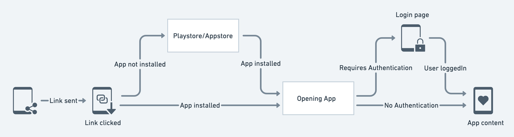
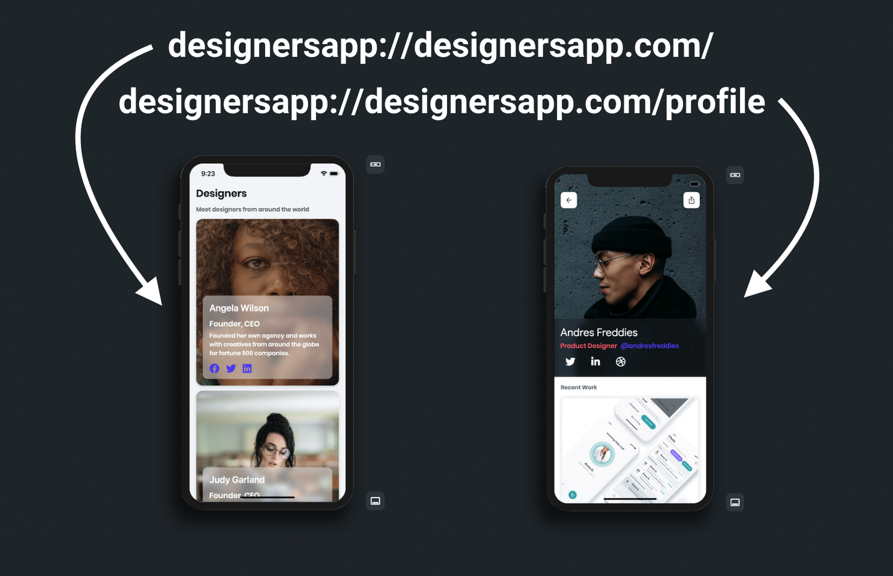
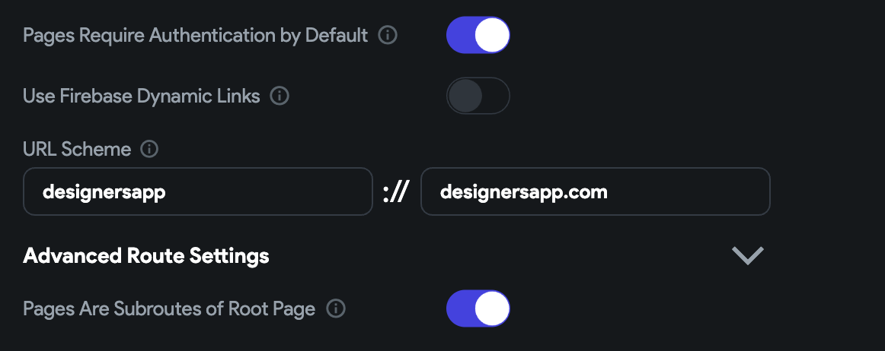
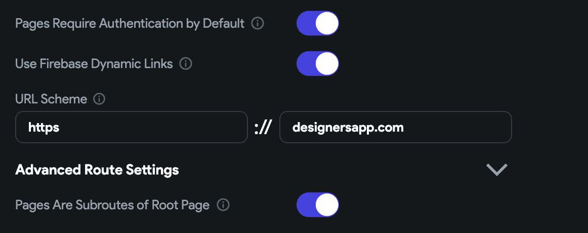
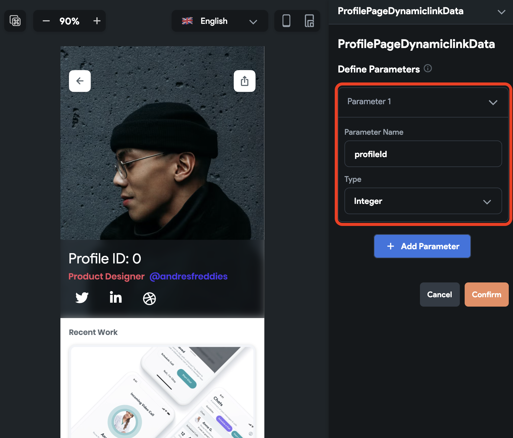
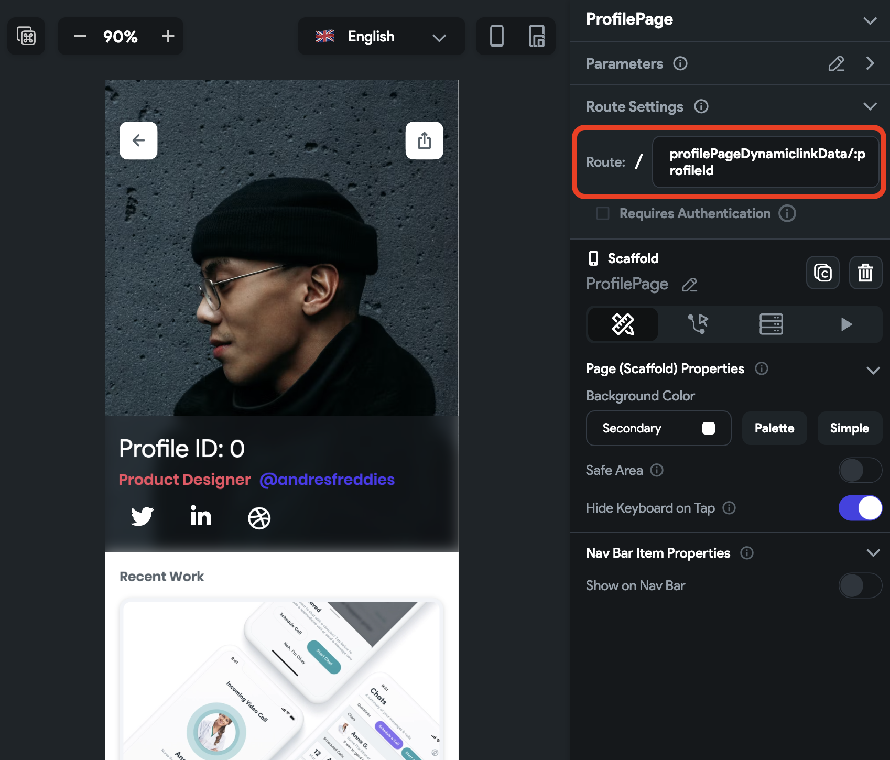

# Deep & Dynamic Linking

:::danger[Support for Dynamic Links]
On August 25th, 2025, Firebase Dynamic Links will be shut down. It's recommended to start exploring alternative solutions for link management and deep linking. Read more about the [**announcement here**](https://firebase.google.com/support/dynamic-links-faq).
:::

Adding deep and dynamic linking allows you to share a special type of link that takes the user right
inside the specific page of your app. You can also send the custom data with a link to load the page
content based on the data.

For example, you could share an interesting social media post with your friends, and they can
directly access its content without manually searching the post inside the app. It just works like
any website link would work.

The figure below illustrates how it works:

<figure>
    
  <figcaption class="centered-caption">Deep and Dynamic link flow</figcaption>
</figure>

When you click on the link, first, it checks if the app is installed. If not, the link opens the
Playstore or Appstore (based on your device) to install the app. After installing, if the page
requires authentication, you'll see a login page. After successful login, you can access the content
shared with you.

The best thing to note here is that even if the app has a different flow for accessing the page
content (e.g. Home Page -> All Posts -> Single Post), you can bypass the flow and directly open a
specific page (e.g. Single Post).

## Deep Link

The deep link allows you to create a URL that will open a specific page in your app. For the deep
links to work, you must have the app installed on your device.

### URL Scheme (structure)

The deep link consists of three parts. It begins with the scheme followed by the host and page name,
such as `designersapp://designersapp.com/profile`.


If the page name is not provided (i.e. `designersapp://mydesignersapp.com/)`It will open the app's
landing page.



### Adding Deep Link

Let's build an example of sharing and opening a profile page using the deep link. The example looks
like the below:

<figure>
    </img>
  <figcaption class="centered-caption">Sharing and opening a deep link</figcaption>
</figure>

The steps to add the deep link are as follows:

1. [Set URL scheme](#1-set-url-scheme)
2. [Setting page URL](#2-setting-page-url)
3. [Sharing deep link](#3-sharing-deep-link)
4. [Testing deep link](#4-testing-deep-link)

#### 1. Set URL scheme

In this step, You will set the URL scheme. To do that:

1. Navigate to **Settings & Integrations > General > App Details.**

2. If you want to add deep linking on multiple pages and all of them require users to log in, turn
   on the **Pages Requires Authentication by Default**.

3. In **URL scheme** fields, by default we add the values based on your project name. To change it,
   enter the **scheme** **name** (before "://") and **hostname** (after "://").

4. If you want users to navigate back to the home page instead of closing the app when they press
   the back button from a deep link page, enable the **Pages Are Subroutes of Root Page** option. *
   *Tip**: we recommend enabling this option to increase user engagement with your app.



#### 2. Setting page URL

The page URL points to the specific page in your app, which is used on the Web and for deep linking
on mobile.

To set the page URL:

1. Select the page that you would like to open via a deep link.

2. Move the **properties panel** on the right and open the **Route Settings** section.

3. By default, the Route is the current page name. Edit this if you want a different name in the
   page URL.

4. By default, the page does not require authentication when it opens via the deep link. However,
   checkmark the **Requires Authentication** if your app works only after login.

<figure>
    </img>
  <figcaption class="centered-caption">Setting page URL</figcaption>
</figure>

#### 3. Sharing deep link

You can share the deep link of the current page by adding
the [share action](share-action.md).

To share the deep link of the current page:

1. Select the page that you would like to open via a deep link.

2. From that page, select any widget (e.g. share button) from the widget tree or the canvas area.

3. Select **Actions** from the Properties Panel (the right menu), and click **Open**. This will open
   an **Action flow Editor** in a new popup window.

    1. Click on the **+ Add Action**.
    2. On the right side, search and select the **Share** action.
    3. Set the **Value Source** to **From Variable**.
    4. Set the **Source** to **Global Properties**.
    5. Set the **Available Options** to **Link To Current Page** and click **Close**.

<figure>
    </img>
  <figcaption class="centered-caption">Sharing deep link</figcaption>
</figure>

#### 4. Testing deep link

Deep links can not be tested in Run Mode. Instead, you will need to test the deep links on a real
device/emulator.

Before you test the deep link, you need to get it first. The easiest way to get it is to run the app
on a device/emulator, click on the share button and then copy the deep link.

Now, you can test the deep link in two ways:

<details>
<summary>Using CLI tools</summary>

If you have Android Studio with the SDK platform tools installed, you can run the following command
in the terminal and replace it with your deep link.

Copy

```
adb shell am start -a android.intent.action.VIEW \
    -c android.intent.category.BROWSABLE \
    -d "designersapp://designersapp.com/profile"
```

</details>

<details>
<summary>Using Firefox mobile browser</summary>

You can also test the deep link in a Firefox mobile browser. To do so, open the browser, paste the
URL in the search bar, open the options menu and click on the **Open in app**.

Here is how you do it:

<figure>
    </img>
  <figcaption class="centered-caption">Using Firefox mobile browser to open the deep link</figcaption>
</figure>
</details>

## Dynamic Link

The dynamic link opens a specific page in your app. Unlike the deep link, the dynamic link survives
the app install. That means if the user has not installed the app, they can be taken to the
respective store to install the app. After the app is installed, users can be taken straight to the
intended app page.

For the dynamic link to work, you need to enable
the [deep link](#adding-deep-link). You can think of a
dynamic link as the additional benefit of the deep link.

:::note
FlutterFlow uses [**Firebase Dynamic Link**](https://firebase.google.com/docs/dynamic-links) (a
product
from Firebase) to create dynamic links.
:::

### Adding Dynamic Link

Let's build an example of sharing and opening a profile page using the dynamic link. The example
looks like the below:

<figure>
    </img>
  <figcaption class="centered-caption">Dynamic link example</figcaption>
</figure>

The steps to add the dynamic link are as follows:

1. [Setting up a domain](#1-setting-up-a-domain)
2. [iOS setup](#2-ios-setup)
3. [Set URL scheme](#3-set-url-scheme)
4. [Setting page URL](#4-setting-page-url)
5. [Sharing dynamic link](#5-sharing-dynamic-link)
6. [Testing dynamic link](#6-testing-dynamic-link)

#### 1. Setting up a domain

The dynamic link requires a domain name that will be used as the URL prefix in the link.

To set up the domain name, follow the steps below:

1. Open the [Firebase console](https://console.firebase.google.com/), and click on **Dynamic Link
   ** (on the left side menu).

2. Click on the **Get Started** button. This will open a popup.

3. Enter the domain name. If you don't own a domain, you can select the free **Google Provided
   Domain** that ends with a **page.link**. To set up your own domain, follow the
   guide [here](https://firebase.google.com/docs/dynamic-links/custom-domains).

4. If you chose Google Provided Domain, you could **Finish** the setup.

<figure>
    </img>>
  <figcaption class="centered-caption">Setting up a domain for the dynamic link</figcaption>
</figure>

#### 2. iOS setup

You must complete additional configuration for the dynamic link to work on the iOS devices.

Setting up iOS includes:

#### 2.1 Add App Store and Team ID to the Firebase project

To add the App Store and Team ID to the Firebase project:

1. Open the [Firebase console](https://console.firebase.google.com/), and click on **Project
   Overview** (on the left side menu).

2. Select the iOS project and click on the Settings (gear) icon inside.

3. Scroll down to see your selected iOS project.

4. Find the **App Store ID** field, click on the edit icon (pencil icon), enter the ID, and click *
   *Save**. To know where is your App Store ID, click on the question mark icon beside the label.

5. Similarly, find the **Team ID** field, click on the edit icon (pencil icon), enter the ID, and
   click **Save**. To know where is your Team ID, click on the question mark icon beside the label.

<figure>
    </img>
  <figcaption class="centered-caption">Adding App Store and Team ID to the Firebase project</figcaption>
</figure>

#### 2.2 Adding Associated Domain capability to App Store

To add the Associated Domain capability on App Store:

1. Open the [Apple Developer homepage](https://developer.apple.com/account) and select *
   *Certificates, IDs & Profiles**.

2. Select **Identifiers** (far left menu) and then click on your app identifier.

3. Checkmark the **Associated Domains** and click **Save**.

<figure>
    </img>
  <figcaption class="centered-caption">Adding Associated Domain capability to App Store</figcaption>
</figure>

#### 3. Set URL scheme

In this step, You will set the URL scheme. To do that:

1. Navigate to **Settings & Integrations > General > App Details.**

2. If you want to add deep linking on multiple pages and all of them require users to log in, turn
   on the **Pages Requires Authentication by Default**.

3. Also, turn on the **Use Firebase Dynamic Links**.

4. In **URL scheme** fields, by default, we add the values based on your project name. To change
   it, enter the **scheme** **name** (before `://`) and **hostname** (after `://`).

5. If you want users to navigate back to the home page instead of closing the app when they press
   the back button from a deep link page, enable the **Pages Are Subroutes of Root Page** option. *
   *Tip**: we recommend enabling this option to increase user engagement with your app.



#### 4. Setting page URL

The page URL points to the specific page in your app, which is used on the Web and for deep linking
on mobile.

To set the page URL:

1. Select the page that you would like to open via a dynamic link.

2. Move the **properties panel** on the right and open the **Route Settings** section.

3. By default, the Route is the current page name. Edit this if you want a different name in the
   page URL.

4. By default, the page does not require authentication when it opens via the dynamic link.
   However, checkmark the **Requires Authentication** if your app works only after login.

<figure>
    </img>
  <figcaption class="centered-caption">Setting page URL</figcaption>
</figure>

#### 5. Sharing dynamic link

You can share the dynamic link of the current page by adding the [**Generate Current Page Link
**](generate-current-page-link.md)
action and then sharing it using the [**Share Action**](share-action.md).

To share the dynamic link of the page:

1. Select the page that you would like to open via a deep link.

2. Select any widget (e.g. share button) from the widget tree or the canvas area.

3. First, add the action
   to [Generate Current Page Link](generate-current-page-link.md#defining-generate-current-page-link-action).

4. Now chain the next action to share the dynamic link.

5. To do that, click on the **+** button at the bottom of the box and select **Add Action**.

6. On the right side, search and select the **Share** action.

7. Set the **Value Source** to **From Variable**.

8. Set the **Source** to **Widget State**.

9. Set the **Available Options** to the **Current Page Link** and click **Close**.

<figure>
    </img>
  <figcaption class="centered-caption">Sharing dynamic link</figcaption>
</figure>

#### 6. Testing dynamic link

Dynamic links can not be tested in Run Mode. Instead, you will need to test the links on a real
device/emulator.

Before you test the dynamic link, you need to get it first. The easiest way is to run the app on a
device/emulator. Click on the share button and then copy the dynamic link.

Now you can test the link in a Firefox mobile browser. To do so, open the browser and paste the URL
into the search bar.

Here is how you do it:

<figure>
    </img>
  <figcaption class="centered-caption">Testing Dynamic Link</figcaption>
</figure>

## Passing Data with a Link

In most cases, you might want to pass custom data with a link. For example, you send the product
page link with a discount code and share the profile page with its profile ID. Passing custom data
with the link can be used to retrieve the information required to display on the page.

<figure>
    </img>
  <figcaption class="centered-caption">Passing profile id in the link</figcaption>
</figure>

To pass custom data with the link, you need to have the following:

1. Make sure you have a parameter defined on a page you want to pass in a dynamic link.

<figure>
    
  <figcaption class="centered-caption">Adding parameter on page</figcaption>
</figure>

2. In the **Route Settings**, include a parameter as part of the route by prefixing it with a
   colon (**:**) for example, `profilePage/:profileId`.


<figure>
    
  <figcaption class="centered-caption">Including a parameter in the route</figcaption>
</figure>


That's all you need to pass custom data with a **Deep Link** or **Dynamic Link**.