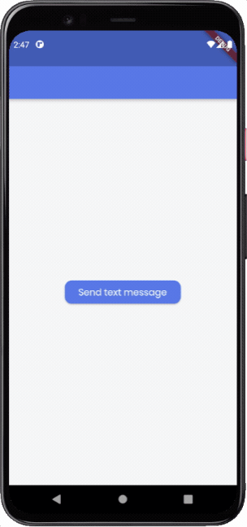
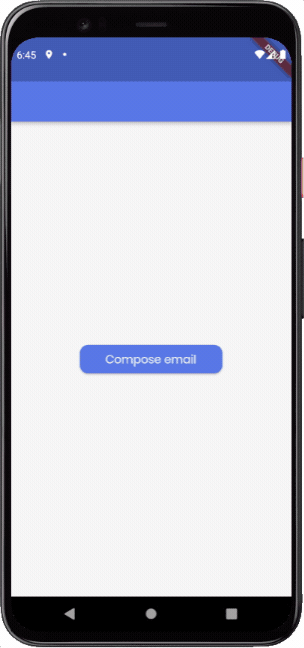

The Launch URL Action lets you specify a URL that will be opened using an app supporting it. If there is more than one app that can handle the specified URL, the user will be presented with a dialog from where one of the apps can be selected.

## Adding Launch URL Action

Follow the steps below to add this action to any widget.

1. Select the **Widget** (e.g., Container, Button, etc.) on which you want to add the action.
2. Select **Actions** from the Properties Panel (the right menu), and click **Open**. This will open an **Action Flow Editor** in a new popup window.
3. Click on the **+ Add Action**.
4. On the right side, search and select the **Launch URL** (under widget/UI Interactions) action.
5. In the *URL Value Type* property, select either **Specify URL** (to add the URL as a String) or **From Variable** (to use the value stored in a String variable).
6. If using **Specify URL**, enter the URL that you want to use in the **URL** field. For example, you can enter "[https://flutter.dev](https://flutter.dev/)" to open the Flutter webpage.
7. If using **From Variable**, select the **Source** from which to fetch the URL value. You can also specify a **Default Value** that will be used when the variable value is not set (i.e. null).

---

## URL schemes
A URL scheme is a way to define how different types of links, such as webpages, phone numbers, SMS messages, and emails, should be handled by an app or browser. The following are some common URL schemes that can be handled by an external app present on the user's device.

### Open a webpage

This URL scheme for loading up a webpage can be defined in this format:

#### Scheme

`http:<webpage URL link>`

`https:<webpage URL link>`

#### Example

`https://flutter.dev`

### Use a phone number

This URL scheme helps to handle phone numbers inside your app. Using this, you can easily initiate a phone call to the provided phone number from the user's device.

#### Scheme

`tel:<phone-number>`

#### Example

`tel:2125551212`

### Compose a text message

This URL scheme lets you redirect users from your app to compose and send an SMS message to a specified phone number.

#### Scheme

`sms:<phone_number>`

#### Example

`sms:2125551212`

### Create an email

This URL scheme helps you to launch an email app on the user's device. It allows you to pass the *email to*, *subject*, and *body* to the app so that you have these fields prefilled with details as the email app is opened.

#### Scheme

`mailto:<email_address>?subject=<subject>&body=<body>`

#### Example

`mailto:name@example.org?subject=Welcome%20to%20FlutterFlow&body=Hey%20there`

This will pass the following details to the email app:

***mailto:*** name@example.org, ***subject:*** Welcome to FlutterFlow, ***body:*** Hey there

