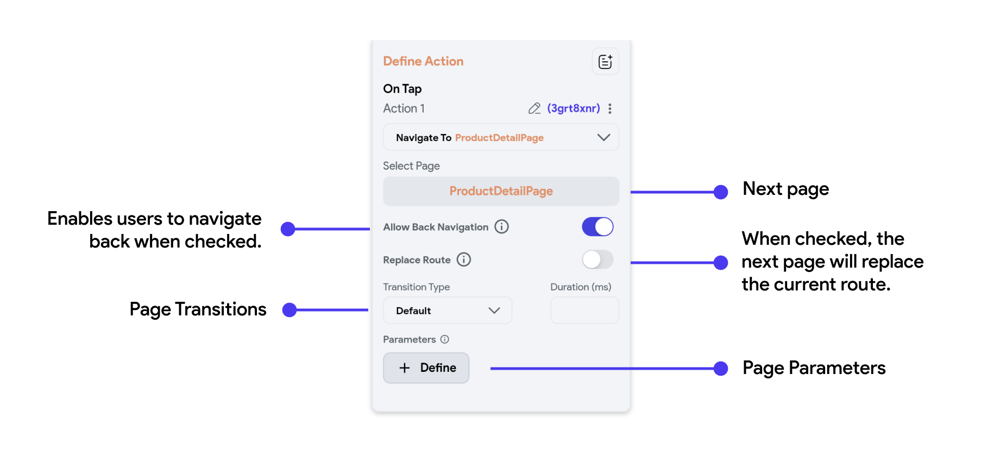

# Page Navigation

Page Navigation in FlutterFlow is handled through routing, where each page is identified by a unique route.
Navigation can be programmed to happen on events like button clicks, leading to
actions such as pushing a new route (opening a new page) or popping a route (returning to a previous
page). FlutterFlow simplifies the routing process, allowing you to visually design the navigation
flow of your app.

Let's see how to do that in FlutterFlow:

    <iframe 
        src="https://demo.arcade.software/EwmbXvNO5SvWtQdQyTBK?embed&show_copy_link=true"
        title="Navigate"
        style={{
            position: 'absolute',
            top: 0,
            left: 0,
            width: '100%',
            height: '100%',
            colorScheme: 'light'
        }}
        frameborder="0"
        loading="lazy"
        webkitAllowFullScreen
        mozAllowFullScreen
        allowFullScreen
        allow="clipboard-write">
    </iframe>

### Navigate To [Action]

The Navigate To Action allows you to set the next page and modify other
navigation-related properties:

| Action Property Name      | Type      | Description                                                                                                                                                                                                                                                                                                                                                                                     |
|---------------------------|-----------|-------------------------------------------------------------------------------------------------------------------------------------------------------------------------------------------------------------------------------------------------------------------------------------------------------------------------------------------------------------------------------------------------|
| **Allow Back Navigation** | Toggle    | Toggle this to prevent the user from navigating back to this page after moving to the next page                                                                                                                                                                                                                                                                                                 |
| **Replace Route**         | Toggle    | Use this option to replace the current page in the navigation stack. For example, if a user navigates from Page A to Page B and then to Page C, pressing the back button on Page C would normally return to Page B. However, if **Replace Route** is enabled on Page B, the route changes to Page A -> Page C; therefore, pressing the back button on Page C will take the user back to Page A. |
| **Transition Type**       | Drop Down | This allows you to specify an animation that will be applied while navigating away from a screen. Options include **Default, Instant, Fade In, Slide Up, Slide Down, Slide Left, Slide Right,** and **Scale**.                                                                                                                                                                                  |
| **Transition Duration**   | Double    | Set the duration of the transition animation in milliseconds                                                                                                                                                                                                                                                                                                                                    |
| **Page Parameters**       |          | Use this to send data to the next page during navigation.                                                                                                                                                                                                                                                                                                                                       |

:::info[Note]
**Allow Back Navigation** does not affect the Android back button. To disable the Android back
button,
set **Disable Android Back Button** property on the destination page.
:::

<figure>
    
  <figcaption class="centered-caption">Properties of a Navigate To Action</figcaption>
</figure>

### Navigate Back [Action]

In the next page you are navigating to, ensure that you add a 'Navigate Back'
action to the AppBar or wherever you want users to navigate from. Let's add a '
Navigate Back' action to our subsequent page, from which we navigated in the
previous section:

    <iframe 
        src="https://demo.arcade.software/SmD3l5fyhjR21ZYPntal?embed&show_copy_link=true"
        title=""
        style={{
            position: 'absolute',
            top: 0,
            left: 0,
            width: '100%',
            height: '100%',
            colorScheme: 'light'
        }}
        frameborder="0"
        loading="lazy"
        webkitAllowFullScreen
        mozAllowFullScreen
        allowFullScreen
        allow="clipboard-write">
    </iframe>

