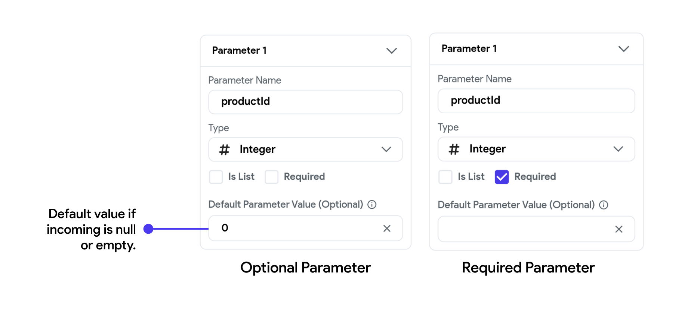

import Tabs from '@theme/Tabs';
import TabItem from '@theme/TabItem';

# Passing Data between Pages

As you build your app, you'll often encounter the need to pass through or transfer data from one page to another. For instance, when a user taps on a product item, you may want to send product data to the next page to display its details.

## Page parameters
This process of passing data between pages is accomplished using **Parameters**. When navigating
from one page to another, you can send parameters to configure the destination
page based on the data from the current page. This is useful for tasks like
passing a user ID to a profile page or specific details to a detailed view page.

To create a page parameter, follow the steps:

    <iframe 
        src="https://demo.arcade.software/oZV2X0pKNYO61p1jhY22?embed&show_copy_link=true"
        title="Create Page Parameters"
        style={{
            position: 'absolute',
            top: 0,
            left: 0,
            width: '100%',
            height: '100%',
            colorScheme: 'light'
        }}
        frameborder="0"
        loading="lazy"
        webkitAllowFullScreen
        mozAllowFullScreen
        allowFullScreen
        allow="clipboard-write">
    </iframe>

When a page parameter is set to Required, it indicates that this parameter is
mandatory when navigating to this page. Users must provide this value;
otherwise, FlutterFlow will throw errors. However, if you are creating an
optional parameter, please ensure this option is unchecked.

Additionally, you can specify a default value in the Default Parameter Value
field to safeguard against incoming values that are empty or null. This step is
optional.

If you have created a **Required** Page Parameter and there is a Navigation Action
already set on your previous page, FlutterFlow will throw errors because this
required parameter has not yet been sent from the previous page. Let's fix that:

    <iframe 
        src="https://demo.arcade.software/kp34JJipEW24hz0u5RsW?embed&show_copy_link=true"
        title="Send Page Parameters"
        style={{
            position: 'absolute',
            top: 0,
            left: 0,
            width: '100%',
            height: '100%',
            colorScheme: 'light'
        }}
        frameborder="0"
        loading="lazy"
        webkitAllowFullScreen
        mozAllowFullScreen
        allowFullScreen
        allow="clipboard-write">
    </iframe>

<figure>
    
  <figcaption class="centered-caption"></figcaption>
</figure>

:::info
Passing data can only be tested in **Run** and **Test** Mode (it can not be tested in Preview Mode).
:::
 
## When to use Page Parameters?
Page parameters are used to pass essential data between pages that is not
persisted in the app’s global state but is necessary for specific
functionalities or displays on the subsequent page. Here’s a
breakdown of typical uses:

- **Contextual Data:** Information that defines the context of the new page, such
as
identifiers for items or entities that the page must display. This could include
identifiers for transactions, specific products, or user profiles that were
selected on the previous page.

- **Configuration Options:** Settings or options chosen by the user that affect
how
the next page functions or appears. For example, filter or sort preferences
selected on a list page that need to be applied on a subsequent results page.

- **Operational Parameters:** Values needed for calculations or logic on the next
page
that are generated through user activities on the current page. These could be
values like quantities, dates, or configuration details necessary to perform
operations or initiate processes on the next page.

Page parameters are thus essential for maintaining a seamless user experience,
enabling the new page to function as intended based on the specific needs and
inputs from a previous interaction.

## Allowed Data Types

You can pass any supported data from one page to another via *page parameter(s)*. You can think of a *page parameter* as a variable that holds the value being passed from one page to another.

:::info
If you are using Firestore Database, most of the time, you would pass the *Document* (an actual record inside the Firestore collection) and *Document Reference (points to actual document)* between the pages.
:::
---

## Video guide

If you prefer watching a video tutorial, here's the one for you:

    <iframe 
        src="https://www.youtube.com/embed/F_4O1uWm22g"
        title=""
        style={{
            position: 'absolute',
            top: 0,
            left: 0,
            width: '100%',
            height: '100%',
            colorScheme: 'light'
        }}
        frameborder="0"
        loading="lazy"
        webkitAllowFullScreen
        mozAllowFullScreen
        allowFullScreen
        allow="clipboard-write">
    </iframe>

