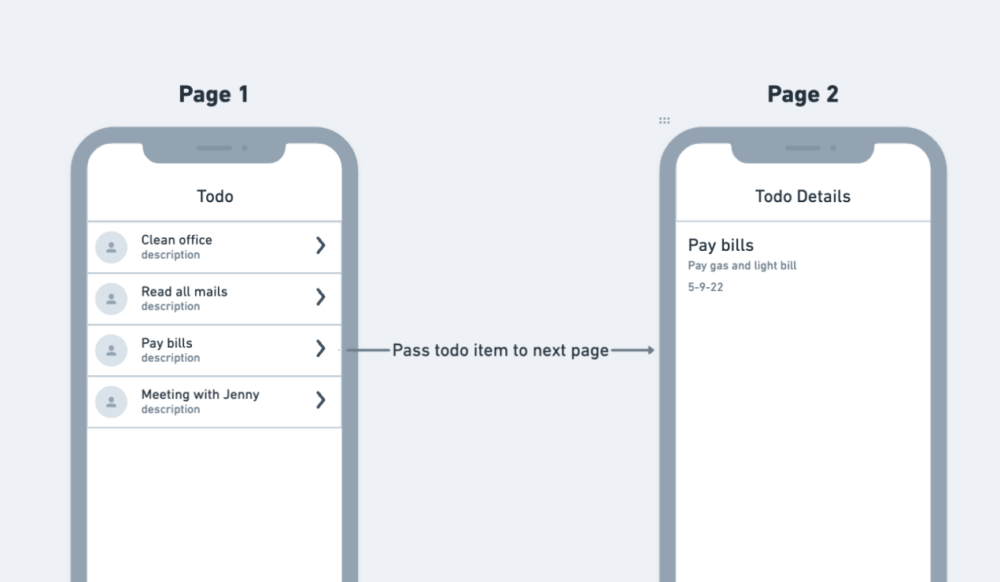

# Passing Data between Pages

As you build your app, you'll often encounter the need to pass through or transfer data from one page to another. For instance, when a user taps on a ListView item, you may want to send a Todo item to the next page to display its details.

This process of passing data between pages is accomplished using parameters.

:::info

Passing data can only be tested in **Run** and **Test** Mode (it can not be tested in Preview Mode).

:::

## How to pass data

To enable data passing between pages, start by defining the parameter(s) on the destination page. Next, on the first page, add the [navigate](https://docs.flutterflow.io/actions/actions/navigation/navigate) action and pass the desired parameter value. On the subsequent page, you can utilize the parameter value just as you would with any other variable.

The figure below illustrates the data passing flow:

## What you can pass

You can pass any [supported data](https://docs.flutterflow.io/data-and-backend/passing-data#when-to-use-which-data-type) from one page to another via *page parameter(s)*. You can think of a *page parameter* as a variable that holds the value being passed from one page to another.

If you are using Firestore Database, most of the time, you would pass the *Document* (an actual record inside the Firestore collection) and *Document Reference (points to actual document)* between the pages.

### When to use which data type

Let's see what all types of data you can pass and when to use them:

- **Integer**: To pass numbers such as 100, 4302, 50000, etc.
- **Double**: To pass a decimal number such as 12.43, 3233.50, 65.5666, etc.
- **String**: To pass plain text such as title, description, etc.
- **Image Path**: To pass the URL of the uploaded image.
- **Video Path**: To pass the URL of the uploaded video.
- **Audio Path**: To pass the URL of the uploaded audio.
- **Boolean**: To pass either a True or False value.
- **Color**: To pass color value.
- **Document Reference**: To pass a reference of a document. Passing a document reference helps you fetch the document data. For example, fetching user's details based on the user reference.
- **Document**: To pass the actual document (i.e., a Firestore document). For example, passing the whole todo item to the next page.
- **DateTime**: To pass the date and time value.
- **JSON**: To pass the JSON value such as `{"firstName":"John", "lastName":"Doe"}`.
- **TimestampRange**: To pass the start date-time and end date-time values.
- **Lat Lng**: To pass the latitude and longitude of a particular place.
- **GooglePlace**: To pass the GooglePlace data.
- **Uploaded File (Bytes)**: To pass the uploaded file in *Bytes*.

---

## Common use cases for passing data

This section provides instructions on how to build some everyday use cases in your app.

Here are they:

1. [Passing data to the next page](https://docs.flutterflow.io/data-and-backend/passing-data#1.-passing-data-to-the-next-page)
2. [Passing ListView item](https://docs.flutterflow.io/data-and-backend/passing-data#2.-passing-listview-item)
3. [Passing a document reference](https://docs.flutterflow.io/data-and-backend/passing-data#3.-passing-a-document-reference)
4. [Passing data to a component](https://docs.flutterflow.io/data-and-backend/passing-data#4.-passing-data-to-a-component)

### 1. Passing data to the next page

Let's see how to send the typed message to the next page.

Sending a message to the next page

https://docs.flutterflow.io/~gitbook/image?url=https%3A%2F%2F468516190-files.gitbook.io%2F%7E%2Ffiles%2Fv0%2Fb%2Fgitbook-x-prod.appspot.com%2Fo%2Fspaces%252F-MhFNOxEwcl8ED58MUC_%252Fuploads%252F9UfYExQdh977f7nUsiwG%252F1-passing-simple-data-demo.gif%3Falt%3Dmedia%26token%3D9e1e25da-8393-4515-bac2-c47e6c1c0e3b&width=768&dpr=4&quality=100&sign=74423ec153b464802420c3d274daafc3b80d7fdb4476f59b1bbc462ca02d2c2d

The steps to pass data from one page to another are as follows:

1. [Building the first page](https://docs.flutterflow.io/data-and-backend/passing-data#1.1-building-the-first-page)
2. [Building the second page](https://docs.flutterflow.io/data-and-backend/passing-data#1.2-building-the-second-page)
3. [Add a parameter on the second page](https://docs.flutterflow.io/data-and-backend/passing-data#1.3-add-a-parameter-on-the-second-page)
4. [Pass data from the first page](https://docs.flutterflow.io/data-and-backend/passing-data#1.4-pass-data-from-the-first-page)
5. [Showing parameter value in UI element](https://docs.flutterflow.io/data-and-backend/passing-data#1.5-showing-parameter-value-in-ui-element)

:::info

If you have already created your pages, you can skip to [Step 3](https://docs.flutterflow.io/data-and-backend/passing-data#1.3-add-a-parameter-on-the-second-page).

:::

#### 1.1 Building the first page

Before you pass any data to the next page, you must capture the data on the first page. To do so, you can add a [TextField](https://docs.flutterflow.io/widgets-and-components/widgets/form-elements-1/textfield) and [Button](https://docs.flutterflow.io/widgets-and-components/widgets/base-elements/button). Here's how it looks:

First page

https://docs.flutterflow.io/~gitbook/image?url=https%3A%2F%2F468516190-files.gitbook.io%2F%7E%2Ffiles%2Fv0%2Fb%2Fgitbook-x-prod.appspot.com%2Fo%2Fspaces%252F-MhFNOxEwcl8ED58MUC_%252Fuploads%252FjPb5PEiLMXge8iB7PRDi%252FScreenshot%25202023-08-04%2520at%252012.18.42%2520PM.png%3Falt%3Dmedia%26token%3D8a2d25ff-0ecb-45b9-85ec-59ce294ea3cb&width=768&dpr=4&quality=100&sign=01f9a737dae5e62e31fa32451e9be51adc76d4409d8ca8ebf4f73747f65347ff

#### 1.2 Building the second page

Now, create a second page to receive the data. To show a message on the second page, simply add a **Text** widget to a page.

Second page

https://docs.flutterflow.io/~gitbook/image?url=https%3A%2F%2F468516190-files.gitbook.io%2F%7E%2Ffiles%2Fv0%2Fb%2Fgitbook-x-prod.appspot.com%2Fo%2Fspaces%252F-MhFNOxEwcl8ED58MUC_%252Fuploads%252F1tQgSILIXCs6XxpVUju9%252FScreenshot%25202023-08-04%2520at%252012.21.23%2520PM.png%3Falt%3Dmedia%26token%3Dcef8d7b1-87ce-4ddb-af5f-dbd3d43119dc&width=768&dpr=4&quality=100&sign=0eb330d4e34aa62a4929ef763bbbf84561a583f92c310ddf32bbd0cfeac0654f

#### 1.3 Add a parameter on the second page

The parameter on the second page will be used to hold the data from the first page.

To add a parameter:

1. Select the second page.
2. On the right side, find the **Page** **Parameters** section and click on the **+** button.
3. Click on **+ Add Parameter** and enter the **Parameter Name** (e.g., message).
4. Set the **Type** to **String** and check the **Required** option because this parameter is mandatory(must contain a value) for this page to work. This allows you to accept a plain text value from the previous page.
5. Optionally you can also add a default value to this parameter which will be displayed if the incoming value is null or empty.
6. Click **Confirm**.

#### 1.4 Pass data from the first page

To pass data from the first page:

1. Select the first page. On the Button widget, add the [**Navigate To**](https://docs.flutterflow.io/actions/actions/navigation/navigate) action.
2. Select the page you want to navigate to (e.g., *PageB).*
3. Click on the **Pass** button below. Now the parameter (created on the second page) will be displayed. Tip: You can also define a new parameter for the second page from here itself by clicking on the **+ Define** button.
4. Click on the parameter name. This will open the set from variable menu.
5. Now select **Widget State -> TextFieldName** (that accepts the message).

#### 1.5 Showing parameter value in UI element

To show data from parameters in the Text widget:

1. Select the second page.
2. Select the **Text** widget, move to the properties panel, and click **Set from Variable**.
3. Select the **Page Parameters > parameter name** (defined on this page).
4. Click **Confirm**.

### 2. Passing ListView item

Let's see how to pass the ListView items (from Firestore Database or API call) to the next page (e.g., a details page).

Passing record from ListView to the details page

https://docs.flutterflow.io/~gitbook/image?url=https%3A%2F%2F468516190-files.gitbook.io%2F%7E%2Ffiles%2Fv0%2Fb%2Fgitbook-x-prod.appspot.com%2Fo%2Fspaces%252F-MhFNOxEwcl8ED58MUC_%252Fuploads%252FoouAbhMEWHFUohJ0pAVB%252Fitem-pass-data-3.gif%3Falt%3Dmedia%26token%3Dd0bbdce7-f377-4a4a-8e95-f14f4fd5ef60&width=768&dpr=4&quality=100&sign=e8f3f986eecf08132a13aff2832f86c9bc289adafb49281bc04808df6c64266e

Passing a record from a ListView to a details page includes the following steps:

1. [Show list of items](https://docs.flutterflow.io/data-and-backend/passing-data#2.1-show-list-of-items)
2. [Building a details page](https://docs.flutterflow.io/data-and-backend/passing-data#2.2-building-a-details-page)
3. [Add the parameter on the details page](https://docs.flutterflow.io/data-and-backend/passing-data#2.3-adding-parameter-on-the-details-page)
4. [Passing item](https://docs.flutterflow.io/data-and-backend/passing-data#2.4-passing-item)
5. [Show item details from the parameter](https://docs.flutterflow.io/data-and-backend/passing-data#2.5-show-the-item-details-from-the-parameter)

:::info

If you already have a list of items displayed on a screen, you can skip to [Step 3](https://docs.flutterflow.io/data-and-backend/passing-data#2.3-adding-parameter-on-the-details-page).

:::

#### 2.1 Show list of items

Add the first page with [ListView](https://docs.flutterflow.io/widgets-and-components/widgets/layout-elements/listview) and display some items using the [Firestore Database](https://docs.flutterflow.io/widgets-and-components/widgets/layout-elements/listview#1.-showing-data-from-firestore) or [API call](https://docs.flutterflow.io/widgets-and-components/widgets/layout-elements/listview#2.-showing-data-from-api-call).

#### 2.2 Building a details page

Add a page with some [**Text**](https://docs.flutterflow.io/widgets-and-components/widgets/base-elements/text) widgets that look like the below:

Details page

https://docs.flutterflow.io/~gitbook/image?url=https%3A%2F%2F468516190-files.gitbook.io%2F%7E%2Ffiles%2Fv0%2Fb%2Fgitbook-x-prod.appspot.com%2Fo%2Fspaces%252F-MhFNOxEwcl8ED58MUC_%252Fuploads%252FcBowS42D2QRb3d7fqtU3%252FScreenshot%25202022-10-11%2520at%252010.06.11%2520AM.png%3Falt%3Dmedia%26token%3D9cf0da39-eb57-4f1f-82e9-82e1213c432c&width=768&dpr=4&quality=100&sign=cb05341139ae67ba8d799f20926ec803c547636cae46362fad853d7e1376a7b2

#### 2.3 Adding parameter on the details page

To add a parameter:

1. Select the details page and then select the first widget with the page name.
2. On the right side, find the **Page** **Parameters** section and click on the **+** button.
3. Click on **+ Add Parameter** and enter the parameter name (e.g., todoItem).
4. Set the **Type** of item you will receive on this page.
    1. To receive the Firestore document, set it to **Document** and choose the **Collection Type**. This allows you to carry a single document/record from the previous page.
    2. To receive the item of API response, set it to **JSON**.
5. Click **Confirm**.

Adding parameter to receive Firestore DocumentA parameter that will receive JSON item from API call

https://docs.flutterflow.io/~gitbook/image?url=https%3A%2F%2F468516190-files.gitbook.io%2F%7E%2Ffiles%2Fv0%2Fb%2Fgitbook-x-prod.appspot.com%2Fo%2Fspaces%252F-MhFNOxEwcl8ED58MUC_%252Fuploads%252FKYLJQimhjMziMe2YoidH%252FScreen-Recording-2022-10-11-at-1.gif%3Falt%3Dmedia%26token%3D2116daeb-eaf9-483a-8e35-eae776fa6787&width=768&dpr=4&quality=100&sign=e5813d165052ebc349bb436808e07231f72a774787c1c793da0d94ecff840ad2

https://docs.flutterflow.io/~gitbook/image?url=https%3A%2F%2F468516190-files.gitbook.io%2F%7E%2Ffiles%2Fv0%2Fb%2Fgitbook-x-prod.appspot.com%2Fo%2Fspaces%252F-MhFNOxEwcl8ED58MUC_%252Fuploads%252FYWEbrRcSME6toDQoN8Ag%252FScreenshot%25202022-10-11%2520at%252010.50.34%2520AM.png%3Falt%3Dmedia%26token%3Dc7314697-23fc-4d7e-b81a-896435202690&width=768&dpr=4&quality=100&sign=4dabb46ea4399430db52f51b141d4ae3489c8ca35536072f6b64e331e02e6d7e

#### 2.4 Passing item

An item inside the ListView can be passed to the next page by adding a [navigate](https://docs.flutterflow.io/actions/actions/navigation/navigate#navigate-to-action) action.

To do so:

1. On ListTile, add the [navigate](https://docs.flutterflow.io/actions/actions/navigation/navigate#navigate-to-action) action.
2. While adding this action, click on the **Pass** button below. Now the parameter (created on the second page) will be displayed. **Tip**: You can also define a new parameter for the next page from here itself by clicking on the **+ Define** button.
3. Click on the **UNSET** and select the source of the item:
    1. To pass the Firestore Document, select the **[collection_name] Document** and then select **Document (collection_name)**.
    2. To pass the item of API response, select the **[dynamic_children_variable_name] item**.
4. Click **Confirm**.

**Passing Firestore DocumentPassing item from API response**

#### 2.5 Show item details from the parameter

Once the item is passed to the next page, you can display it using the parameter.

To display item information from parameter:

1. Select the Details page.
2. Select the **Text** widget, move to the properties panel, and click on the **Set from Variable**. This will open a popup on the left side.
3. Select the **Page Parameters >** **parameter name** (defined on this page).
    1. If it's a Firestore Document, set the **Document Properties** to the **Field** that you want to display.
    2. If it's a JSON, set the **Available Options** to **JSON Path** and **JSON Path** to the custom JSON path. See how to [create a JSON path](https://docs.flutterflow.io/data-and-backend/api-calls/api-calls-101#json-path).
4. Click **Confirm**.

**Show the item (Firestore Document) detailsShow the item (API response - JSON) details**

### 3. Passing a document reference

A Document Reference points to the location where the record (actual data) resides in the Firestore collection. You can use the document reference to retrieve the additional data associated with that record. For example, you could use the user document reference inside the Todo document to identify the user and its details (e.g., name, location, etc.).

User's document reference inside the Todo document

https://docs.flutterflow.io/~gitbook/image?url=https%3A%2F%2F468516190-files.gitbook.io%2F%7E%2Ffiles%2Fv0%2Fb%2Fgitbook-x-prod.appspot.com%2Fo%2Fspaces%252F-MhFNOxEwcl8ED58MUC_%252Fuploads%252FQ4JZeiI0j9XeaHZzFjsx%252FPass%2520document%2520Reference%25402x%2520%283%29.png%3Falt%3Dmedia%26token%3D98563ec3-0ca4-44a5-8ebb-d07fd316afc9&width=768&dpr=4&quality=100&sign=c5d92c9481f39dfb2e62d295b719c84eb296dcdf3f91ffc9c9e924666e62ce8a

In Firestore Data Manager, the document reference looks like this:

Todo collection

https://docs.flutterflow.io/~gitbook/image?url=https%3A%2F%2F468516190-files.gitbook.io%2F%7E%2Ffiles%2Fv0%2Fb%2Fgitbook-x-prod.appspot.com%2Fo%2Fspaces%252F-MhFNOxEwcl8ED58MUC_%252Fuploads%252FKgVOBKqd6rxpjQ141HQo%252FScreenshot%25202022-05-16%2520at%25204.28.16%2520PM.png%3Falt%3Dmedia%26token%3D60bc8a42-a4e2-477a-bac3-0b2dbdf79661&width=768&dpr=4&quality=100&sign=3585cde62abff8885899e24747987c52aec5e534369934bfdd089ee726e7ed67

**When you should pass document reference**

Sometimes, when you pass data to another page, it might not contain all the data to be displayed on the another page. In that case, you can pass a document reference and add a query to pull the required information.

Here's an example of this situation:

- The Todo detail page shows the profile picture of the user who created it.
- When a user clicks on the profile photo on the Todo Details Page, you want to open the next page (i.e., UserDetails) that shows the user's additional information, such as user name and email.
- However, the Todo Details page only contains the user photo and does not have the additional information you want to display.

For this situation, you'll build an example that passes the document reference of the user to the next page and then query additional user details.

Example of passing document reference to another page

https://docs.flutterflow.io/~gitbook/image?url=https%3A%2F%2F468516190-files.gitbook.io%2F%7E%2Ffiles%2Fv0%2Fb%2Fgitbook-x-prod.appspot.com%2Fo%2Fspaces%252F-MhFNOxEwcl8ED58MUC_%252Fuploads%252FnciFp0gQlns4InJv4JT8%252Frr-demo-2.gif%3Falt%3Dmedia%26token%3D318b1a95-1b0f-43a8-95dc-7464911434be&width=768&dpr=4&quality=100&sign=b2650023ccb2b69553e368327a603426eb5f34dc398b20ae088c496a83322c6c

Passing a document reference to another page includes the following steps:

1. [Building Todo details page (first page)](https://docs.flutterflow.io/data-and-backend/passing-data#3.1-building-todo-details-page-first-page)
2. [Building a user details page (second page)](https://docs.flutterflow.io/data-and-backend/passing-data#3.2-building-a-user-details-page-second-page)
3. [Adding a parameter on the user details page](https://docs.flutterflow.io/data-and-backend/passing-data#3.3-adding-a-parameter-on-the-user-details-page)
4. [Passing item reference](https://docs.flutterflow.io/data-and-backend/passing-data#3.4-passing-item-reference)
5. [Query a document based on document reference](https://docs.flutterflow.io/data-and-backend/passing-data#3.5-query-a-document-based-on-document-reference)
6. [Showing data in UI elements](https://docs.flutterflow.io/data-and-backend/passing-data#3.6-showing-data-in-ui-elements)

If you have already created your pages, you can skip to [Step 3](https://docs.flutterflow.io/data-and-backend/passing-data#3.3-adding-a-parameter-on-the-user-details-page).

#### 3.1 Building Todo details page (first page)

To show a list of documents (query collection), find the instructions [here](https://docs.flutterflow.io/data-and-backend/firebase/firestore-database-cloud-firestore/retrieving-data#querying-a-collection).

To show a single document data, follow the instructions [here](https://docs.flutterflow.io/data-and-backend/firebase/firestore-database-cloud-firestore/retrieving-data#querying-a-document).

The Todo details page looks like this:

Todo detail page (first page)

https://docs.flutterflow.io/~gitbook/image?url=https%3A%2F%2F468516190-files.gitbook.io%2F%7E%2Ffiles%2Fv0%2Fb%2Fgitbook-x-prod.appspot.com%2Fo%2Fspaces%252F-MhFNOxEwcl8ED58MUC_%252Fuploads%252FS0cWaRDXijyv8V72amS1%252FScreenshot%25202022-05-13%2520at%25202.50.31%2520PM.png%3Falt%3Dmedia%26token%3Deec39b07-ada6-4d3f-aa90-5030c0d1d4dc&width=768&dpr=4&quality=100&sign=ee5a78581da786421922072294e9247a704196e9c37e44a9f02ab8f1bd2b1eb6

#### 3.2 Building a user details page (second page)

The user details page consists of [CircleImage](https://docs.flutterflow.io/widgets-and-components/widgets/base-elements/circleimage) widget and two [Text](https://docs.flutterflow.io/widgets-and-components/widgets/base-elements/text) widgets:

User details page

https://docs.flutterflow.io/~gitbook/image?url=https%3A%2F%2F468516190-files.gitbook.io%2F%7E%2Ffiles%2Fv0%2Fb%2Fgitbook-x-prod.appspot.com%2Fo%2Fspaces%252F-MhFNOxEwcl8ED58MUC_%252Fuploads%252F0mFApLgjrb6x2D7W4XVU%252FScreenshot%25202023-08-04%2520at%25204.27.32%2520PM.png%3Falt%3Dmedia%26token%3Dc5bf9013-321f-403e-8c92-7d76697c7be4&width=768&dpr=4&quality=100&sign=dcc3896d3ccc59dd3df1f66d1af1996c949e776dbccd3f2409f0c4ccadcca162

#### 3.3 Adding a parameter on the user details page

To add a parameter:

1. Select the User Details page and then select the first widget with the page name.
2. On the right side, find the **Page** **Parameters** section and click on the **+** button.
3. Click on **+ Add Parameter** and enter the parameter name (e.g., userReference).
4. Set the **Type** to **DocumentReference**. This allows you to carry a single document/record reference from the previous page.
5. Set the **Collection Type** to the Firestore collection that holds the data.
6. Click **Confirm**.

#### 3.4 Passing item reference

A document reference can be passed to another page by adding a navigate action and passing a reference in a parameter on the tap of any widget.

To add an action:

1. Select the first page (page with ListView).
2. Select **ListTile**, head over to **Properties Panel > Actions** and click **+ Add Action**.
3. Search and select the **Navigate To** action.
4. Select the page you want to navigate to.
5. Click on the **Pass** button below. Now the parameter (created on the second page) will be displayed. Tip: You can also define a new parameter for the second page from here itself by clicking on the **+ Define** button.
6. Set the **Source** to a document and then set the **Document Properties** to the **Field** that holds the document reference (e.g., *created_by* field).
7. Click **Confirm**.

#### 3.5 Query a document based on document reference

Once you have access to the document reference, you can use it to query the additional information on a page or a widget. The ideal place to query a document is at the page level so that you can access the document data from anywhere within a page.

1. Select the next page (User details).
2. Click on the **Backend Query** tab (on the right side of your screen).
3. Set the **Query Type** to **Document from Reference**.
4. Scroll down to find the **Collection** dropdown and change it to your collection.
5. Click on the **UNSET** and select the parameter name that holds the document reference.
6. Click **Confirm**.

#### 3.6 Showing data in UI elements

To show data on the user details page:

1. Select the **Image** widget, move to the property panel, and scroll down to the **path** property.
2. Click on the **Set from Variable** text. This will open a popup on the left side.
    1. Select the document (retrieved in the [previous step](https://docs.flutterflow.io/data-and-backend/passing-data#5.-query-a-document-based-on-document-reference)) as a source (e.g., **[collection_name] Document**).
    2. Now select the field that holds the image URL path.
3. Similarly, show the data for other UI elements.

### 4. Passing data to a component

See how to [pass data from a page to your component](https://docs.flutterflow.io/widgets-and-components/custom-components#passing-data).

---

## Video guide

If you prefer watching a video tutorial, here's the one for you:
