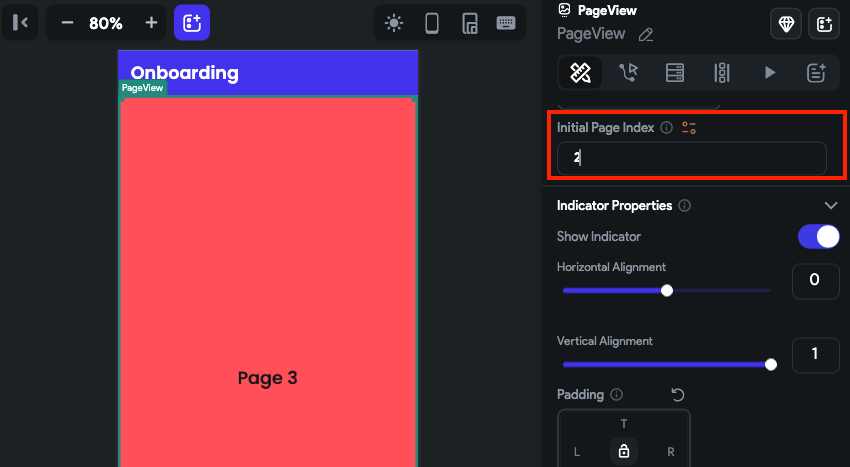

# PageView
The PageView widget is used to create swipeable pages. In page view, you can add multiple child widgets, each of which is considered a page and can be scrolled horizontally or vertically.

The PageView is useful when you have a collection of pages that you want to display one at a time, especially if you want the user to be able to swipe between them, such as in an onboarding screen, an app that shows a short video by swiping up or down just like Instagram, TikTok, Youtube shorts, etc.

## Adding PageView widget

To add the PageView widget to your app:

1. Add the **PageView** widget from the **Layout Elements** tab.
2. By default, it adds three pages and shows the first one in the canvas. In the widget tree, it is represented as **PageView Page**. To see another page in the canvas, move to the **Properties Panel >** set the **Active Page** to the page you want to see.
3. To add a new page, move to the **Properties Panel > Active Page >** click **+ Add Page**.
4. To delete any page, select the **PageView Page** (which you want to delete) from the widget tree or the canvas area and press the **Delete** key on the keyboard.
5. By default, PageView Page contains an [Image](../../../resources/ui/widgets/basic-widgets/image.md) widget; however, you can customize it as per your requirement. For example, if you want to use the PageView widget to create an onboarding experience, you could wrap (`⌘` + B) the default image widget inside the Stack widget and then add some more widgets.

    <iframe 
        src="https://demo.arcade.software/q5j4curqL6RymQkAR7HD?embed&show_copy_link=true"
        title=""
        style={{
            position: 'absolute',
            top: 0,
            left: 0,
            width: '100%',
            height: '100%',
            colorScheme: 'light'
        }}
        frameborder="0"
        loading="lazy"
        webkitAllowFullScreen
        mozAllowFullScreen
        allowFullScreen
        allow="clipboard-write">
    </iframe>

## Adding infinite scroll

The PageView widget is an incredibly versatile widget that can be utilized in a variety of situations to create interactive applications. For example, you might want to use it in an app that involves reading books, magazines, or similar content to mimic the experience of flipping through pages.

In such situations, you might consider adding an infinite scroll on this widget, which automatically loads the new pages as you swipe.

We have already covered how to [add infinite scroll on ListView](../../../resources/ui/widgets/composing-widgets/list-grid.md#adding-infinite-scroll) widget, which will give you an overall idea of how to add infinite scroll on the PageView widget as well.

## Customizing

You can customize the appearance and behavior of this widget using the various properties available under the properties panel.

### Changing the scroll direction

By default, the PageView comes with a horizontal scroll for the pages. To change the scroll direction to vertical, move to the **Properties Panel > Page View Properties >** set the **Axis** to **Vertical**.

    <iframe 
        src="https://demo.arcade.software/0BwCT3CCM40u2yHzr5jP?embed&show_copy_link=true"
        title=""
        style={{
            position: 'absolute',
            top: 0,
            left: 0,
            width: '100%',
            height: '100%',
            colorScheme: 'light'
        }}
        frameborder="0"
        loading="lazy"
        webkitAllowFullScreen
        mozAllowFullScreen
        allowFullScreen
        allow="clipboard-write">
    </iframe>

### Enable/disable swipe to scroll

This widget allows you to change the page using a swipe gesture as well as clicking on the indicator (3 dots at the bottom indicate which page is being viewed). You can change this behavior and only allow changing the page on click of the indicator.

To do so, move to the **Properties Panel > Page View Properties >** disable **Allow swipe scrolling**.

    <iframe 
        src="https://demo.arcade.software/eFNWiP3YP6jU2Do68JBy?embed&show_copy_link=true"
        title=""
        style={{
            position: 'absolute',
            top: 0,
            left: 0,
            width: '100%',
            height: '100%',
            colorScheme: 'light'
        }}
        frameborder="0"
        loading="lazy"
        webkitAllowFullScreen
        mozAllowFullScreen
        allowFullScreen
        allow="clipboard-write">
    </iframe>

### Update page on swipe

Sometimes you might want to rebuild the page on which the PageView widget is contained. i.e., rebuilding the outside of the page view widget. You might want to load data or show/hide UI elements based on the page currently being displayed. For example, you could display a floating action button only on a certain page or show/hide certain widgets based on the page index.

To do so, move to the **Properties Panel > Page View Properties >** turn on the **Update Page on Swipe**.

Here's an example of displaying the current page index on a page that contains the PageView widget.

    <iframe 
        src="https://demo.arcade.software/KLXXBsYf8Fx7bnbrRuIk?embed&show_copy_link=true"
        title=""
        style={{
            position: 'absolute',
            top: 0,
            left: 0,
            width: '100%',
            height: '100%',
            colorScheme: 'light'
        }}
        frameborder="0"
        loading="lazy"
        webkitAllowFullScreen
        mozAllowFullScreen
        allowFullScreen
        allow="clipboard-write">
    </iframe>

### Trigger action on swipe

You might want to trigger an action when the page is swiped in the PageView widget. For example, you might want to load data for a specific page only when the user swipes to it instead of loading all the data upfront.

To trigger action on swipe:

1. Select the widget from the widget tree or canvas area.
2. Select **Actions** from the Properties Panel (the right menu), and click **+ Add Action**.
3. You will notice that the **Type of Action** (aka callback) is already set to **On Page Swipe**. That means actions added under this will be called whenever the page is swiped.
4. Now, you can add any action here.

Here is an example showing the [snackbar](../../../resources/ui/pages/page-elements.md#snackbar) message whenever the page is swiped to the second page.

    <iframe 
        src="https://demo.arcade.software/gHg7V0y3lQtetLDuMCgY?embed&show_copy_link=true"
        title=""
        style={{
            position: 'absolute',
            top: 0,
            left: 0,
            width: '100%',
            height: '100%',
            colorScheme: 'light'
        }}
        frameborder="0"
        loading="lazy"
        webkitAllowFullScreen
        mozAllowFullScreen
        allowFullScreen
        allow="clipboard-write">
    </iframe>

### Setting initial page index

You might want to display a specific page as soon as it is loaded. To do so, move to the **Properties Panel > Page View Properties >** enter the **Initial Page Index** value. Please **note** that the page index starts from 0. So, if you want to set page 1, you should enter 0. If you want to set page 2, you should enter 1, and so on.

### Set margin

Margin adds a space between the PageView content and its border. To change the margin, select the **PageView** widget, move to the **Properties Panel > Page View Properties >** find the **Margin** property, and change the values.

    <iframe 
        src="https://demo.arcade.software/wDvEcRb70O3Wzqvnm2iZ?embed&show_copy_link=true"
        title=""
        style={{
            position: 'absolute',
            top: 0,
            left: 0,
            width: '100%',
            height: '100%',
            colorScheme: 'light'
        }}
        frameborder="0"
        loading="lazy"
        webkitAllowFullScreen
        mozAllowFullScreen
        allowFullScreen
        allow="clipboard-write">
    </iframe>

### Customize the indicator

The Indicator helps you identify which page is currently being viewed. You can change the appearance of the Indicator using the various properties available under the *Indicator Properties* section.

To customize the indicator:

1. Select the **PageView** widget, and move to the **Properties Panel > Indicator Properties**.
2. To change the indicator position,
    1. Find the **Horizontal Alignment** property and adjust the value by using the slider or entering a value. A value of -1 will place the Indicator all the way to the left, while a value of 1 will place the Indicator all the way to the right.
    2. Similarly, you can also change the indicator position vertically using the **Vertical Alignment** property. A value of -1 will place the Indicator all the way to the top, while a value of 1 will place the Indicator all the way to the bottom.
3. To add padding around the indicator, find the **Padding** property and enter the values in L (Left), T (Top), R (Right), and B (Bottom) properties to get the desired result.
4. To change the active and inactive color, use the **Active Color** and **Inactive Color** properties to change the color.
5. To change the indicator dot size, use the **Dot Width** and **Dot height** properties.
6. To change the size of an active dot, you can use the **Expansion Factor** property. For example, if you enter 2, the active dot size will be twice its normal size.

:::info
The width of the active dot is calculated by multiplying the value of the **Dot Width** property with the value of the **Expansion Factor** property. That means if the Dot Width is set to 40 and *Expansion Factor* is set to 2, then the width of the Active dot will be 80.
:::

1. To add space between the indicator dots, use the **Spacing** property.
2. To adjust the rounded corner of indicator dots, use the **Border Radius** property.
3. To show only the border, enable the **Outline** toggle.
4. If you want to hide the indicators, disable the **Show Indicator** toggle.

    <iframe 
        src="https://demo.arcade.software/V4Sl8N3DOMqZpAvP6F5U?embed&show_copy_link=true"
        title=""
        style={{
            position: 'absolute',
            top: 0,
            left: 0,
            width: '100%',
            height: '100%',
            colorScheme: 'light'
        }}
        frameborder="0"
        loading="lazy"
        webkitAllowFullScreen
        mozAllowFullScreen
        allowFullScreen
        allow="clipboard-write">
    </iframe>

### Scroll PageView on button press

If you use the PageView widget to create the onboarding experience, you may probably want to allow users to scroll the pages on button press (e.g., next, previous, and skip buttons) in addition to the swipe to scroll. You can do so by adding the PageView and then defining the Control Page View action on the Tap of a Button widget.

    <iframe 
        src="https://demo.arcade.software/WOqGJeiT2HU8lMq47soV?embed&show_copy_link=true"
        title=""
        style={{
            position: 'absolute',
            top: 0,
            left: 0,
            width: '100%',
            height: '100%',
            colorScheme: 'light'
        }}
        frameborder="0"
        loading="lazy"
        webkitAllowFullScreen
        mozAllowFullScreen
        allowFullScreen
        allow="clipboard-write">
    </iframe>

Here's an example of scrolling PageView on button press:

1. First, [add the PageView](#adding-pageview-widget) widget.
2. [Customize the PageView](#customizing) widget and add buttons to go to the previous and next pages.
3. Now select any button and define the [Control Page View action](#control-page-view-action).

## Control Page View [Action]

By using this action, you can gain more control over the scrolling behavior of the PageView widget. For instance, you can enable your users to move to the next or previous page with a single tap of a button or to quickly jump to a specific page index based on their preferences.

### Types of page view action

These are the types of actions you can add to the pageview.

- **Previous**: Scroll to the previous page in the pageview.
- **Next**: Scroll to the next page in the pageview.
- **First**: Scroll to the first page in the pageview.
- **Last**: Scroll to the last page in the pageview.
- **Jump to**: Scroll to a specific page in the pageview. Please note that the page index starts from 0. So, if you want to jump to page 1, you should enter 0. If you want to jump to page 2, you should enter 1, and so on.

### Adding Control Page View action

Follow the steps below to add this action to any widget.

1. Select the **Widget** (e.g., Container, Button, etc.) on which you want to add the action.
2. Select **Actions** from the properties panel (the right menu), If it's the first action, click **+ Add Action** button. Otherwise, click the "**+**" button below the previous action tile (inside *Action Flow Editor*) and select **Add Action**.
3. Search and select the **Control Page View** (under *Widget/UI Interactions*) action.
4. Set the **Page View to Control** to the **name** of the page view added to your page.
5. Select the [**Page View Action Type**](#types-of-page-view-action).

    <iframe 
        src="https://demo.arcade.software/io0ECo1Q53Z2l50rgDJV?embed&show_copy_link=true"
        title=""
        style={{
            position: 'absolute',
            top: 0,
            left: 0,
            width: '100%',
            height: '100%',
            colorScheme: 'light'
        }}
        frameborder="0"
        loading="lazy"
        webkitAllowFullScreen
        mozAllowFullScreen
        allowFullScreen
        allow="clipboard-write">
    </iframe>

## Video guide

If you prefer watching a video tutorial, here's the one for you:

    <iframe 
        src="https://www.youtube.com/embed/rFvIjpvMneI"
        title=""
        style={{
            position: 'absolute',
            top: 0,
            left: 0,
            width: '100%',
            height: '100%',
            colorScheme: 'light'
        }}
        frameborder="0"
        loading="lazy"
        webkitAllowFullScreen
        mozAllowFullScreen
        allowFullScreen
        allow="clipboard-write">
    </iframe>

