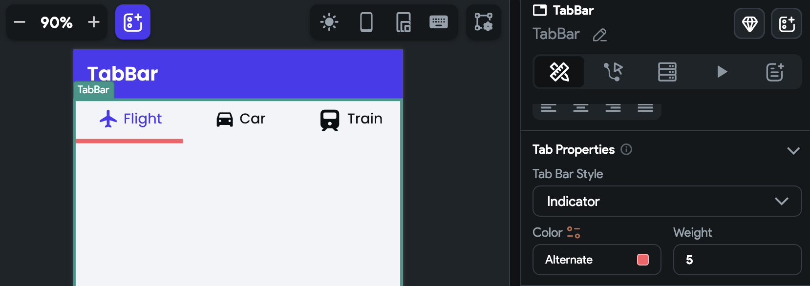
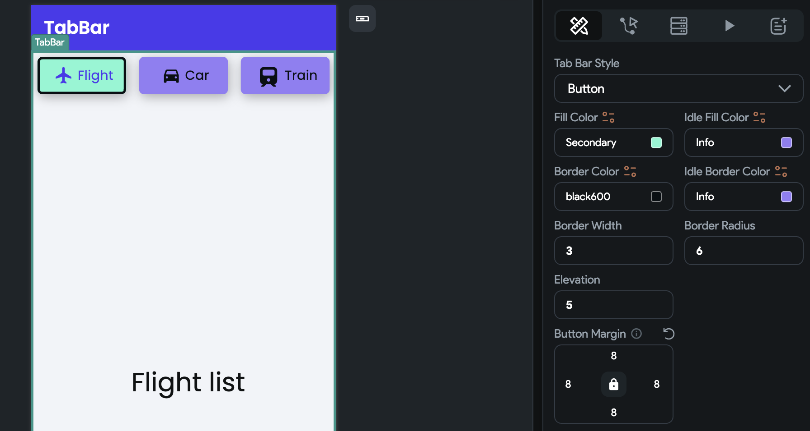
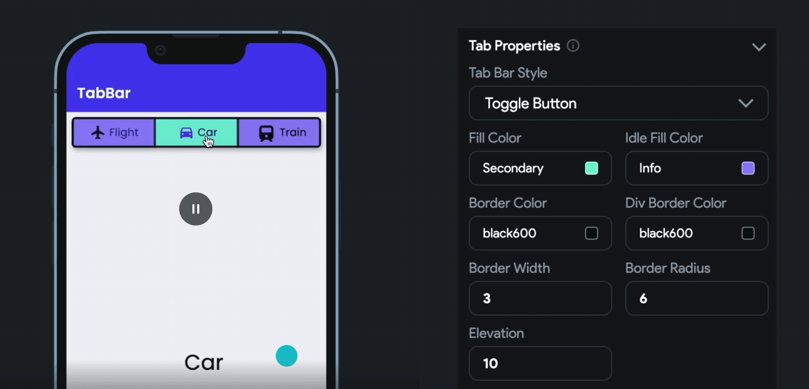
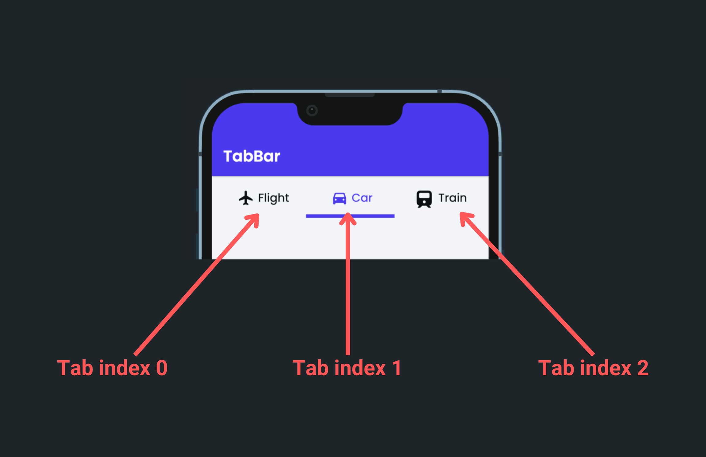
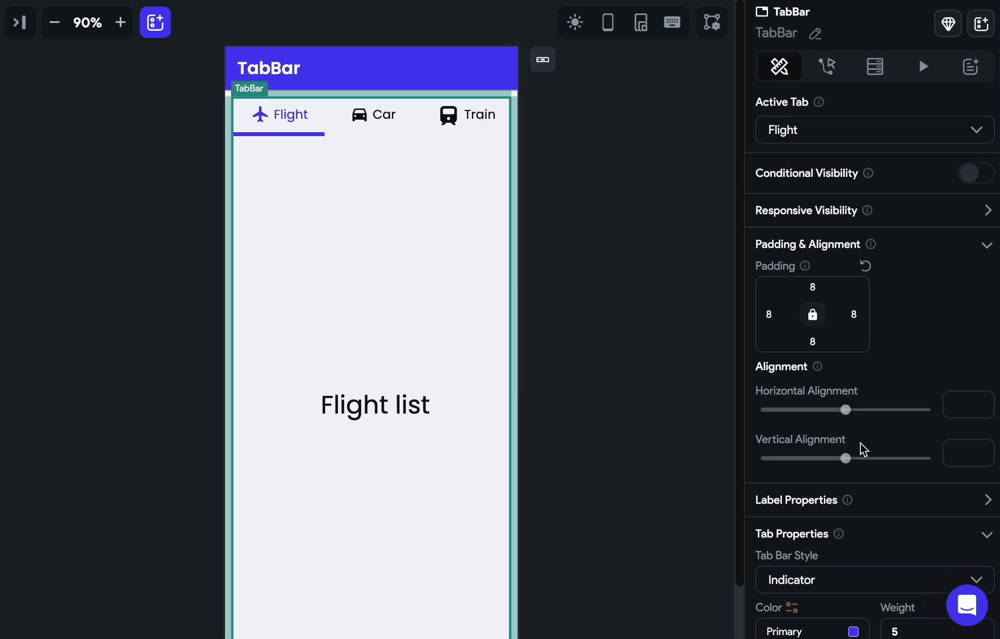
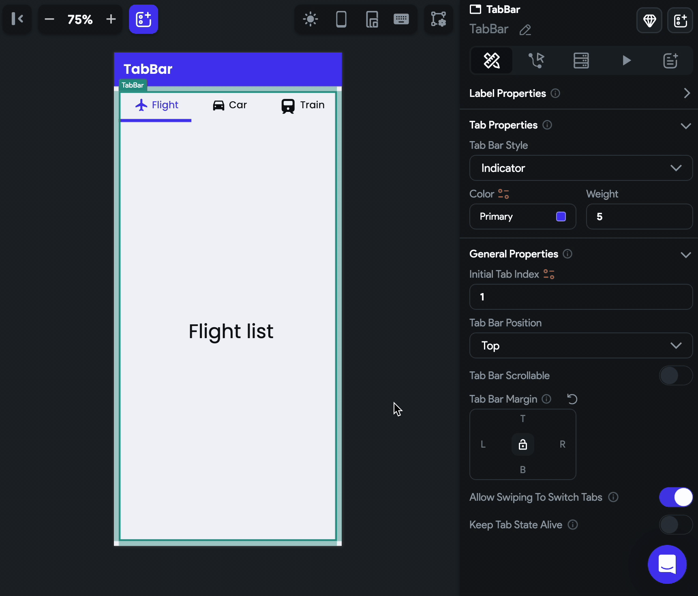

# TabBar

The TabBar widget displays a horizontal row of tabs, allowing users to switch between different content views by tapping on the tabs. Each tab typically represents a different section or category of content.

It can be used in various types of apps, such as news apps with different categories, e-commerce apps with product categories, or social media apps with different sections like feeds, notifications, and messages.

## Adding TabBar widget

To add the TabBar widget to your app:

1. Add the **TabBar** widget from the **Layout Elements** tab.
2. By default, it adds three tabs to the page and shows the first one in the canvas. In the widget tree, it is represented as **Tab** and **TabBar Page**. To see another tab in the canvas, select the **TabBar** widget, move to the **Properties Panel,** and ****set the **Active Tab** to the one you want to see.
3. To customize the Tab:
    1. Select the **Tab >** Move to **Properties Panel**.
    2. Use the **Text** property to change the label of the Tab.
    3. You can also [add Icon](../../../resources/ui/widgets/basic-widgets/icons.md), align it horizontally, and set its margin. **Tip**: To only display Icon, remove the Text value.
4. Inside the **TabBar Page**, you can replace the existing **Text** widget with any widget of your choice.
5. To add a new tab, move to the **Properties Panel > Active Page >** click **+ Add Page**.

:::tip
- If you want to adjust the height of a TabBar Page, wrap a TabBar widget inside a container and then set the container’s height.
- You can find the currently selected tab index from *set from variable menu > widget state > TabBar Current Index*.
:::

    <iframe 
        src="https://www.loom.com/embed/ff3d384fd8504de89dc872d419888865?sid=43ec3262-e6f8-449f-900e-484bbb289e94"
        title=""
        style={{
            position: 'absolute',
            top: 0,
            left: 0,
            width: '100%',
            height: '100%',
            colorScheme: 'light'
        }}
        frameborder="0"
        loading="lazy"
        webkitAllowFullScreen
        mozAllowFullScreen
        allowFullScreen
        allow="clipboard-write">
    </iframe>

## Change tab in response to widget action

If you want to change the tab selection in response to a widget action, such as a button click, you can do so by adding the [Control Tab Bar](#control-tab-bar-action) action.

## Customizing

You can customize the appearance and behavior of this widget using the various properties available under the properties panel.

### Customizing label

To customize the tab label:

1. Select the **TabBar** widget > move to the **Properties Panel > Label Properties**.
2. To set different colors when the tab is selected and unselected, use the **Selected Color** and **Unselected Color** properties.
3. To add some space around the label, use the **Label Padding** property.
4. Use the **Label Style** property to change its [styling](../../../resources/ui/widgets/basic-widgets/text.md#common-text-styling-properties). You can also set the label styling for the unselected tab text by enabling the **Custom Unselected Label Style**.

    <iframe 
        src="https://www.loom.com/embed/574d765ca61a4268bc63b76e4a388239?sid=f3c12da4-cb37-4ef3-91f3-0cb6f55c76c9"
        title=""
        style={{
            position: 'absolute',
            top: 0,
            left: 0,
            width: '100%',
            height: '100%',
            colorScheme: 'light'
        }}
        frameborder="0"
        loading="lazy"
        webkitAllowFullScreen
        mozAllowFullScreen
        allowFullScreen
        allow="clipboard-write">
    </iframe>

### Customizing tab

By default, the tab in the TabBar widget is displayed with an indicator style, which includes a line under the tab to indicate the currently viewed page. However, you have the flexibility to change the tab's styling to achieve different visual effects. Instead of the indicator style, you can customize the tab to appear as a row of buttons or a toggle button, depending on your design requirements and preferences.

To change the tab styling:

1. Select the **TabBar** widget > move to the **Properties Panel > Tab Properties**.
2. Choose the **Tab Bar Style** from **Indicator**, **Button** and **Toggle Button**.
3. When the style is set to **Indicator**, you can set the indicator **Color** and **Weight** (thickness).
    
    
    
4. When the style is set to **Button**, you have the following options to customize:
    1. To set the tab background color for selected and unselected states, use the **Fill Color** and **Idle** **Fill Color,** respectively.
    2. To set the border color for selected and unselected states, use the **Border Color** and **Idle Border Color,** respectively. Also, make sure to set the **Border Width** to see the border.
    3. To adjust the rounded corner of each tab, use the **Border Radius** property.
    4. You can also set the **Elevation** and **Button Margin** properties for all tabs.
    
    
    
5. When the style is set to **Toggle** **Button**, you have the following options to customize:
    1. To set the tab background color for selected and unselected states, use the **Fill Color** and **Idle** **Fill Color,** respectively.
    2. To set a border around all tabs, use the **Border Color** and **Border Width** properties.
    3. To add a divider between the tabs, use the **Div** **Border Color** and **Border Width** properties.
    4. You can also set the **Elevation** and **Button Margin** properties for all tabs.
        
        
        

### Setting initial tab index

You might want to display a specific tab as selected as soon as the TabBar is loaded. To do so, move to the **Properties Panel > General Properties >** enter the **Initial Tab Index** value. Please **note** that the tab index starts from 0. So, if you want to set tab 1, you should enter 0. If you want to set tab 2, you should enter 1, and so on.

### Change the tab bar position

Sometimes you might want to change the default tab bar position, i.e., from top to bottom. You can do so by navigating to **Properties Panel > General Properties >** changing the **Tab Bar Position** value.

### Making TabBar Scrollable

When you have a large number of tabs, they may not all fit on the screen. To address this, you can make the tabs scrollable, allowing the user to scroll horizontally to view all the tabs.

To make a TabBar scrollable, select the TabBar widget > move to the **Properties Panel > General Properties >** enable the **Tab Bar Scrollable** option.

:::info
If there are fewer tabs, you can control the alignment using the **Tab Bar Horizontal Alignment** property. However, for fewer tabs, you may not need to make them scrollable, but the option is available if required.
:::

    <iframe 
        src="https://www.loom.com/embed/aa94fef50d034822a4aa997227cd8f9f?sid=466570b0-2240-4666-bec2-07020ef2b6a7"
        title=""
        style={{
            position: 'absolute',
            top: 0,
            left: 0,
            width: '100%',
            height: '100%',
            colorScheme: 'light'
        }}
        frameborder="0"
        loading="lazy"
        webkitAllowFullScreen
        mozAllowFullScreen
        allowFullScreen
        allow="clipboard-write">
    </iframe>

### Set margin

Margin adds a space between the TabBar and its border. To change the margin, select the **TabBar** widget, move to the **Properties Panel > General Properties >** find the **Tab Bar** **Margin** property, and change the values.

### Disable swipe to switch tab

By default, you can switch to another tab by swiping and clicking on the tab. In case you want to disable the swiping behavior, you can do so by navigating to **Properties Panel > General Properties >** disabling the **Allow Swiping to Switch Tabs**.

    <iframe 
        src="https://www.loom.com/embed/86e5bfa6c7d846a9aa8ef7c16395a93a?sid=6a3d8a32-52df-44a3-b182-58ce7c3e0407"
        title=""
        style={{
            position: 'absolute',
            top: 0,
            left: 0,
            width: '100%',
            height: '100%',
            colorScheme: 'light'
        }}
        frameborder="0"
        loading="lazy"
        webkitAllowFullScreen
        mozAllowFullScreen
        allowFullScreen
        allow="clipboard-write">
    </iframe>

### Keeping tab state alive

By default, when you switch to a different tab, the state of the previous tab is lost and gets rebuilt when you switch back to it. However, in certain scenarios, you may want to maintain the state of each tab to preserve user input, scroll positions, data from an API call, or any other relevant data. This is called keeping the tab state alive.

To keep the tab state alive, select the **TabBar** widget **> Properties Panel > General Properties>** enable **Keep Tab State Alive**.

    <iframe 
        src="https://www.loom.com/embed/c0460343287b4d628c11160ff0e06d57?sid=03f002b3-4589-4214-8e35-ae31b41f5425"
        title=""
        style={{
            position: 'absolute',
            top: 0,
            left: 0,
            width: '100%',
            height: '100%',
            colorScheme: 'light'
        }}
        frameborder="0"
        loading="lazy"
        webkitAllowFullScreen
        mozAllowFullScreen
        allowFullScreen
        allow="clipboard-write">
    </iframe>

## Control Tab Bar [Action]

By using this action, you can gain more control over the tab-switching behavior of the TabBar widget. For instance, you can enable users to move to the next or previous tab with a single tap of a button or to quickly jump to a specific tab based on their preferences.

    <iframe 
        src="https://www.loom.com/embed/7a8454f15bec4df5a45b4e54c967b3cd?sid=36c3441f-66ba-42ff-a354-f7727f14ea81"
        title=""
        style={{
            position: 'absolute',
            top: 0,
            left: 0,
            width: '100%',
            height: '100%',
            colorScheme: 'light'
        }}
        frameborder="0"
        loading="lazy"
        webkitAllowFullScreen
        mozAllowFullScreen
        allowFullScreen
        allow="clipboard-write">
    </iframe>

### Types of action

These are the types of actions you can add to the TabBar.

- **Previous**: Switch to the previous tab in the TabBar.
- **Next**: Switch to the next tab in the TabBar.
- **First**: Switch to the first tab in the TabBar.
- **Last**: Switch to the last tab in the TabBar.
- **Jump to**: Switch to a specific tab in the TabBar. Please **note** that the tab index starts from 0. So, if you want to jump to tab 1, you should enter 0. If you want to jump to tab 2, you should enter 1, and so on.

### Adding Control Tab Bar action

Follow the steps below to add this action to any widget.

1. Select the **Widget** (e.g., Container, Button, etc.) on which you want to add the action.
2. Select **Actions** from the properties panel (the right menu), If it's the first action, click **+ Add Action** button. Otherwise, click the "**+**" button below the previous action tile (inside *Action Flow Editor*) and select **Add Action**.
3. Search and select the **Control Tab Bar** (under *Widget/UI Interactions*) action.
4. Set the **Tab Bar to Control** to the **name** of the tab bar added to your page.
5. Select the [action type](#types-of-action).

    <iframe 
        src="https://www.loom.com/embed/4b3bbd2ea16e43928f91827ef019064a?sid=ee520d4c-3c5e-4308-bb0a-9e318f3be83f"
        title=""
        style={{
            position: 'absolute',
            top: 0,
            left: 0,
            width: '100%',
            height: '100%',
            colorScheme: 'light'
        }}
        frameborder="0"
        loading="lazy"
        webkitAllowFullScreen
        mozAllowFullScreen
        allowFullScreen
        allow="clipboard-write">
    </iframe>

## Video guide

If you prefer watching a video tutorial, here's the one for you:

    <iframe 
        src="https://www.youtube.com/embed/L3hyUQlUi9E"
        title=""
        style={{
            position: 'absolute',
            top: 0,
            left: 0,
            width: '100%',
            height: '100%',
            colorScheme: 'light'
        }}
        frameborder="0"
        loading="lazy"
        webkitAllowFullScreen
        mozAllowFullScreen
        allowFullScreen
        allow="clipboard-write">
    </iframe>

