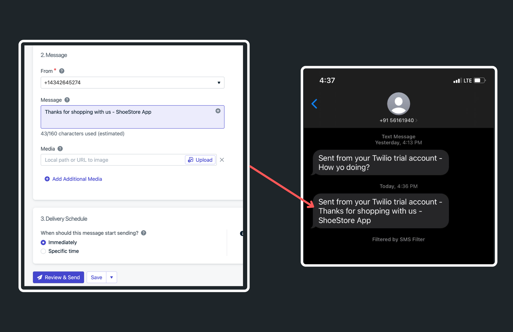
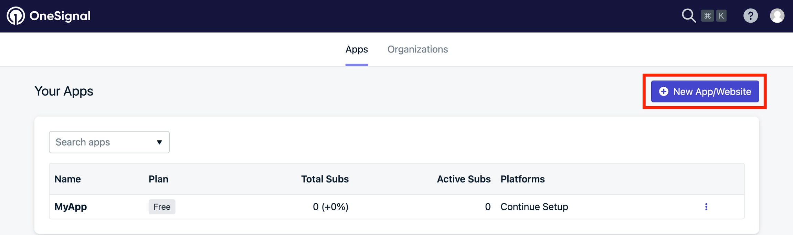
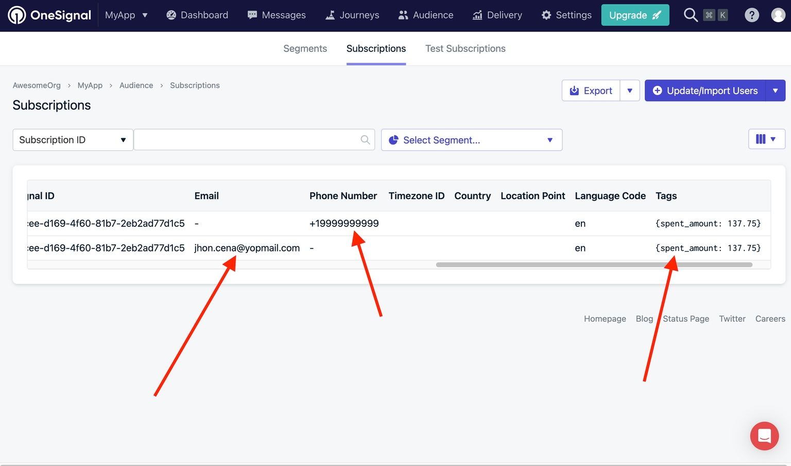

# OneSignal

Integrating OneSignal lets you send emails and SMS (text messages) to your users. This can help you
get more engagement, make more sales, and keep users coming back. After you set up OneSignal, you'll
be able to easily add users to or remove them from OneSignal's subscription list.

:::note[Prerequisites]
- Before you begin, make sure the Firebase project is on the **Blaze** pay-as-you-go plan because FlutterFlow deploys Cloud Functions for this integration. Configure Firebase budgets and alerts before deploying.
- [**Create an Account**](https://dashboard.onesignal.com/signup) on OneSignal
:::

## Initial Setup
Here's a detailed, step-by-step guide to help you integrate OneSignal:

### Setup in OneSignal

1. To get started, you need an app created on OneSignal. You can create one from
   the [dashboard](https://dashboard.onesignal.com/apps).

1. After creating your app, activate the services you need, like SMS and Email. Go to your app
   settings by clicking **App > Settings > Platforms** and then select **Activate** for the services
   you want to use.

    * If you're planning to use SMS, you'll need a [Twilio](https://twilio.com/) account and then
   follow the steps from the official [SMS Quickstart documentation](https://documentation.onesignal.com/docs/en/sms-setup).
   <figure>
       </img>
     <figcaption class="centered-caption">SMS Configuration</figcaption>
   </figure>
    * For sending emails, configure your settings as per the guidelines provided in the OneSignal
      [documentation](https://documentation.onesignal.com/docs/email-quickstart).

### Setup in FlutterFlow
To enable OneSignal in FlutterFlow:
1. Navigate to **Settings and Integrations** > **Integrations** > **OneSignal**.

2. Switch on the **Enable OneSignal** toggle.

3. Gather your credentials:
   - **App ID**: Find this in your OneSignal app under **Settings > Keys & IDs**. The App ID is a public identifier.
   - **API Key**: Create or copy an **App API Key** from the same page.
   - **Organization API Key**: Open **Organizations > your organization > Keys & IDs** and create or copy an Organization API Key.
   - Click **Deploy**.

   The App API Key and Organization API Key are secrets. Enter them only in the FlutterFlow integration fields, restrict them where possible, rotate them if exposed, and never place them in client-side custom code or a public repository. See OneSignal's [Keys & IDs](https://documentation.onesignal.com/docs/en/keys-and-ids) guide.

<figure>
    
<iframe title="OneSignal interactive tutorial" src="https://www.loom.com/embed/55a72de8e15e418581cc8b49fc108b12?sid=052ead4c-96e4-4e9a-95c5-40162eb0d5fc" frameborder="0" allow="accelerometer; autoplay; clipboard-write; encrypted-media; gyroscope; picture-in-picture; web-share" referrerpolicy="strict-origin-when-cross-origin" allowfullscreen></iframe>

  <figcaption class="centered-caption"></figcaption>
</figure>

4. Now, at appropriate event in your app, you can [add an action](#adding-onesignal-action) that adds the user to the OneSignal's subscription.

5. To test SMS functionality, follow the continuation of the instructions in the [SMS documentation](https://documentation.onesignal.com/docs/sending-sms-messages#sending-sms-notifications-from-dashboard).

6. To try out sending Emails, continue with instructions
   from [here](https://documentation.onesignal.com/docs/sending-email#sending-email-notifications-from-dashboard).

## Types of OneSignal action

There are two main actions you can utilize in OneSignal:

- **Add User**: Add the authenticated user with an email address, phone number, and optional tags.
- **Delete User**: Remove the user from the OneSignal integration.

### Adding OneSignal action

To add a OneSignal action, such as adding a user, follow these steps:

1. Select the **Widget** (e.g., Button, etc.) on which you want to add the action.

2. Select **Actions** from the Properties Panel (the right menu).

3. Search for **OneSignal** under **Integrations**, then select **Add User** or **Delete User**.

4. For **Add User**, enable the subscription options you want. You can set the value directly or use
a variable. Remember, phone numbers should be in the [E.164 format](https://documentation.onesignal.com/docs/sms-faq#what-is-the-e164-format).

5. Optionally, add Tags for more personalized messaging. For example, you could tag users based on
their spending amount to target them with specific emails or SMS messages about their purchases.

<figure>
    
<iframe title="OneSignal interactive tutorial" src="https://www.loom.com/embed/f06e63054a2b4c94883994b61182b7d2?sid=647d815a-d53d-41dc-a569-8cc3186eb6f7" frameborder="0" allow="accelerometer; autoplay; clipboard-write; encrypted-media; gyroscope; picture-in-picture; web-share" referrerpolicy="strict-origin-when-cross-origin" allowfullscreen></iframe>

  <figcaption class="centered-caption"></figcaption>
</figure>

You can confirm whether the user was successfully added by navigating to **OneSignal dashboard > App > Audience > Subscriptions**.

:::info[OneSignal for Supabase Users]
Currently, our OneSignal integration supports only Firebase authentication. If you want to use [**Supabase authentication**](../../ff-integrations/authentication/supabase-auth/initial-setup.md), you may need to use [**custom code**](../../ff-concepts/adding-customization/custom-code.md) to notify your users.
:::
