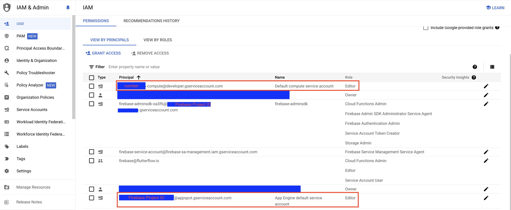
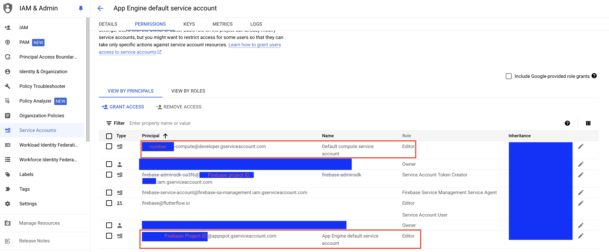

# Push Notifications

**Push Notifications** let you deliver time-sensitive, real-time messages to users even when the app isn’t active. These notifications rely on [**Firebase Cloud Messaging (FCM)**](https://firebase.google.com/docs/cloud-messaging) behind the scenes, which routes messages to both Android and iOS devices. When integrated correctly, you can use push notifications to:

- Send alerts for new content (e.g., chat messages, and updates).
- Re-engage users with timely reminders or offers.
- Provide relevant information (e.g., order status, location-based alerts).

Push notifications involve several key components working together to deliver messages to users' devices. In FlutterFlow, you can construct and send notification payloads—such as title, message body, and additional data like image—to a push service, Firebase Cloud Messaging (FCM). FCM receives notifications and routes them to the appropriate devices.

Each device is identified by a unique **Device Token/Registration Token** generated by the FCM to target specific devices. The user's device receives these notifications and handles the payload by displaying messages or navigating the user to specific screens.

## Push Notifications Setup

You can add and send push notifications manually or trigger them based on user actions within the app. Here are the steps in detail:

:::info[General Prerequisites]
Before you begin, ensure that you:
- Complete all the steps in 
[**Firebase Setup**](../../ff-integrations/firebase/connect-to-firebase-setup.md).
- Upgrade your Firebase project to the [**Blaze plan**](https://firebase.google.com/pricing) to enable [**Cloud Functions**](https://firebase.google.com/docs/functions), which are required specifically for FlutterFlow’s push notification setup, such as retrieving the FCM token and sending notifications trigger from FlutterFlow.  
:::

:::info[iOS Prerequisites]
To send push notifications to iOS devices, you must:
- Have an active [**Apple ID**](https://appleid.apple.com/account?appId=632&returnUrl=https%3A//developer.apple.com/account/).
- Enroll in the [**Apple Developer Program**](https://developer.apple.com/programs/enroll/) (a paid membership is required). For more details, visit the [**Apple Developer Program**](https://developer.apple.com/programs/).
:::

### Enabling Push Notification

:::warning
**Please note, push notifications will not work in these scenarios:**

* Push notifications will not work on an iOS simulator. To test you will need to use a real device.
* Push notifications will not be delivered to users who are logged out of your app. To send push notifications to users who are not logged in, consider implementing [**Anonymous Firebase Login**](../../ff-integrations/authentication/firebase-auth/anonymous-login.md) within your app
* Push notifications will not work if you have the app open on your device.
:::

To enable push notifications:

1. Navigate to the **Settings and Integrations > Push Notifications** and 
**Enable Push Notifications**.
2. Now, click on the **Deploy** button. This will create and deploy the *Cloud Functions* in your Firebase project that are necessary for push notifications to work.
3. Optionally, you can enable **Allow Scheduling** to send push notifications at a later time. Once enabled, you can select **Scheduler Granularity**, which determines how precisely the notifications will be sent. You can choose the granularity based on how time-sensitive your notifications are; For example:
    - If you need the notification to be sent at an **exact time** (e.g., 11:37 AM), choose **"1 minute"**.
    - If a slight delay is acceptable, you can select **"15 minutes"** or **"1 hour"**, meaning the notification will be sent within that timeframe.
    - **Higher precision (e.g., 1-minute intervals) requires more computing resources**, which may **slightly increase costs** (up to $0.50 per month).
    - **Lower precision (e.g., 1-hour intervals) is more cost-effective**, as it reduces the frequency of function execution (around $0.05 per month).

:::warning[Upgrading to Blaze Plan]
If you encounter deployment errors instructing you to contact support, it could be because you recently upgraded your Firebase project to the **Blaze plan**. After upgrading, Firebase may take approximately **10-15 minutes** to propagate the changes. If you receive this error, wait **10-15 minutes** and then try deploying again.
:::

:::info
By default, the **Automatically Prompt Users for Permission** option is enabled, meaning your app will automatically prompt users requesting for permission to receive push notifications when the app is started. However, this may be disruptive to your user sign-in flow.

If you disable it, you can control when the permission is requested. To do so, you will need to manually [**Request Permission**](../../resources/projects/settings/project-setup.md#request-permission-action) at the appropriate point in your app. **It is recommended to keep this option always enabled**.
:::

### Configuring iOS App

To receive the push notifications in an iOS app, you need to perform the following additional steps.

#### Step 1: Creating a Key

Apple requires developers to create a key for the push notifications inside the *Apple Developer Console* to verify the push notification's sender.

To create an APNs key in your Apple Developer account, go to the [**Keys**](https://developer.apple.com/account/resources/authkeys/list) section and click the **(+)** button. Enter a **Key Name**, select **Apple Push Notifications service (APNs)**, and click **Configure**. Choose the appropriate **Environment** (Sandbox, Production, or both) and set any [**Key Restriction**](https://developer.apple.com/documentation/usernotifications/establishing-a-token-based-connection-to-apns#Team-scoped-keys) as needed. Once configured, click **Save**, then **Continue** and **Register**. Finally, download and securely store the key file, as it will be required for integration with your Firebase project.

:::tip

After testing push notifications in the development environment, it's advisable to create a new key specifically for production use and upload it to your Firebase project.

:::

    <iframe 
        src="https://demo.arcade.software/x4nbnTorUddFfuEzYiuU?embed&show_copy_link=true"
        title=""
        style={{
            position: 'absolute',
            top: 0,
            left: 0,
            width: '100%',
            height: '100%',
            colorScheme: 'light'
        }}
        frameborder="0"
        loading="lazy"
        webkitAllowFullScreen
        mozAllowFullScreen
        allowFullScreen
        allow="clipboard-write">
    </iframe>

#### Step 2: Add APNs Key to Firebase Project

To add the **APNs** key to your Firebase project, navigate to your **Firebase Project Dashboard > Project Settings** and select the **Cloud Messaging** tab. Scroll down to the **Apple app configuration** section and locate the **APNs Authentication Key**. 

Click **Upload** and select your APNs auth key file (that you downloaded in the [previous step](#step-1-creating-a-key)). Enter the **Key ID**, which can be found inside the key entry in [Keys](https://developer.apple.com/account/resources/authkeys/list). Finally, enter the **Team ID**, available in the [**Apple Developer Account**](https://developer.apple.com/account) inside the **Membership details** section.

    <iframe 
        src="https://demo.arcade.software/oxt6ehoUBv46Kh3W54j6?embed&show_copy_link=true"
        title=""
        style={{
            position: 'absolute',
            top: 0,
            left: 0,
            width: '100%',
            height: '100%',
            colorScheme: 'light'
        }}
        frameborder="0"
        loading="lazy"
        webkitAllowFullScreen
        mozAllowFullScreen
        allowFullScreen
        allow="clipboard-write">
    </iframe>

## Send Push Notifications

To send push notifications, go to **FlutterFlow** > **Settings and Integrations** > **Push Notifications**, then open the **Manually Trigger Notifications** section. Enter the notification details and click **Send Notification**. A confirmation popup will appear—type **"Send Notification"** and click **Send Notification** again to deliver your message.

To send push notifications, you need to provide the following details:

- **Notification Title:** Enter the title of the notification.
- **Notification Text:** Provide the message content for the notification.
- **Notification Image (Optional):** Upload an image to be displayed with the notification.
- **Target Audience** **(Optional):** Choose whether to send notifications to **iOS**, **Android** users, or **All** users regardless of their device type.
- **Deliver With Sound** **(Optional):** Enable this option if you want the notification to play a sound.
- **Batch Notifications** **(Optional):** Toggle this setting if you want to send the notification in batches. Enable this only when you have over 10K users.
- **Scheduled Time (Optional):** Choose the specific date and time for the notification to be sent. This option is available only when the **Allow Scheduling** option is enabled, and the selected date and time follow your timezone.
- **User References (Optional):** Send push notifications to a specific user or a few users. Enter the user document reference (from the 'users' collection in Firestore) into the *User References* in this format: `/users/user_id`.

    :::tip
    You can easily copy and paste the document reference directly from the [**Firestore Data Manager**](../../ff-integrations/database/cloud-firestore/firebase-content-manager.md) in FlutterFlow.
    
    
    :::
- **Initial Page (Optional):** Choose the page the app should open when the user taps the notification.

    <iframe 
        src="https://demo.arcade.software/OwaxQqQZqrBLPzTkLFDh?embed&show_copy_link=true"
        title=""
        style={{
            position: 'absolute',
            top: 0,
            left: 0,
            width: '100%',
            height: '100%',
            colorScheme: 'light'
        }}
        frameborder="0"
        loading="lazy"
        webkitAllowFullScreen
        mozAllowFullScreen
        allowFullScreen
        allow="clipboard-write">
    </iframe>

## Push Notifications with Data

Sometimes, you might want to include additional data with your push notifications, which can then be used to display more detailed information on the page when it is opened through a push notification.

For instance, consider a news app that sends push notifications for breaking news. When the user taps the notification, the additional data like the article’s title, summary, and image can be displayed on the news page.

:::warning

Currently, we only support sending *Firestore DocumentReferences* as data.

:::

To send a push notification with data, you need a page that accepts a parameter of type **DocumentReference**. Start by building the notification, and set the **Initial Page** to the one that accepts the parameter. In the **Parameter Data** section, copy-paste the document reference from Firestore. Finally, click **Send Notification** to deliver the push notification with the specified data.

:::tip

On the page that receives the DocumentReference, you can fetch additional details of the item using the [**Backend Query**](../../resources/control-flow/backend-logic/backend-query/document-from-reference.md).

:::

## Trigger Push Notification [Action]

You may want to send a push notification when a specific event occurs in your app. For example, notifying a user when they receive a new message, when an appointment is booked, or when there is a price change.

You can send the push notification when such an event occurs by adding the **Trigger Push Notification** action.

In this action, you can decide who should receive the push notification by setting the **Audience** to either **Single Recipient** or **Multiple Recipients**.

- **Single Recipient:** Sends a notification to one specific user. For example, notifying the **group creator** when a new member joins.
- **Multiple Recipients:** Sends a notification to multiple users. For example, notifying **all group members** when someone joins the group.

:::tip

- You must provide the document reference of the user who should receive the notification.
- You can set other notification details as per your requirements.

:::

## Testing Push Notifications Cloud Function

You can also test the Push Notifications Cloud Function directly from the Google Cloud console, without needing to trigger from FlutterFlow. This is especially useful for debugging purposes. For step-by-step instructions, including an example and how to structure the request, refer to the [Testing Cloud Functions in Google Cloud Console](../../ff-concepts/adding-customization/cloud-functions.md#testing-cloud-functions-in-google-cloud-console) section.

## Update App Badge Count (iOS only) [Action]

The **Update App Badge Count** action lets you manually display a numeric badge on your **iOS app icon**. This badge typically indicates pending tasks or updates, such as unread messages, notifications, or reminders.

:::info[Platform Support]
In Android, badges automatically appear on app icons with push notifications. We would like to add this functionality for iOS. However, we are blocked by [**this**](https://github.com/firebase/flutterfire/issues/9563) issue. Therefore, it is important to note that this action **does not automatically set the badge count** when receiving a push notification in iOS—rather, it must be triggered manually while your app is running.

:::

:::tip[possible use cases]

- In a **messaging app**, you might manually increment the badge count each time a new chat message arrives while the user has the app open or decrease it as they read the messages.
- In an **email app**, you could manually update the badge count each time a new email arrives while the user is actively using the app and decrease it as emails are opened or marked as read.
- In a **calendar app**, you might set the badge count to reflect the number of upcoming events for the day, incrementing or decrementing it based on the user's interactions or changes in their schedule.
:::

To implement, simply enter the number of **Badge Count** the app should display on the home screen icon.

## FAQs

Push notifications not working; Getting cloud function error: PERMISSION_DENIED: Missing or insufficient permissions

If you encounter an error with push notifications, specifically a cloud function failure due to permission issues, it might be related to your Google Cloud organization's settings. Organizations can disable automatic IAM grants for default service accounts, leading to this error.

To fix this issue, manually grant the Editor role to the default service account used by your project. You can do this by visiting the GCP IAM page and assigning the Editor role to the following service account:

- For App Engine (Gen 1): `{firebase-project-id}@appspot.gserviceaccount.com`
- For Compute Engine (Gen 2): `{project-number}-compute@developer.gserviceaccount.com`

Also, ensure that these principals (emails) and their roles are present in the permissions tabs in *App Engine Default service account*, *Default compute service account*, and *firebase-adminsdk*. You can do this by visiting the GCP Service Accounts page, clicking on each service account email, and granting access to these principals in the permissions tab.

Below is a sample image for App Engine Default service account.

