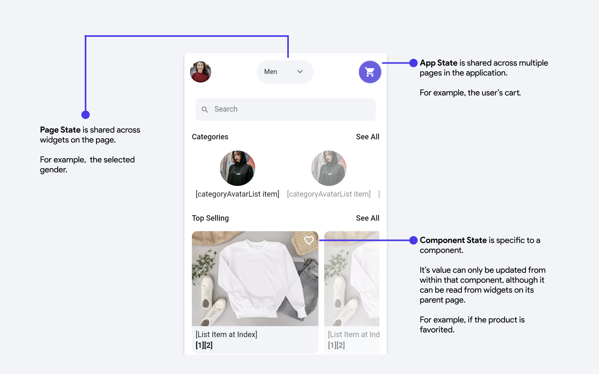

State management is a crucial concept focused on maintaining and controlling the *state* of an application. Simply put, it involves monitoring the changes within your app and updating the user interface to reflect these changes. 

You can think of the UI as a function of your state variables, where changes in these variables directly influence what the UI displays.

In FlutterFlow, there are a few types of state variables that you can create:

<figure>
   
  <figcaption class="centered-caption">App State is shared across multiple pages in the application. Component State is specific to a component. Page State is shared across widgets on the page.</figcaption>
</figure>

- State variables are themselves **variables** - meaning they have a *name* and a *data type*. 
- They also have an initial value that is set when you create the variable. 
- Once you create a state variable, it's value can be used to change the configuration of widget properties - like any other variable. 
- You can update the value of state variables using the *Update State Variable* action.

You can learn more about state management from this video:

<iframe src="https://www.youtube.com/embed/jD6L4xjYjJA?si=-RjniUB-K0ZsMoB1" title="YouTube video player" frameborder="0" allow="accelerometer; autoplay; clipboard-write; encrypted-media; gyroscope; picture-in-picture; web-share" referrerpolicy="strict-origin-when-cross-origin" allowfullscreen></iframe>

:::tip
To learn more about state management in FlutterFlow, read up on [**Variables**](#) and how [**Page 
State**](#), or 
[**Component State**](#) or [**App State variables**](#) are modified in FlutterFlow. 
:::

