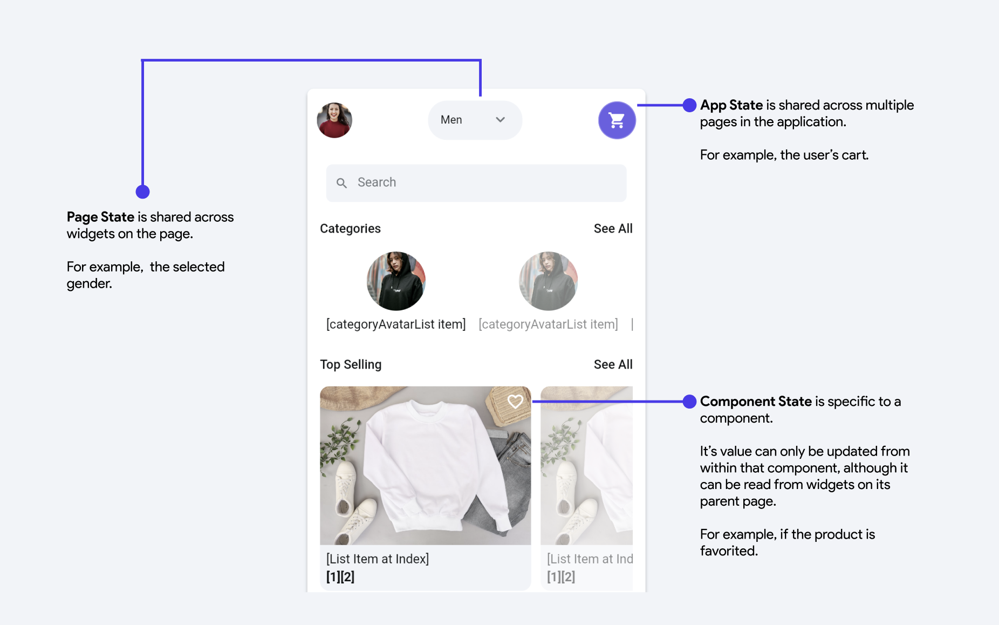

# State Management
State management is a crucial concept focused on maintaining and controlling the **state** of an application. Simply put, it involves monitoring the changes within your app and updating the user interface to reflect these changes.

The UI (user interface) displays information based on state variables. When these state variables change, the UI updates to reflect the changes.

## State Variables

In FlutterFlow, there are a few types of state variables that you can create:

<figure>
   
  <figcaption class="centered-caption">App State is shared across multiple pages in the application. Component State is specific to a component. Page State is shared across widgets on the page.</figcaption>
</figure>

- State variables are themselves [**variables**](../../resources/data-representation/overview.md#variable) - meaning they have a *name* and a *data type*.
- They can have an initial value. A nullable state variable may begin with no value.
- Once you create a state variable, it's value can be used to change the configuration of widget properties - like any other variable.
- You update them with the scope-specific **Update App State**, **Update Page State**, or **Update Component State** action.

### Creating State Variables
- To create an **App State variable**, refer to this **[guide](../../resources/data-representation/app-state.md#create-app-state-variable)**.
- To create a **Page State variable**, refer to this [**guide**](../../resources/ui/pages/page-lifecycle.md#creating-a-page-state).
- To create a **Component State variable**, refer to this [**guide**](../../resources/ui/components/component-lifecycle.md#creating-a-component-state).

Users do not create **Widget State** variables. FlutterFlow exposes them for widgets with readable runtime state, including form inputs and supported scrollable widgets.

### Updating State Variables
- To update an **App State variable**, refer to this **[guide](../../resources/data-representation/app-state.md#update-app-state-action)**.
- Refer to the [**Page Lifecycle**](../../resources/ui/pages/page-lifecycle.md) guide to learn about updating **[Page State variables](../../resources/ui/pages/page-lifecycle.md#update-page-state-action)**.
- Refer to the [**Component Lifecycle**](../../resources/ui/components/component-lifecycle.md) guide to learn about updating **[Component State variables](../../resources/ui/components/component-lifecycle.md#update-component-state-action)**.

:::tip[Learn from video]
You can learn more about state management from this video:

<iframe src="https://www.youtube.com/embed/jD6L4xjYjJA?si=-RjniUB-K0ZsMoB1" title="YouTube video player" frameborder="0" allow="accelerometer; autoplay; clipboard-write; encrypted-media; gyroscope; picture-in-picture; web-share" referrerpolicy="strict-origin-when-cross-origin" allowfullscreen></iframe>

:::

## Rebuild [Action]

The **Rebuild Page** or **Rebuild Component** action redraws UI without changing a state variable. It is useful after custom logic changes data that the current UI reads but does not itself notify FlutterFlow to rebuild.

The Rebuild action provides different update types depending on where it is used:

- **Rebuild Page:** When on a page, you will see the **Rebuild Current Page** option, which refreshes the entire page’s UI.
- **Rebuild Component:** When on a component, you will see the **Rebuild Current Component** option, which refreshes only that specific component.
    - **Rebuild Containing Page:** When on a component, you will see this option as well, which refreshes the entire page that contains the component. For example, if you have a **"Confirm"** button inside a dialog component that updates an order’s status, selecting this action will refresh the parent page to instantly show the updated order list.
- **No Rebuild:** Leaves the UI unchanged. This option is useful in a conditional action setup where no redraw should occur for that branch.

