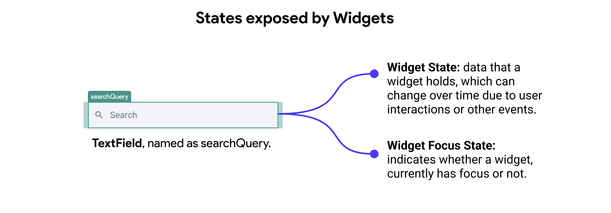
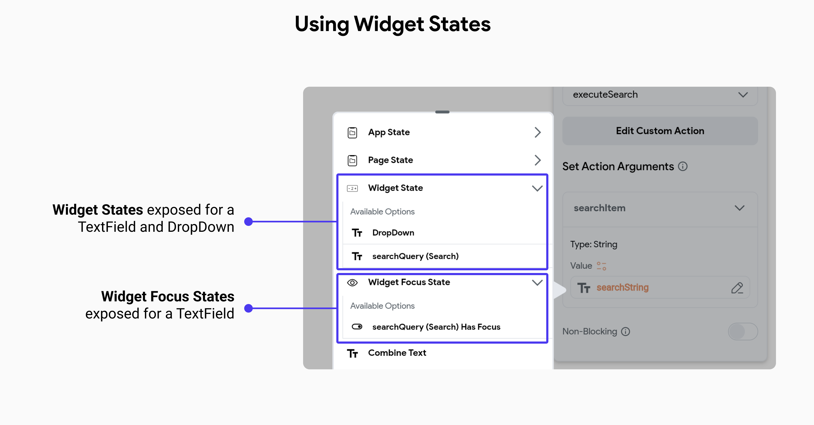
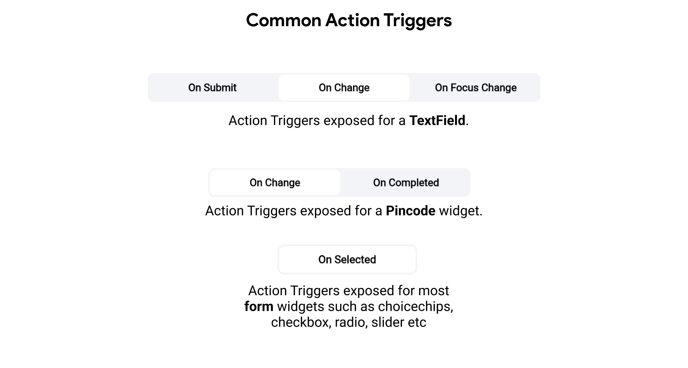

# Widget State

**Widget state** refers to the data or information that a widget holds, which can change over time and affect the widget's appearance or behavior. In FlutterFlow, the state is particularly important for form widgets, such as text fields, checkboxes, and radio buttons, as it allows these widgets to respond to user interactions.

Additionally, **Widget Focus State** refers to the state that indicates whether a widget, such as a text field, currently has focus or not. When a widget has focus, it is ready to receive user input, and its appearance typically changes to indicate this (e.g., a text field with a blinking cursor).

**Key Points:**

- **Dynamic Data:** Represents values that change over time (e.g., user input in a text field).
- **Automatic Management:** FlutterFlow handles the state, so developers do not need to write explicit state management code.
- **Reactive Updates:** Changes in the state automatically update the widget's display. 

## Managing Widget States

FlutterFlow simplifies state management by providing built-in support for handling widget states. This means developers do not need to manually create or manage the state of form widgets. Instead, FlutterFlow automatically manages the state for these widgets, ensuring a seamless and intuitive experience.

Some examples of widget states exposed by FlutterFlow: 

  - **Text Fields:** The state of text fields is automatically managed, including the input text and validation states.
  - **Checkboxes:** The state of checkboxes is managed, indicating whether they are checked or unchecked.
  - **Radio Buttons:** The state of radio buttons is managed to reflect the selected option.

In the following example, we find widget state and widget focus state of a TextField being exposed by FlutterFlow on the page it was created and available as an option in the variable menu.

:::tip[Scope]
**Widget states** are mostly available for access on the page or component where they were created. However, when you add a component to a page, the widget states exposed in the component will also be available in its parent page.

For instance, consider a component with two `TextFields` – one for the username and another for the password. This component could be utilized in both sign-in and sign-up pages. In such cases, you need to be able to retrieve the values from each TextField as if they were added directly to the page.

You can access the widget state of a component's widgets on your page, just as you would for other widgets. Simply navigate to the **Set Variable menu > Widget State > [component_name] > [your_widget]**.

<iframe src="https://www.loom.
com/embed/4dca7e59da1643629dcbb7cd2065580d?sid=3f2cd864-7d72-41ee-adc2-bb96e3ddc1b5" frameborder="0" allow="accelerometer; autoplay; clipboard-write; encrypted-media; gyroscope; picture-in-picture; web-share" referrerpolicy="strict-origin-when-cross-origin" allowfullscreen></iframe>

:::

FlutterFlow allows you to update the state of these widgets through actions exposed by the platform. For example, if you want to clear a TextField when the Send button is clicked on a form-like page, then in the Actions Flow, you can find relevant actions such as **Clear TextField**. This enables dynamic interaction and state management directly within the visual development environment.

## Action Triggers for Form Widgets
FlutterFlow allows you to bind action triggers to widget states, such as calling an API on focus change of a textfield or changing the appearance of a button when a checkbox is checked.

**Most common Action Triggers exposed by form widgets:**

- **On Focus Change:** Triggered when a widget, such as a text field, gains or loses focus.
For example, showing additional tips or validation messages when the user starts typing in a text field.

- **On Submit:** Triggered when a form or text field is submitted. For example, validating input and submitting data when the user presses the enter key or clicks a submit button.

- **On Change:** Triggered when the value of a widget changes. For example, real-time validation or updating state as the user types in a text field or changes a selection in a dropdown.

- **On Completed:** Triggered when a specific input is completed, such as entering a pincode.
For example, automatically moving to the next step in a process after a complete and valid pincode is entered.

- **On Selected:** Triggered when an option is selected in widgets like choice chips, checkboxes, radio buttons, or sliders. For example, updating the UI or performing actions based on the selected option.

These triggers allow developers to create interactive and responsive applications by defining specific actions that occur in response to user interactions with form widgets.

