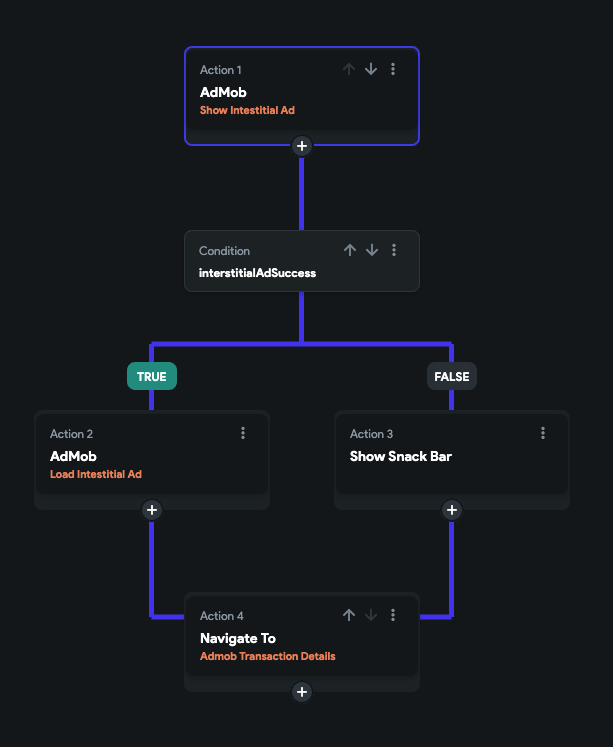

import Tabs from '@theme/Tabs';
import TabItem from '@theme/TabItem';

# AdMob
Integrating AdMob in your FlutterFlow app allows you to effortlessly include various types of advertisements, such as banner ads and interstitial ads. Here's a quick guide on how to add an AdMob banner widget and display interstitial ads in your app.

## Getting API Keys

Acquiring the API keys comprises the following steps:

1. [Creating AdMob app](#1-creating-admob-app)
2. [Adding keys to FlutterFlow](#2-adding-keys-to-flutterflow)

### 1. Creating AdMob app

To create an AdMob app:

1. Visit the AdMob homepage and [signup using your Google account](https://admob.google.com/home/).
2. Go to the Dashboard, and click **Apps** on the left side menu.
3. Now, click **Add App**.
4. Select the Platform as **Android**.
5. For the **Is the app listed on a supported app store?,** select **Yes** if your app is published on Playstore or Appstore. Select **No** if your app is still under development.
6. Click on **Continue**.
7. Enter the **App Name** and click **ADD APP**.
8. Click **Done**.
9. Similarly, create another AdMob App for iOS app.

:::info
You should be creating two AdMob Apps to display advertisements in both Android and iOS apps.
:::

    <iframe 
        src="https://www.loom.com/embed/470902676107457894a2ff354947174d?sid=569d7656-150e-4aea-acf6-f4c72b6bccbb"
        title=""
        style={{
            position: 'absolute',
            top: 0,
            left: 0,
            width: '100%',
            height: '100%',
            colorScheme: 'light'
        }}
        frameborder="0"
        loading="lazy"
        webkitAllowFullScreen
        mozAllowFullScreen
        allowFullScreen
        allow="clipboard-write">
    </iframe>

### 2. Adding keys to FlutterFlow

You must add the App keys to your FlutterFlow project that will allow your app to communicate with the AdMob server.

To add the APP keys:

1. First, get the APP key by visiting the **AdMob dashboard > Select the App > App Settings (left side menu) > Copy the App ID**.
2. Now, return to the FlutterFlow project and navigate to **Settings and Integrations** > **Integrations** > **AdMob**.
3. To display the GDPR consent dialog for users in the European Union (EU), enable the **Show GDPR Consent Dialog at App Launch** toggle.
4. Find the **AdMob** **Android App Key** input box and enter the key.
5. Similarly, add the **AdMob** **iOS App Key** from the iOS AdMob app.

    <iframe 
        src="https://www.loom.com/embed/81ac98a0ba5c477f95c3aed4f95b7b64?sid=45ad83d1-68cd-4037-8caa-305bb654a017"
        title=""
        style={{
            position: 'absolute',
            top: 0,
            left: 0,
            width: '100%',
            height: '100%',
            colorScheme: 'light'
        }}
        frameborder="0"
        loading="lazy"
        webkitAllowFullScreen
        mozAllowFullScreen
        allowFullScreen
        allow="clipboard-write">
    </iframe>

## Showing ads

After adding the keys, you can find the instructions to display the ad on below pages:

# **AdBanner**

The AdBanner widget is used to show an advertisement banner inside your app. The AdBanner widget may display texts, images, and other rich media such as video ads. 

:::info
Our AdBanner widget uses Admob which is an Ad network from Google.
:::

Showing AdBanner From AdMob comprises of following steps:

1. [Adding AdBanner widget](#1-adding-adbanner-widget)
2. [Assigning Ad Unit ID](#2-assigning-ad-unit-id)
3. [Enabling test ads](#3-enabling-test-ads)
4. [Testing ads](#4-testing-ads)

### 1. Adding AdBanner widget

To add the AdBanner widget to your project:

1. Add the Column widget from the widget tree or from the canvas area.
2. Drag the **AdBanner** widget from the **Base Elements** tab (in the Widget Panel) or add it directly from the widget tree.
3. Move to the property editor and scroll down to the **Ad Banner Dimensions** section and adjust the **Width** and **Height** property.

:::info
If you leave the Width property empty, AdBanner will take the full width of the screen.
:::

    <iframe 
        src="https://demo.arcade.software/PBkC8jgpGHT2zrPhl5yh?embed&show_copy_link=true"
        title=""
        style={{
            position: 'absolute',
            top: 0,
            left: 0,
            width: '100%',
            height: '100%',
            colorScheme: 'light'
        }}
        frameborder="0"
        loading="lazy"
        webkitAllowFullScreen
        mozAllowFullScreen
        allowFullScreen
        allow="clipboard-write">
    </iframe>

### 2. Assigning Ad Unit ID

The Ad Unit ID is the unique identifier given to every ad on Admob. You can get this by creating a new ad unit from your Admob account.

To assign the ad unit Id:

1. Go to the Admob account dashboard, click **Apps** on the left side menu and select your app.
2. Select **Ad units** and then click on the **Add add unit**.
3. Select the **Banner** Ad.
4. Enter the **Ad unit name**.
5. Click **Create ad unit**.
6. Copy the ad unit ID (the second one) and then click **Done**.
7. Paste it into the **Android Ad Unit ID** input box.
8. Similarly, create, copy and paste Ad unit for the iOS app as well.

    <iframe 
        src="https://demo.arcade.software/rL445JrvJkBjPivJZlDo?embed&show_copy_link=true"
        title=""
        style={{
            position: 'absolute',
            top: 0,
            left: 0,
            width: '100%',
            height: '100%',
            colorScheme: 'light'
        }}
        frameborder="0"
        loading="lazy"
        webkitAllowFullScreen
        mozAllowFullScreen
        allowFullScreen
        allow="clipboard-write">
    </iframe>

### 3. Enabling test ads

To prevent the risk of your AdMob account ban, it is best to enable the test ads while you are still developing the app.

To enable the test ads:

1. Select the **AdBanner** Widget from the widget tree or from the canvas area.
2. Move to property editor and scroll down to the **Ad properties** section.
3. Checkmark the **Show Test Ads**. Uncheck it only when you are about to publish the app.

    <iframe 
        src="https://demo.arcade.software/tRCqieHMarFAuF0kukPt?embed&show_copy_link=true"
        title=""
        style={{
            position: 'absolute',
            top: 0,
            left: 0,
            width: '100%',
            height: '100%',
            colorScheme: 'light'
        }}
        frameborder="0"
        loading="lazy"
        webkitAllowFullScreen
        mozAllowFullScreen
        allowFullScreen
        allow="clipboard-write">
    </iframe>

### 4. Testing ads

You can't test Ads in Run Mode, It can be only tested on a real device or emulator. For that, you will need to [download](../../testing-deployment-publishing/exporting-code/ff-cli.md) the code and run it in your IDE.

To test Ads:

1. Open and Run the app from your preferred IDE.
2. See the Banner ads appearing on the screen.

    <iframe 
        src="https://demo.arcade.software/ITIaBQou0jEiGCtLVcSX?embed&show_copy_link=true"
        title=""
        style={{
            position: 'absolute',
            top: 0,
            left: 0,
            width: '100%',
            height: '100%',
            colorScheme: 'light'
        }}
        frameborder="0"
        loading="lazy"
        webkitAllowFullScreen
        mozAllowFullScreen
        allowFullScreen
        allow="clipboard-write">
    </iframe>

# **Load/Show Interstitial Ad**

Using this action, you can display the [interstitial ad](https://developers.google.com/admob/android/interstitial#:~:text=Interstitial%20ads%20are%20full%2Dscreen,between%20levels%20in%20a%20game.). This type of ad is a full-screen ad (shows an image or video inside) and is typically displayed during natural pauses in your app/game, such as moving to the next page/level.

    <iframe 
        src="https://demo.arcade.software/U1vhnf7cXTds2hPUiCVA?embed&show_copy_link=true"
        title=""
        style={{
            position: 'absolute',
            top: 0,
            left: 0,
            width: '100%',
            height: '100%',
            colorScheme: 'light'
        }}
        frameborder="0"
        loading="lazy"
        webkitAllowFullScreen
        mozAllowFullScreen
        allowFullScreen
        allow="clipboard-write">
    </iframe>

## Displaying Interstitial Ad

To display an interstitial ad, you need to use both **Load Interstitial Ad** and **Show Interstitial Ad** actions. Here is how it works:

First, you must load the ad using the **Load Interstitial Ad** action and display it using the **Show Interstitial Ad** action. When the ad is visible, users can choose to either open or dismiss it. When the ad is dismissed, you can't show the same ad again. Hence, it would be best if you loaded the ad again. The newly loaded ad will be displayed next time you trigger the **Show Interstitial Ad** action.

:::warning
**Allow sufficient time after calling *Load Interstitial Ad* before you call *Show Interstitial Ad.*** It might take some time to load the ad. Hence, it's advisable to load the ad well in advance before showing it. Otherwise, the ad won't display. For example, if you want to display an ad with the tap of a widget, you must load the ad as soon as the page is loaded.
:::

:::info
Learn the best practices to add the interstitial ad [**here**](https://support.google.com/admob/answer/6066980?hl=en&ref_topic=2936214).
:::

Let's apply this basic fundamental and build an example that shows the interstitial ad when you navigate to the next page. Here's how it looks:

On the first page, trigger the **Load Interstitial Ad** action when the page is loaded. On tap of a widget, add the **Show Interstitial Ad** action. This action gives the result of whether the ad is dismissed or not inside the `interstitialAdSuccess` variable. If this is true, you can load the ad again and then navigate to the next page.

Here are the step-by-step instructions:

1. [Getting Ad Unit ID](#1-getting-ad-unit-id)
2. [Adding pages](#2-adding-pages)
3. [Loading ad on page load](#3-loading-ad-on-page-load)
4. [Display ad](#4-display-ad)

### 1. Getting Ad Unit ID

The Ad Unit ID is the unique identifier given to every ad on Admob. You can get this by creating a new Interstitial ad unit from your Admob account.

:::info
This will be needed when you load the ad.
:::

To get the ad unit Id:

1. Go to the Admob account dashboard, click **Apps** on the left side menu and select your app.
2. Select **Ad units** and then click on the **Add add unit**.
3. Select the **Interstitial** Ad.
4. Enter the **Ad unit name**.
5. Click **Create ad unit**.
6. Copy the ad unit ID (the second one) and then click **Done**.
7. Similarly, create and copy Ad unit for the iOS app as well.

    <iframe 
        src="https://demo.arcade.software/pdhDPc4jY5o3nd47Iyyc?embed&show_copy_link=true"
        title=""
        style={{
            position: 'absolute',
            top: 0,
            left: 0,
            width: '100%',
            height: '100%',
            colorScheme: 'light'
        }}
        frameborder="0"
        loading="lazy"
        webkitAllowFullScreen
        mozAllowFullScreen
        allowFullScreen
        allow="clipboard-write">
    </iframe>

### 2. Adding pages

:::info
You can skip this step if you already have a few pages with proper navigation.
:::

Let's add two sample pages from the templates as shown below:

<Tabs>
<TabItem value="1" label="First Page" default>

</TabItem>
<TabItem value="2" label="Second Page">

</TabItem>
</Tabs>

### 3. Loading ad on page load

You should always load the ad ahead of time before you intend to show it. This allows an ad to fully load its content (image or video) before you show it. The best place to do it is the On Page Load.

To load the ad on page load:

1. Select the **Page**.
2. Select **Actions** from the Properties panel (the right menu), and click **+ Add Action**.
    1. Search and select **Load Interstitial Ad** (under *Integrations > Admob*) action.
    2. If you click too many live ads, your AdMob account may get flagged for invalid activity. Hence, the **Show Test Ads** option is enabled by default. You should keep it enabled as long as you are building the app. Only disable it when you are about to publish your app.
    3. Enter the iOS and Android Ad Unit ID obtained in [step 1](#1-getting-ad-unit-id).

    <iframe 
        src="https://demo.arcade.software/UcgFTZurQPXXud7WLyzD?embed&show_copy_link=true"
        title=""
        style={{
            position: 'absolute',
            top: 0,
            left: 0,
            width: '100%',
            height: '100%',
            colorScheme: 'light'
        }}
        frameborder="0"
        loading="lazy"
        webkitAllowFullScreen
        mozAllowFullScreen
        allowFullScreen
        allow="clipboard-write">
    </iframe>

### 4. Display Ad

In this step, you will show the ad plus check if a user has dismissed the ad. If so, you will load the new ad and then move to the next page.

The steps to display an interstitial ad are as follows:

1. Select the **Widget** (e.g., ListTile) on which you want to define the action.
2. Select **Actions** from the Properties panel (the right menu), and click **Open**. This will open an **Action flow Editor** in a new popup window.
3. Click on the **+ Add Action**.
4. On the right side, search and select the **Show Interstitial Ad** (under *Integrations > Admob*) action.
5. By default, the action output variable name is set to **interstitialAdSuccess**. This will be used to check if a user has dismissed the ad.
6. Click on the plus button and select the **Add Conditional**.
7. On the right side (**Set Condition for Action**), select the **Action Output > interstitialAdSuccess** (action output variable name).
    1. Under the **TRUE** section, add **Load Interstitial Ad** and provide the Ad Unit IDs. This means a user has dismissed the ad, and it will load a new ad.
    2. Under the **False** section, you can add an action to show the snackbar with a failure message.
8. In the end, add an action to [navigate](../../ff-concepts/navigation-routing/page-navigation.md#navigate-to-action) to the next page.

<Tabs>
<TabItem value="1" label="Action flow for displaying interstitial Ad" default>

    <iframe 
        src="https://demo.arcade.software/HXXxlkxn9FtIo0EepzAp?embed&show_copy_link=true"
        title=""
        style={{
            position: 'absolute',
            top: 0,
            left: 0,
            width: '100%',
            height: '100%',
            colorScheme: 'light'
        }}
        frameborder="0"
        loading="lazy"
        webkitAllowFullScreen
        mozAllowFullScreen
        allowFullScreen
        allow="clipboard-write">
    </iframe>

</TabItem>
<TabItem value="2" label="Final action flow for displaying interstitial Ad">

</TabItem>
</Tabs>