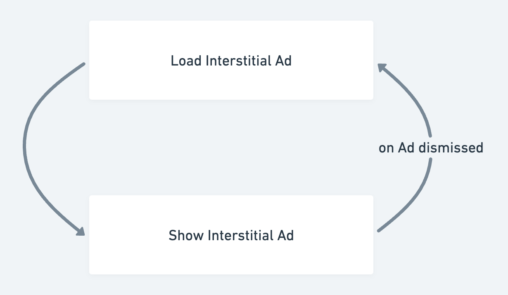

import Tabs from '@theme/Tabs';
import TabItem from '@theme/TabItem';

# AdMob
Adding ads to your FlutterFlow project can be a powerful way to monetize your app. FlutterFlow supports the integration of popular advertising platforms like [Google AdMob](https://admob.google.com/home/), making it easy for you to add [Banner](https://developers.google.com/admob/android/banner) and [Interstitial](https://developers.google.com/admob/android/interstitial) ads to your projects. This guide provides a step-by-step walkthrough for integrating ads within your FlutterFlow project.

## Setup AdMob

Setting up an AdMob involves creating AdMob apps for both Android and iOS, obtaining the app keys, and configuring some optional settings.

### 1. Creating AdMob app

Visit the AdMob homepage and [sign up](https://admob.google.com/home/) using your Google account. Once logged in, create an Android and iOS app with the necessary details, such as platform and app name.

:::info

You should create two AdMob apps to display ads in both Android and iOS versions.

:::

    <iframe 
        src="https://demo.arcade.software/xFOz1T9ksdXL3ElhtMW3?embed&show_copy_link=true"
        title=""
        style={{
            position: 'absolute',
            top: 0,
            left: 0,
            width: '100%',
            height: '100%',
            colorScheme: 'light'
        }}
        frameborder="0"
        loading="lazy"
        webkitAllowFullScreen
        mozAllowFullScreen
        allowFullScreen
        allow="clipboard-write">
    </iframe>

### 2. Adding keys to FlutterFlow

You must add the App keys to your FlutterFlow project that will allow your app to communicate with the AdMob server.

To do so, get the app key from the AdMob App Settings, navigate to **Settings and Integrations** in FlutterFlow, and add the Android and iOS app keys under **AdMob** integration settings.

    <iframe 
        src="https://demo.arcade.software/ZCwInN2vMMPBAknkR5yL?embed&show_copy_link=true"
        title=""
        style={{
            position: 'absolute',
            top: 0,
            left: 0,
            width: '100%',
            height: '100%',
            colorScheme: 'light'
        }}
        frameborder="0"
        loading="lazy"
        webkitAllowFullScreen
        mozAllowFullScreen
        allowFullScreen
        allow="clipboard-write">
    </iframe>

### 3. Configure optional settings

Below are some AdMob settings (under **Settings and Integrations** menu) that you might need to configure based on your app and target audience.

- **Show Test Ads**: Test ads are placeholders provided by AdMob that simulate real ads. To enable test ads during development, enable this option. This allows you to click on ads without charging Google advertisers and prevents your account from being flagged for invalid activity. Once your app is ready for production, you can disable this setting to serve real ads.

- **Show GDPR Consent Dialog at App Launch**: To display the GDPR consent dialog for users in the European Union (EU), enable this option. **Note that** the dialog will only appear if the user is from the EU and you created a [European regulations message](https://support.google.com/admob/answer/10113207).
- **Child-Directed Settings**: To indicate that your content is directed towards children, enable this option. This will ensure that Google treats your content as child-directed when making ad requests.
- **Users Under the Age of Consent**: This setting allows you to comply with privacy regulations for users in the European Economic Area (EEA) who are under the age of consent. It ensures that ad requests are appropriately handled, limiting data collection and targeting to meet legal requirements. This is important to protect user privacy and to avoid penalties for non-compliance.
- **Ad Content Filtering**: To filter the type of ads displayed, select the appropriate content rating. AdMob will ensure that ads returned for these requests have a content rating at or below the level selected.
    
    These are the levels you can set:
    
    - **G (General Audience)**: Suitable for all audiences, with no adult content or explicit themes.
    - **PG (Parental Guidance)**: Ads may contain mild content, suitable for children with parental supervision.
    - **T (Teen)**: Ads with content appropriate for teenagers; may include some mature topics.
    - **MA (Mature Audience)**: Ads intended for adults, which may include strong themes or explicit content.

Once the setup is completed, you can start to display [AdBanner](#adbanner) or [Interstitial ads](#interstitial-ad) in your app.

## AdBanner

The **AdBanner** widget displays advertisement banners within your app. It can feature text, images, and rich media, including video ads.

Here's an example for AdBanner widget with a test ad:

To display an **AdBanner** from AdMob, follow these steps:

### Adding AdBanner widget

First, add the **AdBanner** widget from the **Base Elements**. Next, create a new Banner Ad unit in AdMob, then copy and paste its **unit ID** into FlutterFlow. The Ad unit ID is a unique identifier assigned to each ad created in AdMob.

:::info
By default, ad banners are set to a dimension of 100 (width) x 50 (height).
:::

    <iframe 
        src="https://demo.arcade.software/vlm11muoQuU7YRS2AzQW?embed&show_copy_link=true"
        title=""
        style={{
            position: 'absolute',
            top: 0,
            left: 0,
            width: '100%',
            height: '100%',
            colorScheme: 'light'
        }}
        frameborder="0"
        loading="lazy"
        webkitAllowFullScreen
        mozAllowFullScreen
        allowFullScreen
        allow="clipboard-write">
    </iframe>

:::tip

While building your app, clicking on too many ads may cause your AdMob account to be flagged for invalid activity. To avoid this, it's recommended to enable **Test Ads** during development. 
:::

### Testing AdBanner

Ads cannot be tested in Test or Run Mode. They can only be tested on a real device or emulator. To do this, you can use [Local run](../../testing-deployment-publishing/running-your-app/local-run.md) or [download the code](../../testing-deployment-publishing/exporting-code/ff-cli.md) and run it in your IDE.

## Interstitial Ad

An **Interstitial Ad** is a type of full-screen ad that appears at natural transitions or pauses in an app, such as when switching between pages. Unlike banner ads, which stay on-screen while users interact with the app, interstitial ads are shown at key moments and are designed to be closed before the user can continue. They typically support multiple formats, including:

- **Image ads**
- **Video ads**
- **Rich media (interactive ads)**

To display an interstitial ad in FlutterFlow, you need to use the **Load Interstitial Ad** and **Show Interstitial Ad** actions together. Here's how it works:

First, load the ad using the **Load Interstitial Ad** action, then display it with the **Show Interstitial Ad** action. Once the ad is shown, users can choose to either interact with it or dismiss it. After the ad is dismissed, it cannot be displayed again, so you'll need to load a new ad. The newly loaded ad will then be ready for display the next time you trigger the **Show Interstitial Ad** action.

:::warning

***Allow sufficient time between calling Load Interstitial Ad and Show Interstitial Ad to ensure the ad has fully loaded.*** Since loading may take some time, it's recommended to load the ad well in advance to avoid display issues. For example, if you want to show an ad when a widget is tapped, you should load the ad as soon as the page loads. If the ad isn’t loaded in time, it won’t be displayed.

:::

Let's see an example displaying the interstitial ad when you navigate to the next page:

On the first page, trigger the **Load Interstitial Ad** action as soon as the page loads. Then, on a widget tap, add the **Show Interstitial Ad** action. The result of whether the ad is dismissed will be stored in the `interstitialAdSuccess` variable. If this value is true (the ad was dismissed), you can load a new ad and proceed to navigate to the next page.

Here are the step-by-step instructions:

### Getting Ad Unit ID

The Ad Unit ID is the unique identifier given to every ad on Admob. You can get this by creating a new Interstitial ad unit from your Admob account. You’ll need this ID when loading the ad.

To get the ad unit ID, go to the AdMob dashboard, select your app under **Apps**, and create an **Interstitial** ad unit by following the steps under **Ad units**. Once created, copy the ad unit ID, and repeat the process for the iOS version if needed.

    <iframe 
        src="https://demo.arcade.software/2wSXjAoYe6V4y1pZKLyB?embed&show_copy_link=true"
        title=""
        style={{
            position: 'absolute',
            top: 0,
            left: 0,
            width: '100%',
            height: '100%',
            colorScheme: 'light'
        }}
        frameborder="0"
        loading="lazy"
        webkitAllowFullScreen
        mozAllowFullScreen
        allowFullScreen
        allow="clipboard-write">
    </iframe>

### Loading Ad on Page Load

Always load the ad in advance before you intend to display it. This ensures the ad has enough time to fully load its content, whether it's an image or video, before being shown. The best place to do it is the **On Page Load**.

To load the ad when the page loads, select the page, add the **On Page Load** action trigger, and set the action to **Load Interstitial Ad**. Enter the iOS and Android **Ad Unit ID**s you obtained in [step 1](#getting-ad-unit-id).

:::tip

While building your app, clicking on too many ads may cause your AdMob account to be flagged for invalid activity. To avoid this, it's recommended to enable **Test Ads** during development.

:::

    <iframe 
        src="https://demo.arcade.software/6EsZj1z7A2tUSOnYUzrw?embed&show_copy_link=true"
        title=""
        style={{
            position: 'absolute',
            top: 0,
            left: 0,
            width: '100%',
            height: '100%',
            colorScheme: 'light'
        }}
        frameborder="0"
        loading="lazy"
        webkitAllowFullScreen
        mozAllowFullScreen
        allowFullScreen
        allow="clipboard-write">
    </iframe>

### Display Interstitial Ad

Now, you can display the ad using the **Show Interstitial Ad** action. This action returns `interstitialAdSuccess` (as an action output variable), which can be used to check if the user has dismissed the ad. If the ad is dismissed, load a new one and then proceed to navigate to the next page.

    <iframe 
        src="https://demo.arcade.software/4DUgIr5gJGDY7P6yixLH?embed&show_copy_link=true"
        title=""
        style={{
            position: 'absolute',
            top: 0,
            left: 0,
            width: '100%',
            height: '100%',
            colorScheme: 'light'
        }}
        frameborder="0"
        loading="lazy"
        webkitAllowFullScreen
        mozAllowFullScreen
        allowFullScreen
        allow="clipboard-write">
    </iframe>

## Best Practices

To maximize the effectiveness of AdMob ads in your app while maintaining a positive user experience and complying with AdMob policies, follow these overall best practices:

- **Use Test Ads During Development**: Always enable Test Ads during development to avoid invalid traffic and protect your AdMob account from being flagged or banned.
- **Comply with AdMob Policies**: Adhere strictly to AdMob’s guidelines regarding ad placement, frequency, and user interaction. This includes avoiding accidental clicks and ensuring that ads are not too intrusive. Learn more about [AdMob Policies & Restrictions](https://support.google.com/admob/answer/6128543?hl=en).
- **Respect User Privacy**: Follow data privacy regulations (e.g., GDPR, CCPA) and give users control over their ad preferences by integrating privacy options. Learn more about [AdMob Privacy & Consent](https://support.google.com/admob/answer/7676680?hl=en)

### AdBanner Best Practices

- **Strategic Placement**: Position AdBanner widgets in non-intrusive areas of the app, such as at the bottom or top of the screen, so they don’t interfere with the user’s interaction with the app’s core content. Learn more about [Banner Ad Placement Guide](https://support.google.com/admob/answer/6128877?hl=en).
- **Avoid Clickbait**: Make sure the banner ad does not blend too much with the app content. Users should easily differentiate between the ad and the app’s content to avoid accidental clicks.

### Interstitial Ad Best Practices

- **Loading Ads in Advance**: Interstitial ads should be loaded before they are needed, typically in the background, to avoid delays when it’s time to display the ad.
- **Displaying at the Right Time**: Ensure ads are shown at natural transition points. Showing ads in the middle of an activity can disrupt the user experience.
- **Monitoring Frequency**: Overuse of interstitial ads can lead to a negative user experience. It's recommended to show them sparingly and at appropriate times.
- **Test Before Production**: Use test ads during development to ensure that your implementation is correct and that you don’t accidentally trigger invalid ad interactions, which could lead to an AdMob account suspension.