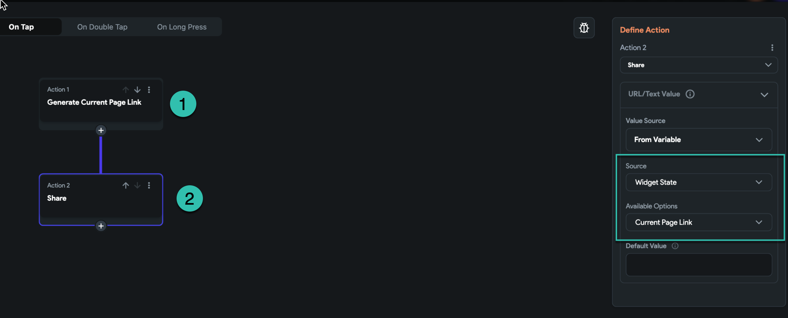

# Access Page Link After Activating Dynamic Link

After enabling **Deep Linking & Routing** in your FlutterFlow project, you can also enable **Firebase Dynamic Links**. This feature allows each page in your app to have a shareable, dynamic URL.

:::note
Firebase dynamic links require an `https` scheme in your URL configuration. Make sure to configure this correctly when enabling dynamic links.
:::

:::info[Prerequisites]
- Deep linking and routing must be enabled in your FlutterFlow project.
- Firebase Dynamic Links should be set up and configured correctly.
:::

Follow the steps below to access and share the page link:

1. **Add the Generate Current Page Link Action**  
   Attach this action to the widget from which you want to generate the link (e.g., a Share button).

2. **Use the Generated Link from Widget State**  
   After the link is generated, you can access it via `Widget State > Current Page Link`.

3. **Trigger a Share Action**  
   Add a second action that uses the generated page link as the content to share.

   
