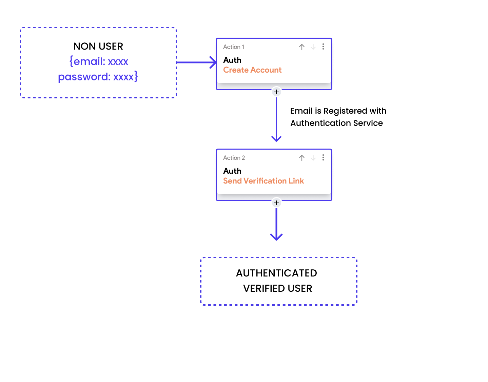
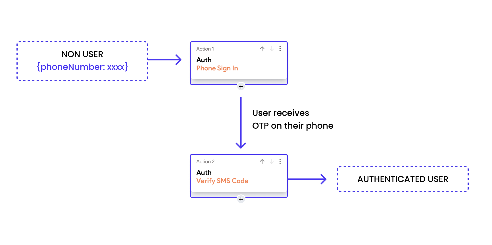

# Authentication Methods Overview

Authentication enables users to create accounts and log into your app, establishing a secure,
verified connection. In the dynamic world of applications, users can authenticate using various
methods, including **Email Login**, **OAuth**, and **phone authentication**, among others.

While each method has its unique features and advantages, they all share a common goal: enhancing
security and verifying the identity of users to provide a safe and personalized user experience.

## Email Login Authentication

The Email Login method involves users registering with an email address and
password.

Security in this approach is enhanced through **Email Verification**,
where a link or code is sent to the user's email to confirm ownership. This step
prevents unauthorized account creation and ensures that the user can recover
their account and receive important communications.

## OAuth (Open Authorization)

**OAuth** is a popular authentication protocol that enables users to authorize
one
application to interact with another on their behalf without revealing their
password. This method is commonly used to allow applications to access service
features or user information from other services, such as logging into a
third-party app using Google or Facebook credentials.

By using OAuth, the user's
login credentials stay secure with the original service provider, and only
specific permissions are granted to third-party apps via access tokens. This
approach minimizes the risk of exposing sensitive user data and streamlines the
login process across various platforms.

## Phone Authentication

Another method is phone authentication, where a user's phone number is used as a
form of identity verification. Upon registering or logging in, the user receives
a text message with a verification code that must be entered to proceed. This
method leverages the security of mobile networks and the uniqueness of phone
numbers to ensure that the person attempting access is the legitimate owner of
the account.

## Anonymous Authentication

Anonymous Authentication allows users to interact with your application without
signing in with permanent credentials, by creating temporary anonymous accounts.
This method is beneficial for users who want to test services before committing
to creating an account. If a user decides to sign up later, their anonymous
account can be upgraded to a regular account, preserving their data and
interactions.

Each anonymous session is typically isolated, with strict permissions to prevent
access to sensitive features or user data. When upgrading to a full account,
secure practices are used to link the anonymous data to the new authenticated
profile, ensuring that no data leakage or unauthorized access occurs during the
transition.

Each authentication method aims to balance user convenience with high security,
ensuring that personal and sensitive data remains protected while providing a
seamless user experience. 

