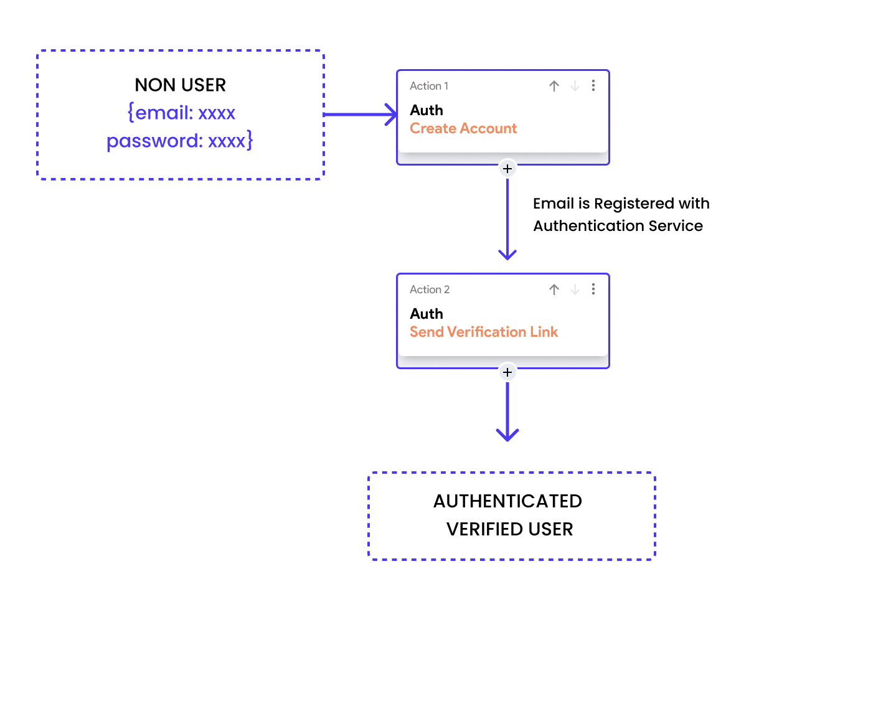
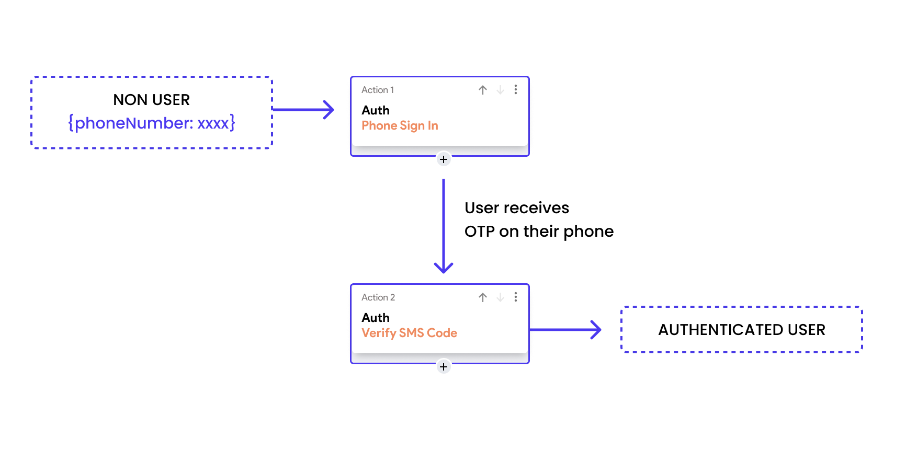

# Authentication Methods Overview

Authentication enables users to create accounts and log into your app, establishing a secure,
verified connection. In the dynamic world of applications, users can authenticate using various
methods, including **Email Login**, **OAuth**, and **phone authentication**, among others.

While each method has its unique features and advantages, they all share a common goal: enhancing
security and verifying the identity of users to provide a safe and personalized user experience.

## Email Login Authentication

The Email Login method involves users registering with an email address and
password.

Security in this approach is enhanced through **Email Verification**,
where a link or code is sent to the user's email to confirm ownership. This step
prevents unauthorized account creation and ensures that the user can recover
their account and receive important communications.

## OAuth and OpenID Connect

**OAuth 2.0** is an authorization framework: it lets an app obtain limited access
to another service without receiving the user's password. Social sign-in commonly
adds **OpenID Connect (OIDC)** or a provider-specific identity layer so the app can
authenticate the user. Follow the selected provider's setup guide because callback
URLs, client types, consent screens, and credential handling differ.

By using OAuth, the user's
login credentials stay secure with the original service provider, and only
specific permissions are granted to third-party apps via access tokens. This
approach minimizes the risk of exposing sensitive user data and streamlines the
login process across various platforms.

## Phone Authentication

Another method is phone authentication, where a user's phone number is used as a
sign-in credential. Upon registering or logging in, the user receives a text
message with a verification code that must be entered to proceed. This verifies
possession of the phone number at that moment; it does not prove a person's
real-world identity. SIM swaps, recycled numbers, interception, and social
engineering make SMS unsuitable as the only factor for high-risk operations.

## Anonymous Authentication

Anonymous Authentication allows users to interact with your application without
signing in with permanent credentials, by creating temporary anonymous accounts.
This method is beneficial for users who want to test services before committing
to creating an account. If a user decides to sign up later, their anonymous
account can be upgraded to a regular account, preserving their data and
interactions.

Isolation is not automatic. Enforce ownership in your Firestore, Storage, Supabase,
or backend authorization rules, and test those rules with anonymous accounts. When
the user adopts a permanent sign-in method, link the credential to the existing
anonymous account when supported; creating a separate account can orphan the
anonymous user's data.

Each authentication method aims to balance user convenience with high security,
ensuring that personal and sensitive data remains protected while providing a
seamless user experience.

## Related documentation

See [Auth Services](/integrations/authentication-types) for a related FlutterFlow workflow.
