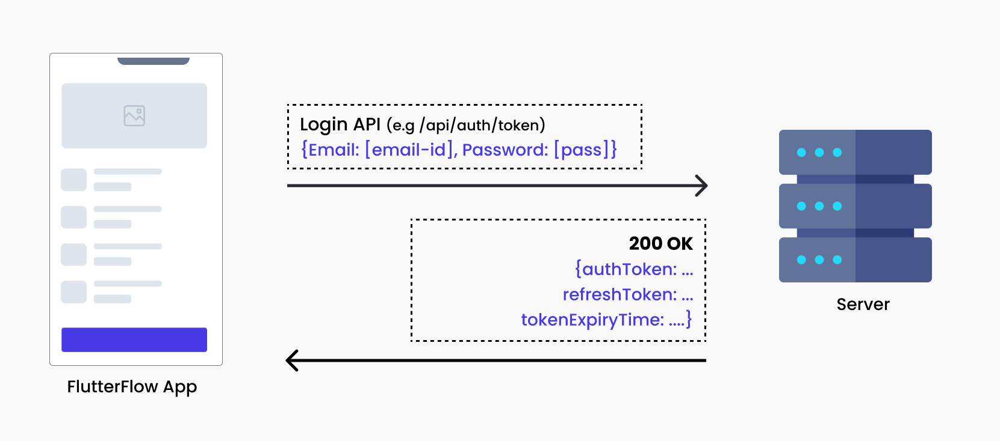
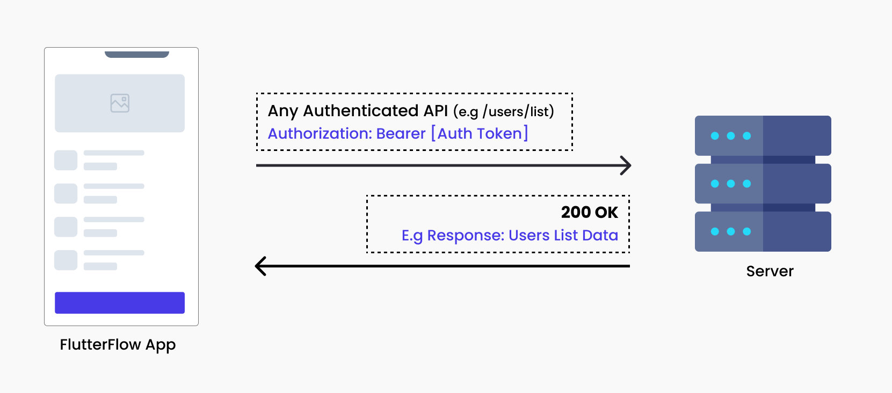
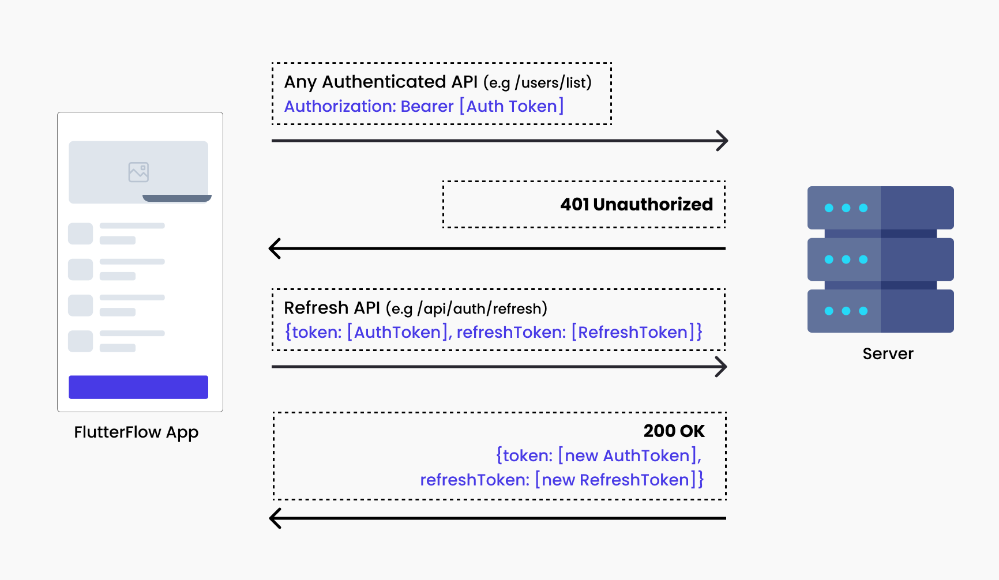

# Tokens: Types and Lifespans

Here are some key terms we'll encounter in [**Custom Authentication**](custom-auth.md).

- **Authentication Token**: An Auth Token acts as a digital key provided to
  client apps upon successful login. This key verifies the user's identity for subsequent actions
  within the app, eliminating the need for repeated login prompts. It ensures secure and streamlined
  access to the app's features.

- **Refresh Token**: This token functions as a secondary mechanism to renew the
  authentication token without requiring the user to re-enter login credentials. This is
  particularly useful for maintaining a user's session securely, even when the primary
  authentication token expires, enhancing both security and user experience.

- **Token Expiry Time** : This refers to the lifespan of an authentication token.
  It defines the period during which the token remains valid. This is a critical security measure to
  prevent unauthorized access, ensuring that tokens are regularly refreshed and authenticated.

Developers must save these values in the persisted app state to keep it secure.

:::warning[Remember]
Not all login APIs will return an Auth Token, Refresh Token, and Token Expiry Time. The details of
the response depend on the configuration of your backend API. Always check your API documentation to
understand what is returned upon successful authentication.
:::
<figure>
    
  <figcaption class="centered-caption">1.1 An example of a Login API transaction that 
returns the above values in its response</figcaption>
</figure>

### Example of Auth using Tokens

For example, when a user logs in using a Login API, the server verifies the submitted credentials
and typically responds with both an **Auth Token** and a **Refresh Token** (both strings). The
authentication token is short-lived; for instance, it may be valid for 1 hour and is used to
authenticate API requests (_as shown in diagram 1.1_).

If you need to use the token, it is typically included in any authenticated API request, such as
accessing a list of users available only to logged-in users. In this case, the app sends a request
to the API with a header that includes an Authorization header containing the authentication token.
<figure>
    
  <figcaption class="centered-caption">An example of an Authenticated API request that 
sends a Authorization Bearer Token that uses the saved Auth Token</figcaption>
</figure>

After an hour, or as determined by the token's expiry time, the authentication token expires. Any
attempt to access another post with the expired token will result in a 401 Unauthorized response.

To retrieve a new token, a common practice involves the client app making a request to a specific
endpoint, submitting the saved refresh token in the request body. The server then validates the
refresh token and responds with a new authentication token.

Thanks to the refresh token, users can continue accessing the app without needing to log in again.
This process enhances security by limiting the lifespan of each token while ensuring a seamless
experience for the user.

