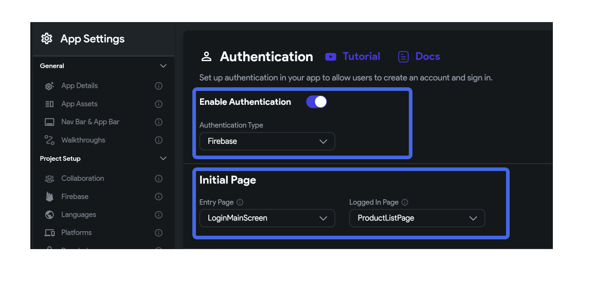
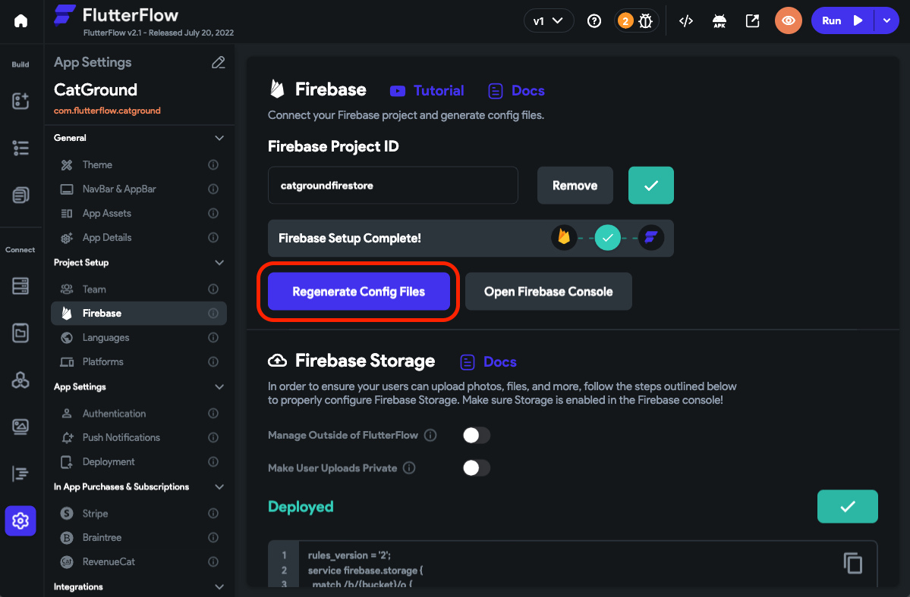

# Set Up Firebase Email Authentication

:::tip[Skip if...]
You have already enabled authentication while creating a [**new project with Firebase setup.**](../../firebase/connect-to-firebase-setup.md)
:::

To enable authentication in FlutterFlow:

1. Open your FlutterFlow project where you are planning to use Firebase
  Authentication.
2. Open **Settings and Integrations > App Settings > Authentication**.
3. Turn on the Enable Authentication toggle and select **Authentication Type** to
  **Firebase**.
4. To ensure that your users are directed to the appropriate pages based on their
  login status, you must set the **Initial Page**.



### Setting Initial Pages for Authentication

You can specify your app's **Entry Page** and **Logged In Page** from this section.

- **Entry Page** : This page will be displayed if the user is not logged in. This is
typically used to display the onboarding flow or to provide the login/sign-up
page.

- **Logged In Page**: This page will be displayed if the user is already logged in to
your app. Users are automatically navigated to the page you specify here on a
successful sign-in attempt.

## Creating the `users` collection (optional) {#creating-the-users-collection}

:::info[Prerequisities]
To allow FlutterFlow to create user documents during authentication steps, it is
important to enable Firestore Access in Firebase. Follow this section to enable
it first.
:::

Firebase Authentication does not require a Firestore `users` collection. Create one when your app needs profile or application data beyond Firebase Auth's user record, or when you enable **Create User Document** on a FlutterFlow authentication action.

Protect the collection with Firestore Security Rules that enforce ownership and validate allowed fields. Never add password, provider client secret, service-account key, refresh token, or other credential fields; Firebase Authentication manages credentials separately.

:::tip[Skip if...]
You have already enabled 'Create User Collection' while creating a new
project with [Firebase Setup](../../firebase/connect-to-firebase-setup.md).
:::

1. Click on the Firestore tab from the
[**Navigation Menu**](../../../intro/ff-ui/builder.md#navigation-menu).
2. Click on the **+ Create Collection** button. If you have any other collection
  already added, you can click on the Plus button.
3. Enter a collection_name (this can be anything, but we recommend 'users') and
  click on Create button.
4. If you enter 'users' a popup will open which asks you to populate this
  collection with default fields. You can click Yes, and we will add all the
  fields.

Follow the quicklink to see the steps

<div style={{
    position: 'relative',
    paddingBottom: 'calc(56.67989417989418% + 41px)', // Keeps the aspect ratio and additional padding
    height: 0,
    width: '100%'}}>
    <iframe
        src="https://demo.arcade.software/89TZAX3avXKxRpdZH3bK?embed&show_copy_link=true" title="Initial Setup: Firebase Auth interactive tutorial"
        style={{
            position: 'absolute',
            top: 0,
            left: 0,
            width: '100%',
            height: '100%',
            colorScheme: 'light'
        }}
        frameborder="0"
        loading="lazy"
        webkitAllowFullScreen
        mozAllowFullScreen
        allowFullScreen
        allow="clipboard-write">
    </iframe>
</div>
<p></p>

:::tip[Add Default Fields if skipped previously]

1. Click on the Settings icon in the Firestore tab.
2. Find the **Users Collection** switch and enable it.
3. Find the **Collection** dropdown below, click on the **Unset**, and select the
  name of
  the collection you just created.
4. Now switch to the **Collection** tab. Now you should see all the default
  fields.

<iframe title="Initial Setup: Firebase Auth interactive tutorial" src="https://www.loom.com/embed/ba977f72f606497b92ee9ff45c620451"
frameborder="0" allowFullScreen style={{ width: '100%', height: '600px' }}></iframe>
:::

To store and collect additional information or modify the default fields list,
see how to add fields.

:::warning[ WARNING]
You do not need to create a password field. This is handled internally by
Firebase.
:::

## Setup for Google or Phone sign-in setup for Android Apps

:::tip[OPTIONAL]
If you aren't planning to use **Google** or **Phone Sign-In**, you can skip these steps.
:::

### Generate the SHA-1 key

Register the certificate fingerprints for every Android signing identity that will run the app. Google sign-in requires the relevant SHA-1 fingerprint; phone authentication and related anti-abuse checks may also require SHA-256. Add debug fingerprints for local builds and the Google Play app-signing fingerprints for Play-distributed builds. See [Authenticating your client](https://developers.google.com/android/guides/client-auth).

:::warning[Release Guidelines]
While releasing the app, make sure to [**get the key from Play Console**](#getting-sha-keys-for-release-mode).
:::

1. Open a terminal window:

- **Mac**: Use the Launchpad or press (⌘ + Spacebar) for Spotlight search,
  type 'Terminal', and open it.

- **Windows**: Click the Windows icon, navigate to the 'Windows System' folder,
  and open 'Command Prompt' either by clicking or right-clicking it.

2. Copy the following command (based on your operating system) and select Enter.

<details>
  <summary>Windows</summary>
  <div>
   ```keytool -list -v -keystore C:\Users\leon\.android\debug.keystore -alias androiddebugkey```

    If you get the following error while trying the above command:

```ERROR:'keytool' is not recognized as an internal or external command```

    You might not have JAVA installed on your machine. [Here](https://codewithandrea.com/articles/keytool-command-not-found-how-to-fix-windows-macos/) is the helpful link to install JAVA and remove the above issue.

  </div>
</details>

<details>
  <summary>Mac/Linux</summary>
  <div>
   ```keytool -list -v -alias androiddebugkey -keystore ~/.android/debug.keystore```
  </div>
</details>

3. After being prompted for the key password, type 'android' and press 'Enter'.
   Note: For security reasons, you won't see the password as you type it.
4. Copy the SHA-1 and SHA-256 fingerprints you need for the provider and build type.

#### Add the SHA-1 key in the Firebase Console

1. Open the **Firebase console > Project Overview > Project Settings** and scroll
  down to Your App section.
2. Select your Android App from the left side menu.
3. Find the SHA certificate fingerprints section and click on the Add
  fingerprint.
4. Add each required SHA-1 or SHA-256 fingerprint and click **Save**.

#### Getting SHA keys for release mode

If you're releasing your app to the Play Store, you must add the SHA certificate fingerprints from the Play Console.

In Play Console, open your app's **App signing** page (the navigation label can vary as Play Console evolves) and copy the **SHA-1** and **SHA-256** fingerprints under **App signing key certificate**. Do not substitute the upload-key certificate: Google Play signs the APKs installed by users with the app-signing key. See Android's [Play App Signing documentation](https://developer.android.com/studio/publish/app-signing#app-signing-google-play).


### Regenerate config files

After adding or changing certificate fingerprints, regenerate the Firebase configuration files in FlutterFlow.

To regenerate the config files:
1. Return to FlutterFlow. From the Navigation Menu, select **Settings &
  Integrations > Project Setup > Firebase**.
2. Click on the Regenerate Config Files.


