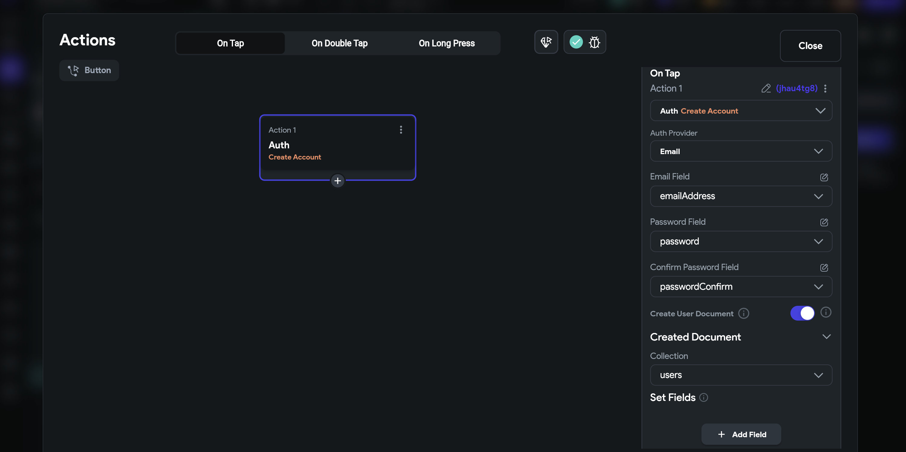
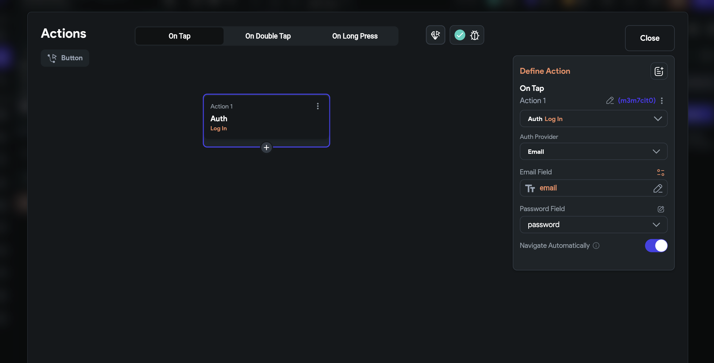

# Email Login using Firebase

:::info[Prerequisites]

Before getting started with this section:

- Complete [**Firebase Setup**](../../firebase/connect-to-firebase-setup.md)
- Complete [**Initial Setup**](auth-initial-setup.md)
:::

## Enable Email Login Provider in Firebase

1. Open the Firebase Console and click on **Authentication**
2. Click on the Get started button (this may not be visible if you have already
  set up other forms of Authentication).
3. Select the **Sign-in** method tab.
4. Click on Email/Password (Under the 'Native providers' section). If you have
  already added any other provider, click on Add new provider and then click on
  Email/Password.
5. Find the Email/Password switch and enable it.
6. Click on the Save button.

## Add a Login Screen with Email/Password Fields

In FlutterFlow, you can utilize the Page Templates feature to create a new
authentication page that includes both a "Create Account" component and a "Log
In" component. 

This setup aligns with Firebase's authentication process, which
requires users to first create an account using their email and then allows them
to sign in using the email ID they registered with.

## Create Account Action

The Create Account action is the entry point for new users in any application.
It's about establishing a user's credentials and granting them access for the
first time. This action involves collecting necessary information such as email,
password, and potentially other user-specific details like name or phone number.

The primary goal is to register and store new user data securely in your backend
or authentication service (like Firebase). This process typically includes steps
like validating the data format (e.g., email format), checking for unique
usernames or email addresses etc.

To enable this in FlutterFlow, follow these steps:

1. Create a page using Page Templates or from scratch, and add fields such as Email, Password, and Confirm Password. Based on your requirements, you may add additional fields.
2. Add a "Create Account" or "Sign Up" button and attach an action to it.
3. Search for and select the **Create Account** action under **Backend/Database >
   Firebase Authentication**.
4. Set the **Auth Provider to Email**.
5. Configure the fields to retrieve values from variables, which are usually
   found
   under Widget State > Field Name.
6. The **Create User document** is enabled by default. This means a user
   document will
   be created in the 'users' collection after the user is authenticated, if it
   does
   not already exist with details like email and UID.
       - To create a user document in a different collection, adjust the **Created
      Document > Collection** dropdown to the desired collection.
    - If additional details such as name, age, and birthday are needed at
      signup,
      click on the **+ Add Field** and set its value. Make sure these fields are
      already
      created in the 'users' collection.

## Send Email Verification Link [Action]

:::info
To understand why email verification is required when authenticating with an email and password,
refer
to [**Authentication Methods**](../authentication-methods.md)
:::
1. Add a new action immediately after the **Create Account** action.

2. Search for and select the **Send Email Verification Link** (located under **Backend/Database > Firebase
   Authentication**) action. The user's email is automatically retrieved from Firebase Authentication,
   and a verification link is sent to the user for confirmation.

    <iframe 
        src="https://demo.arcade.software/3aDUDdUKXWmpBPiTO5oe?embed&show_copy_link=true"
        title="Send Email Verification Link"
        style={{
            position: 'absolute',
            top: 0,
            left: 0,
            width: '100%',
            height: '100%',
            colorScheme: 'light'
        }}
        frameborder="0"
        loading="lazy"
        webkitAllowFullScreen
        mozAllowFullScreen
        allowFullScreen
        allow="clipboard-write">
    </iframe>

<figure>
    
  <figcaption class="centered-caption"></figcaption>
</figure>
The user should receive an email verification link in their inbox. Upon successful verification,
they will see a success message.

## Log In [Action]

The **Log In** action, on the other hand, is for users who already have an account.
It involves verifying the credentials provided by a returning user against
stored data to grant access to the system. This action is crucial for
maintaining secure access control as it ensures that the entity attempting to
gain access is indeed who they claim to be. The process usually requires users
to provide their registered email and password, which are then checked for
correctness through your authentication system.

To enable this in FlutterFlow, follow these steps:

1. Create another Log In page using Page Templates or from scratch, and add
   fields such as
   Email, Password.
2. Add a "Log In" button and attach an action to it.

3. Search for and select the **Log In** action under **Backend/Database >
   Firebase Authentication**.

4. Configure the fields to retrieve values from variables, which are usually
   found
   under Widget State > Field Name.

:::info
To let users log out of your app, you can use the [**Logout**](auth-actions.md#logout-action) action.
:::

### Verify user created in Firebase Dashboard

To verify that you have successfully added the email authentication and that
users are being created, you can head over to your **Firebase project >
Authentication > Users** and verify the user entries.

