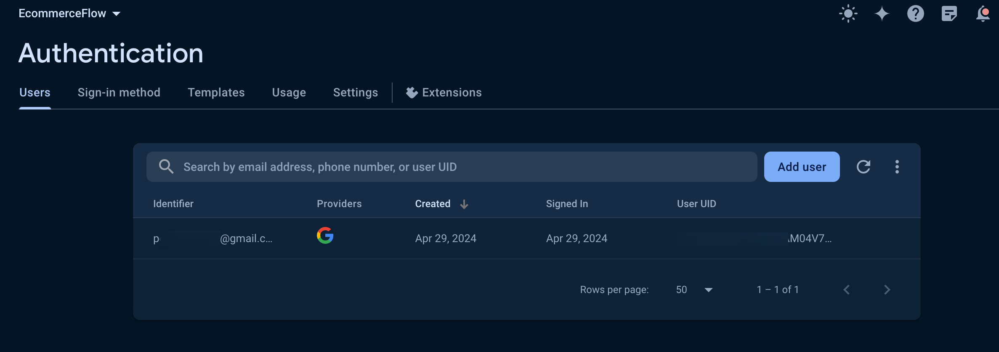

# Google Login

Google Sign-In allows users to authenticate using their Google Accounts.

:::info[Prerequisites]

Before getting started with this section:

- Complete [**Firebase Setup**](../../firebase/connect-to-firebase-setup.md)
- Complete [**Initial Setup**](auth-initial-setup.md)
- Added **SHA-1 key** and regenerated **Config Keys**.
:::

## Enable Google Sign-in Provider in Firebase

Open the **Firebase Console**, click on **Authentication** and then follow the steps below to enable Google Sign in for your Firebase project.

    <iframe 
        src="https://demo.arcade.software/I50vTFEEyhXfU82yLick?embed&show_copy_link=true"
        title=""
        style={{
            position: 'absolute',
            top: 0,
            left: 0,
            width: '100%',
            height: '100%',
            colorScheme: 'light'
        }}
        frameborder="0"
        loading="lazy"
        webkitAllowFullScreen
        mozAllowFullScreen
        allowFullScreen
        allow="clipboard-write">
    </iframe>

## Add a Login Screen with Google Login Action

### Create a Login Screen

To allow users to authenticate, you need a Login or Sign-in Page with a button.
You can create your own or use the one from page templates.

### Add Login Action

1. On your Google Login button, select **Actions** from the properties panel (the
  right menu) and select **Add Action**.
2. Search and select the Log In (under **Backend/Database > Firebase
  Authentication**) action.
3. Set **Auth Provider** to **Google**.
4. Enable **Create User Document** and set the **Collection** to **users**. After successful login, this will insert the user's details, such as email, name, and photo, into the *users* collection. **Note** that, if a user exists already, it won't add the details again.

If you haven’t already, see how to [create *users* collection](auth-initial-setup.md#creating-the-users-collection).

    <iframe 
        src="https://demo.arcade.software/CBVoec46awMc3yNGLuVJ?embed&show_copy_link=true"
        title=""
        style={{
            position: 'absolute',
            top: 0,
            left: 0,
            width: '100%',
            height: '100%',
            colorScheme: 'light'
        }}
        frameborder="0"
        loading="lazy"
        webkitAllowFullScreen
        mozAllowFullScreen
        allowFullScreen
        allow="clipboard-write">
    </iframe>

:::tip
To let users log out of your app, you can use the [**Logout**](auth-actions.md#logout-action) action.
:::

## Test Google Login in various platforms

### Running on Test Mode/Run Mode

1. To test Google sign-in in Test or Run mode, you must add the authorized
   domain in the Firebase console and Google cloud console.

    - **For Test mode**, you can open the browser console, try logging in, and
      get the domain from the browser console. It should look like `ff-debug-service-frontend-ygxkweukma-uc.a.run.app`. For *Pro* users, the above URL will also include `-pro`, such as `ff-debug-service-frontend-pro-ygxkweukma-uc.a.run.app`.

    - **For Run mode**, you can simply use 'app.flutterflow.io'.

2. To add in Firebase console:

    1. Open the Firebase console and click on Authentication and select the
      Setting tab.

    2. Select **Authorized domains** from the left side menu.

    3. Click **Add domain**.

3. To add in Google cloud console:

    1. Head over to
      your [Project Credentials](https://console.cloud.google.com/apis/credentials?project=_) page.
   
    2. Ensure you are on the correct project. In our case, we are using the
      [EcommerceFlow demo project](https://bit.ly/ff-docs-demo-v1), it will be different for you.
   
    

    3. Under the '**OAuth 2.0 Client IDs**', select '**Web client** (auto created by
      Google Service)'.

    4. Under the '**Authorized JavaScript origins**', click ADD URI and add both the
      URL.
    5. Similarly, under the '**Authorized redirect URIs**', click ADD URI, add both
      the URL and append '/__/auth/handler' at the end.

<iframe src="https://www.loom.com/embed/efd5b99b858d4de8bca55452c6e1d20c" frameborder="0"
allowFullScreen style={{ width: '100%', height: '600px' }}></iframe>

<figure>
    
  <figcaption class="centered-caption"></figcaption>
</figure>

4. If you don't see the Web client created yet, you can create new one by
   clicking **+ CREATE CREDENTIALS**, selecting OAuth client ID and then select
   Application type to Web application.

### Verify user created in Firebase Dashboard

To confirm the successful integration of Google authentication and the creation of users, navigate
to your **Firebase project > Authentication > Users** and check the entries.

:::info
To ensure that your Android release will authenticate to Google, make sure to use Google Play Console's SHA keys - see how to [**Get SHA keys for release mode**](auth-initial-setup.md#getting-sha-keys-for-release-mode).
:::
