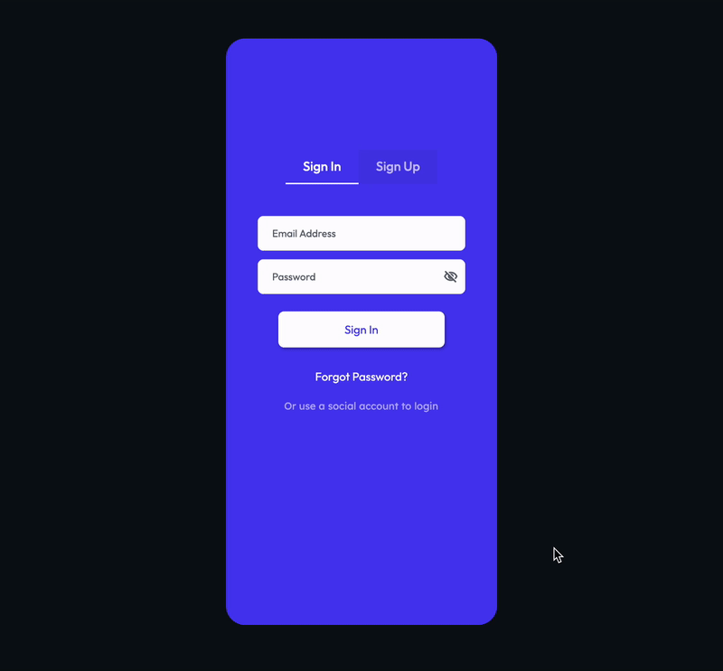
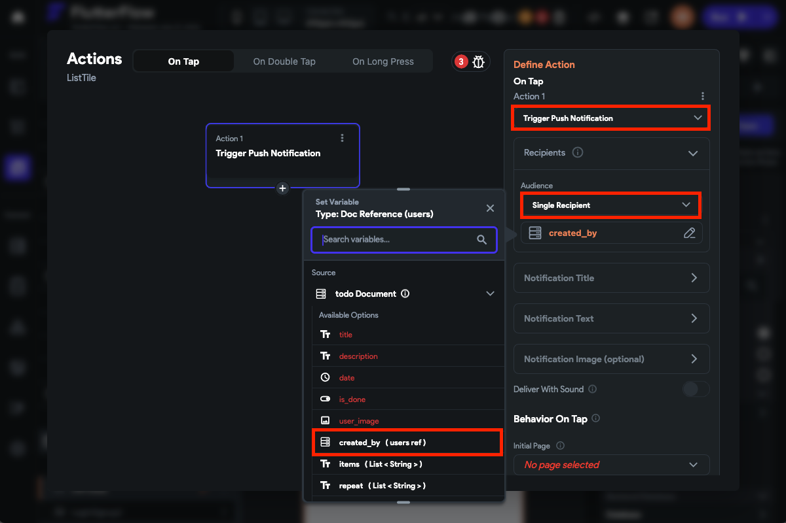

# JWT Token Authentication

Firebase custom-token sign-in lets your trusted backend authenticate a user in its own identity system and then issue a short-lived Firebase custom token. The app exchanges that one-time sign-in assertion with Firebase Authentication and receives the Firebase session used for Firestore, Storage, and other Firebase services.

:::warning[Firebase custom token, not an arbitrary JWT]
The action requires a Firebase custom token with Firebase's required claims and signature. A JWT issued by Supabase, Okta, your normal API, or another identity provider cannot be passed through unchanged. Your trusted backend must verify the upstream identity and mint the Firebase custom token with the Firebase Admin SDK or an implementation that follows Firebase's specification exactly.
:::


The app sends credentials or an upstream identity assertion to your server over HTTPS. The server authenticates the request, chooses a stable Firebase UID, applies any approved custom claims, and returns a Firebase custom token. Never send a service-account key or signing credential to the app.

:::info
You can learn more about Firebase and JWT tokens [**here**](https://firebase.google.com/docs/auth/admin/create-custom-tokens).
:::

## Adding JWT token authentication

Let's build an example that uses a JWT token to log into the app. Here's how it looks when completed:



:::info[Prerequisites]

Before getting started with this section:

- Complete [**Firebase Setup**](../../firebase/connect-to-firebase-setup.md).
- Complete [**Initial setup**](auth-initial-setup.md) required for authentication.
:::


Adding JWT token authentication comprises the following steps:

1. [Add login API](#1-add-login-api)
2. [Adding login page](#2-adding-login-page)
3. [Add login action](#3-add-login-action)
4. [Adding logout action](#4-adding-logout-action)
5. [Verify user creation](#5-verify-user-creation)

### 1. Add login API

You must [create an API](../../../resources/control-flow/backend-logic/api/create-test-api-calls.md) endpoint on your server that accepts email/username and password. If the credentials are valid, it generates the JWT token and passes it back in response.

At your server, generate the custom token with the [Firebase Admin SDK](https://firebase.google.com/docs/auth/admin/create-custom-tokens#create_custom_tokens_using_the_firebase_admin_sdk) whenever possible. A third-party JWT library is appropriate only if your server implements Firebase's [documented custom-token format](https://firebase.google.com/docs/auth/admin/create-custom-tokens#create_custom_tokens_using_a_third-party_jwt_library), protects the signing key, and validates the caller before minting a token.

Rate-limit the login endpoint, avoid account-enumeration responses, do not log credentials or tokens, and authorize custom claims from server-side data rather than trusting values submitted by the client.

The API endpoint should be similar to the following (Tip: Expand and see the '200 OK' section):

#### Login API to be created on your server

`POST` `/login`

##### Request Body

| Name | Type | Description |
| --- | --- | --- |
| email* | String |  |
| password* | String |  |

##### 200: OK

```
{
    "user": {
        "id": 1,
        "role_id": 1,
        "name": "james",
        "email": "james@yopmail.com"
    },
    "token_type": "Bearer",
    "expires_in": 3600,
    "firebase_custom_token": "[FIREBASE_CUSTOM_TOKEN]"
}
```

:::warning
In most cases, you would make the app content available right after creating a new account. Hence, you should also generate and return the JWT token on the success of create account API and use it to login into the Firebase.
:::

### 2. Adding login page

Let's add a sign-in page from the templates and choose the **Authenticate Solo Alt** from under the **Auth** tab. Tip: After adding, remove the other social sign-in buttons.


### 3. Add login action

The login process involves two steps. First, you trigger an API call to your server. Upon successful call completion, you'll use the returned JWT token in the JWT Token action.

Here are the step by step instructions:

1. Select the **Widget** (e.g., Sign In) on which you want to define the action.

2. Select **Actions** from the Properties Panel (the right menu), and click **Open**. This will open an **Action Flow Editor** in a new popup window.
3. Add the login api and provide the **Action Output Variable Name**. If the call succeeds, this will be used to retrieve the token.
4. Inside the **TRUE** section, click on the **+** button and select **Add Action**.
5. On the right side, search and select the **Log in** (under Firebase Authentication) action.
6. Set the **Auth Provider** to **JWT token**.
7. Now, you must provide the actual JWT token. To set the token from an API response:
    1. Click on the **UNSET** and select the **Action Outputs -> Action Output Variable Name** (that you specified in the API call section.)
    2. Set the **API Response Options** to **JSON Body** and **Available Options** to **JSON Path**.
    3. Enter the **JSON Path** that locates the token in your response, such as `$.firebase_custom_token`, and click **Confirm**.
8. (Optional) add the [snackbar action](../../../resources/ui/pages/page-elements.md#show-snackbar-action) to display the success message.
9. (Optional) Inside the **False** section, add the snackbar action to display the failure message.

<div style={{
    position: 'relative',
    paddingBottom: 'calc(56.67989417989418% + 41px)', // Keeps the aspect ratio and additional padding
    height: 0,
    width: '100%'}}>
    <iframe
        src="https://www.loom.com/embed/c905b00428f045dc9d8d7d92ea4413db?sid=61ab89e3-5933-41ec-ae09-8a4fe19be459" title="JWT Token interactive tutorial"
        style={{
            position: 'absolute',
            top: 0,
            left: 0,
            width: '100%',
            height: '100%',
            colorScheme: 'light'
        }}
        frameborder="0"
        loading="lazy"
        webkitAllowFullScreen
        mozAllowFullScreen
        allowFullScreen
        allow="clipboard-write">
    </iframe>
</div>
<p></p>

### 4. Adding logout action

To let users log out of your app, you can use the [Logout](auth-actions.md#logout-action) action.

### 5. Verify user creation

To confirm the successful integration and the creation of users, navigate to your **Firebase project > Authentication > Users** and check the user entries. Tip: Notice the 'userid' (originally created by your server) is added inside the **User UID** column.

## Testing before the backend is complete

Do not mint Firebase custom tokens in FlutterFlow, client-side custom code, or a public API call. For development, use a temporary trusted backend or a local Admin SDK helper that authenticates test requests before minting tokens. Prefer Application Default Credentials or a managed workload identity. If you must download a service-account JSON key for a controlled local test, keep it outside the project and source control, restrict access to it, delete it after the test, and revoke it immediately if it is exposed.

Pass the temporary custom token directly from the test endpoint's action output to **Log In**. Do not persist it in App State, page state, logs, analytics, or a public decoder. Firebase custom tokens expire after a short period and are intended only for exchange with Firebase Authentication, not as bearer tokens for your own APIs.

## Accessing Firebase Database

Once you log in via the JWT token, the *Authenticated User* object is available. This object contains the fields (i.e., logged-in user's data), especially **User Reference (users ref),** that you may need to provide while adding or retrieving Firestore documents.

Here's an example of how you can use the *Authenticated User* object to filter the to-do items based on the user who created it.


## Sending push notifications

Once you log in via the JWT token, the *Authenticated User* object is available. This object contains the fields (i.e., logged-in user's data), especially **User Reference (users ref),** that you may need to provide while adding or retrieving Firestore documents.

When such user reference is stored inside the Firestore documents, you can use them inside the **Single** or **Multiple Recipient** while defining the **Audience** inside the [Trigger Push Notification](../../../ff-concepts/notifications/push-notifications.md#trigger-push-notification-action) action, as shown in the image below:



To learn more about how to use user references for sending push notifications, please check the [push notification](../../../ff-concepts/notifications/push-notifications.md) section.
