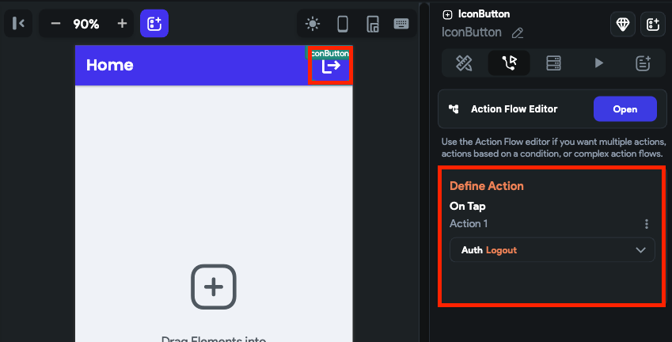

# Logout [Action]

This action enables users to securely log out of their account and clear their session data from the app, which ensures that their account remains safe and secure.

## Adding Logout action

Follow the steps below to add this action:

1. Select the widget (e.g., Button) on which you want to add the action.
2. Select **Actions** from the properties panel (the right menu), If it's the first action, click **+ Add Action** button. Otherwise, click the "**+**" button below the previous action tile (inside *Action Flow Editor*) and select **Add Action**.
3. Search and select the **Logout** (under *Backend/Database > Firebase Authentication*) action.

