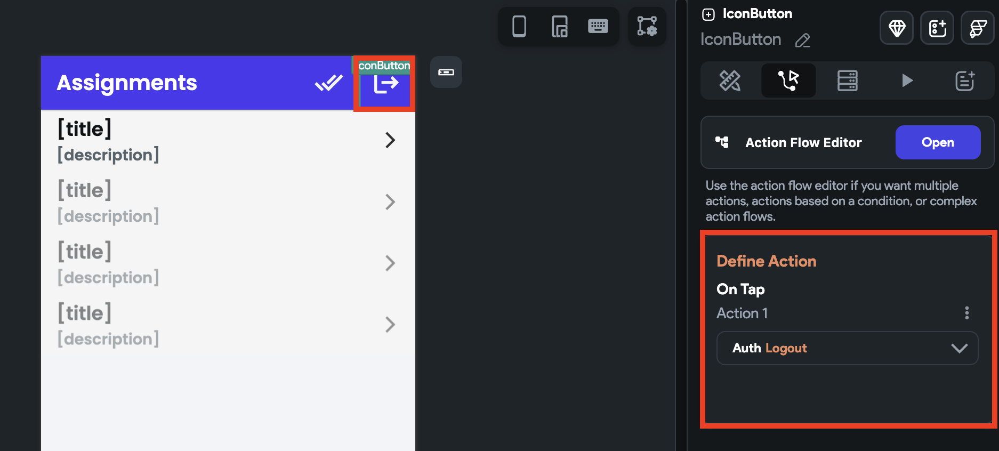

# Authentication Actions
Currently FlutterFlow supports the following Actions for Supabase Authentication:

## Log in [Action]

This action provides users with multiple login options to access their accounts.

Follow the steps below to add Email Login action:

1. Select the widget(e.g., Button) on which you want to add the action.
2. Select **Actions** from the [Properties Panel](../../../intro/ff-ui/builder.md#properties-panel) (the right menu) and click + **Add Action**.
3. Search and select the **Log in** (under *Backend/Database > Supabase Authentication*) action.
4. Set **Auth Provider** to **Email**.
5. Set the **Email Field** dropdown to the widget name that accepts email (e.g., *TextFieldEmail*).
6. Set the **Password Field** dropdown to the widget name that accepts a password (e.g., *TextFieldPassword*).

</img>

## Create Account [Action]

By using this action, you can provide your users with the flexibility to create their accounts in different ways, according to their preferences.

:::note
As of now, we support creating accounts with Email/Password, Google and Apple auth providers.
:::

Follow the steps below to add email signup action:

1. Select the widget(e.g., Button) on which you want to add the action.

2. Select **Actions** from the [Properties Panel](../../../intro/ff-ui/builder.md#properties-panel) (the right menu), **Open** the **Action Flow Editor,** and click + **Add Action**.
3. Search and select the **Create Account** (under *Backend/Database > Supabase Authentication*) action.
4. Set **Auth Provider** to **Email**.
5. Set the **Email** **Field** dropdown to the widget name that accepts email (e.g., *TextFieldEmail*).
6. Set the **Password Field** dropdown to the widget name that accepts a password (e.g., *TextFieldPassword*).
7. Similarly, If you have a confirm password field in your UI, set the **Confirm Password Field** to the appropriate one.

</img>

## Log out [Action]

This action enables users to securely log out of their account and clear their session data from the app, which ensures that their account remains safe and secure.

Follow the steps below to add this action:

1. Select the widget (e.g., Button) on which you want to add the action.

2. Select **Actions** from the Properties Panel (the right menu), If it's the first action, 
   click **+ Add Action** button. Otherwise, click the "**+**" button below the previous action 
   tile (inside **Action Flow Editor**) and select **Add Action**.
3. Search and select the **Log Out** (under **Backend/Database > Supabase Authentication**) action.

## Send Reset Password Email [Action]

This action allows users to reset their password by sending a reset link to their registered email address.

    <iframe 
        src="https://demo.arcade.software/PkAwpUU2WsXbG1DpzNCX?embed&show_copy_link=true"
        title=""
        style={{
            position: 'absolute',
            top: 0,
            left: 0,
            width: '100%',
            height: '100%',
            colorScheme: 'light'
        }}
        frameborder="0"
        loading="lazy"
        webkitAllowFullScreen
        mozAllowFullScreen
        allowFullScreen
        allow="clipboard-write">
    </iframe>

:::info[Prerequisites]

To build the reset password functionality, you need to create the following two pages in your app:

1. **ForgotPassword Page**: This page allows users to enter their email address and request a password reset link.
2. **UpdatePassword Page**: This page allows users to set a new password after clicking on the reset link.
:::

Here’s how you can add the Supabase reset password feature to your app:

1. On the **ForgotPassword Page**, add the **Send Reset Password Email** action and set the **Email Field** dropdown to the widget that accepts the user's email address. This action will send the reset password link to the provided email.
2. The reset link sent to the user will open the **UpdatePassword Page**. On that page, add the **Update Password** action and set the **Password Field** and **Confirm Password Field** to the respective input widgets.
3. Copy the route name of the **UpdatePassword Page** and paste it into the **Supabase Dashboard > Authentication > Email Templates > Reset Password > Source**. After **`"{{ .ConfirmationURL}}"`** add **`"/[here]"`** only if you're not using a [custom redirect URL](#use-custom-redirect-urls). If using a custom redirect URL, the confirmation URL will redirect directly to your specified path.
4. [Deploy your app to the web](../../../testing-deployment-publishing/publishing/web-publishing.md).
5. Copy the URL of your deployed project and paste it into the **Supabase Dashboard > Authentication > URL Configuration > Site URL**.

:::tip
**For mobile**, you must set the **deep link URL** as the Site URL. To find this, navigate to **FlutterFlow > Settings & Integrations > App Details > Routing & Deep Linking**, open the **URL Scheme** tooltip, and copy the URL.

:::

    <iframe 
        src="https://demo.arcade.software/GqayWApqWV2xInXc1SUO?embed&show_copy_link=true"
        title=""
        style={{
            position: 'absolute',
            top: 0,
            left: 0,
            width: '100%',
            height: '100%',
            colorScheme: 'light'
        }}
        frameborder="0"
        loading="lazy"
        webkitAllowFullScreen
        mozAllowFullScreen
        allowFullScreen
        allow="clipboard-write">
    </iframe>

### Use Custom Redirect URLs

Instead of relying on the default `{{ .ConfirmationURL }}` path, you could optionally configure a **custom redirect URL** in Supabase. This option allows you to bypass the default setup and send users directly to a custom page in your app for resetting their password.

To configure a custom redirect URL:

1. When adding the **Send Reset Password Email** action in FlutterFlow, enter the **Redirect To** URL. For example `http://my-site.com/resetPassword`.
2. Whitelist this custom URL by navigating to **Supabase Dashboard > Authentication > URL Configuration > Redirect URL**, and click **Add URL** to include it.
3. Update the reset password template. Go to **Supabase Dashboard > Authentication > Email Templates > Reset Password > Source** and ensure only `{{ .ConfirmationURL }}` is present in the template (remove any appended route names).

    <iframe 
        src="https://demo.arcade.software/TaAYPINhn20QEgR6TR5F?embed&show_copy_link=true"
        title=""
        style={{
            position: 'absolute',
            top: 0,
            left: 0,
            width: '100%',
            height: '100%',
            colorScheme: 'light'
        }}
        frameborder="0"
        loading="lazy"
        webkitAllowFullScreen
        mozAllowFullScreen
        allowFullScreen
        allow="clipboard-write">
    </iframe>

## Delete User 

At present, we do not support deleting Supabase user action. However, you can refer to this community video for guidance on how to do so.

<iframe src="https://www.youtube.com/embed/PNBvc35CDAk" title="YouTube video player" frameborder="0" allow="accelerometer; autoplay; clipboard-write; encrypted-media; gyroscope; picture-in-picture; web-share" referrerpolicy="strict-origin-when-cross-origin" allowfullscreen></iframe>

