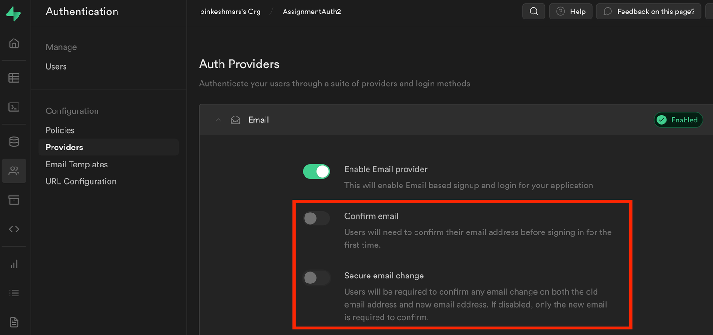
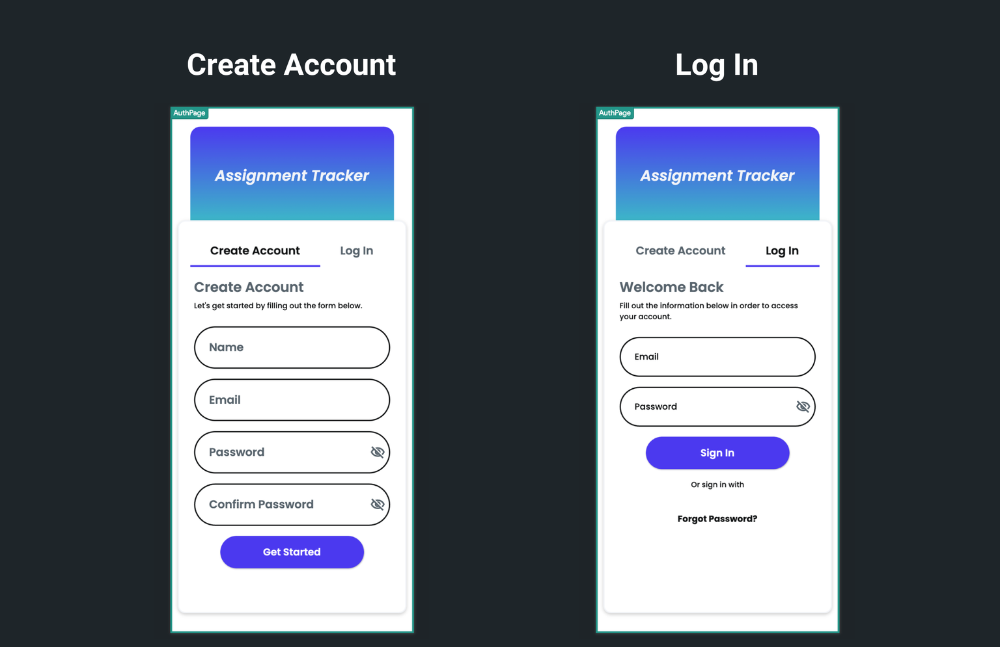
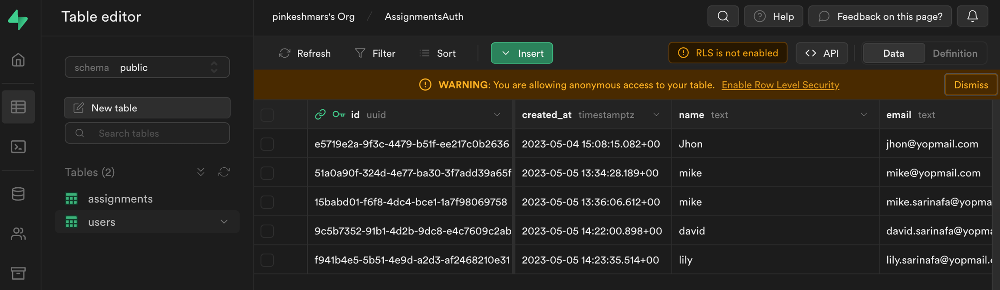

# Email Authentication

Supabase email authentication is a secure and easy way to allow users to sign up and log in to your application using their email and password.

:::info[Prerequisites]
Before getting started with this section, ensure you have,

1. Completed all steps in the [**Supabase setup**](../../supabase/supabase-setup.md)
2. Completed [**Initial setup**](initial-setup.md) 
   required for authentication.
:::

## Adding Email Authentication

Let's see how to add a Supabase email authentication by building an example that looks like this:

<figure>
    
<iframe src="https://www.loom.
    com/embed/7d789e3520fd47e38f06a2f9404d04a5?sid=ec15e6af-084e-47c6-8c14-fbb36f1fc174" frameborder="0" allow="accelerometer; autoplay; clipboard-write; encrypted-media; gyroscope; picture-in-picture; web-share" referrerpolicy="strict-origin-when-cross-origin" allowfullscreen></iframe>

    
    
  <figcaption class="centered-caption"></figcaption>
</figure>

The steps to add Supabase email authentication are as follows:

### Configure Email Authentication in Supabase

Due to some Supabase auth behavior, you need to disable the email verification on the Supabase side. However, you can still add the email verification logic on your own in your app if you wish to.

Here's how you disable email verification on the Supabase side:

1. In your Supabase project, navigate to **Authentication > Provider**.
2. Open the **Email** section and disable the **Confirm email** and **Secure email change**.

<figure>
    
  <figcaption class="centered-caption">Disable email verification on the Supabase side</figcaption>
</figure>

### Building pages

Let's add a page that allows users to create accounts and log in. To speed up, you can add a page from the [template](../../../resources/ui/pages/intro-pages.md#create-a-page-from-a-popular-template). Here is the page added from the templates, and after some modification, it looks the below:

Also, see how to build a page layout in case you want to build a page from scratch.

### Adding Create Account [Action]

Now, you can proceed to add an account creation flow, which basically consists of three actions in the following order:

1. Supabase [Create Account Action](auth-actions.md#create-account-action)
2. Supabase [Insert row action](../../database/supabase/database-actions.md#insert-row-action)
3. [Navigate](../../../ff-concepts/navigation-routing/nav-overview.md) action

The first one creates an account in Supabase and adds an email and password in the "auth.users" table (i.e., *Protected schemas > schema auth*). However, this action does not create an entry in the "users" table you created [here](initial-setup.md#1-creating-a-users-table). To do so, you need to add another action called Supabase *insert row* action with the user's details, such as email and profile_pic. Once the entry has been created, you can navigate to the home page using the navigate action.

Here's how it looks:

<figure>
    
<iframe src="https://www.loom.
    com/embed/054ccddb5ed54aaf98a45fd2384525ba?sid=eade0c13-727a-47f5-95b0-d7d66168b694" frameborder="0" allow="accelerometer; autoplay; clipboard-write; encrypted-media; gyroscope; picture-in-picture; web-share" referrerpolicy="strict-origin-when-cross-origin" allowfullscreen></iframe>

    
    
  <figcaption class="centered-caption"></figcaption>
</figure>

### Adding Log In [Action]

To allow users to log in with their credentials, you can use the [**Log In**](auth-actions.md#log-in-action) action.

### Adding Logout [Action]

To let users log out of your app, you can use the [**Log Out**](auth-actions.md#log-out-action) action.

### Verify user creation

To verify that you have successfully added the email authentication, you can come over to your Supabase project > Table Editor > select the "users" table and verify the user entries.

<figure>
   
    
    
  <figcaption class="centered-caption"></figcaption>
</figure>

### What's next?

Now that you have successfully added the Supabase email authentication in your app, you can access the logged-in user's details, such as email, user id, phone number, email verified, and JWT token via the **Set Variable menu > Authenticated User**.

Here's an example of filtering the to-do list based on the logged-in user using the **Set Variable menu > Authenticated User > User ID** property.

<iframe src="https://www.loom.
com/embed/9a62d44880264177a5ed6d52b78330c8?sid=a52506a8-1f4b-467d-bf41-f30f98361a48" frameborder="0" allow="accelerometer; autoplay; clipboard-write; encrypted-media; gyroscope; picture-in-picture; web-share" referrerpolicy="strict-origin-when-cross-origin" allowfullscreen></iframe>

