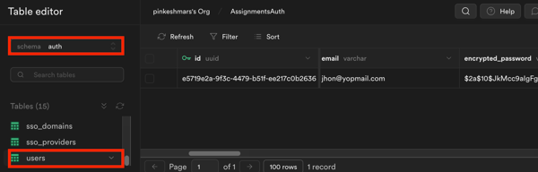
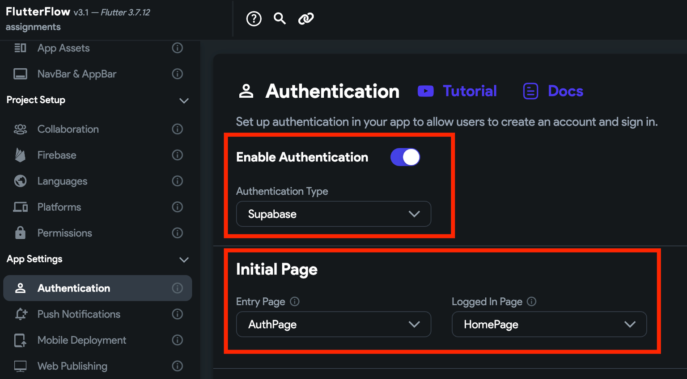

# Initial Setup

To use authentication, you will need to complete the following initial setup:

1. [Creating a "users" table](#1-creating-a-users-table)
2. [Enabling authentication in FlutterFlow](#2-enabling-authentication-in-flutterflow)

:::info[Prerequisites]
Before you begin, make sure you have completed the 
[**Supabase Setup**](../../supabase/supabase-setup.md).
:::

### 1. Creating a "users" table

To use Supabase authentication, you'll need to create a table to store your users' data, such as their name, email, and profile picture.

Also, it's recommended to create a [foreign key relationship](https://supabase.com/docs/guides/database/tables#joining-tables-with-foreign-keys) from the `id` column of your "users" table to the `id` column of the "users" table in auth (protected) schema, i.e., `auth.users.id` with `on delete cascade`. This ensures that when a user is deleted from the "auth.users" table, their corresponding data in your "users" table will also be removed.

Here's how you do it:

<figure>
    
<iframe src="https://www.loom.
    com/embed/430d196461b7466283a069de9ff7e707?sid=7ccb937f-f711-4a55-b1c5-f65a8515fa94" frameborder="0" allow="accelerometer; autoplay; clipboard-write; encrypted-media; gyroscope; picture-in-picture; web-share" referrerpolicy="strict-origin-when-cross-origin" allowfullscreen></iframe>

    
    
  <figcaption class="centered-caption"></figcaption>
</figure>

:::note
The "users" table in auth (protected) schema is a private table that Supabase uses to store auth-related sensitive information such as email, encrypted pass, and confirmation token.

:::

### 2. Enabling authentication in FlutterFlow

To enable authentication in FlutterFlow:

1. Open your FlutterFlow project.

2. Navigate to the Setting and Integrations () from the Navigation Menu > App Settings > 
   Authentication.

3. Turn on the **Enable Authentication** toggle and select **Authentication Type** to **Supabase**.

4. To ensure that your users are directed to the appropriate pages based on their login status, you must set the [initial pages](../../../resources/projects/settings/general-settings.md#initial-page).

