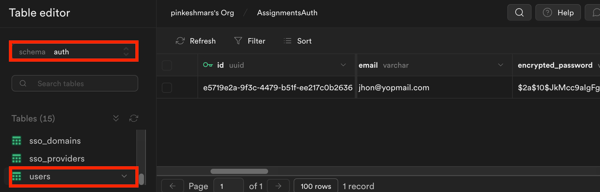
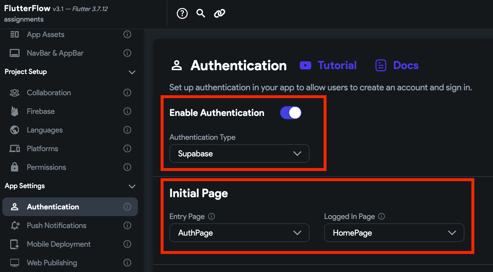

# Set Up Supabase Email Authentication

To use authentication, you will need to complete the following initial setup:

1. [Creating a profile table (optional)](#1-creating-a-users-table)
2. [Enabling authentication in FlutterFlow](#2-enabling-authentication-in-flutterflow)

:::info[Prerequisites]
Before you begin, make sure you have completed the
[**Supabase Setup**](../../supabase/supabase-setup.md).
:::

### 1. Creating a profile table (optional) {#1-creating-a-users-table}

Supabase Authentication stores credentials and identity records in `auth.users`; a separate public table is not required merely to sign users in. Create a profile table only when your app needs queryable application data such as a display name or profile picture.

For a profile table, create a primary-key/foreign-key relationship from its `id` column to `auth.users.id`, commonly with `on delete cascade`. Enable Row Level Security and add policies that allow each user only the intended operations on their own row. A foreign key preserves referential integrity; it does not create authorization rules.

Here's how you do it:

<figure>
    
<iframe title="Initial Setup: Supabase Auth interactive tutorial" src="https://www.loom.com/embed/430d196461b7466283a069de9ff7e707?sid=7ccb937f-f711-4a55-b1c5-f65a8515fa94" frameborder="0" allow="accelerometer; autoplay; clipboard-write; encrypted-media; gyroscope; picture-in-picture; web-share" referrerpolicy="strict-origin-when-cross-origin" allowfullscreen></iframe>

  <figcaption class="centered-caption"></figcaption>
</figure>

:::note
The `auth.users` table is managed by Supabase and is not exposed through the auto-generated API. Do not copy credential fields into your public profile table. Follow [Supabase user-management guidance](https://supabase.com/docs/guides/auth/managing-user-data) when designing a profile table or signup trigger.

:::

### 2. Enabling authentication in FlutterFlow

To enable authentication in FlutterFlow:

1. Open your FlutterFlow project.

2. Navigate to **Settings and Integrations > App Settings > Authentication**.

3. Turn on the **Enable Authentication** toggle and select **Authentication Type** to **Supabase**.

4. To ensure that your users are directed to the appropriate pages based on their login status, you must set the [initial pages](../../../resources/projects/settings/general-settings.md#initial-page).

