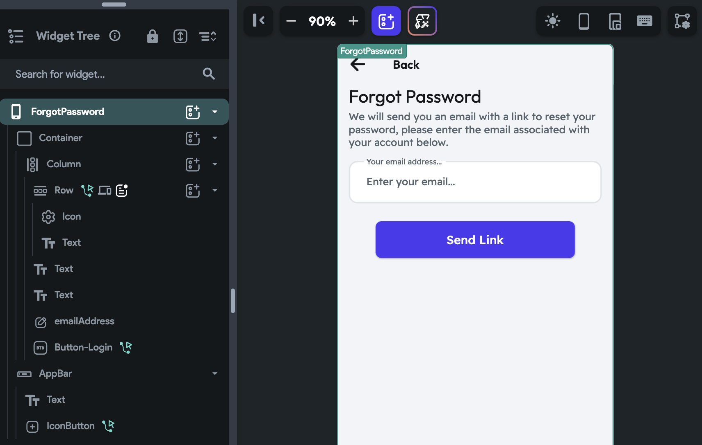
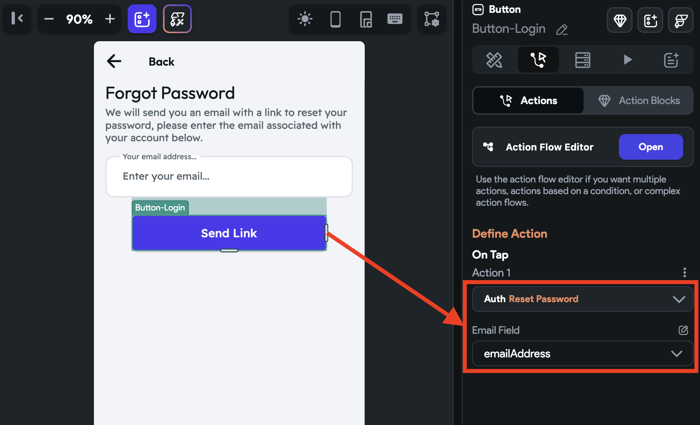

# Password Reset

Password reset allows users to change their password by sending them a password reset link to their email address.

    <iframe 
        src="https://www.loom.com/embed/ecbcbe948925431da777b6393f8b5b10?sid=07e6bcbe-610a-4b7c-8572-271527cd956c"
        title=""
        style={{
            position: 'absolute',
            top: 0,
            left: 0,
            width: '100%',
            height: '100%',
            colorScheme: 'light'
        }}
        frameborder="0"
        loading="lazy"
        webkitAllowFullScreen
        mozAllowFullScreen
        allowFullScreen
        allow="clipboard-write">
    </iframe>

## Adding password reset action

Adding password reset comprises of following steps:

1. [Building page](#1-building-page)
2. [Adding reset password action](#2-adding-reset-password-action)

### 1. Building page

Let's add a page that allows users to provide their email address. To speed up, you can add a page from the [template](#). Here is what the template page (named 'Forgot Password 01') looks like:

### 2. Adding reset password action

On click of the 'Send Link' button, you'll add the 'Reset Password' action, which sends the password reset link to the given email address.

To add reset password action:

1. Select the widget (e.g., Button) on which you want to add the action.

2. Select **Actions** from the properties panel (the right menu) and select **Add Action**.
3. Search and select the **Reset Password** (under *Backend/Database > Firebase Authentication*) action.
4. Set the **Email** **Field** dropdown to the widget name that accepts email (e.g., *TextFieldEmail*).

