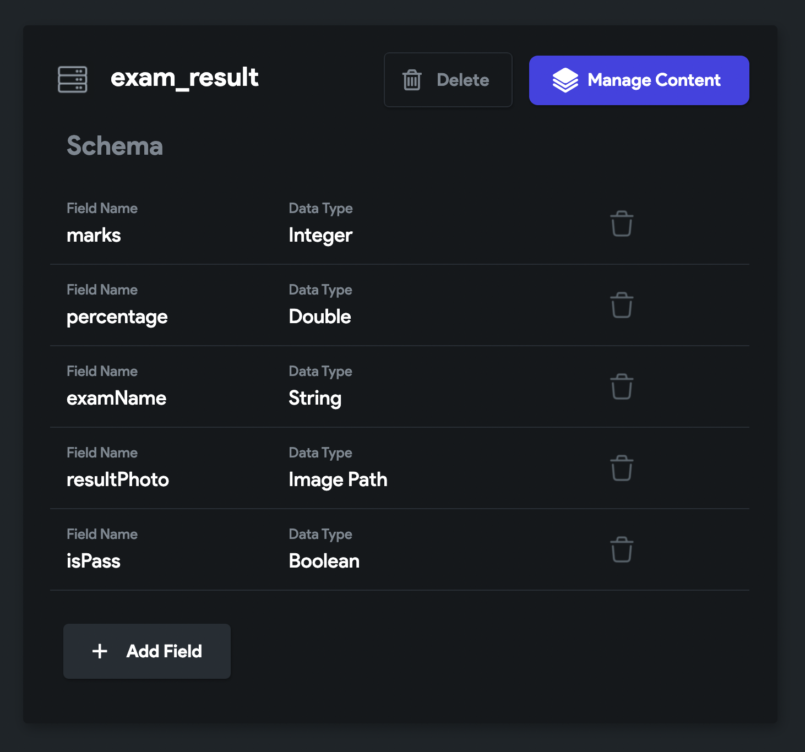
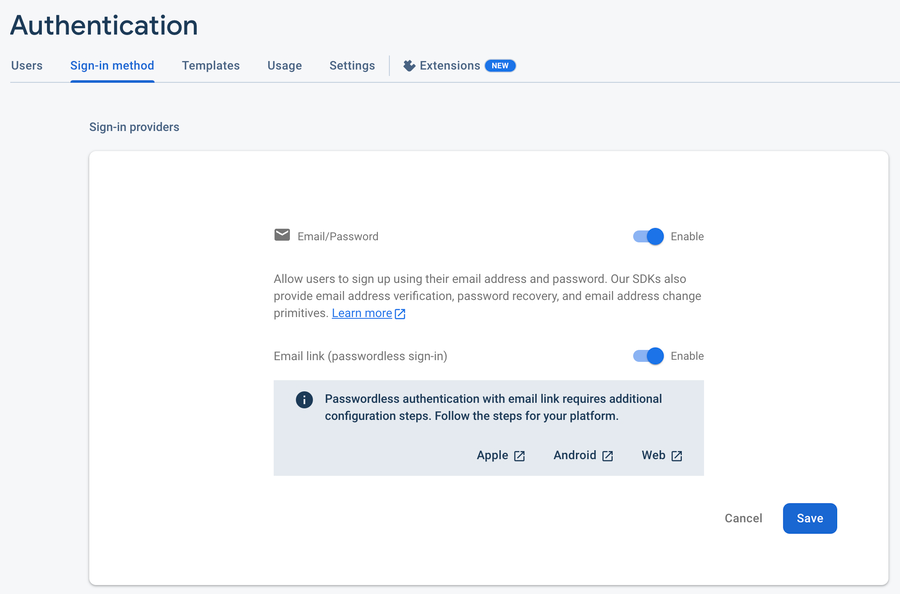
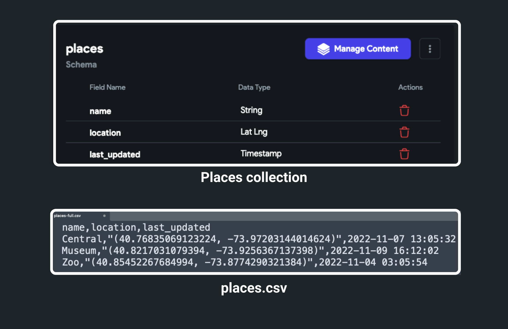
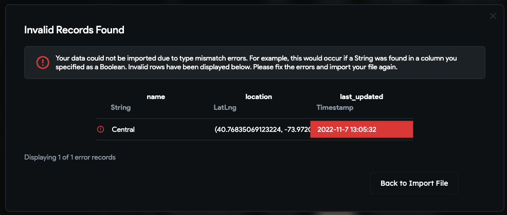
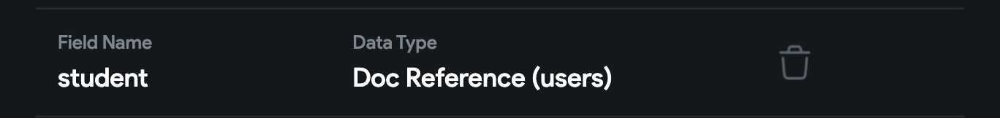
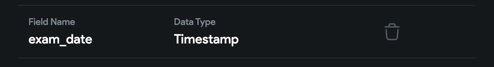
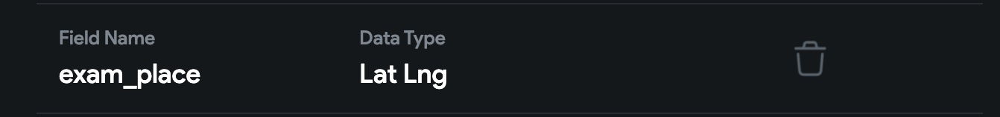
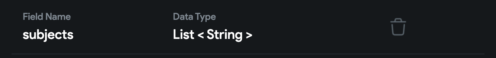

# Firestore Content Manager

The Firestore Content Manager provides an easy way to visually create, edit, and add documents 
to your [**Firestore database**](getting-started.md).

:::info
* Subcollections are not supported in Content Manager at this time.
* Firestore Content Manager is included in the **Pro plan**.
:::

:::note[Prerequisites]

Before getting started with this section, ensure you:

1. Become familiar with [**Structuring the Firebase Database**](getting-started.md#structuring-the-database).
2. Completed all steps in the [**Firebase Setup**](../../firebase/connect-to-firebase-setup.md).
3. Create a [**Collection**](creating-collections.md).
4. [**Defined the Fields**](creating-collections.md#define-schema-creating-fields) for the collection. Only fields defined in 
   your Firebase schema are 
   shown in the Firebase Content Manager.
:::

## Adding Document

Before you add a new document to the collection, make sure you have some Fields added. For instance, the 'exam_result' collection with basic fields looks like this:

<figure>
    
  <figcaption class="centered-caption">'exam_result' collection</figcaption>
</figure>

To add a document:

1. Head to the **Firestore** (left side Navigation Menu) and click **Manage Content**. This will 
open up a new browser window.
2. Select the **Collection** to which you want to add a document and then select + **Add Document.** A popup will appear.
3. Enter the information for the record and click **Add Document**.

:::caution
If you get this error "**Could not create an account as firebase@flutterflow.io to your Firebase 
project**", just enable the '[**Email Sign-In**](../../authentication/firebase-auth/email-sign-in.md)' in your 
Firebase 
project.


:::

<div class="video-container"><iframe src="https://www.loom.
com/embed/a9a406bd5ee140a9bd0570d0dc013314?sid=6e1d5fc4-063f-4bb9-8732-524abebfbc09" frameborder="0" allow="accelerometer; autoplay; clipboard-write; encrypted-media; gyroscope; picture-in-picture; web-share" referrerpolicy="strict-origin-when-cross-origin" allowfullscreen></iframe></div>


### Upload CSV file for bulk addition

You might want to migrate your data from somewhere else to the collection of your current project. Adding an extensive list of records one by one is an incredibly time-consuming process. If you can get or already have data in a CSV (comma-separated values) file, we allow uploading the CSV file, and your data will be loaded into the collection in just a few steps.

:::info
To successfully upload the data:

* Ensure you have header rows in your CSV file. The header should contain the exact name of the fields you have in your collection.
* If you are uploading lat-long data, make sure you format it like (lat, lng) or [lat,lng].
* Dates must be in a format like YYYY-MM-DD HH:MM:SS, where hours should be in 24hrs format (e.g., 2022-11-07 13:05:32).
:::

To better understand, here is the sample places collection and CSV file:



**_places.csv_**
```
name,location,last_updated
Central,"(40.76835069123224, -73.97203144014624)",2022-11-07 13:05:32
Museum,"(40.8217031079394, -73.9256367137398)",2022-11-09 16:12:02
Zoo,"(40.85452267684994, -73.8774290321384)",2022-11-04 03:05:54
```
Here's how you upload the CSV file:

1. Select the **Collection** and click the **Upload CSV** button (see top right side). A popup 
will open.
2. Click **Select File** and upload your CSV file.
3. Now, you can choose the **Separator Type** and enter the **Number of Rows to Upload**. If you leave this empty, all records will be imported.
4. Click **Upload CSV** button.
5. Once the file is uploaded, you'll see the preview of data with field name and its data type.
6. Click **Validate & Import**. If everything looks good, this will import the data and you can **Finish and Close**. If there is any issue with data type mismatch or formatting issue, you'll see a message like this:


<figure>
    
  <figcaption class="centered-caption">Formatting issue</figcaption>
</figure>

<div class="video-container"><iframe src="https://www.loom.
com/embed/483f870f1c3142fbbf51044a90528dd2?sid=94dbe172-ce4f-42e2-8606-904be1e36225" frameborder="0" allow="accelerometer; autoplay; clipboard-write; encrypted-media; gyroscope; picture-in-picture; web-share" referrerpolicy="strict-origin-when-cross-origin" allowfullscreen></iframe></div>

<p></p>

If your CSV file contains additional fields, you'll go through a quick *field import process* that will add the new fields with their data in your collection.

<div class="video-container"><iframe src="https://www.loom.
com/embed/52e2f2afce104f63a87e1e935ebd8e1f?sid=435a3702-a1cf-4a60-a97c-5b8d0f2a55f2" frameborder="0" allow="accelerometer; autoplay; clipboard-write; encrypted-media; gyroscope; picture-in-picture; web-share" referrerpolicy="strict-origin-when-cross-origin" allowfullscreen></iframe></div>


---

## Adding Advanced Fields

You might want to add some advanced fields to store data, such as a Document Reference, DateTime, LatLng, and Multiple Items.

Let's see how to add them using Firestore Content Manager.

### Document Reference

To store the document reference, make sure you have a Field with **Data Type** set to **Doc/Record Reference** and **Reference Type** set to your **Collection**.

The field looks like this:



To add a document reference:

1. First, select the **Collection** from which you want to get a document reference.
2. Click on the **id** of the record to **copy** the document reference.
3. Now, select the **Collection** you would like to add a document to and then select + **Add Document.** A popup will appear.
    1. Find the **Field** that accepts document reference and **paste** it
    2. Click **Add Document**.

<div class="video-container"><iframe src="https://www.loom.
com/embed/4a967e69a73f4654a14e208ba2c599fb?sid=38acc42c-2df2-4acd-a16b-c6b67ae6d786" frameborder="0" allow="accelerometer; autoplay; clipboard-write; encrypted-media; gyroscope; picture-in-picture; web-share" referrerpolicy="strict-origin-when-cross-origin" allowfullscreen></iframe></div>


### Date Time

To store the DateTime, make sure you have a Field with **Data Type** set to **Timestamp**.

The field looks like this:



To add a Date Time:

Select the **Collection** you would like to add a document to and then select + **Add Document.** A popup will appear.
   1. Find the **Field** that accepts DateTime.
   2. Click on it, choose the **Date,** and then click **OK**.
   3. Now, select **Time** and click **OK**.
   4. Click **Add Document**.

:::note
To modify the given Date Time, click on the Date Time Field again to open the Date Picker dialog.
:::

<div class="video-container"><iframe src="https://www.loom.
com/embed/60bccdc46f4d4f41a5daae3176c10a14?sid=2742657c-a1ac-418f-b790-48ca15d95cf6" frameborder="0" allow="accelerometer; autoplay; clipboard-write; encrypted-media; gyroscope; picture-in-picture; web-share" referrerpolicy="strict-origin-when-cross-origin" allowfullscreen></iframe></div>


### Lat Lng

To store the Latitude and Longitude of any place, make sure you have a Field with **Data Type** set to **Lat Lng**.

The field looks like this:



To add a Lat Lng for any place:

Select the **Collection** you would like to add a document to and then select + **Add Document.** A popup will appear.
1. Find the **Field** that accepts LatLng. There are two ways you can add LatLng.
   * Directly add LatLng value for any place.
   * Click on the icon to find the place and get the LatLng.
2. Click **Add Document**.

<div class="video-container"><iframe src="https://www.loom.
com/embed/1f0d58f3d1f64f6ab5e40fe34d49fc39?sid=de5cd66e-2b99-4fea-8fb1-8c5eb2c5008a" frameborder="0" allow="accelerometer; autoplay; clipboard-write; encrypted-media; gyroscope; picture-in-picture; web-share" referrerpolicy="strict-origin-when-cross-origin" allowfullscreen></iframe></div>


### Multiple Items

To store the multiple items of the same data type, For example, a list of Fruit names, make sure you have a Field with **Data Type** set and **Field Type** set to **List**.

The field looks like this:



To add data to List Field:

1. Select the **Collection** you would like to add a document to and then select + **Add Document.** A popup will appear.


	2. Find the **Field** that accepts a list and click on it.
	5. Click on the **+ Add Item** and enter the value.
	8. Similarly, add more items.
	11. Click **Add Document**.

### Custom DataType (aka Firestore Map)

To add data to a custom data type field:

Select the **Collection** you would like to add a document to and then select + **Add Document**.A popup will appear.
1. Find the **Field** that accepts a custom data type.
2. Select **Tap to Set Fields (Unset)** or **Tap to Edit Fields** (based on whether you are 
   creating or updating the document). This will open a new popup.
3. Enter the values for the fields of the custom data type.
4. Select **Save Data**.
5. Click **Add Document**.

<div class="video-container"><iframe src="https://www.loom.
com/embed/f16b8393e86342848b5c2d361f184956?sid=05f7a626-6de1-49cb-a730-73ee74e8473d" frameborder="0" allow="accelerometer; autoplay; clipboard-write; encrypted-media; gyroscope; picture-in-picture; web-share" referrerpolicy="strict-origin-when-cross-origin" allowfullscreen></iframe></div>


---

## Updating Document

To update a document:

1. Select the **pencil icon** in the row of the Document you want to update**.** You can also open 
the record by long-pressing any field in the Document (excluding the ID).
2. A popup will appear. Update the document as needed and then select **Update Document.**
3. You will now see the updated information displayed in your collection.

<div class="video-container"><iframe src="https://www.loom.
com/embed/7d528b68a69346f2bdd51b7c5152d695?sid=5021b80a-ebe2-44cd-a0f6-87bb008a9497" frameborder="0" allow="accelerometer; autoplay; clipboard-write; encrypted-media; gyroscope; picture-in-picture; web-share" referrerpolicy="strict-origin-when-cross-origin" allowfullscreen></iframe></div>


---

:::tip[Other Tips & Tricks]

* Clicking on the ID field will copy the \*reference\* to a record. This is a helpful feature when you need to reference a user while you are creating a document.
* Clicking on assets will open the asset URL.

:::

---

## FAQ
<details>
<summary>Getting 'Error updating Firestore Security Rules...'</summary>

To fix this issue, you must [**deploy the Firestore Rules**](firestore-rules.md#deploy).
</details>

<details>
<summary>Getting the error "Could not create an account as firebase@flutterflow.io to your Firebase project.</summary>

If you encounter such an issue, you just need to enable the 
[**Email Sign-In**](../../authentication/firebase-auth/email-sign-in.md) in your 
Firebase project.
</details>
