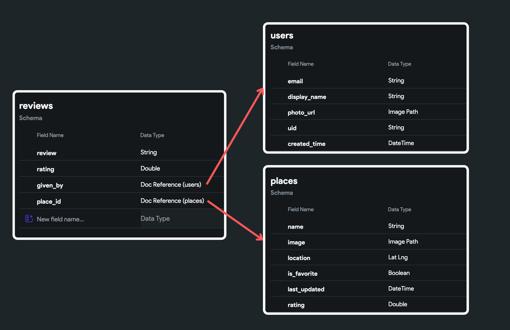
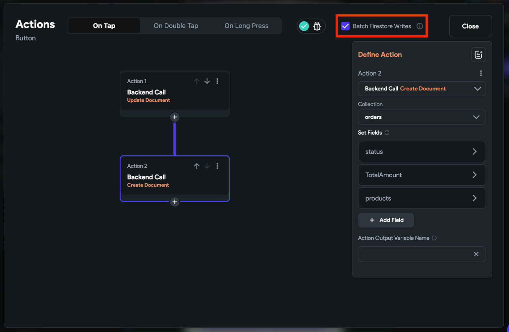

# Firestore Actions

The Firestore action allows you to create, update, or delete a record from a Firestore Collection.

:::info[Prerequisites]

- Get to know how to [**structure the Firebase Database**](getting-started.md#structuring-the-database).
- Ensure you've gone through and completed every step in the [**Firebase Setup**](../../firebase/connect-to-firebase-setup.md)
  for your project.
- Created a [**collection**](creating-collections.md)
  :::

## Types of Firestore Database Actions

Following are the types of Firestore database action:

1. [**Create Document**](#create-document-action)**:** Creates a new record inside the specified 
   Firestore Collection.
2. [**Read Document**](#read-document-action): Fetches document data using a reference.
3. [**Update Document**](#update-document-action)**:** Updates the specified field value of the 
   existing document.
4. [**Delete Document**](#delete-document-action)**:** Deletes records inside the specified 
   Firestore Collection.
5. [**Query Collection**](#query-collection-action): Retrieves record(s) from the Firstore 
   collection.

### Create Document [Action]

Go to your project page on FlutterFlow and follow the steps below to define the Action to any widget.

1. Select the **Widget** (e.g., Button) on which you want to add the action.
2. Select **Actions** from the Properties Panel (the right menu), and click **Open**. This will open an **Action Flow Editor** in a new popup window.
3. Click on **+ Add Action**.
4. On the right side, search and select the **Firestore** > **Create Document** action.
5. Set the **Collection** to your collection name.
6. Under the **Set Fields** section, click on the **+ Add Field** button.
7. Open the *Field* to pass its value from a widget:
   - Set the **Value Source** to **From Variable**.
   - Click on **UNSET** and select **Widget State > Name** of the TextField.
8. Similarly, add the field for the other UI elements.
9. By default, documents are added with an auto-generated ID. However, if you prefer to use your own ID for the document, you can enable the **Custom ID** toggle.

<iframe src="https://www.loom.
com/embed/cb4db8e0ec364d63ade1c8ddb8f40e49?sid=c4b45e2d-4d89-4544-a7f9-86c6bd11566a" frameborder="0" allow="accelerometer; autoplay; clipboard-write; encrypted-media; gyroscope; picture-in-picture; web-share" referrerpolicy="strict-origin-when-cross-origin" allowfullscreen></iframe>

### Read Document [Action]

There are some scenarios where you may want to fetch document data in response to a widget action. For example, fetching the user's profile details like name, profile picture, and bio to display them on click of a button.

Here are some more use cases where you may find this action helpful:

* Fetching additional user details for a post or comment.
* Retrieve product details, price, and availability for order IDs in a user's cart.
* Get details for cities referenced within a country document in a travel app.

Let's see how to add this action with an example that fetches and displays the details of users who've reviewed a travel destination. Here's how it looks:

<iframe src="https://www.loom.
com/embed/8a3289685e2740d19b868ee76701179d?sid=c90e25d3-f4a6-4aa8-98ed-d17f2d5fb1c0" frameborder="0" allow="accelerometer; autoplay; clipboard-write; encrypted-media; gyroscope; picture-in-picture; web-share" referrerpolicy="strict-origin-when-cross-origin" allowfullscreen></iframe>

Here's how collections are setup:

Follow the steps below to define this action to any widget:

1. Select the **Widget** (e.g., Button) on which you want to add the action.
2. Select **Actions** from the Properties Panel (the right menu), and click **Open**. This will open an **Action Flow Editor** in a new popup window.
3. Click on **+ Add Action**.
4. On the right side, search and select the **Firestore** > **Read Document** action.
5. Now, **Select Reference to Read** data from.
6. Provide the **Action Output Variable Name**. This will be used to store the document data.

<iframe src="https://www.loom.
com/embed/7da68f8517f147b8b51a5059655f9729?sid=780aa288-9e06-4f79-92cc-2d66782f8f46" frameborder="0" allow="accelerometer; autoplay; clipboard-write; encrypted-media; gyroscope; picture-in-picture; web-share" referrerpolicy="strict-origin-when-cross-origin" allowfullscreen></iframe>

7. Now, you can use the *Action Output Variable Name* provided in the previous step to fetch the 
details. For example, to display data on Text widget, select the **Text widget > Properties Panel > Text > Set Variable menu > ***[action_output_variable_name]*** > select the field** you want to display.

<iframe src="https://www.loom.
com/embed/94de6ff1dfb44fafa573f0ef519199c9?sid=5d8cb7aa-fe85-462b-981f-5c673960ed4f" frameborder="0" allow="accelerometer; autoplay; clipboard-write; encrypted-media; gyroscope; picture-in-picture; web-share" referrerpolicy="strict-origin-when-cross-origin" allowfullscreen></iframe>

### Update Document [Action]

Go to your project page on FlutterFlow and follow the steps below to define the Action to any widget.

1. Select the **Widget** (e.g., Button) on which you want to add the action.
2. Select **Actions** from the Properties Panel (the right menu), and click **Open**. This will open an **Action Flow Editor** in a new popup window.
3. Click on **+ Add Action**.
4. On the right side, search and select the **Firestore** > **Update Document** action.
5. In order to update a specific document within a Firebase collection, you need to specify the reference to that document. The reference acts as a pointer to the exact document you want to update.
6. Under the **Set Fields** section, click on the **+ Add Field** button.
7. Open the *Field* to pass its value from a widget:

   1. Set the **Value Source** to **From Variable**.
   2. Click on **UNSET** and select **Widget State > Name** of the TextField.
8. Similarly, add the field for the other UI elements.

<iframe src="https://www.loom.
com/embed/1f4675229ddb4a3188891f9859e297a0?sid=d3a0d32a-c669-44ba-b916-bc456330b97c" frameborder="0" allow="accelerometer; autoplay; clipboard-write; encrypted-media; gyroscope; picture-in-picture; web-share" referrerpolicy="strict-origin-when-cross-origin" allowfullscreen></iframe>

### Delete Document [Action]

Go to your project page on FlutterFlow and follow the steps below to define the Action to any widget.

1. Select the **Widget** (e.g., Button) on which you want to add the action.
2. Select **Actions** from the Properties Panel (the right menu), and click **Open**. This will open an **Action Flow Editor** in a new popup window.
3. Click on **+ Add Action**.
4. On the right side, search and select the **Firestore** > **Delete Document** action.
5. In order to delete a specific document within a Firebase collection, you need to specify the reference to that document. The reference acts as a pointer to the exact document you want to delete.

<iframe src="https://www.loom.
com/embed/db7b60cf67cb49148ec10284c11215d5?sid=7acf6f3f-e7c4-48ae-acd7-0b07eaaa8aac" frameborder="0" allow="accelerometer; autoplay; clipboard-write; encrypted-media; gyroscope; picture-in-picture; web-share" referrerpolicy="strict-origin-when-cross-origin" allowfullscreen></iframe>

### Query Collection [Action]

There are certain scenarios where you may want to query a collection manually. For example, you might want to only fetch data in response to a specific user action, such as clicking a button or submitting a form.

Additionally, If your app fetches different data under different conditions, you might find it more convenient to manually call queries. For example, fetching different tasks for admin and team members.

To manually query a collection, follow the steps below to define this action to any widget:

1. Select the **Widget** (e.g., Button) on which you want to define the action.

2. Select **Actions** from the Properties Panel (the right menu), and click **Open**. This will open an **Action Flow Editor** in a new popup window.
3. Click on **+ Add Action**.
4. On the right side, search and select the **Firestore** > **Query Collection** action.
5. Choose the **Collection** you want to query.
6. Choose the **Query Type** among the following:
   - **List of Documents:** Use this option when you need to query an entire list of documents from 
   a collection. This is useful for retrieving multiple documents that can be ordered or filtered by specific criteria, such as a keyword.
   - **Single Document:** Select this when you want to fetch a specific single document from a 
     collection, typically identified by its unique ID.
   - **Count:** Choose this option to determine the number of documents that meet certain criteria 
     without retrieving the documents themselves. This is useful for getting quick insights or summaries, like the total number of entries that match a filter.
7. You can also [Filter](#filtering-a-collection-query) and [Order](#ordering-a-collection-query) the query result.
8. Provide the **Action Output Variable Name**. This will be used to store the query result.

<iframe src="https://www.loom.
com/embed/f416df1ad705467780a389c6381eae77?sid=776597d6-4574-40f1-8339-d5aedb0acf92" frameborder="0" allow="accelerometer; autoplay; clipboard-write; encrypted-media; gyroscope; picture-in-picture; web-share" referrerpolicy="strict-origin-when-cross-origin" allowfullscreen></iframe>

9. Now, you can use the *Action Output Variable Name* provided in the previous step to generate 
children from a variable on **ListView**.
10. Finally, you can display data in a **Text** 
   widget. To do so, select the **Text widget > Properties Panel > Text > Set from Variable menu** 
   **> [children_from_variable_name] item > select the field** you want to display.

<iframe src="https://www.loom.
com/embed/7aa25a24385c4d4e80ec5d48d29465d4?sid=57ce6e1a-08f8-46dd-a2a7-0a23b15dabd1" frameborder="0" allow="accelerometer; autoplay; clipboard-write; encrypted-media; gyroscope; picture-in-picture; web-share" referrerpolicy="strict-origin-when-cross-origin" allowfullscreen></iframe>

#### Filtering a Collection Query
Sometimes, you might need to filter a list based on a condition. For example, you might want to show only incomplete Todo items on the main listing.

To add a filter when querying a collection:

- In the Action properties of **Query Collection Action**, scroll down and click on the **+ Filter** 
  button at the bottom
- Find the **Field Name**, click on the Unset, and select a field on which you would like to apply 
  the filter.
- Find the **Relation** dropdown, click on the **Unset**, and choose the relation among the list.
- Find the **Value** property and set it to an appropriate value and click **Confirm**.

:::info
- Select a filter relation that aligns with your specific needs. For instance, if you wish to display only incomplete todos, you can create a field named 'isDone,' set the relation to 'Equal To,' and define the value as 'False.' 
- Another example would be to showcase users older than 30; in this case, you'd create a 'Age' field, set the relation to 'Greater Than,' and specify the value as 30.
- You can combine multiple filters using **AND** or **OR** operators to create more advanced filtering logic. This enables you to refine your data query to match specific conditions.
:::

<iframe src="https://www.loom.
com/embed/7eeb6a1488964615af3fdb9f118f4d1e?sid=88cdeb30-70f7-4127-9139-36bd9b02c2a8" frameborder="0" allow="accelerometer; autoplay; clipboard-write; encrypted-media; gyroscope; picture-in-picture; web-share" referrerpolicy="strict-origin-when-cross-origin" allowfullscreen></iframe>

#### Ordering a Collection Query

You might want to show your list based on a specific order. For example, you could show a Todo list in order of due date.

To specify the order when querying a collection:

- In the Action properties of **Query Collection Action**, scroll down and click on the **+ Order 
  By** button at the bottom
- Find the **Field Name**, click on the **Unset**, and select the field which you would like to choose 
  for ordering.
- Find **Order** dropdown, click on the Unset, and choose the order either Increasing or Decreasing and 
  click **Confirm**.

:::info
Choose the order based on your requirements. For instance, if you want to display Todo items sorted by their due dates, simply set the **Field Name** to date and the **Order** to Increasing.
:::

<iframe src="https://www.loom.
com/embed/9b290f31a2fe4c14b6b740ab2f854c0e?sid=797ddfec-5966-4a94-866b-275212ba589b" frameborder="0" allow="accelerometer; autoplay; clipboard-write; encrypted-media; gyroscope; picture-in-picture; web-share" referrerpolicy="strict-origin-when-cross-origin" allowfullscreen></iframe>

:::warning
If you apply both filtering and ordering while querying a collection, an index is necessary 
otherwise FlutterFlow will throw an error. 
[**Learn how to avoid the errors.**](../../firebase/connect-to-firebase-setup.md#adding-indexes)
:::

## Enabling Firestore Batch Write

When working with databases, you often need to create, update, or delete data. Typically, you would send individual requests to the database for each operation, which requires multiple round trips to the server. This can be time-consuming and inefficient.

By enabling Firestore batch write, you can group multiple operations and send them to the database as a single request. With this, either all the operations within the batch will succeed or none of them will be applied. This guarantees data consistency, so you don't end up with a partially updated state if something goes wrong during the process.

:::tip
* You can learn more about 
[**Firestore Batch Write**](https://firebase.google.com/docs/firestore/manage-data/transactions#batched-writes).
* If you are a newbie, we recommend watching [**this video**](https://youtu.be/dOVSr0OsAoU) first.
:::

Suppose you have an e-commerce application, and after a successful order, you need to update the product inventory count and create a new document in the 'orders' collection. Using a batch write, you can combine these operations and execute them together to ensure data consistency.

To enable Firestore batch write, you must have multiple Firestore any combination of 
actions; inside the action editor, at the top right side, enable **Batch Firestore Writes**.

<figure>
    
  <figcaption class="centered-caption">Enabling Firestore Batch Write</figcaption>
</figure>

## Trigger action on data change

Sometimes, you might want to trigger an action whenever the data changes inside the collection. For instance, In a news app, you might want to notify users when new news is available, like this:

<iframe src="https://www.loom.
com/embed/238400b5445b444db712f492584b0d6e?sid=7b496882-0280-4920-924c-640fddeff0a1" frameborder="0" allow="accelerometer; autoplay; clipboard-write; encrypted-media; gyroscope; picture-in-picture; web-share" referrerpolicy="strict-origin-when-cross-origin" allowfullscreen></iframe>

To do so:

1. Ensure you have added a **Query Collection** or **Document from Reference** on a widget with **Single Time Query** disabled.
2. Now, on the widget with **Query Collection** or **Document from Reference**, open the **Action Flow Editor** and set **On Data Change** as the [Action Trigger](../../../resources/control-flow/functions/action-triggers.md). This ensures that any actions you add will be triggered whenever the data is updated, added, or deleted.
3. You can now [add any action](../../../resources/control-flow/functions/action-flow-editor.md#adding-an-action-example) you want to perform, such as showing a notification, refreshing the UI, or fetching related data.

:::info
If you are using this trigger on a ListView, make sure to **disable** the **Infinite Scroll**.
:::

    <iframe 
        src="https://demo.arcade.software/ghFiQWGsQuJu5reUyXnl?embed&show_copy_link=true"
        title=""
        style={{
            position: 'absolute',
            top: 0,
            left: 0,
            width: '100%',
            height: '100%',
            colorScheme: 'light'
        }}
        frameborder="0"
        loading="lazy"
        webkitAllowFullScreen
        mozAllowFullScreen
        allowFullScreen
        allow="clipboard-write">
    </iframe>

