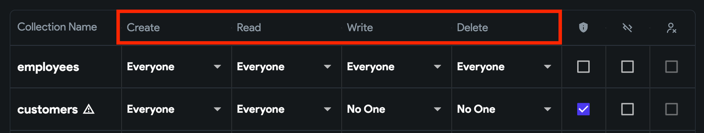
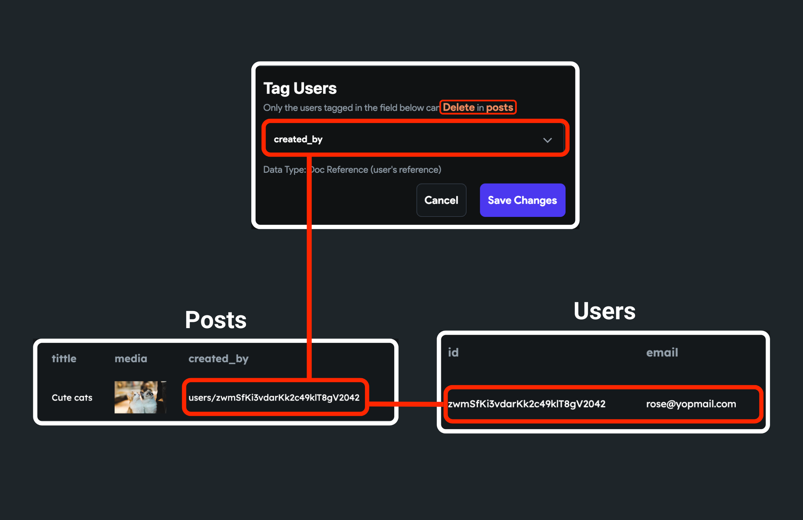
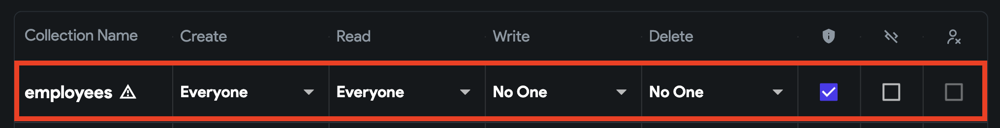
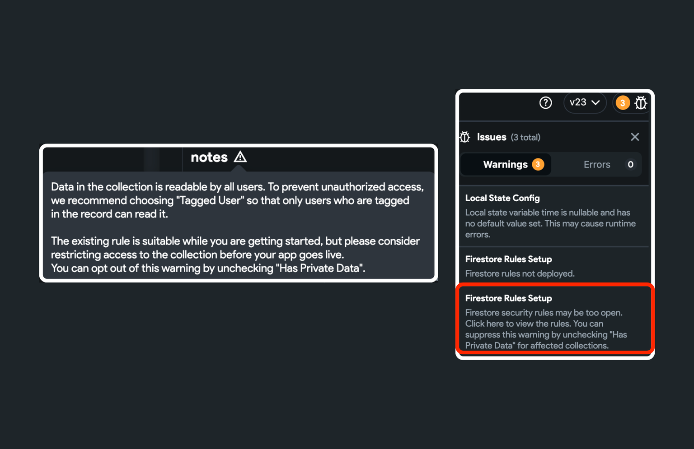
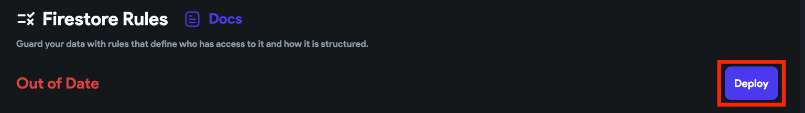
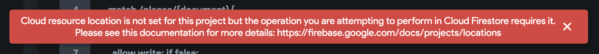
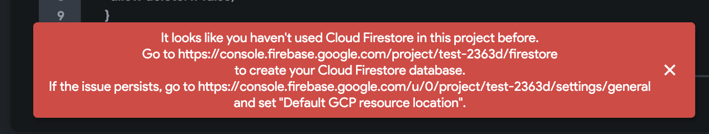
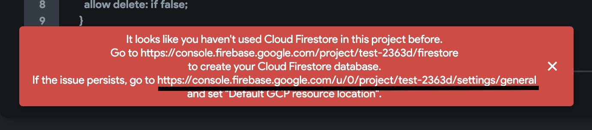
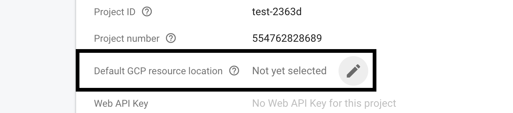

# Firestore Rules

Firestore security rules are essential in safeguarding your Firebase data from potential malicious users. These rules not only enhance security but also give you control over data access within your application. With Firestore rules, you can enforce restrictions, ensuring that only authorized users can interact with specific data.

For instance, you can configure Firestore rules to permit appointment creation only for authenticated users, such as those who have signed in via Email, Google Sign-in, or other authenticated methods.

:::tip
If you are brand new to Firestore rules, check out this overview about [**Getting Started With Firestore Rules**](https://firebase.google.com/docs/firestore/security/get-started).
:::

## Creating Firestore Rules

There are two ways you can set the Firestore Rules:

1. [Using FlutterFlow Firestore setting](#1-using-flutterflow-firestore-settings)
2. [Using Firestore Database Console](#2-using-firestore-database-console)

### 1. Using FlutterFlow Firestore Settings

To set up basic rules, you can use the *Firestore Setting* available right inside FlutterFlow.

#### Overview of Firestore Rules inside of FlutterFlow

You can control the following operations that can be performed on a document:

* **Create:** Allow users to create a new document inside the collection.
* **Read:** Allow users to read documents inside the collection.
* **Write:** Allow users to update a document of a collection.
* **Delete:** Allow users to delete a document of a collection.

<figure>
    
  <figcaption class="centered-caption">Default Rules</figcaption>
</figure>

We provide various levels of access control that allow you to define user permissions for data access:

* **Everyone**: This grants access to all users, whether authenticated or unauthenticated, allowing them to create, read, write, and delete documents.

* **Authenticated Users**: Access is limited to authenticated users only, such as those who have signed in through Email, Google Sign-in, etc. Any user logged into the app can now create, read, write, and delete documents.

* **Tagged Users**: Allow users to read/update/delete a document if they are tagged in that 
  document. For example, say there is a "posts" collection with a `created_by` field representing the user who created the post. Then the "Tagged User" rule can be set on the `created_by` field to only allow accessing (read/update/delete) the post if the logged-in user is the one who created it.

<figure>
    
  <figcaption class="centered-caption"></figcaption>
</figure>

* **Users Collection**: Allow users whose authentication id is the same as the id of a document. Tip: This option is only applicable to a 'users' collection.
* **No One**: No one is allowed to create/read/write/delete a document.

:::caution[Note]
For 'Tagged Users,' the document must contain a field that can either be a reference to the user or a string with the user id.
:::

#### Default rules applied to new collections

When you create a new collection inside the [Firestore Content Manager](../../database/cloud-firestore/firebase-content-manager.md), below are the default rules applied to the collection:

* **Create -> Everyone**: All users can create a document.
* **Read -> Everyone**: All users can read documents.
* **Write -> No One**: No one can update a document.
* **Delete -> No One**: No one can delete a document.

<figure>
    
  <figcaption class="centered-caption">Default Rules</figcaption>
</figure>

The default rule is suitable while you are getting started, but before the app goes live, please think about limiting access to any collections that potentially include the user's private information. To help you with that, we mark it as 'Has Private Data'. This will show you a warning to update the rule and restrict access.

For example, a newly created 'notes' collection allows everyone to read all notes by default. In 
reality, only the user who created it should be able to read it. But because we have marked it 
as '**Has Private Data**' it will show a warning like the one below, and you can modify the 
rules that allow only a user to read notes who created it.

<figure>
    
  <figcaption class="centered-caption">Firestore Warning</figcaption>
</figure>

If you want more control over a specific collection, you can remove the FlutterFlow generated rule by checking the **Exclude** option. And then, you can set up advanced or custom security rules using the Firestore Database console.

:::info
To bring the rules into effect, you must deploy them. Click the **Deploy** button from here, and 
you will see the deployed rules at **Firebase Console > Firebase Database > Rules.**
:::

When a user is deleted from your app, you might want to delete all records and data associated with that user as well. To do so, first set the 'Tagged Users' for the delete rule, and then check the () option.

<div class="video-container"><iframe src="https://www.loom.
com/embed/583cfc171fac4f589330b64742f96cd2?sid=ef8957e2-d66a-46b8-be10-4b8a9735f153" frameborder="0" allow="accelerometer; autoplay; clipboard-write; encrypted-media; gyroscope; picture-in-picture; web-share" referrerpolicy="strict-origin-when-cross-origin" allowfullscreen></iframe></div>


#### Example: How to use Firestore Rules?

Let's take an example to set up the rules on a *todos* collection for the following requirements:

* Only authenticated users should be able to create a Todo item.
* All users (authenticated/unauthenticated) can see all the Todo items.
* Only a user who created the Todo item can update it.
* No one can delete a Todo item.

To set up the Firestore Rules for the above requirements:

1. Inside the **Firestore Rules** section, set the **Create** to **Authenticated Users**.
2. Set the **Read** to **Everyone**.
3. Set the **Write** to **Tagged Users**. This will open a popup named **Tag Users**.
    2. Inside the dropdown, click on **Unset** and select the field that contains either user reference or user id.
    5. Click **Save Changes**.
4. Set the **Delete** to **No One**.
5. Now you can [deploy](#deploy) the rules.

:::caution
The rules set in the above examples are for simplification purposes. You should carefully understand your requirements and set the rules accordingly.
:::
<div style={{
    position: 'relative',
    paddingBottom: 'calc(56.67989417989418% + 41px)', // Keeps the aspect ratio and additional padding
    height: 0,
    width: '100%'
}}>
    <iframe 
        src="https://demo.arcade.software/jyev2F2KqwIlZEFU6zJl?embed&show_copy_link=true"
        title=""
        style={{
            position: 'absolute',
            top: 0,
            left: 0,
            width: '100%',
            height: '100%',
            colorScheme: 'light'
        }}
        frameborder="0"
        loading="lazy"
        webkitAllowFullScreen
        mozAllowFullScreen
        allowFullScreen
        allow="clipboard-write">
    </iframe>
</div>

### 2. Using Firestore Database Console

To set up more advanced or custom rules you can use the Firebase Cloud Firestore Console.

Let's take an example to set up the rules on a *todos* collection for the following requirements:

* To create a Todo item, a user must be authenticated and verified via email or phone, and it must be a valid Todo item.
* All users (authenticated/unauthenticated) can see all the Todo items.
* Only a user who created the Todo item can update it with valid Todo details.
* Only a user who created the Todo item can delete it.

To set up the Firestore Rules for the above requirements:

1. Open the Firebase console of your project, and click on the **Firestore Database** in the left 
side menu.
2. Select the **Rules** tab.
3. Paste the following code and click on **Publish**.

```
rules_version = '2';

service cloud.firestore {
  match /databases/{database}/documents {
    
    // 1.
    function isSignedIn() {
      return request.auth != null;
    }
    
    // 2.
    function verified() {
      return request.auth.token.email_verified || request.auth.token.phone_number;
    }
    
    // 3.
    function isValidItem() {
      return request.resource.data.name.size() > 0 ;
    }
  
    match /todos/{document} {
      // 4.
      allow create: if isSignedIn() && verified() && isValidItem();
      // 5.
      allow read: if true;
      // 6.
      allow write: if isValidItem() && resource.data.created_by == /databases/$(database)/documents/users/$(request.auth.uid);
      // 7.
      allow delete: if resource.data.created_by == /databases/$(database)/documents/users/$(request.auth.uid);
    }

    match /users/{document} {
      allow create: if request.auth.uid == document;
      allow read: if true;
      allow write: if request.auth.uid == document;
      allow delete: if false;
    }

    match /{document=**} {
      allow read, write: if
          request.time < timestamp.date(2022, 3, 4);
    }
  }
}
```
Here’s a quick rundown of what’s going on in the code above:

1. **isSignedIn()**: This checks whether a user is authenticated.
2. **verified()**: This checks whether the user is verified via email or phone.
3. **isValidItem()**: This checks whether the Todo item is not empty.
4. **create**: Allow to create a Todo item only if a user is authenticated, verified, and created a valid Todo item.
5. **read**: Allow all users to see all Todo items.
6. **write**: Allow to update a Todo item with valid details to a user who created it.
7. **delete**: Allow to delete a Todo item to a user who created it.

<div style={{
    position: 'relative',
    paddingBottom: 'calc(56.67989417989418% + 41px)', // Keeps the aspect ratio and additional padding
    height: 0,
    width: '100%'
}}>
    <iframe 
        src="https://demo.arcade.software/kzuJJDsEaahl4oxQKipi?embed&show_copy_link=true"
        title=""
        style={{
            position: 'absolute',
            top: 0,
            left: 0,
            width: '100%',
            height: '100%',
            colorScheme: 'light'
        }}
        frameborder="0"
        loading="lazy"
        webkitAllowFullScreen
        mozAllowFullScreen
        allowFullScreen
        allow="clipboard-write">
    </iframe>
</div>

## Deploy

To deploy the Firestore Rules, simply hit the **Deploy** button.

Before you finally deploy the new rules, a popup asks you to review your changes. Here, you can check the difference between the before and after versions of the Firestone Rules and then click **Deploy Now**.

:::caution
* You must deploy rules every time you make a change.
* Before publishing your app, ensure you remove default Firestore rules, such as 'allow read, write: if request.time < timestamp.date(2024, 5, 31);' and exit Test mode.
:::



## Reverting to previous rules

You can go back to the previous rule state with Firebase Cloud Firestore Console:

1. Open the Firebase console of your project, and click on the **Firestore Database** in the left 
side menu.
2. Select the **Rules** tab.
3. Select and copy the previous rule from the left-side menu.
4. Select the current rule from the left side menu and paste the previous rule.
5. Click on **Publish**.

:::tip[Learn More]
Learn more about [**creating custom Firestore Rules**](https://fireship.io/snippets/firestore-rules-recipes/).
:::

## FAQs

<details>
<summary>Getting an error, "cloud resource location is not set," "It looks like you haven't used Cloud Firestore in this project before" or a red alert while deploying rules.</summary>

**Error-1**



**Error-2**



If you encounter such issues, the 'Default GCP resource location" is probably not set in your Firebase project. To fix this issue:

1. First, ensure that you have 
[**configured the Cloud Firestore**](../../firebase/connect-to-firebase-setup.md#enable-firestore-for-database-access)
2. And then, head over to the second link (from the error) and set the GCP resource location.

<figure>
    
  <figcaption class="centered-caption">Highlighted Link</figcaption>
</figure>

<figure>
    
  <figcaption class="centered-caption">Set the link to Firebase Console > General 
Settings > Default GCP Resource Location </figcaption>
</figure>

</details>


