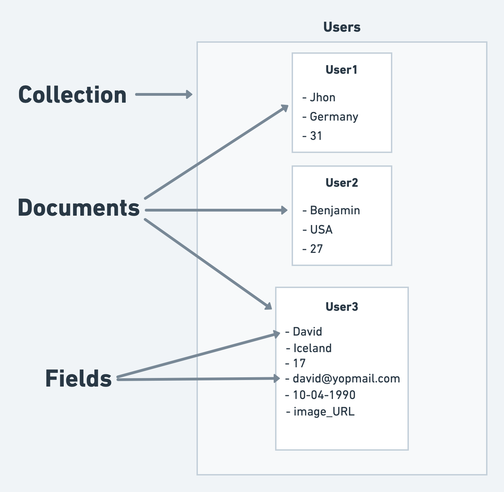
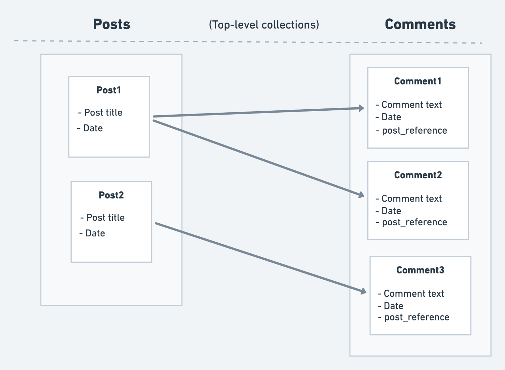
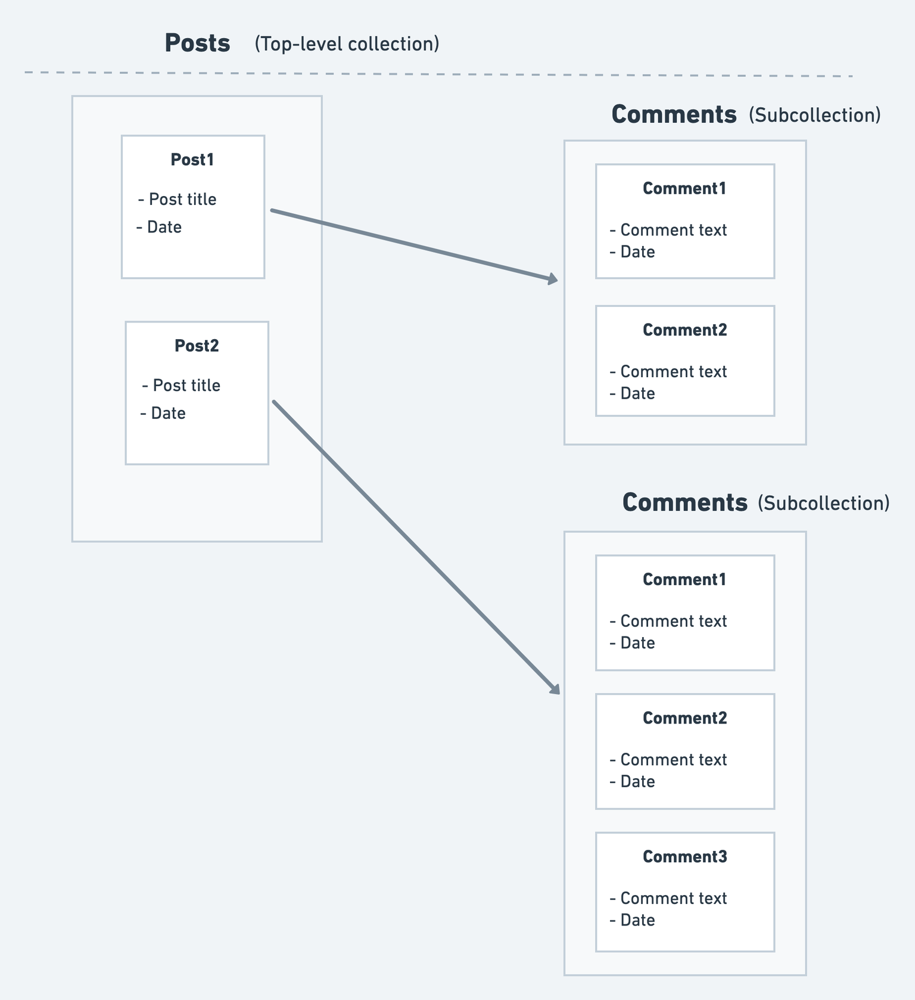

# Cloud Firestore

[Firestore Database](https://firebase.google.com/docs/firestore) is a product from Google's [Firebase](https://firebase.google.com/). It's a flexible, scalable, NoSQL cloud database. It allows you to store your app data and uses real-time listeners to keep the data in sync.

Let's understand the Firestore database (Cloud Firestore, a NoSQL Database) in more detail.

## What is a NoSQL Database

A NoSQL database does not store data in relational tables. Cloud Firestore uses a collection-and-document model and permits documents in one collection to contain different fields. It still enforces supported value types, document and request limits, indexes, and security rules. FlutterFlow also uses the collection schema you define to type fields in the builder and generated code, so keep documents consistent with that schema.

Key terms to remember:

* **Collection:** A collection is simply a set of 'documents.'
* **Document:** A document is a record that contains the 'fields.'
* **Fields:** The key-value pairs inside the document are called 'fields.' e.g., name, place, age, etc.

To better understand, see the figure below:

<figure>
    
  <figcaption class="centered-caption">Collection document model</figcaption>
</figure>

Every user's information is kept in a unique document. Multiple of these documents come together to form a collection. The beauty of this system is that not all documents within a collection need to have identical fields. So, if you decide to add a new field (e.g., DOB, image) to a new document, there's no need to go back and add it to older ones.

---

## Structuring the Database

To see how to structure the database, consider an example that allows users to comment on a post.

With FlutterFlow, you can structure the database in the following ways:

* [Top-level collections](#top-level-collections)
* [Subcollections within documents](#subcollections-within-documents)

### Top-level collections

In Top-level collections, multiple collections are created at the root level of your database.

For example, you create collections such as 'comments' and 'posts' at the root level. Comments for all the posts are stored in a single top-level collection. To know which comment belongs to which post, you include additional reference fields that distinctly identify each post within this structure.

<figure>
    
  <figcaption class="centered-caption">Top-level collection</figcaption>
</figure>

:::tip[Pro Tip]
Use top-level collections when you often search or filter within one collection without depending on another. For instance, if you want to see all comments, regardless of their related post (i.e., showing comments with the most likes).
:::

### Subcollections within documents

Collections are created inside the document. Such a collection is called subcollection.

For example, you create the top-level collection, such as posts, and then create a 'comments' collection (as a subcollection) inside the 'posts' collection. The advantage? You don't need extra tags or reference fields to know which post a comment belongs to; it's already grouped right there.

<figure>
    
  <figcaption class="centered-caption">Subcollections</figcaption>
</figure>

:::tip[Pro Tip]
Subcollection is best when you have several queries or filters or search on a collection that
is based on the other collection. For example, loading or searching the comments of a specific post (i.e., show all comments of a specific post that have more likes.)
:::

:::warning[Secure and cost-aware design]
Before using real user data, configure and test [Firestore Security Rules](firestore-rules.md). Rules are authorization, not query filters: the query itself must be compatible with the permitted result set. Also review Firestore pricing, indexes, and limits; listeners and repeated queries can generate billable reads.
:::

---

:::tip[Learn more]
[**MongoDB**](https://www.mongodb.com/), [**Cassandra**](https://cassandra.apache.org/_/index.html), and [**ElasticSearch**](https://www.elastic.co/) are the other No-SQL database solutions that exist in the market.

If you are a visual learner, you can check out the video:

<iframe title="Getting Started: Cloud Firestore interactive tutorial" src="https://www.youtube.com/embed/v_hR4K4auoQ" frameborder="0" allow="accelerometer; autoplay; clipboard-write; encrypted-media; gyroscope; picture-in-picture; web-share" referrerpolicy="strict-origin-when-cross-origin" allowfullscreen></iframe>

:::

## Manage Databases

You can also create multiple Firestore databases within a single Firebase project. This is especially useful for enterprise use cases, for example, when managing region-based databases or supporting multiple clients with isolated data stores.

Additionally, you can use multiple databases to simulate different environments such as development, staging, and production. **However, note that** this setup is not directly related to the [Development Environments](../../../testing-deployment-publishing/development-environments/development-environments.md) in FlutterFlow, which operates independently of Firebase's multi-database configuration. This means that you’ll need to manually switch Firestore Database ID when switching Development Environments.

To create a new database, go to the **Firebase Console > Firestore Database** section. Click the button next to the default database, i.e, **Add database**. Choose a region and configure your security rules. Once the new database is created, you can switch between databases using the dropdown.

Next, copy the new **Database ID** and navigate to **FlutterFlow > Settings and Integrations > Firebase > Advanced Settings**. Paste the ID into the **Firestore Database ID** input field. Finally, regenerate the config file. Your app will now use the selected database. Deploy and test security rules and indexes for that database separately.

    <iframe
        src="https://demo.arcade.software/f2lDuL0yk5UlrjkNnfRF?embed&show_copy_link=true" title="Getting Started: Cloud Firestore interactive tutorial"
        style={{
            position: 'absolute',
            top: 0,
            left: 0,
            width: '100%',
            height: '100%',
            colorScheme: 'light'
        }}
        frameborder="0"
        loading="lazy"
        webkitAllowFullScreen
        mozAllowFullScreen
        allowFullScreen
        allow="clipboard-write">
    </iframe>

