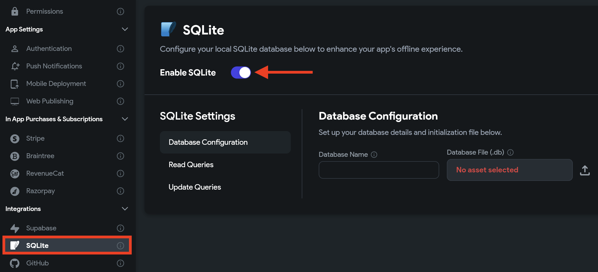
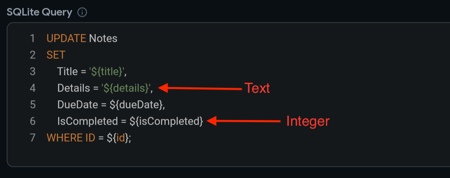
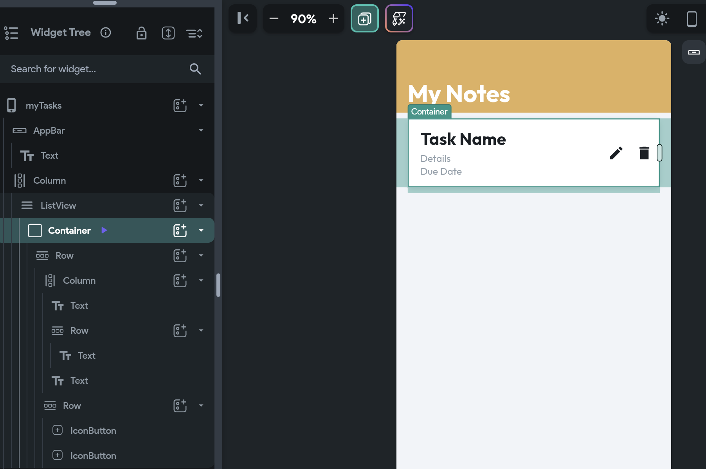
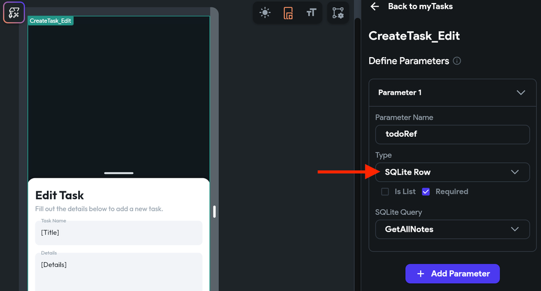

# SQLite

SQLite is a compact, efficient database management system. Unlike conventional databases that require a server, SQLite is serverless and embeds directly into applications.

It's perfect for mobile apps where resources are limited, and a full-fledged database server is impractical. For example, it's ideal for a mobile app that needs to store data locally, such as a personal finance tracker or a health record app, especially when offline functionality is required.

:::caution
Currently, we don't support SQLite on Web-based apps.
:::

Let's understand how you can utilize SQLite in your app with an example. An app where users can add, update, and delete Notes. Here's how it looks when completed:

<div class="video-container"><iframe src="https://www.loom.
com/embed/a35c0fab4b9b4c2ba4f479d82e402f44?sid=f5fb3f4e-c4bb-4ec5-a5b5-60f6aed47d5d" frameborder="0" allow="accelerometer; autoplay; clipboard-write; encrypted-media; gyroscope; picture-in-picture; web-share" referrerpolicy="strict-origin-when-cross-origin" allowfullscreen></iframe></div>

<p></p>

Here are the steps to build such an example:

1. [Enable SQLite](/settings-and-integrations/integrations/sqlite#id-1.-enable-sqlite)
5. [Database configuration](/settings-and-integrations/integrations/sqlite#id-2.-database-configuration)
8. [Add SQL queries](/settings-and-integrations/integrations/sqlite#id-3.-add-sql-queries)
11. [Display all notes](/settings-and-integrations/integrations/sqlite#id-4.-display-all-notes)
14. [Add note](/settings-and-integrations/integrations/sqlite#id-5.-add-note)
17. [Update note](/settings-and-integrations/integrations/sqlite#id-6.-update-note)
20. [Delete note](/settings-and-integrations/integrations/sqlite#id-7.-delete-note)
23. [Running app on a device](/settings-and-integrations/integrations/sqlite#id-8.-running-app-on-a-device)
26. [Example project](/settings-and-integrations/integrations/sqlite#id-9.-example-project)

## 1. Enable SQLite

To enable SQLite in FlutterFlow, navigate to Settings and Integrations > Integrations > SQLite > switch on the **Enable SQLite** toggle.



## 2. Database configuration

In the database configuration step, you'll need to upload your SQLite database file and assign a name to it. This process is crucial for initializing the database when your app launches.

If you don't yet have an SQLite database, you can easily create one using tools like 
[sqlitebrowser](https://sqlitebrowser.org/). Simply download [sqlitebrowser](https://sqlitebrowser.org/dl/), create a new database, set up your tables, and optionally add some data. After preparing your database, upload the file to FlutterFlow to integrate it with your app.

For this example, we'll create a "Notes" table with `ID`, `Title`, `Details`, `DueDate`, and `IsCompleted` as columns.

Here's how you can create and configure the database:

<div class="video-container"><iframe src="https://www.loom.
com/embed/c5f43ee65e954df2856d78e035ab8bba?sid=fcaccfa1-fb0c-4f67-9953-d51e7227e596" frameborder="0" allow="accelerometer; autoplay; clipboard-write; encrypted-media; gyroscope; picture-in-picture; web-share" referrerpolicy="strict-origin-when-cross-origin" allowfullscreen></iframe></div>

<p></p>

:::info[Important to note]
SQLite does not have dedicated date-time or boolean data types. For storing date-time values like `DueDate`, we use the integer data type and represent the date-time as a [**UNIX timestamp**](https://www.unixtimestamp.com/). Similarly, for boolean values, such as checking if a note is completed, SQLite uses integers where `0` represents `false` (or not completed) and `1` represents `true` (or completed).
:::

## 3. Add SQL queries

SQL queries are statements used to interact with a database. We allow you to add queries in two different sections:

#### 1. Read Queries

This includes statements that retrieve data from the database but do not modify anything. Some common examples:

* `SELECT * FROM customers;` - retrieve all rows and columns.
* `SELECT name, city FROM customers;` - retrieve specific columns.
* `SELECT * FROM customers WHERE city = 'New York';` - retrieve rows that match a condition.

#### 2. Update Queries

This includes statements that modify the database, such as:

* `INSERT INTO customers (name, address, city) VALUES ('John', '555 Main St', 'New York')` - add new rows.
* `UPDATE customers SET address = '123 Main Street' WHERE name = 'John'` - update existing rows.
* `DELETE FROM customers WHERE city = 'Chicago'` - delete rows that match a condition.

In general, to add any query, you need to provide a name, the query statement, and variables that are used to pass values from your app to queries. For *Read Queries*, you have to define the output columns as well. This will help you display the row data in the UI by selecting the column name.

:::tip

* To use variables, simply use the syntax `${variableName}`. For example: `SELECT \* FROM Notes WHERE id = ${noteId}`
* When passing string or text data in queries, enclose variables in single quotes, like `${title}`, to signify them as strings.

:::

Below are the queries that we'll require for this example:

#### 1. GetAllNotes

This will retrieve all notes from the database.


```
Select * from Notes
```
<div class="video-container"><iframe src="https://www.loom.
com/embed/b4f1e7961d7144d894ec399bb5b13053?sid=383a4e77-a394-4372-a01e-d66918167ebe" frameborder="0" allow="accelerometer; autoplay; clipboard-write; encrypted-media; gyroscope; picture-in-picture; web-share" referrerpolicy="strict-origin-when-cross-origin" allowfullscreen></iframe></div>

<p></p>

#### 2. AddNote

This will add a new note to the database.


```
INSERT INTO Notes (Title, Details, DueDate, IsCompleted) VALUES ('${title}', '${details}', ${dueDate}, 0);
```

<div class="video-container"><iframe src="https://www.loom.
com/embed/a3870b604d8a41f98e49e925f0dac23c?sid=2e5452ad-893b-4cb3-9e92-042b5ee1d20f" frameborder="0" allow="accelerometer; autoplay; clipboard-write; encrypted-media; gyroscope; picture-in-picture; web-share" referrerpolicy="strict-origin-when-cross-origin" allowfullscreen></iframe></div>

<p></p>

#### 3. UpdateNote

This will update the existing note based on the note ID.


```
UPDATE Notes
SET 
    Title = '${title}',
    Details = '${details}',
    DueDate = ${dueDate},
    IsCompleted = ${isCompleted}
WHERE ID = ${id};
```

<div class="video-container"><iframe src="https://www.loom.
com/embed/e87e63de285543ecbd50ada0cfd4577b?sid=a76bb4a8-b434-45ce-bd0b-7d9e8a7daa93" frameborder="0" allow="accelerometer; autoplay; clipboard-write; encrypted-media; gyroscope; picture-in-picture; web-share" referrerpolicy="strict-origin-when-cross-origin" allowfullscreen></iframe></div>

<p></p>

#### 4. DeleteNote

This will delete the note based on the note ID.

```
DELETE FROM Notes WHERE ID = ${id};
```

<div class="video-container"><iframe src="https://www.loom.
com/embed/aa0bb7bea67145c8b0b61ce57485a5c2?sid=9d950aba-c498-484c-8507-c795bee7459f" frameborder="0" allow="accelerometer; autoplay; clipboard-write; encrypted-media; gyroscope; picture-in-picture; web-share" referrerpolicy="strict-origin-when-cross-origin" allowfullscreen></iframe></div>


## 4. Display all notes

To show a list of notes, you can use the [ListView](/widgets-and-components/widgets/layout-elements/listview) > [Container](/widgets-and-components/widgets/layout-elements/container) widgets to [design a page](/widgets-and-components/ui-and-layout-101) that looks like the following:



Now, on the ListView widget, add a [SQLite backend query](/data-and-backend/backend-query/sqlite-query) and display data in UI elements.

### To add a SQLite Query:

Go to your project page and follow the steps below to define an SQLite query:

- Select the widget (or page) on which to apply the query.
- Select **Backend Query** from the Properties panel (the right menu).
- Click **Add Query** and set the Query Type to **SQLite Query**.
- Select the **Query Name**. (Only Read Queries will be displayed here.) and click **Confirm**.

<div class="video-container"><iframe src="https://www.loom.
com/embed/29001cdee28d4d058dd711b3bbb70b7e?sid=b20e4978-c0c5-446a-88f8-222ffba42879" frameborder="0" allow="accelerometer; autoplay; clipboard-write; encrypted-media; gyroscope; picture-in-picture; web-share" referrerpolicy="strict-origin-when-cross-origin" allowfullscreen></iframe></div>

<p></p>

Once you have the SQLite query defined, you can use the data retrieved from the query to display on widgets present inside. Follow the steps below:

- Select the widget (e.g., Text) on which you want to display the data.

- From the Properties Panel, open the Set from Variable menu > select [your query name] Row > 
select the column data that you want display here and click **Confirm**.

<div class="video-container"><iframe src="https://www.loom.
com/embed/1cf9df4d871948c1b6513587c05d9040?sid=aae128a2-0066-433c-a34d-fad4031bb11b" frameborder="0" allow="accelerometer; autoplay; clipboard-write; encrypted-media; gyroscope; picture-in-picture; web-share" referrerpolicy="strict-origin-when-cross-origin" allowfullscreen></iframe></div>

<p></p>

:::info
In our example, the due date is stored as a Unix timestamp, which isn't user-friendly for display purposes. Therefore, we've included a custom function in the [example project](https://app.flutterflow.io/project/note-taking-app-zto2ua) that converts this timestamp into a human-readable date format.
:::

## 5. Add note

You can add a new note in the database using the SQLite query Action with the type set to 
**Update Query** and Query Name to [AddNote](#2-addnote).

Here's how you do it:

<div class="video-container"><iframe src="https://www.loom.
com/embed/bb775d5da5614117ac6fbe6542b6c29f?sid=877e565c-be16-4c77-a92c-9a6a9540860d" frameborder="0" allow="accelerometer; autoplay; clipboard-write; encrypted-media; gyroscope; picture-in-picture; web-share" referrerpolicy="strict-origin-when-cross-origin" allowfullscreen></iframe></div>


## 6. Update note

For updating note values, like marking a note as completed or modifying other fields, utilize 
the SQLite Query Action and set the type to **Update Query**. Here, set the Query Name to 
[UpdateNote](#3-updatenote).


Here's how you do it:

<div class="video-container"><iframe src="https://www.loom.
com/embed/35564ad5e8be4f58aa72527bc6818183?sid=2740d823-df42-49c3-ae54-8e0e95a72411" frameborder="0" allow="accelerometer; autoplay; clipboard-write; encrypted-media; gyroscope; picture-in-picture; web-share" referrerpolicy="strict-origin-when-cross-origin" allowfullscreen></iframe></div>

:::info

* In this example, we are updating the note on a bottom sheet component. To provide a better user experience, we initially display the current values of the note, ensuring that users have a clear idea of what they are going to edit. To display the note values in bottom sheet, we [pass](/widgets-and-components/custom-components#passing-data) the current note with **Type** set to **SQLite Row**.



* When updating a date value, we also verify if the date has been modified. If there's no change, we simply pass back the same value we received.
:::

## 7. Delete note

You can delete an existing note from the database using the [SQLite query action](/actions/actions/backend-database/sqlite-query) with the type set to *Update Query* and Query Name to [DeleteNote](/settings-and-integrations/integrations/sqlite#id-4.-deletenote).

:::tip[Pro Tip] 
To refresh the page, simply add an [**Update App State Action**](#) action with the Update Type set 
to 'Rebuild Current Page'.
:::
Here's how you do it:

<div class="video-container"><iframe src="https://www.loom.
com/embed/e8369eeccc1740628a988c064d9e1713?sid=f51569d4-ff45-4834-b9d8-f4cc6d776361" frameborder="0" allow="accelerometer; autoplay; clipboard-write; encrypted-media; gyroscope; picture-in-picture; web-share" referrerpolicy="strict-origin-when-cross-origin" allowfullscreen></iframe></div>

<p></p>

:::info[Example project]

Check out the complete [**example project**](https://app.flutterflow.io/project/note-taking-app-zto2ua) for reference.
:::

## FAQs

<details>
<summary>Can SQLite handle complex data structures compared to App State Variables?</summary>


Yes, SQLite can handle complex data structures much more effectively. It allows for structured data storage, complex queries, sorting, and filtering, which are challenging to implement with app state variables.


</details>

<details>
<summary>Is SQLite a good choice for apps that require offline functionality?</summary>

Absolutely. SQLite stores data locally, making it an excellent choice for apps that need to operate offline. Users can access and manipulate data without needing an internet connection.

</details>

<details>
<summary>Will using SQLite affect my app's performance compared to using App State Variables?</summary>


SQLite is designed to be lightweight and efficient, so it generally won't negatively impact your app's performance. In fact, for larger data sets, it's more efficient than storing data in app state variables.

</details>

<details>
<summary>How does SQLite ensure data security and integrity?</summary>


SQLite maintains data integrity and supports transactional operations. This means it ensures the database state remains consistent even in cases of unexpected interruptions, like app crashes or power failures.


</details>
