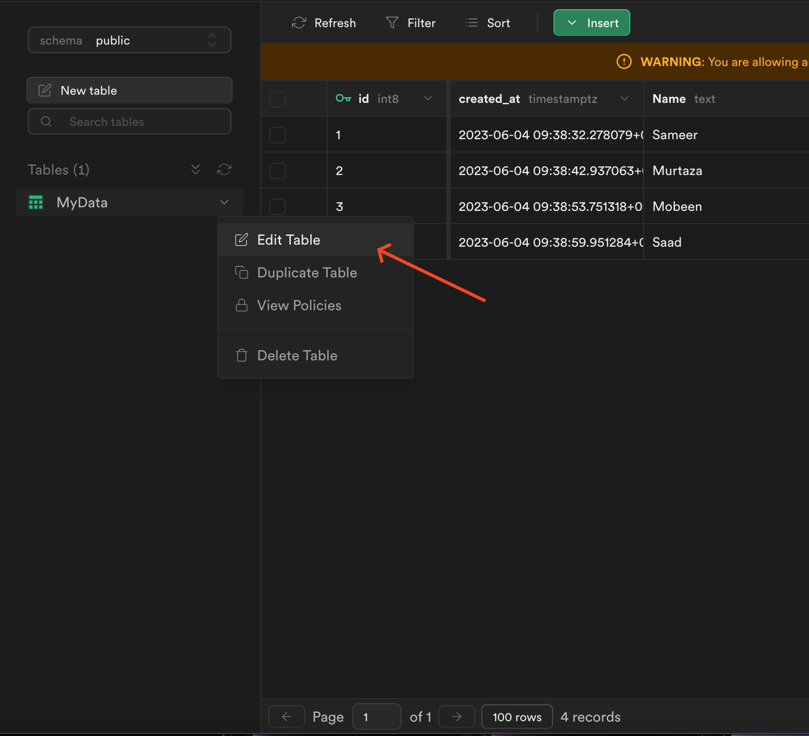
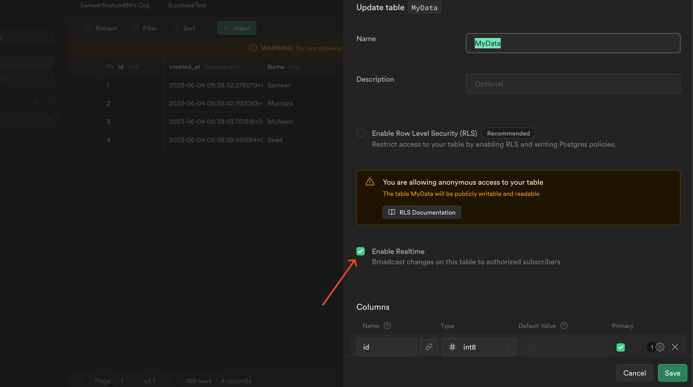
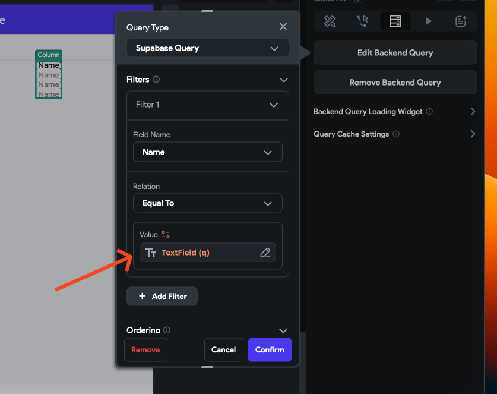
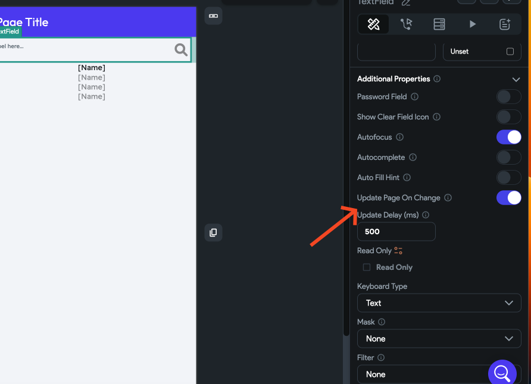
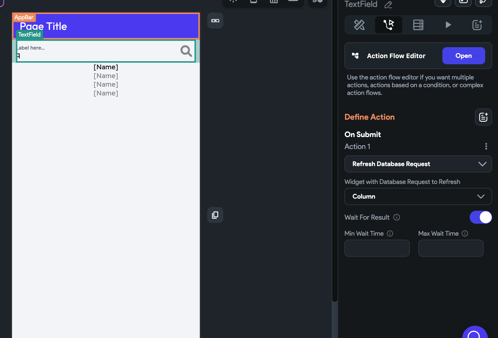

# Supabase Search Implementation

This article outlines a workaround to implement basic search functionality using Supabase in FlutterFlow. While FlutterFlow does not currently support full Supabase search natively, you can use the Realtime feature combined with input filters for a basic search experience.

:::info[Prerequisites]
- A Supabase project integrated with your FlutterFlow app.
- Realtime enabled in the relevant Supabase table.
:::

Follow the steps below to implement Supabase Search:

   - **Enable Realtime in Supabase**

      1. Open your Supabase project and go to **Table Editor**.
      2. Select the relevant table.
      3. Enable **Realtime** updates from the table settings.

      

      

   - **Filter Query Data Using an Input Field**

      4. In FlutterFlow, add an **Input Text Field** to your UI.
      5. Configure your **Query Collection** to apply a filter using the input value.
         - Set the filter condition to `is equal to`.

         

   - **Choose a Trigger Method for Search**

      - Auto-Search on Input Change

      6. Enable **Update Page on Change**.
      7. Set the update frequency to your desired interval.

      

   - **Manual Search on Submit**

      8. Refresh the query manually when the input text is submitted.

      

:::warning
Using real-time updates for live search may incur higher costs compared to performing a search on submission.
:::
