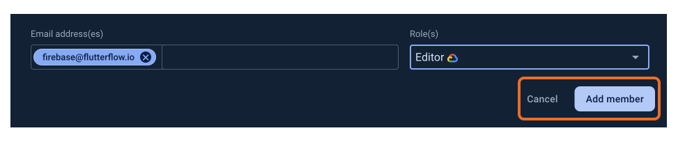

# Connect to Firebase

Firebase integration in FlutterFlow provides an effortless way to enhance your apps with powerful features such as user authentication, cloud storage, real-time databases, and more. This setup guide will walk you through integrating Firebase with FlutterFlow, empowering you to easily create feature-rich, scalable applications.

## Create a new Firebase project from FlutterFlow

FlutterFlow allows you to automatically create a Firebase project directly from the builder using a quick three-step process.

#### Step 1: Set Up Your Project
Go to **Settings & Integrations > Project Setup > Firebase** in FlutterFlow to get started.

#### Step 2: Select Your Region
Hit **+ Create Project**. You’ll see a popup where you can confirm your project's name and choose the Firebase region that best serves your users.

#### Step 3: Connect Your Google Account
Choose **Create** or **Sign in with Google** to link your Firebase account.
If asked, you must grant the access requested from 'flutterflow.io' to be able to create and configure the Firebase project on your behalf. Here, you can **Select all** and click **Continue**.

Once initiated, FlutterFlow will handle the rest of the project creation in the background.

Here's a quick walkthrough:
<iframe src="https://demo.arcade.software/C4Db1hkZU3Dyqd5VmY99?embed&show_copy_link=true" title="Shopping App - FlutterFlow" frameborder="0" loading="lazy" webkitallowfullscreen mozallowfullscreen allowfullscreen allow="clipboard-write" width="100%" height="600"></iframe>
As soon as the process is completed, you will see the following view in your Firebase Settings dashboard. 

#### Enable Firebase Authentication
If you want to use the Firebase Authentication in your app or the Firebase Content Manager, you must enable the authentication in the Firebase console and enable the 'Email/Password' sign-in.

#### Enable Firebase Storage
If you plan to use Firebase storage in your app, click on the Enable Storage on Firebase and enable it on Firebase console.

#### Download Firebase Config files
The configuration files are necessary when connecting to Firebase. It contains various settings and keys that enable your project to communicate with Firebase services. To generate those files, click on Auto Generate Config Files and then click Generate Files.

## Connect an existing Firebase project manually

If you already have a Firebase project and want to connect it to your current FlutterFlow project, go to **Settings & Integrations > Project Setup > Firebase** and click on the Firebase Setup Wizard. A pop-up dialog will appear. Follow these steps:

#### Setup Firebase

In the dialog, scroll down to **Setup Firebase**, check that option, and click **Next Step**. The second page of the dialog will open. Before filling in more information, you need to allow FlutterFlow to access your Firebase project. The following section will guide you through this process.

#### Allow FlutterFlow to Access Your Project

1. Go to the Firebase console of your existing project, navigate to the far left menu, and select **Project Settings -> Users and Permissions**.

2. Select **Add Member** from the top right.

3. Add **firebase@flutterflow.io** as an "**Editor**" for your project and select **Done**. Then press **Add Member**.

4. On the same page (i.e., Users and Permissions), select **Advanced Permission Settings** (small blue text below the table). This will open the Google Cloud console in a new browser window.

5. Find the row containing *firebase@flutterflow.io* and select **Edit principal** (pencil on the far right of the row).

6. Select **+ Add Another Role.**

7. Under **Select A Role**, search for **Service Account User** (you may need to scroll to find this). Select **Service Account User**.

8. Select **+ Add Another Role** again. Under **Select A Role**, search for **Cloud Functions Admin**. Select **Cloud Functions Admin**.

:::info
Note: The option to add Cloud Functions Admin may only show up if you are on a Firebase Blaze plan. In addition, you may need to  [enable cloud functions](https://console.cloud.google.com/marketplace/product/google/cloudfunctions.googleapis.com) first.
Cloud Functions Admin permissions are required for several FlutterFlow features (e.g., Push Notifications). Adding this Cloud Functions Admin is optional, but not doing so will prevent you from using any functions that require Cloud Functions.
:::

#### Connect and autogenerate files

1. From the Firebase dashboard of your project, navigate to the far left menu and select **Project Settings**.

2. Under Your Project, find the **Project ID**, right-click it, and copy.

3. Return to FlutterFlow, enter your Firebase Project ID in the dialog, and click Connect. A green checkmark will appear once the connection is successful.

4. Under Config Files, choose **Generate Config Files** and then select **Generate Files**.

:::info
Do not close or refresh the page while the files are being generated.
:::

## Connect to Firebase on Creating a New FlutterFlow Project

If you know you'll be integrating Firebase as you create your project, you can do the following: 

#### Step 1: Create a new project and enable Firebase

First, create a new project, and while doing so, keep the Setup Firebase option enabled and click Next Step.

#### Step 2: Connect to Firebase  

If you'd like FlutterFlow to create a Firebase project for you, click **"+ Create Project"** and follow the [related steps](#create-a-new-firebase-project-from-flutterflow). Alternatively, if you wish to connect an existing Firebase project manually, please follow the [manual steps here](#connect-an-existing-firebase-project-manually). 

#### Step 3: Enable Authentication

Turn on the Enable Authentication to allow users to log into your app using various sign-in methods, including email and password, social media providers, and even phone number. 

**Note:** this step only enables authentication. You will need to complete an additional setup to implement authentication logic later. 

## Enable Firestore for Database Access 

If you plan to use Firestore Database as your backend, follow these additional steps to enable Firestore. This will allow you to create collections and add documents directly from FlutterFlow.

To configure Firestore Database:

1. From the Firebase dashboard of your project, navigate to the far left menu. Under Build, select Firestore Database and then select Create Database (marked in yellow in the screenshot).

2. Next, you will need to set your **Firebase security rules**. To get started quickly, you can select Start in test mode and select Next. 

:::info
We recommend updating your Firebase security rules before deploying your app. Please see [this 
link](../database/cloud-firestore/firestore-rules.md) for additional information on 
Firestore security rules.
:::

3. Next, you will need to choose the location where your Firestore data will be stored. From the dropdown, select a location and then select Enable. Please see this link for additional information on Firebase locations.

On completion, you land at the panel view of Cloud Firestore and can start creating collections and documents right away!

### Adding Indexes

Deploying indexes is necessary to perform certain queries in your Firestore database. Firestore automatically adds indexes for the most basic queries. However, when you apply both filtering and ordering while querying a collection, an index is necessary, and a warning will be generated to add it.

We create indexes for you. The only thing you need to do is deploy them to your Firestore database.

Here are the steps to deploy indexes.

- Click on the Firestore from the Navigation Menu (left side of your screen).
- Switch to the **Settings** tab.
- Scroll down to the **Firestore Indexes** section and click on **Deploy**.

:::caution[Please note]
If you add a filtering/ordering on the query or change the existing filtering/ordering settings, you should deploy the Firestore Indexes again.
:::

<iframe src="https://www.loom.
com/embed/1abddd1120db477da2c085dbc6b7a742?sid=5b161c8b-3957-4ac9-b27f-dc5ebc03f550" frameborder="0" allow="accelerometer; autoplay; clipboard-write; encrypted-media; gyroscope; picture-in-picture; web-share" referrerpolicy="strict-origin-when-cross-origin" allowfullscreen></iframe>

## Enable Billing

If you want to deploy [Cloud Functions](https://firebase.google.com/products/functions) (e.g., Braintree payments, Push Notifications) or use [Firebase Cloud Storage](https://firebase.google.com/products/storage), you will need to enable billing for your Firebase project. Please follow these steps to enable billing:

1. From the Firebase dashboard of your project, navigate to the far left menu. Under Build, select **Functions** and then select **Upgrade project**.

2. Select **Purchase**. If this is your first time enabling billing, you will be taken to a new page to provide your payment information. Otherwise, you can set a project budget. Please see [this link](https://firebase.google.com/pricing) for additional information on Firebase pricing.

