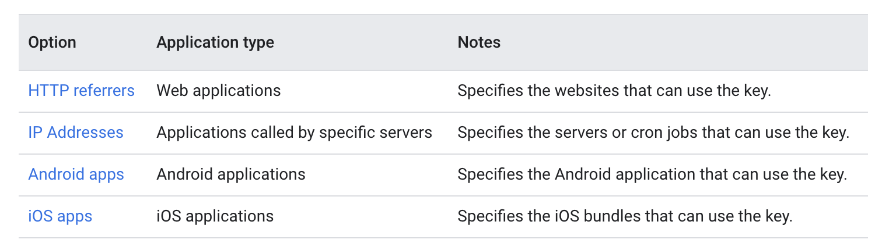

# Best Practices: Secure API Keys

Google Cloud API key restriction is essential for managing access and enhancing security when
working with Google Cloud services. This overview explains how to effectively restrict API keys,
allowing developers to control how and where their keys can be used. Developers can set geographical
restrictions, bind keys to specific IP addresses, or limit usage to particular services. These
measures ensure that API keys are secured, helping to protect projects and maintain optimal
functionality.

To minimize potential damage from compromised API keys:

- **Add restrictions to your API key:** By setting restrictions, you can limit how an API key can be
  used, thus reducing the impact if it becomes compromised.

- **Delete unnecessary API keys:** Remove any API keys that are no longer required to reduce
  exposure to attacks.

- **Rotate your API keys periodically:** Regularly create new API keys, delete the old ones, and
  update your applications to use the new keys. This practice helps maintain security and limit the
  lifespan of any single key.

## Add restrictions to your API key

API keys are unrestricted by default. Unrestricted keys are insecure because they can be used by anyone, from anywhere. You can add either [application restrictions](https://cloud.google.com/docs/authentication/api-keys?#adding-application-restrictions) or [API restrictions](https://cloud.google.com/docs/authentication/api-keys?#api_key_restrictions) to
enhance
security.

In the following example, we will use the **Map API keys** and restrict them to specific platforms
using
their unique identifiers.

At this stage, you should already have API keys created, but they are currently unrestricted. If
they are not yet created, you can follow the integration process for any of the Google Cloud
services we support in FlutterFlow, or for Maps, [you can go here.](../maps/google-maps/generate-maps-keys.md)

All your created API keys should be available on
the [Cloud Credentials Page](https://console.cloud.google.com/apis/credentials). (Ensure you are
logged into the correct Google account and are in the right Google Cloud project.)

Follow the steps below to enable the iOS key exclusively for iOS apps with a unique package name:

    <iframe 
        src="https://demo.arcade.software/givOcppDSZHXzWJDloWj?embed&show_copy_link=true"
        title="Restrict API Keys"
        style={{
            position: 'absolute',
            top: 0,
            left: 0,
            width: '100%',
            height: '100%',
            colorScheme: 'light'
        }}
        frameborder="0"
        loading="lazy"
        webkitAllowFullScreen
        mozAllowFullScreen
        allowFullScreen
        allow="clipboard-write">
    </iframe>

Now your iOS API Key will only work when accessed from your app with the given unique identifier.
You can also restrict the API keys by **HTTP referrers** or **IP addresses**. Here's a quick
overview from the official docs:

:::note[Learn More]
Learn more about **securing API keys for all platforms and restricting API usage** by visiting
the official [**Google Cloud Docs**](https://cloud.google.com/docs/authentication/api-keys?#securing).
:::
