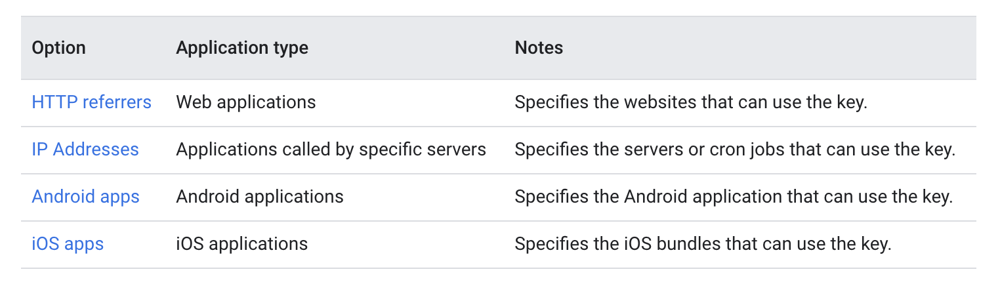

# Best Practices: Secure API Keys

Google Cloud API key restrictions reduce how an exposed key can be abused. Client API keys embedded in Android, iOS, or web builds can be inspected, so do not treat them as secrets. Create separate keys for each platform and environment, apply both an application restriction and API restrictions, and monitor usage and billing.

To minimize potential damage from compromised API keys:

- **Add restrictions to your API key:** By setting restrictions, you can limit how an API key can be
  used, thus reducing the impact if it becomes compromised.

- **Delete unnecessary API keys:** Remove any API keys that are no longer required to reduce
  exposure to attacks.

- **Rotate safely when needed:** Create and restrict the replacement, update and release every consumer, verify traffic on the new key, and only then revoke the old key. Rotate immediately after suspected compromise.

- **Keep server credentials off clients:** A key or credential that grants privileged or billable server access must stay behind a trusted backend. Do not put service-account keys, unrestricted server keys, or secrets in FlutterFlow client state, custom code, assets, or Remote Config.

## Add restrictions to your API key

API keys are unrestricted by default. Apply both [application restrictions](https://cloud.google.com/docs/authentication/api-keys#adding-application-restrictions) and [API restrictions](https://cloud.google.com/docs/authentication/api-keys#api_key_restrictions) whenever the target service supports them. Use HTTP referrers for a web key, Android app restrictions with the package name and signing-certificate fingerprint for Android, iOS app restrictions with the bundle identifier for iOS, and IP restrictions only for calls from servers with stable egress addresses.

In the following example, we will use the **Map API keys** and restrict them to specific platforms
using
their unique identifiers.

At this stage, you should already have API keys created, but they are currently unrestricted. If
they are not yet created, you can follow the integration process for any of the Google Cloud
services we support in FlutterFlow, or for Maps, [you can go here.](../maps/google-maps/generate-maps-keys.md)

All your created API keys should be available on
the [Cloud Credentials Page](https://console.cloud.google.com/apis/credentials). (Ensure you are
logged into the correct Google account and are in the right Google Cloud project.)

Follow the steps below to enable the iOS key exclusively for iOS apps with a unique package name:

    <iframe
        src="https://demo.arcade.software/givOcppDSZHXzWJDloWj?embed&show_copy_link=true"
        title="Restrict API Keys"
        style={{
            position: 'absolute',
            top: 0,
            left: 0,
            width: '100%',
            height: '100%',
            colorScheme: 'light'
        }}
        frameborder="0"
        loading="lazy"
        webkitAllowFullScreen
        mozAllowFullScreen
        allowFullScreen
        allow="clipboard-write">
    </iframe>

Now the iOS key is restricted to the configured bundle identifier. Add API restrictions as a separate step so the key can call only the required services. Test release-signed builds and every allowed web origin; an incorrect application restriction commonly produces authorization failures.

:::note[Learn More]
Learn more about **securing API keys for all platforms and restricting API usage** by visiting
the official [**Google Cloud Docs**](https://cloud.google.com/docs/authentication/api-keys?#securing).
:::

If a key is exposed, review its usage, restrict or rotate it, and investigate unexpected charges. Restrictions reduce risk but do not replace quotas, budget alerts, App Check where supported, backend authorization, or credential monitoring.
