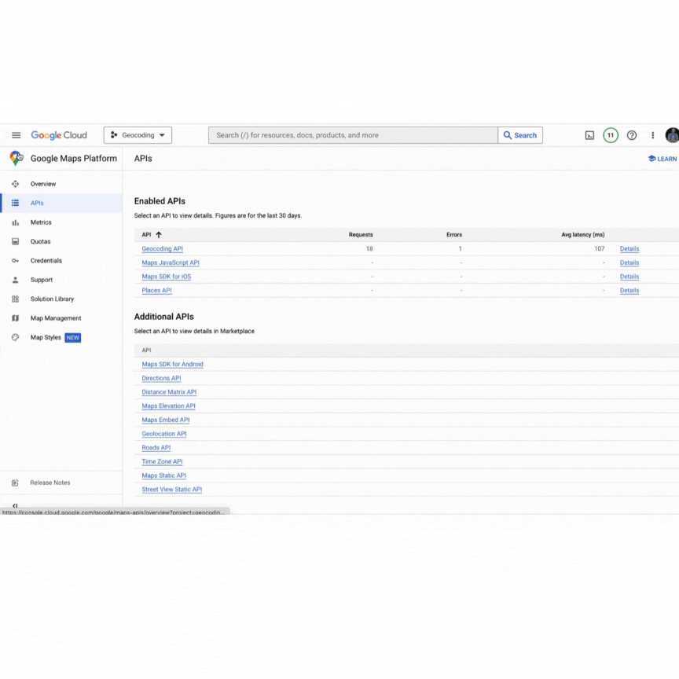
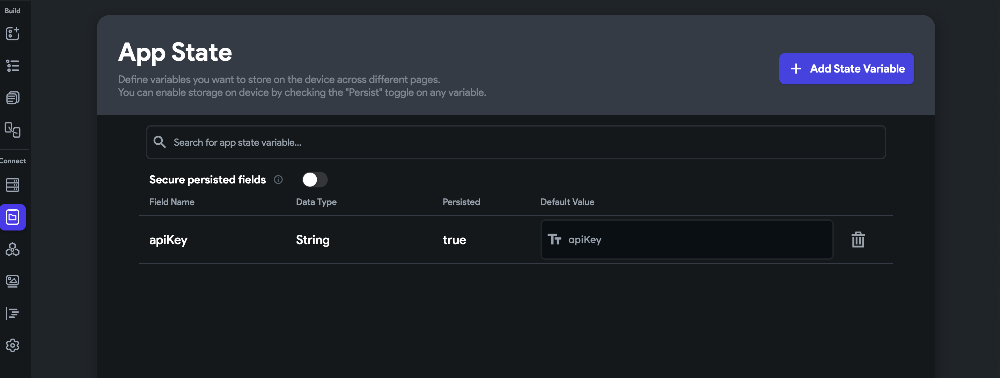
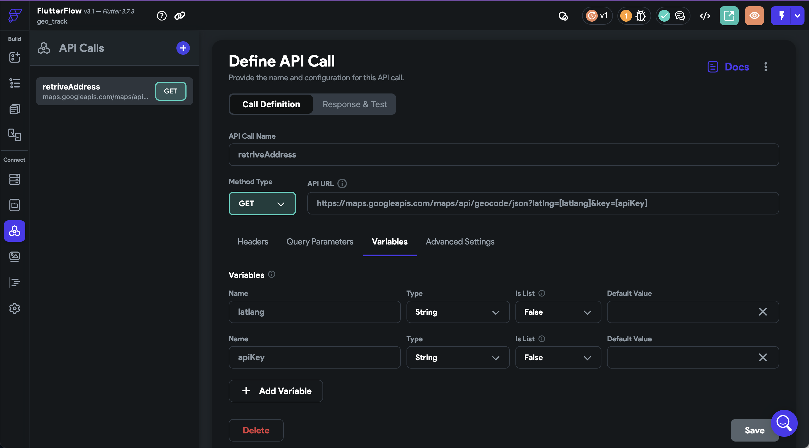
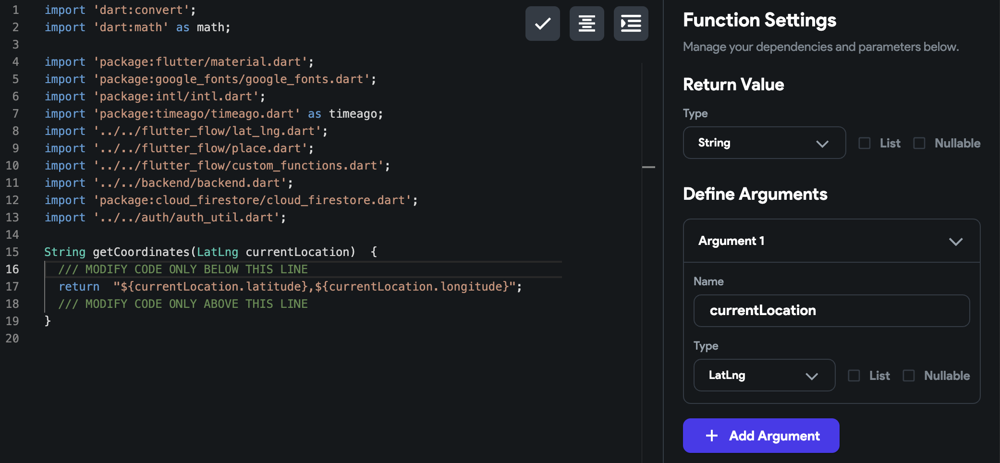

# Geocoding in FlutterFlow

**Geocoding** is the process of converting between human-readable addresses (like “1600 Amphitheatre Parkway, Mountain View, CA”) and geographic coordinates (latitude and longitude).

FlutterFlow supports geocoding through **custom API calls** and **custom code actions**, giving you flexibility to choose the approach that works best for your app.

**Types of Geocoding**

There are two common types of geocoding:

1. **Forward Geocoding**  
   Converting an address into geographic coordinates.  
   *Example:* `"Paris, France"` → `(48.8566, 2.3522)`

2. **Reverse Geocoding**  
   Converting geographic coordinates into an address.  
   *Example:* `(37.4221, -122.0841)` → `"1600 Amphitheatre Parkway, Mountain View, CA"`

**Approaches in FlutterFlow**

You can implement geocoding in FlutterFlow in two main ways:

1. **Google Maps Geocoding API**

  - Uses the official Google Maps API for reliable, global geocoding.
  - Requires a Google Cloud project and API key.
  - Works via a standard API Call in FlutterFlow.
  - Best for:
    - Apps with existing Google Maps integrations.
    - Large-scale or high-accuracy location services.

  See: **[Google Maps Geocoding API Documentation](https://developers.google.com/maps/documentation/geocoding)**

  Example: Forward Geocoding API Call

  **Endpoint:** 
    ```js 
    GET https://maps.googleapis.com/maps/api/geocode/json?address=Paris,France&key=YOUR_API_KEY
    ```

    **Sample Response**
    ```json
    {
      "results": [
        {
          "formatted_address": "Paris, France",
          "geometry": {
            "location": {
              "lat": 48.856614,
              "lng": 2.3522219
            }
          }
        }
      ],
      "status": "OK"
    }

  **FlutterFlow API Call Setup**

    - Method: GET
    - URL: `https://maps.googleapis.com/maps/api/geocode/json`
    - Query Parameters:
      - address → `Paris`,`France` (or variable)
      - `key` → your Google Maps API key

2. **`geocoding` Dart Package (Custom Code)**

  - Uses Flutter’s [`geocoding`](https://pub.dev/packages/geocoding) package for native geocoding.
  - Works entirely offline for some lookups (depending on platform and data availability).
  - Implemented via a custom action in FlutterFlow.
  - Best for:
    - Apps that don’t want to rely on external APIs.
    - Simpler geocoding needs.
  
  **Example: Forward Geocoding with geocoding package**
  
    ```dart
      import 'package:geocoding/geocoding.dart';
      Future<void> getCoordinatesFromAddress(String address) async {
        try {
          List<Location> locations = await locationFromAddress(address);
          if (locations.isNotEmpty) {
            print('Latitude: ${locations.first.latitude}');
            print('Longitude: ${locations.first.longitude}');
          }
        } catch (e) {
          print('Error: $e');
        }
      }
    ```
  **Example: Reverse Geocoding with geocoding package**
  
    ```dart
      import 'package:geocoding/geocoding.dart';
      Future<void> getAddressFromCoordinates(double lat, double lng) async {
        try {
          List<Placemark> placemarks = await placemarkFromCoordinates(lat, lng);
          if (placemarks.isNotEmpty) {
            final place = placemarks.first;
            print('${place.street}, ${place.locality}, ${place.country}');
          }
        } catch (e) {
          print('Error: $e');
        }
      }
    ```

## Step-by-step guide for reverse geocoding a device’s coordinates.

This guide focuses on **reverse geocoding**—turning a device’s latitude and longitude into a readable address (such as city or street name).

You can achieve this in FlutterFlow using either:

- **The Google Maps Geocoding API** (via API Calls)
- **The `geocoding` Dart package** (via a Custom Action)

Explore a live example in this **[FlutterFlow sample project](https://app.flutterflow.io/project/geo-track-rvndye)**.

**Option 1: Using the Google Maps API**

   1. **Enable the Geocoding API**

      1. Go to the [Google Cloud Console](https://console.cloud.google.com/).
      2. Select your project.
      3. Search for and enable the **Geocoding API**.

          

   2. **Add API Key to App State**

      1. Go to **App State > Local State** in FlutterFlow.
      2. Add a new variable:
         - `apiKey` → Type: `String`
      3. Paste your Geocoding API key as the default value.

         

   3. **Create the API Call**

      1. Navigate to **API Calls** in FlutterFlow.
      2. Create a new API call with the following configuration:

         - **Base URL**:  
         ```js
         https://maps.googleapis.com/maps/api/geocode/json
         ```
         - **Method**: `GET`

      3. Under **Variables**, add:
         - `latlng` → Type: `String`
         - `apiKey` → Type: `String`

         

   4. Create a Custom Function (LatLng → String)

      Create a custom function that accepts a `LatLng` value (device location) and returns a string in `"latitude,longitude"` format.

      This will be used to populate the `latlng` variable in your API call.

         

   5. **Run the API and Display the Result**

      1. Add a button or trigger to run the API call.
      2. Pass the following:
         - `latlng`: From the custom function.
         - `apiKey`: From local state.
      3. From the API response, extract the address using a **JSON Path**.

         Example JSON Path for city name:
            ```json
            $.results[0].address_components[1].long_name
            ```
      4. Bind the extracted value to a `Text` widget.

**Option 2: Using the `geocoding` Dart Package**

   If you prefer to use Flutter's native functionality, you can achieve the same result using the geocoding Dart package in a custom action.

   1. **Add the Package**
      Add the dependency to your project’s pubspec.yaml file:

      ```js
      dependencies:
      geocoding: ^2.1.0
      ```

   2. **Create a Custom Action**
      - Create a new custom action.
      - Add a parameter: LatLng location.
   3. Use the geocoding package to convert the coordinates into a readable address.

      Sample code:

      ```js
      import 'package:geocoding/geocoding.dart';

      Future<String> getAddressFromLocation(LatLng location) async {
         final placemarks = await placemarkFromCoordinates(location.latitude, location.longitude);
         final place = placemarks.first;
         return '${place.locality}, ${place.country}';
      }

      ```
   4. Return the result and bind it to a Text widget.


:::tip
If your app already uses Google Maps for displaying locations, the Google API method will be the most seamless. If you want a code-based approach that avoids API calls, the `geocoding` package is a good alternative.
:::