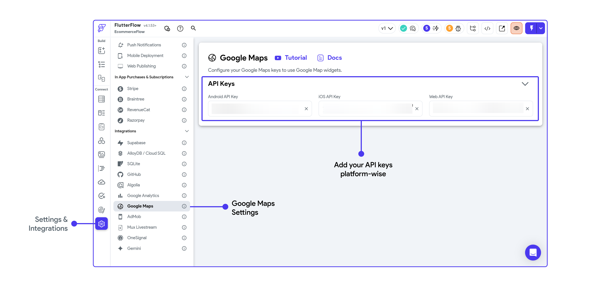
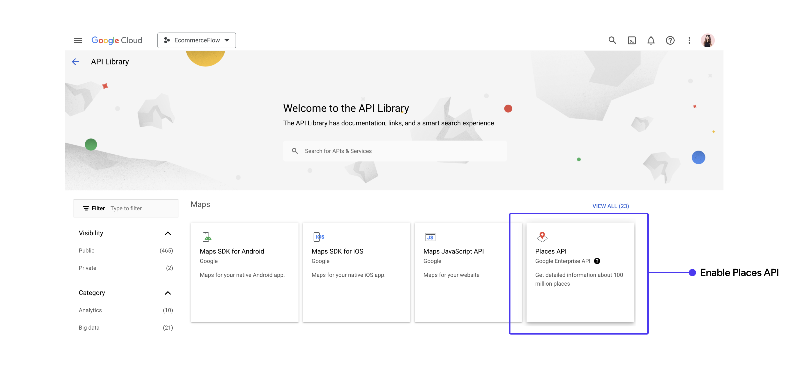

# Maps & Places APIs

FlutterFlow natively supports **Google Maps**, providing a seamless and efficient way to embed
interactive maps into your FlutterFlow apps. It also supports **Places API** that returns formatted location data and imagery about establishments, geographic locations, or prominent points of interest.

## Add Maps APIs

To enable **Google Maps** in your project, please follow the steps:

### Get API Keys

To start working with **Google Maps APIs**, you need to enable the **Maps API** from the [Google
Cloud Console](https://console.cloud.google.com/).

1. As you land on the Cloud console, make sure you are in the correct Google Cloud project. Then,
  from the right menu, click on [**Library**](https://console.cloud.google.com/apis/library) and
  search for **Maps**.

2. You may receive a prompt from Google Cloud to add a billing account. Please add a billing account
  to continue.

3. You will see options such as the **Maps SDK for iOS, Maps SDK for Android**, and the **Maps
  Javascript API**. Select the platform you wish to support and then click **Enable**.
  If you are running on Run Mode, ensure that your Maps Javascript API is enabled.

Enable only the APIs the app actually uses. Google Maps Platform requires a billing account, even when usage remains within an applicable no-cost threshold. Configure quotas, budgets, and billing alerts; budget alerts do not automatically stop charges.

<iframe title="Generate Maps Keys interactive tutorial" src="https://www.loom.com/embed/b1f6d8ddcc44492a92f833dafa619ec0" frameborder="0" allow="accelerometer; autoplay; clipboard-write; encrypted-media; gyroscope; picture-in-picture; web-share" referrerpolicy="strict-origin-when-cross-origin" allowfullscreen></iframe>

:::warning
Create a separate key for web, Android, and iOS. Apply the correct application restriction and restrict each key to only the Maps Platform APIs that platform uses. Client map keys are visible in the distributed app, so restrictions—not secrecy—are the primary control. See [Secure API Keys](../../google-cloud/secure-keys.md).
:::

- Click on the Credentials menu from the left panel.

- Find the key for the platform you need, and copy the key.

### Add keys to FlutterFlow

Now add the API keys platform wise to FlutterFlow Settings page

### Create a new Key if not available

If you don't find the Android key (auto created by Firebase) or iOS key (auto created by
Firebase) in the Google developer console, here are the steps to create one:

- On your Cloud console, click the **Credentials** menu on the left.

- Click on the **+ Create Credentials** at the top.

- Click on the **API Key** to create a new key for the Android app. Similarly, create one for
  iOS and Web.

<iframe title="Generate Maps Keys interactive tutorial" src="https://www.loom.com/embed/2c644aa950c44f76b19c6787784cf3b5?sid=3e22206e-4b4b-4734-b842-0c644d32f344" frameborder="0" allow="accelerometer; autoplay; clipboard-write; encrypted-media; gyroscope; picture-in-picture; web-share" referrerpolicy="strict-origin-when-cross-origin" allowfullscreen></iframe>

## Add Places APIs

You can [enable the **Places API**](https://console.cloud.google.com/apis/library/places-backend.googleapis.com) from Google Cloud Console—make sure you selected the same project as the API key. The current [PlacePicker widget](../../maps/google-maps/place-picker-widget.md) uses the legacy Places API endpoints, so the legacy **Places API** must be available for the project. **Places API (New)** alone is not a drop-in replacement for this widget. Google restricts new access to legacy services, so confirm availability in your project before committing to the PlacePicker for a new production app.

