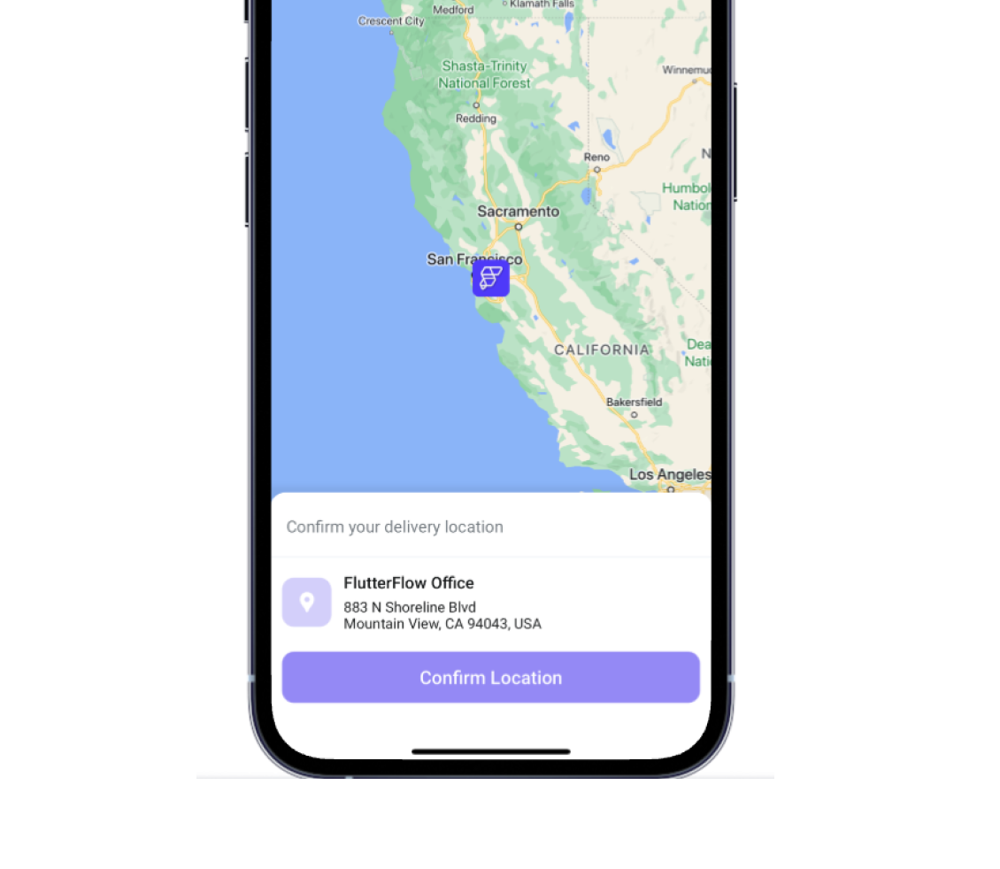
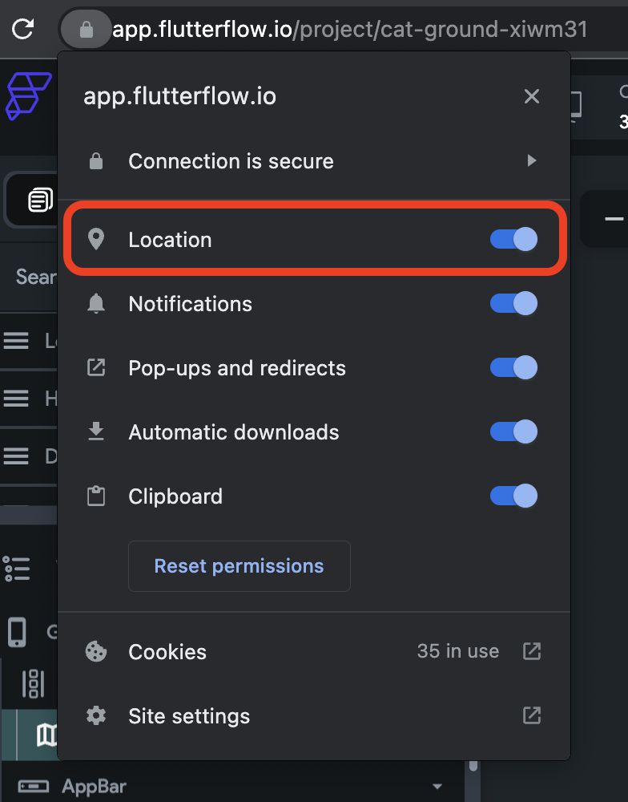
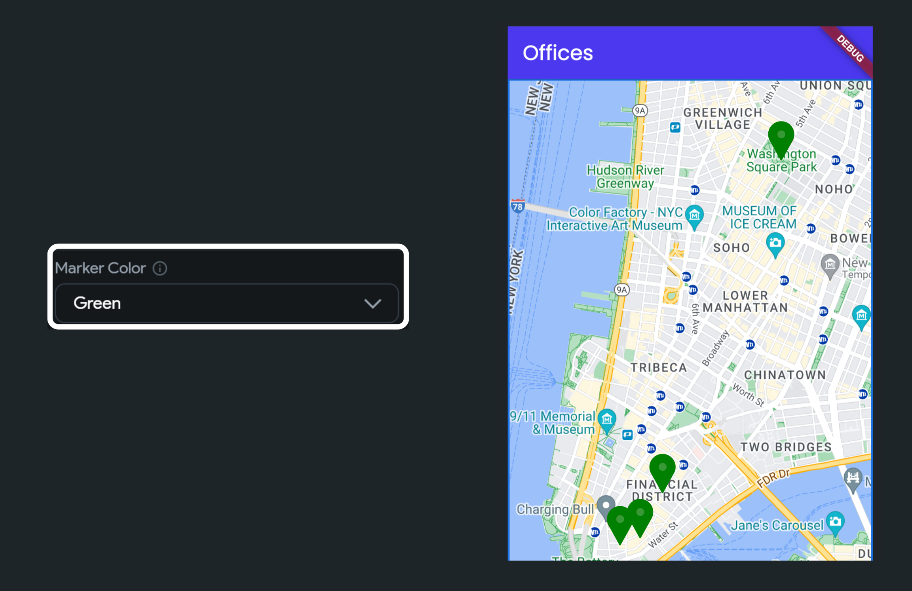
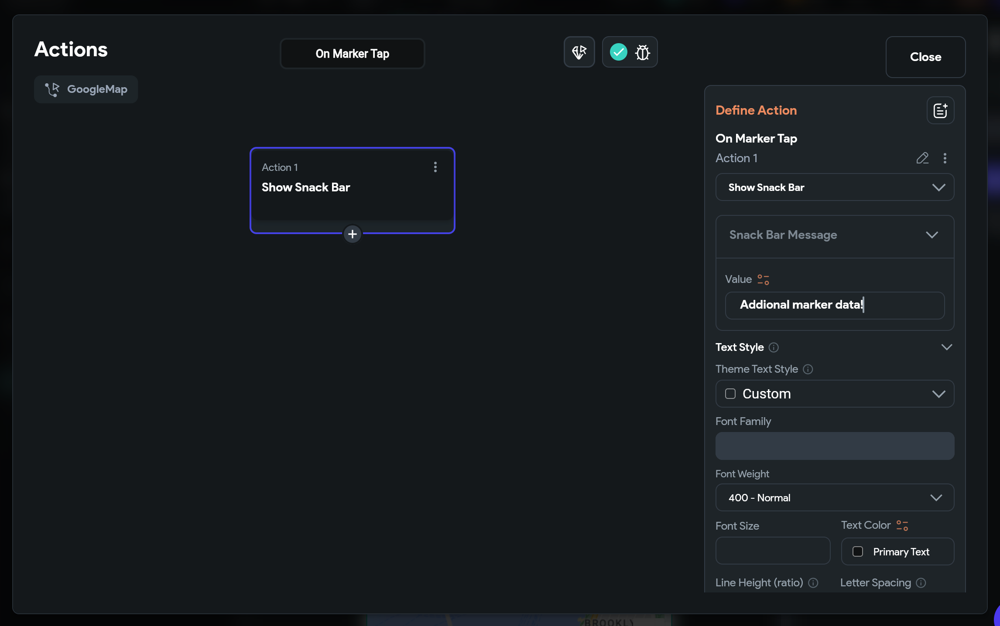

# Google Maps Widget

The **Google Maps** widget enables the integration of interactive maps into your app, offering users
valuable geographical insights. For instance, in a food delivery app, this widget could display the
locations of restaurants. It offers a range of customization options, allowing you to tailor the
display with various map types and markers to suit your specific needs.

:::danger[Feature Completion]
As we continuously enhance our platform, please note that while our integration is robust, it is not
yet feature-complete. We encourage you to review the available APIs and features detailed below to
ensure they meet your app development needs before integration.
:::

:::info[Prerequisite]
Ensure you have added the [**Google Map API keys**](generate-maps-keys#get-api-keys) before adding the Google Maps widget to your project
:::

## Add Google Map widget

1. Open the Widget Palette and locate the **Google Map** widget under the **Base Elements** tab. You
  can
  drag it to your desired location or add it directly from the widget tree or canvas area.

2. By default, the map displays a random location. To set a specific location, go to the
  **Properties Panel > Initial Location**.

3. Enter the latitude and longitude values in the **Lat and Lng** fields to specify the location. To
  use the user's current location, set a variable through the **Set Variable menu > Global
  Properties > Current Device Location**.

4. To change the map type, go to the **Properties Panel > Map Type** and select one of the following
  options:
    - **Roadmap:** Displays the default road map view.
    - **Terrain:** Shows a physical map based on terrain information.
    - **Hybrid:** Combines normal and satellite views.
    - **Satellite:** Displays satellite images from Google Earth.

5. To customize the visual appearance of your map, navigate to the **Properties Panel > Map Style**.

6. To set the **initial zoom level** of the map, go to the **Properties Panel > Initial Zoom** 
   of Map and enter the desired value. Note that a higher value will zoom in on the map while a lower value will
  zoom out.

<iframe src="https://www.loom.
com/embed/11c929da4a82492fb2d9e690779051d8?sid=477a3de8-3f0c-42e1-a8b6-7556c3e72e96" frameborder="0" allow="accelerometer; autoplay; clipboard-write; encrypted-media; gyroscope; picture-in-picture; web-share" referrerpolicy="strict-origin-when-cross-origin" allowfullscreen></iframe>

<figure>

  <figcaption class="centered-caption"></figcaption>
</figure>
:::tip
If you don't see your current location while testing, make sure you have enabled location permission in your browser.

:::

## Markers

A marker is an icon that appears over the map, indicating a location. To add markers:

- Select the **Google Map** widget, move to the **Properties Panel > Num Markers** and select
  whether you
  want to show **Single** or **Multiple** markers.

### Set Markers from Firebase

- Set the Marker Type to **Document** if the data is on Firestore Collection

- In case of Documents, create a collection and query it on any widget (must be a parent of
  GoogleMap) or page.

- In Marker Document, set the source of markers as shown in the following video.

<iframe src="https://www.loom.
com/embed/265b96cfd3554ce5b7516650b950b303?sid=83b3f4bd-8470-4307-9cbe-b742681c383f" frameborder="0" allow="accelerometer; autoplay; clipboard-write; encrypted-media; gyroscope; picture-in-picture; web-share" referrerpolicy="strict-origin-when-cross-origin" allowfullscreen></iframe>

### Set Markers from List of LatLng

If you choose **LatLng**, you must provide a source that contains a list of locations as Data Type
(LatLng) (e.g., App State > [variable_name] (List of **LatLng**)).

<iframe src="https://www.loom.
com/embed/e0cf2e67ab0e45b7aedc3bb96b212d73?sid=38a4bdce-89f5-4278-aaa2-4ad8e859f925" frameborder="0" allow="accelerometer; autoplay; clipboard-write; encrypted-media; gyroscope; picture-in-picture; web-share" referrerpolicy="strict-origin-when-cross-origin" allowfullscreen></iframe>

### Changing Marker Color

To change the marker color, move to the Properties Panel > Google Map > set the Marker Color
dropdown value to the color you like:

### Set Marker Image

Custom marker images can enhance your map interface by making it more intuitive and visually
engaging, while also aligning with your app's branding. To set an image as a marker:

- Move to the **Properties Panel > Google Map > set the Marker Icon to Image**.

- Select the type of image you want to set:
    - For an image hosted online, set the Image Type to **Network** and specify the image URL in the
      Path field.
    - To provide an image from your system, set the Image Type to **Asset** and upload the image.

<iframe src="https://www.loom.
com/embed/0655708e67db4b5c8798820b7d12dc5f?sid=fff3c351-e8e7-4879-9c78-0510057a7b6a" frameborder="0" allow="accelerometer; autoplay; clipboard-write; encrypted-media; gyroscope; picture-in-picture; web-share" referrerpolicy="strict-origin-when-cross-origin" allowfullscreen></iframe>

### Centering map on marker tap

To center a map on a marker tap, move to the **Properties Panel > Google Map > enable the Centering
Map on Marker Tap toggle**.

<iframe src="https://www.loom.
com/embed/3f069a4c31fa45b99e52ebc56a992876?sid=6cafde11-c24f-4a79-915b-2dc158b5f680" frameborder="0" allow="accelerometer; autoplay; clipboard-write; encrypted-media; gyroscope; picture-in-picture; web-share" referrerpolicy="strict-origin-when-cross-origin" allowfullscreen></iframe>

## On Marker Tap [Action Trigger]

Sometimes, you might want to receive a callback when a user taps on a marker. This can be useful for
dynamically displaying additional information about the location, opening a detailed view, or
initiating other actions based on the selected marker.

Here’s how you do it:

- Select the **Google Map** widget.
- From the Properties Panel, select **Actions** and open the **Action Flow Editor**.
- Under the action trigger **On Marker Tap**, add any actions here.

## Advanced Customizations

You can customize the appearance and behavior of this widget using the various properties available
in the properties panel.

### Allow Interacting With the Map

By default, the map interaction feature is enabled, allowing users to drag, zoom in, and zoom out on
the map. However, you can disable the **Allow Zooming the Map** and **Show Zoom Buttons** on the Map
options
if you wish to restrict the zoom functionality.

To access these settings, navigate to the **Properties Panel > Google Map > Allows Interacting with
the Map**.

<iframe src="https://www.loom.
com/embed/1b06bfc1365f4fc68f15089d4f84d798?sid=ff33ea94-cd7f-4b4e-822e-6fe0743dbd27" frameborder="0" allow="accelerometer; autoplay; clipboard-write; encrypted-media; gyroscope; picture-in-picture; web-share" referrerpolicy="strict-origin-when-cross-origin" allowfullscreen></iframe>

### Show User Location

When enabled, a blue dot appears on the map to indicate the user's current location. If the map is
moved, users can re-center their location by clicking the button at the top right side.

To enable this option, navigate to the **Properties Panel > Google Map > enable the Show User
Location toggle**.

:::note
When you enable this option, make sure to set the **Initial Location to Global Properties > Current
Device Location**.
:::

<iframe src="https://www.loom.
com/embed/97a4aca1b5e84313b106f9c98aa15957?sid=5340a30a-fb0f-43bf-92e1-bf305b0630b7" frameborder="0" allow="accelerometer; autoplay; clipboard-write; encrypted-media; gyroscope; picture-in-picture; web-share" referrerpolicy="strict-origin-when-cross-origin" allowfullscreen></iframe>

### Showing Compass

While exploring the map, users may rotate the map (which can make it difficult to trace the route).
Enabling compass will allow users to bring the map to its original direction.

To enable the compass, navigate to the **Properties Panel > Google Map > enable the Show Compass
toggle**.

<iframe src="https://www.loom.
com/embed/53822c6ac9fa4455b43748c46f127ebb?sid=ac9ac978-03f5-49e3-b627-43c6dee5c6b0" frameborder="0" allow="accelerometer; autoplay; clipboard-write; encrypted-media; gyroscope; picture-in-picture; web-share" referrerpolicy="strict-origin-when-cross-origin" allowfullscreen></iframe>

### Enabling map toolbar

The Toolbar, located at the bottom right of the map, becomes visible when a user selects a marker.
It offers quick access to either a map view or directions in the Google Maps mobile app.

To enable the toolbar, navigate to the **Properties Panel > Google Map > enable the Show Map Toolbar
toggle**.

<iframe src="https://www.loom.
com/embed/890f12d9134f4c8793cc6dce17ce0929?sid=cefa00a8-680a-4871-a18a-5586a33c65a5" frameborder="0" allow="accelerometer; autoplay; clipboard-write; encrypted-media; gyroscope; picture-in-picture; web-share" referrerpolicy="strict-origin-when-cross-origin" allowfullscreen></iframe>

### Showing Traffic on Map

Showing traffic on the map allows user to know the flow of traffic on the roads and helps them
decide on a better route.

To show live traffic on a map, navigate to the Properties Panel > Google Map > enable the Show
Traffic on Map toggle.

<iframe src="https://www.loom.
com/embed/8cf915f27803412cb9b2247b5cfb257a?sid=45dac67a-0f2d-4f7d-a390-25b2ce8bc16f" frameborder="0" allow="accelerometer; autoplay; clipboard-write; encrypted-media; gyroscope; picture-in-picture; web-share" referrerpolicy="strict-origin-when-cross-origin" allowfullscreen></iframe>

## FAQ

Why Google Maps custom markers are not working in run mode or test mode?

Due to a recent update, Google Maps custom markers won't work in Run or Test mode unless CanvasKit is enabled. This is expected behavior. To use custom markers effectively, enable CanvasKit from [**Advanced Web Settings**](../../../resources/projects/settings/project-setup.md#advanced-web-settings).

