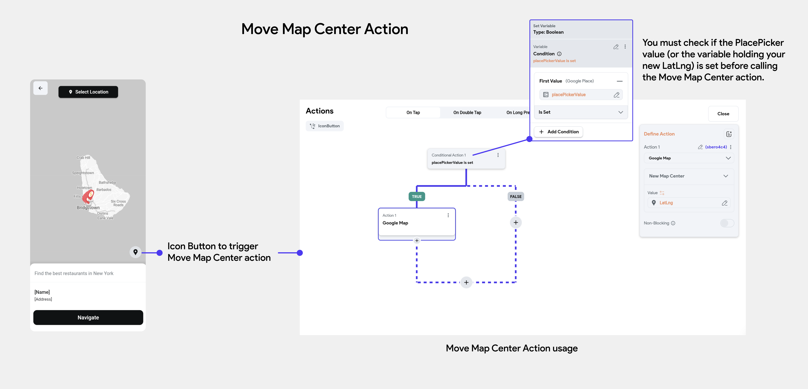

# Move Map Center [Action]

This action allows you to center the map on a specified location, such as setting the pickup and drop-off points. You can define the location either by directly inputting the latitude and longitude values or by using a variable.

:::info[Prerequisites]
- To implement this feature, add a Google Maps widget to your page or component. 
[**Learn how.**](google-maps-widget.md)
- If you wish to enable users to select locations from a dropdown using FlutterFlow's PlacePicker 
  widget, you can also integrate the Place Picker widget into your map view. [**Learn more here**](place-picker-widget.md).
:::

Assuming you've set up the Place Picker widget on your Google Maps widget view, let's add a button that triggers the action to move the map center, so the map centers on the newly selected location.

In our example, we've added an IconButton with a location pin icon. For the button's OnTap 
action trigger, we'll add the Move Map Center action and set the LatLng to the LatLng of the 
Place Picker's selected place. You must check if the PlacePicker value (or the variable holding your new LatLng) is set before calling the Move Map Center action.

