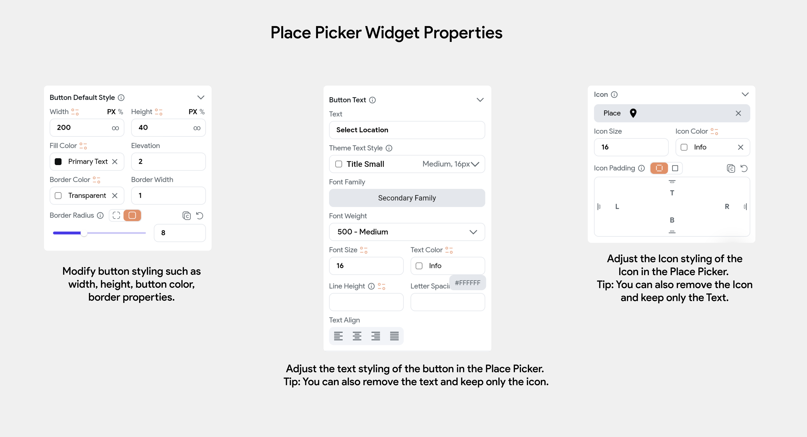

# Place Picker Widget

The `PlacePicker` widget is designed to retrieve information about places, such as establishments (e.g., buildings, parks, museums) and geographic features (e.g., roads, lakes, mountains). It provides details like name, address, city, state, country, zip code, and latitude-longitude coordinates.

This widget is particularly useful in applications like cab booking services. For instance, it can be used to capture the exact location and full address of a destination, displaying this information on a page or integrating it into a Google Map.

Visually, the PlacePicker appears as a button. When tapped, it enables you to search for a place by typing its name, and displaying a dropdown list of matching locations. Once a place is selected, its name is displayed on the button, and additional details are accessible through the placePickerValue variable from Widget State.

Here's an example from the Demo app:

    <iframe 
        src="https://demo.arcade.software/EQ4xhHBgjMp4wbm3aTin?embed&show_copy_link=true"
        title="Place Picker Widget"
        style={{
            position: 'absolute',
            top: 0,
            left: 0,
            width: '100%',
            height: '100%',
            colorScheme: 'light'
        }}
        frameborder="0"
        loading="lazy"
        webkitAllowFullScreen
        mozAllowFullScreen
        allowFullScreen
        allow="clipboard-write">
    </iframe>

:::info[Prerequisites]
- The Place Picker **requires a Google Maps API key**. See how to [**create and add API keys**](generate-maps-keys.md#add-maps-apis) to FlutterFlow.
- Ensure you have enabled **Places API** from Cloud console. [**Check out the Setup docs.**](generate-maps-keys.md#add-places-apis)
- Enable **Google Maps Platform Billing** via your Cloud console. Please note: Failing to enable the Google Maps Platform Billing will not show any place in an autocomplete list.
:::
<figure>
    
  <figcaption class="centered-caption"></figcaption>
</figure>

## Add Place Picker widget

To add the PlacePicker widget to your project:

    <iframe 
        src="https://demo.arcade.software/uWaLSOHPZctjnGik03Pu?embed&show_copy_link=true"
        title="Add Place Picker widget"
        style={{
            position: 'absolute',
            top: 0,
            left: 0,
            width: '100%',
            height: '100%',
            colorScheme: 'light'
        }}
        frameborder="0"
        loading="lazy"
        webkitAllowFullScreen
        mozAllowFullScreen
        allowFullScreen
        allow="clipboard-write">
    </iframe>

By default, the `Place Picker` widget features an icon and the text "Select Location" on the 
button. You can modify the styling and properties of these elements from the Properties Panel on 
the right.

If you retain the Text widget, the text will update to the name of the selected location when a user makes a selection. Both the icon and text are optional; adjust them according to your design requirements.

<figure>
    
  <figcaption class="centered-caption">The widget properties of Place Picker widget</figcaption>
</figure>

## Use PlacePicker widget state values

The values associated with the selected place are stored in a `GooglePlace` custom data type exposed by FlutterFlow. It holds fields such as the selected place's Name, Address, LatLng, City, State, Country, and Zipcode. Users can use these values in any widget, either to directly set them in a Text widget or for further conditional calculations.

    <iframe 
        src="https://demo.arcade.software/uWaLSOHPZctjnGik03Pu?embed&show_copy_link=true"
        title="Use PlacePicker widget state"
        style={{
            position: 'absolute',
            top: 0,
            left: 0,
            width: '100%',
            height: '100%',
            colorScheme: 'light'
        }}
        frameborder="0"
        loading="lazy"
        webkitAllowFullScreen
        mozAllowFullScreen
        allowFullScreen
        allow="clipboard-write">
    </iframe>

Let's test this change in Test Mode:

    <iframe 
        src="https://demo.arcade.software/2ncapOklwNGM3ETCntdl?embed&show_copy_link=true"
        title="Place Picker Test"
        style={{
            position: 'absolute',
            top: 0,
            left: 0,
            width: '100%',
            height: '100%',
            colorScheme: 'light'
        }}
        frameborder="0"
        loading="lazy"
        webkitAllowFullScreen
        mozAllowFullScreen
        allowFullScreen
        allow="clipboard-write">
    </iframe>

