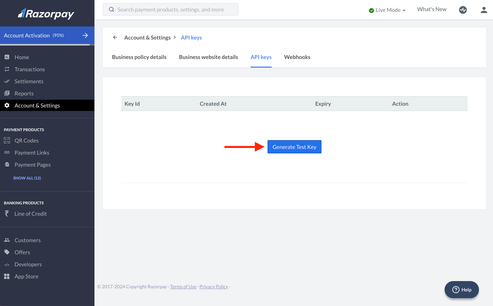
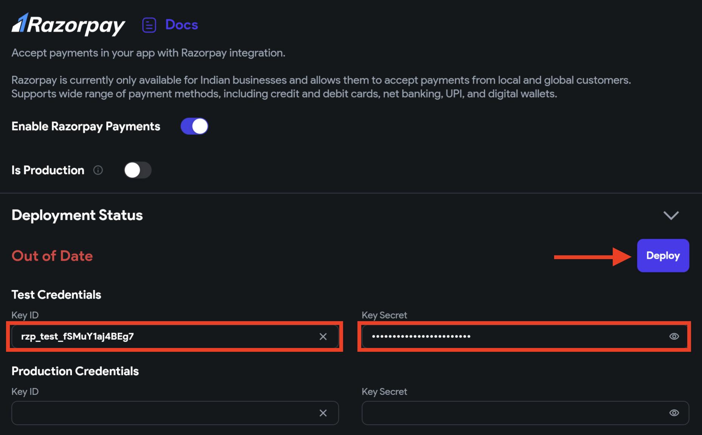

# RazorPay

[Razorpay](https://razorpay.com/) is a leading online payment gateway widely used by businesses in India to accept and process digital payments securely.

It provides a platform for merchants and businesses to integrate payment solutions into their websites and mobile apps. It allows customers to make online payments using various payment methods such as credit cards, debit cards, net banking, UPI (Unified Payments Interface), and digital wallets.

:::warning
Currently, publishing to the web with Razorpay enabled is restricted due to some regulations.
:::

    <iframe 
        src="https://www.loom.com/embed/02447248672c41c29abc5d7477296aa3?sid=10f5f200-c4d0-4160-a81c-356485c60914"
        title=""
        style={{
            position: 'absolute',
            top: 0,
            left: 0,
            width: '100%',
            height: '100%',
            colorScheme: 'light'
        }}
        frameborder="0"
        loading="lazy"
        webkitAllowFullScreen
        mozAllowFullScreen
        allowFullScreen
        allow="clipboard-write">
    </iframe>

:::info[Prerequisites]

Before starting to set up payments, make sure you have,

1. Complete [**Firebase Setup**](../../ff-integrations/firebase/connect-to-firebase-setup.md) for your project.
2. Enabled [**Firebase Authentication**](../authentication/firebase-auth/auth-initial-setup.md) for your project.
3. Upgraded your Firebase project to [**Blaze Plan**](https://firebase.google.com/pricing). We use [**Firebase Cloud Functions**](https://firebase.google.com/docs/functions) to process a transaction.
:::

## Razorpay Integration

Integrating Razorpay in your app comprises the following steps:

1. [Setup Razorpay](#1-setup-razorpay)
2. [Trigger Razorpay payment](#2-trigger-razorpay-payment-action)
3. [Testing](#3-testing)
4. [Releasing to production](#4-releasing-to-production)

### 1. Setup Razorpay

Setting up the Razorpay payments includes creating an account, enabling test mode, acquiring the keys from your Razorpay account, and adding them to your project.

:::warning
You should always try out payments in a test mode before releasing them to your production application. Hence, the instructions below will guide you on how to get the test keys.
:::

Here are the steps:

1. Create a new Razorpay account from [here](https://dashboard.razorpay.com/signup). If you already have an account, [log in](https://dashboard.razorpay.com/signin).
2. Once you are logged in, turn on the **Test Mode**. Test mode helps you simulate the payments without involving real money transactions.

3. From the left side menu, select **Account & Settings** > Under **Website and app settings** section, select **API keys**.
4. If you're asked to add a website link but your app isn't published yet, you can temporarily publish it to a subdomain using our [web publishing](../../testing-deployment-publishing/publishing/web-publishing.md) feature. Later, you can update this to your actual domain in both FlutterFlow and Razorpay.

5. Click **Generate Test Key** and copy the **Key Id** and **Key Secret**. To regenerate, click on **Regenerate Test Key** and choose how you want to deactivate the old key.

    <iframe 
        src="https://www.loom.com/embed/6ccda9493cae46198027b357afcda521?sid=91f61c5c-50dc-4c77-a5a6-11d613507eb4"
        title=""
        style={{
            position: 'absolute',
            top: 0,
            left: 0,
            width: '100%',
            height: '100%',
            colorScheme: 'light'
        }}
        frameborder="0"
        loading="lazy"
        webkitAllowFullScreen
        mozAllowFullScreen
        allowFullScreen
        allow="clipboard-write">
    </iframe>

6. Return to the FlutterFlow project, navigate to **Settings and Integrations** > **In App Purchases & Subscriptions** > **Razorpay**. Use the toggle to **Enable Razorpay Payments**.
7. Under **Test Credentials**, paste the **Key ID** and **Key Secret** obtained in the previous step.
8. Set your **Business Name**.
9. Click the **Deploy** button.

### 2. Trigger Razorpay payment [Action]

To initiate a payment using Razorpay, you must use the **Razorpay Payment** action. This action lets users process a payment inside your app using credit cards, debit cards, net banking, UPI (Unified Payments Interface), and digital wallets via Razorpay.

Follow the steps below to add this action:

1. Select the widget (e.g., checkout button) on which you want to add the action.
2. Select **Actions** from the Properties panel (the right menu), and click Open. This will open an **Action Flow Editor** in a new popup window. Click on the **+ Add Action**.
3. Search and select the **Razorpay Payment** (under *Integrations*) action.
4. Enter or use a variable for specifying the total amount under the **Amount** section. **Note** that the value should be specified in the currency's smallest unit.
    - For example, *$24.99* should be passed as *2499* (as a round-off integer; otherwise, it would be automatically rounded); similarly, for an amount of ₹120.00, 12000 should be passed.
    - Most probably, you'll specify this value from a variable. If you do so, you might need this [code expression](../../resources/control-flow/functions/utility-functions.md#code-expressions) to convert the total amount in the required format: `amount.toStringAsFixed(2).replaceAll(".", "");`
5. Enter the **Currency Code** to be used for the amount, for example, *INR*, *USD*, *EUR*, or *BRL*. Make sure you enter a valid currency code; otherwise, the transaction won't go through. Download the complete [list of supported currencies](https://razorpay.com/docs/build/browser/assets/images/international-currency-list.xlsx).

    <iframe 
        src="https://www.loom.com/embed/1405bb45c9734f4abba2ba123949fb0c?sid=0215e670-70b5-49ed-adae-a86d65b261e7"
        title=""
        style={{
            position: 'absolute',
            top: 0,
            left: 0,
            width: '100%',
            height: '100%',
            colorScheme: 'light'
        }}
        frameborder="0"
        loading="lazy"
        webkitAllowFullScreen
        mozAllowFullScreen
        allowFullScreen
        allow="clipboard-write">
    </iframe>

6. With this action, you can also add some optional fields, such as **Receipt Number**, **Description**, **User Name**, **User Email**, **User Contact**, and **Timeout** (time for which the checkout dialog should remain active. By default, it is 180 seconds).

    <iframe 
        src="https://www.loom.com/embed/291c0d50a2d54c3a8af8eddbaa2e9058?sid=2cf88f42-0716-4e86-80cd-9074aa3cf64f"
        title=""
        style={{
            position: 'absolute',
            top: 0,
            left: 0,
            width: '100%',
            height: '100%',
            colorScheme: 'light'
        }}
        frameborder="0"
        loading="lazy"
        webkitAllowFullScreen
        mozAllowFullScreen
        allowFullScreen
        allow="clipboard-write">
    </iframe>

7. You can also customize the color scheme for the payment sheet using properties such as **Dialog Color, Barrier Color,** **Text Color**, **Processing Color**, **Success Color**, **Error Color,** and more.

8. Enter an **Action** **Output Variable Name** where the payment ID would be stored on a successful transaction.
9. Now you must check if the payment was successful. You can do so by adding the [conditional action](../../resources/control-flow/functions/conditional-logic.md#conditional-actions). To do so, click the "**+**" button below the previous action tile and select **Add Conditional**.
10. On the right side (**Set Condition for Action**),
    1. Select **UNSET** > **Condition** > **Single Condition**.
    2. **First Value** > **Action** **Output Variable Name**.
    3. Set the operator to **Is Set and Not Empty**.
11. Under the **TRUE** section, add an action that will be triggered if the payment is successful.
12. Under the **FALSE** section, add an action that will be triggered if payment is failed.

    <iframe 
        src="https://www.loom.com/embed/9f9aea02e2db4c4fa3ea14f480567650?sid=d780d458-5970-4bbb-b10a-08ff6e4dab1b"
        title=""
        style={{
            position: 'absolute',
            top: 0,
            left: 0,
            width: '100%',
            height: '100%',
            colorScheme: 'light'
        }}
        frameborder="0"
        loading="lazy"
        webkitAllowFullScreen
        mozAllowFullScreen
        allowFullScreen
        allow="clipboard-write">
    </iframe>

:::warning
Ensure the user is authenticated before triggering this action; otherwise, it will result in an error. You can follow the steps on [**this page**](../authentication/firebase-auth/auth-initial-setup.md) to set up Firebase Authentication.
:::

### 3. Testing

You can test Razorpay payments on Run mode, Test mode, an emulator/Simulator, or a physical device.

To test payments in Test or Run mode:

1. In your FlutterFlow project, navigate to **Settings and Integrations** > **In App Purchases & Subscriptions** > **Razorpay**.
2. Make sure the **Is Production** is disabled.
3. Make sure you have entered the correct **Test Credentials**.
4. Run your app in [Test mode](../../testing-deployment-publishing/running-your-app/run-your-app.md#test-mode).
5. To test the purchase, you can try any method from [here](https://razorpay.com/docs/payments/payments/test-card-upi-details/#test-card-for-international-payments).

### 4. Releasing to production

Once you are done testing your Razorpay integration and you are ready to go **live**, follow the steps below:

1. Complete **KYC** (or the [Activation Form](https://dashboard.razorpay.com/app/activation?ref=blog.flutterflow.io)) to access the Razorpay Live API.
2. Log into the [Razorpay Dashboard](https://dashboard.razorpay.com/?ref=blog.flutterflow.io#/access/signin) and switch to **Live Mode** on the menu.
3. From the left side menu, select **Account & Settings** > Under **Website and app settings** section, select **API keys**.
4. Click **Generate Live Key** and copy the **Key Id** and **Key Secret**. To regenerate, click on **Regenerate Live Key** and choose how you want to deactivate the old key.
5. Return to the FlutterFlow project, navigate to **Settings and Integrations** > **In App Purchases & Subscriptions** > **Razorpay**. Turn on the **Is Production**.
6. Under **Production Credentials**, paste the **Key ID** and **Key Secret** obtained in the previous step.
7. Click the **Deploy** button.
8. [Test](../../testing-deployment-publishing/running-your-app/run-your-app.md#test-mode) your app.