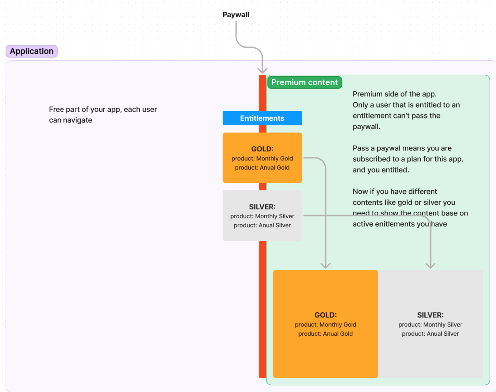
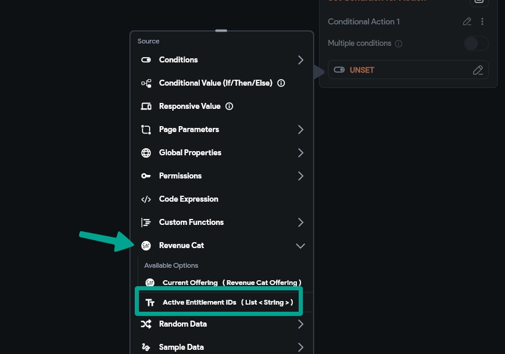
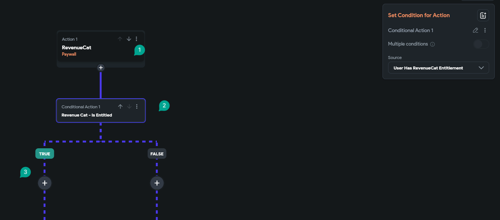
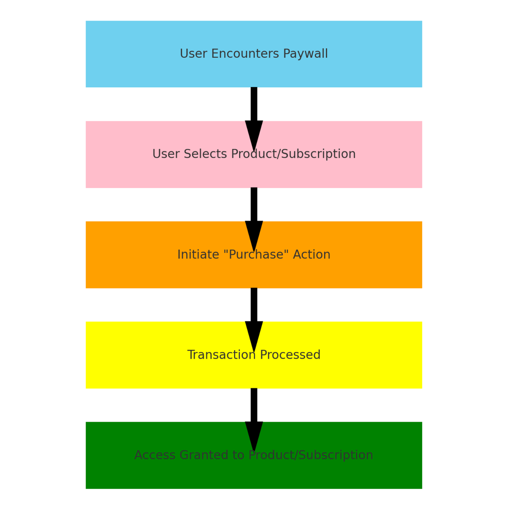
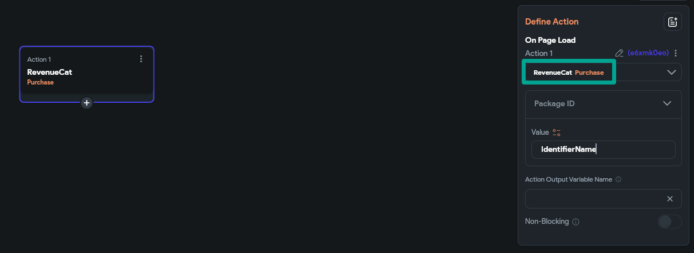

# RevenueCat Subscription and One-Time Payments in FlutterFlow

In-app purchases and subscriptions are key monetization strategies for mobile apps. **RevenueCat** simplifies the implementation and management of these models when integrated with **FlutterFlow**. This guide covers how to configure RevenueCat for both **subscriptions** and **one-time payments**, and how to implement a paywall using FlutterFlow actions.

RevenueCat acts as an intermediary between your app and app stores (Google Play and Apple App Store). It handles:

    - Subscription lifecycle management
    - Purchase validation
    - Cross-platform syncing
    - Receipt handling

:::info[Prerequisites]
Before integrating RevenueCat:

- Publish your app to both the **Google Play Store** and **Apple App Store**
- Define your subscription and one-time purchase products in both stores
- Enable mobile deployment in FlutterFlow under **Settings > Integrations > Mobile Deployment**
:::

**Configure Products in RevenueCat**

- **Subscriptions**

    Create auto-renewable subscriptions with:

        - Unique product identifiers
        - Duration, price, and tier info
        - Configuration under **Product Setup**

- **One-Time Purchases**

    Define non-consumable products with unique identifiers to support:

    - Lifetime access
    - Token bundles
    - Feature unlocks

    

**Define Entitlements and Offerings**

- **Entitlements**

    Entitlements determine feature access based on purchase. Example:

        - `PremiumAccess` = Unlocks premium screens or features

- **Offerings**

    Offerings link the products in your app store to RevenueCat. These define how product packages are presented on the paywall.

    

    :::tip[Tip on Mixed Purchases]
    If using both subscriptions and one-time products (e.g., token bundles), check the user's **entitlements** manually. The default paywall treats both types equally.

    If a user purchases a one-time item, their entitlement will allow them to bypass the paywall—even if they don't have a subscription.
    :::

## Implementing a Paywall in FlutterFlow

    You can build a **paywall** screen or modal in FlutterFlow using the **Paywall Action**. This action returns a **boolean** value:

        - If `true`, the user has access (an entitlement exists)
        - If `false`, guide the user to subscribe or purchase

        

    - **Conditional Navigation**

        After a paywall action:

        - Add a conditional action block
        - FlutterFlow automatically uses the paywall result
        - If entitlement exists, proceed to next action
        - Otherwise, show a modal or navigate to a subscription screen

        

## Managing Transactions in FlutterFlow

- **Purchase Action**

    The **Purchase** action triggers the transaction and updates user entitlements.

    RevenueCat handles the store interaction securely.

- **Restore Purchases**

    Use the **Restore Purchase** action to:

        - Retrieve entitlements on reinstall or new devices
        - Sync prior purchases with RevenueCat

        

- **Payment ID**

    After a purchase, the result includes a `paymentId`:

        - Use the Source menu to access the output
        - Confirm that `paymentId` is present before continuing
        - This ensures the purchase was successful

RevenueCat integration in FlutterFlow provides a complete solution for managing subscriptions and one-time purchases. By configuring your products, entitlements, and paywall correctly, you can streamline monetization while offering a seamless experience to your users.

:::info[Additional Resources]
- [FlutterFlow YouTube Tutorials](https://www.youtube.com/@FlutterFlow)
- [RevenueCat Docs: Non-Subscription Purchases](https://www.revenuecat.com/docs/non-subscription-purchases)
- [FlutterFlow Community](https://community.flutterflow.io/)
:::