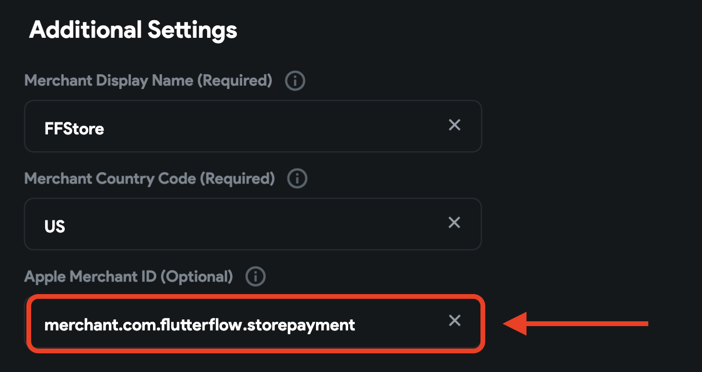

# Stripe

Stripe helps integrate payment processing into your FlutterFlow app. Using this payment service, you can easily sell products directly inside your application and manage transactions easily.

While using Stripe as the payment provider, users can buy products using credit cards, Apple Pay, or Google Pay.

    <iframe 
        src="https://www.loom.com/embed/9ee91ed7807d4b3d81b8cb1c87a8bed2?sid=fe448cd6-e92b-4dad-b696-aad9a5452c60"
        title=""
        style={{
            position: 'absolute',
            top: 0,
            left: 0,
            width: '100%',
            height: '100%',
            colorScheme: 'light'
        }}
        frameborder="0"
        loading="lazy"
        webkitAllowFullScreen
        mozAllowFullScreen
        allowFullScreen
        allow="clipboard-write">
    </iframe>

:::info[Prerequisites]

Before starting to set up payments, make sure you have,

1. Complete [**Firebase Setup**](../../ff-integrations/firebase/connect-to-firebase-setup.md) for your project.
2. Enabled [**Firebase Authentication**](../authentication/firebase-auth/auth-initial-setup.md) for your project.
3. Upgraded your Firebase project to [**Blaze Plan**](https://firebase.google.com/pricing). We use [**Firebase Cloud Functions**](https://firebase.google.com/docs/functions) to process a transaction.
:::

## Stripe Integration

Integrating the Stripe Payments in your app comprises the following steps:

1. [Setup Stripe payment](#1-setup-stripe-payment)
2. [Apple Pay setup (optional)](#2-apple-pay-setup-optional)
3. [Trigger Stripe payment](#3-trigger-stripe-payment-action)
4. [Testing](#4-testing)
5. [Releasing to production](#5-releasing-to-production)

### 1. Setup Stripe payment

Setting up the Stripe payment includes acquiring the keys from your Stripe account and adding them to FlutterFlow.

:::warning
You should always try out payments in test mode before releasing them to your production app. Hence, the instructions below will guide you on how to get the test keys.
:::

Follow the steps below to set up payment using Stripe:

1. Create a new **Stripe account** from [here](https://dashboard.stripe.com/register). If you already have an account, [login](https://dashboard.stripe.com/login).
2. From the dashboard page, click **Developers**.
3. Enable **Test Mode** (top right side of your screen).
4. Switch to the **API keys** tab.
5. Return to the FlutterFlow project and navigate to **Settings and Integrations** > **In App Purchases & Subscriptions** > **Stripe**. Use the toggle to **Enable Stripe Payments**.
6. Copy the **Publishable Key** and **Secret Key** from the Stripe API keys page and paste them into the respective fields inside FlutterFlow. If you are using Stripe in test mode, make sure you paste them inside the **Test Credentials** section.
7. Under the **Additional Settings**, you need to specify the following:
    1. **Merchant Display Name** (*Required*): Enter a name for the merchant (you) that the user will see while performing the payment.
    2. **Merchant Country Code** (*Required*): Enter your country code. This must be the 3-digit ISO country code, such as USA, IND, and NGA.
    3. **Apple Merchant ID** (*Optional*): You need to enter this if you want to accept payments through Apple Pay as well. The instructions for using Apple Pay are in [this section](#2-apple-pay-setup-optional).
8. Click **Deploy**.

    <iframe 
        src="https://www.loom.com/embed/0e4ba1f7f055433e96a7fa6cede2c127?sid=400ef912-1580-44ad-81a9-25051bed0256"
        title=""
        style={{
            position: 'absolute',
            top: 0,
            left: 0,
            width: '100%',
            height: '100%',
            colorScheme: 'light'
        }}
        frameborder="0"
        loading="lazy"
        webkitAllowFullScreen
        mozAllowFullScreen
        allowFullScreen
        allow="clipboard-write">
    </iframe>

This would deploy the Stripe payment service as a Firebase Cloud Function. Now, you are ready to trigger payments inside your app.

### 2. Apple Pay setup (optional)

Setting up Apple Pay comprises the following steps:

1. [Creating Apple Merchant ID](#21-creating-apple-merchant-id)
2. [Uploading Payment Certificate in Stripe](#22-uploading-payment-certificate-in-stripe)
3. [Adding Apple Merchant ID in FlutterFlow](#23-adding-apple-merchant-id-in-flutterflow)

#### 2.1 Creating Apple Merchant ID

To create Apple Merchant ID:

1. Go to Apple's Developer Center and select [**Certificates, Identifiers & Profiles**](http://developer.apple.com/account).
2. Under **Identifiers**, select ***Merchant IDs***.
3. Click the **Add button** (+) in the upper-right corner.
4. Enter a **Description** and specify an **Identifier**. The identifier is usually defined in the format `merchant` followed by the *Package Name* of your app (you'll find it inside the ***Settings and Integrations*** page of FlutterFlow), for example, `merchant.com.domainname.appname`.
5. Click **Continue**.
6. Review the settings, and click **Register**.
7. Click **Done**.
8. Now, again under **Identifiers**, select ***Apps IDs***.
9. Select your app's identifier from the list.
10. Under **Capabilities**, check the ***Apple Pay Payment Processing*** option.
11. Click **Configure**.
12. Select the merchant account that you just created, and click **Continue**.
13. Click **Save** and then **Confirm** in the dialog.

    <iframe 
        src="https://www.loom.com/embed/705e799700de453cab3a0157ac4eecdd?sid=9f65c690-de5d-4b7e-b1ae-d9b056d2f805"
        title=""
        style={{
            position: 'absolute',
            top: 0,
            left: 0,
            width: '100%',
            height: '100%',
            colorScheme: 'light'
        }}
        frameborder="0"
        loading="lazy"
        webkitAllowFullScreen
        mozAllowFullScreen
        allowFullScreen
        allow="clipboard-write">
    </iframe>

#### 2.2 Uploading Payment Certificate in Stripe

To upload a payment certificate in Stripe:

1. First, go to the [**Settings**](https://dashboard.stripe.com/settings) page from your Stripe dashboard and select the **Payment methods** option.
2. Expand the **Apple Pay** tab under the **Wallets** section.
3. Click **Configure** to navigate to the [**Apple Pay settings**](https://dashboard.stripe.com/settings/payments/apple_pay) page.
4. Under **iOS certificates**, click **+ Add new application**.
5. This will download the **Certificate Signing Request (CSR)** file on your system and click **Continue**.
6. Select the **Merchant ID** with which you want to associate this certificate, and click **Create Certificate**.
7. Follow the instructions to **upload the CSR file** that you downloaded from Stripe.
8. To enable the certificate, click **Activate**. Then click **Download** to save it locally.
9. Go back to the Stripe page where the dialog box is displayed, and click **Continue**.
10. Upload the new certificate file.
11. Once uploaded, you should see the certificate listed under **iOS certificates**.

#### 2.3 Adding Apple Merchant ID in FlutterFlow

To add Apple Merchant ID in FlutterFlow:

1. Navigate to **Settings and Integrations** > **In App Purchases & Subscriptions** > **Stripe**.
2. Under the **Additional Settings**, enter your **Apple Merchant ID**.

### 3. Trigger Stripe payment [Action]

In order to initiate a payment using Stripe, you have to use the **Stripe Payment** action.

Follow the steps below to add this action to any widget.

1. Select the **Widget** (e.g., Container, Button, etc.) on which you want to add the action.
2. Select **Actions** from the Properties panel (the right menu), and click **Open**. This will open an **Action Flow Editor** in a new popup window.
3. Click on the **+ Add Action**.
4. On the right side, search and select the **Stripe Payment** (under *Integrations*) action.
5. Enter or use a variable for specifying the total payment amount under the **Amount** section. The value should be specified in the currency's smallest unit. For example, *$24.99* should be passed as *2499* (as a round-off integer, otherwise it would be automatically rounded), whereas *¥1925* can be simply passed as *1925*. For more information check out [this page](https://stripe.com/docs/currencies#zero-decimal).
6. Enter the **Currency Code** to be used for the amount, for example, *USD*, *EUR*, *BRL*. Make sure you enter a valid currency code otherwise, the transaction won't go through.
7. Next, you need to specify the **Customer Email** (required) and **Customer Name** (optional) to be used for the transaction. You can either use a variable or enter the value for them. If you are using authentication, these two values can be retrieved from the ***Authenticated User**.*
8. Specify a **Description** of the purchase for both your and the user's record.
9. To enable **Google Pay** or **Apple Pay** as the payment method, turn on the respective toggle. To use Apple Pay, you have to set up a *Merchant ID* by following the steps [here](#2-apple-pay-setup-optional).
10. Select the **Payment Sheet Theme** among ***System Default***, ***Light Theme***, or ***Dark Theme**.*
11. Specify the **Primary Button Color** and **Button Text Color** to be used on the payment dialog.
12. Enter an **Output Variable Name** where the payment ID would be stored on a successful transaction. Later, you can use this variable elsewhere inside the page or pass it to a different page of the app.

:::warning
Make sure the user is authenticated before triggering the Stripe Payment Action. Otherwise, it will result in an error.
:::

    <iframe 
        src="https://www.loom.com/embed/88bebdf2381547659f542a42726a7b72?sid=bd1fb3e3-8cca-43da-9a13-7a59ef00e457"
        title=""
        style={{
            position: 'absolute',
            top: 0,
            left: 0,
            width: '100%',
            height: '100%',
            colorScheme: 'light'
        }}
        frameborder="0"
        loading="lazy"
        webkitAllowFullScreen
        mozAllowFullScreen
        allowFullScreen
        allow="clipboard-write">
    </iframe>

### 4. Testing

You can test Stripe payments on mobile and the Web before deployment. To do that:

1. Go to the FlutterFlow project and navigate to **Settings and Integrations** > **In App Purchases & Subscriptions** > **Stripe**.
2. Make sure the **Is Production** is disabled.
3. Make sure you have entered the correct **Test Credentials,** such as **Publishable Key** and **Secret Key**.
4. [Download](../../testing-deployment-publishing/exporting-code/ff-cli.md) and [run](../../testing-deployment-publishing/running-your-app/run-your-app.md) your project..
5. To test the purchase, you can use any of these [basic test card numbers](https://stripe.com/docs/testing#cards).

### 5. Releasing to production

Before you release the app to production, complete the following steps:

1. [Login](https://dashboard.stripe.com/login) to your Stripe account and navigate to the **Developers** page.
2. Disable the **Test Mode** (top right side of your screen).
3. Select **API keys** from the left menu and copy the **Publishable Key** and **Secret Key**.
4. Return to FlutterFlow; under the **Production Credentials** section, paste the **Publishable Key** and **Secret Key**.
5. To deploy the Android app, follow the [Google Play Store Deployment](../../testing-deployment-publishing/publishing/google-playstore-deployment.md) guide.
6. To deploy the iOS app, follow the [App Store Deployment](../../testing-deployment-publishing/publishing/apple-appstore-deployment.md) guide.

---

## FAQs

I am getting "Error: Unknown error occurred"

    When encountering the "Error: Unknown error occurred" message, consider these troubleshooting steps:
    
    1. **Stripe Settings Adjustment**: In FlutterFlow's Stripe settings, verify the Merchant country code is a 3-digit code, like "USA" instead of "US". If needed, remove previously deployed functions in the Firebase console and redeploy them after updating the country code.
    2. **User Authentication Requirement**: Stripe payments require an authenticated user session. Ensure you're attempting the Stripe action after a user has successfully logged in to the app.
    3. **Cloud Functions Permissions**: Check that your cloud functions have the **Cloud Functions Invoker** permission set for **allUsers** in the Google Cloud console. To do this, go to the Cloud Console, directly search for the **initStripePayment** function, open the function, switch to the **Permissions** tab, and confirm the permissions status. This permission is typically assigned by default, but it's good practice to double-check.
        
    

