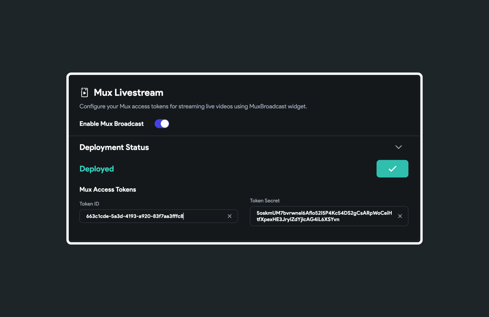

# Mux LiveStream

## Initial Setup 

To send the live stream from your device to the Mux server, you must enable the live stream here, obtain the keys and deploy it.

Here is how you can set up the Mux Livestream:

1. Navigate to **Settings and Integrations** > **Integrations** > **Mux Livestream** and enable 
   the Mux Broadcast. 

2. Now to get the access tokens, create a Mux account [here](https://dashboard.mux.com/signup).

3. Click on **Settings > API Access Tokens** (left side menu) and select **Generate new token.

4. Set the Environment to **Development** or **Production**. 

5. Checkmark the **Mux Video**. Make sure the **Write** checkbox is also selected. This gives you access to sending the live stream to the mux server.

6. Provide the **Access token name** and click **Generate Token**. 

7. Copy the **Access Token ID** and **Secret key**, return to FlutterFlow and paste both keys. Finally, hit the **Deploy** button.

<figure>
   </img>
  <figcaption class="centered-caption">Setup Mux Livestream</figcaption>
</figure>
Before releasing your app to production, create new keys (with Environment set to Production) and deploy them again.

:::info
Visit the complete guide on [**how to add a live stream feature**](integrate-mux.md)to your app.
:::