# MuxBroadcast

Adding a live-streaming or broadcast feature allows users to watch the event in real-time.
Instead of building the live-streaming from scratch, you can use the built-in widget called
**MuxBroadcast**, which is provided by FlutterFlow. The **MuxBroadcast** widget allows you to build
a
broadcast feature in minutes, and you can focus more on your app's core features.

The MuxBroadcast uses [Mux](https://www.mux.com/), an API-based video streaming service. Learn more
about [how video stream works](https://blog.flutterflow.io/flutter-mux-live-streaming/#how-does-live-streaming-work).

On this page, you'll learn how to use the MuxBroadcast widget (
by [building an example app](#building-broadcast-live-stream-app))
and [customize the MuxBroadcast](#customizing-muxbroadcast) widget.

<figure>
    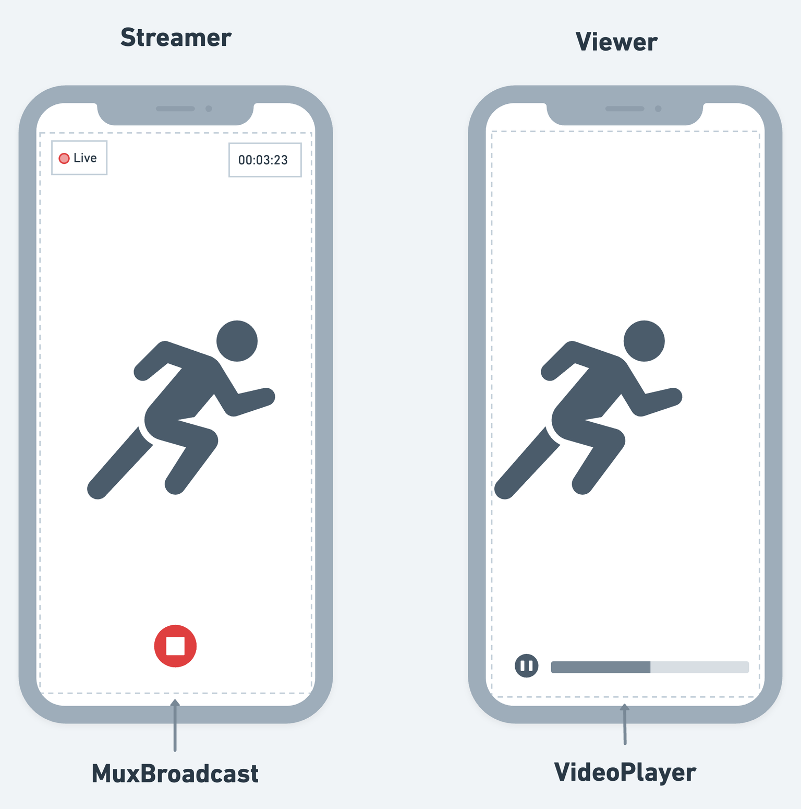
  <figcaption class="centered-caption">MuxBroadcast widget</figcaption>
</figure>

## Building broadcast (live stream) app

This section walks you through building an example app that allows users to create and watch the
live stream. The home page shows the list of all streams. If any stream is live, users will see a
broadcast icon. Tapping on a stream name will open a new page that shows a live or past stream,
whereas tapping on a floating action button navigates to a new page, and users can start
broadcasting the event.

The final app looks like this:

<figure>
    </img>>
  <figcaption class="centered-caption">Streamer on the left, Viewer on the right</figcaption>
</figure>


To build such an app, you need the following pages and a bottom sheet.

* **BroadcastListing**: This shows a list of all broadcasts.
* **BroadcastName**: A bottom sheet that allows you to set a broadcast name.
* **StartBroadcast**: This allows you to start a broadcast.
* **ViewBroadcast**: This allows you to watch a live or past broadcast.

The following flow illustrates how these pages will work together:

<figure>
    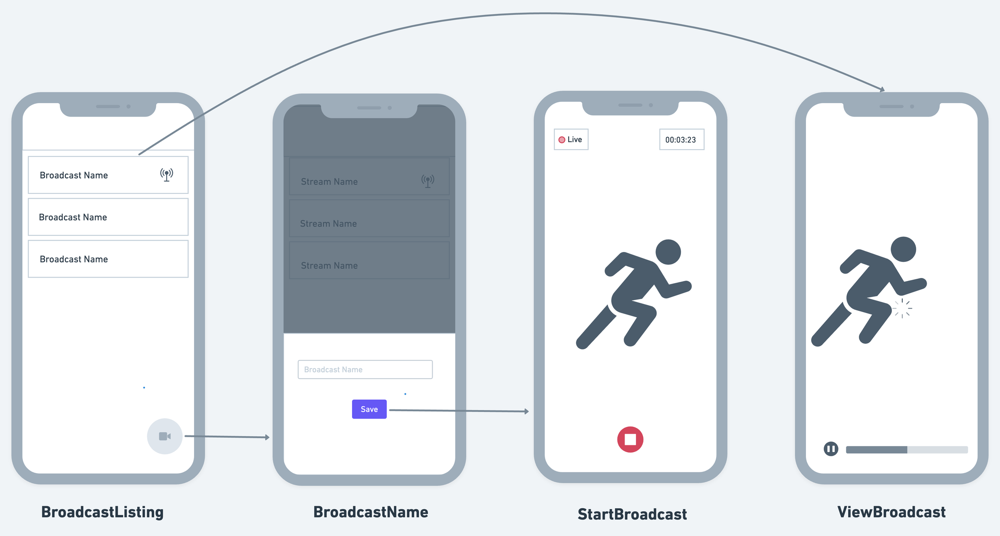
  <figcaption class="centered-caption">App Flow</figcaption>
</figure>

:::note[Prerequisites]

- [**Set up Firebase**](../../firebase/connect-to-firebase-setup.md) for your project and [**Enable Billing**](https://firebase.google.com/pricing). This is required to deploy
  the cloud functions (to your Firebase project) that will create the live
  stream on the Mux server.

- Get API keys and follow the **[initial setup](initial-setup.md)**
  :::

## Adding MuxBroadcast Widget

### 1. Creating Firestore collection

To display the broadcast list, you must store the records of created streams on your backend server.
For simplification, we will use the Firestore collection. The collection called *broadcasts* will
store the stream information, and it looks like this:

The steps to create a collection are as follows:

- Be familiar with [**Structuring the Firebase Database**](../../database/cloud-firestore/getting-started.md#structuring-the-database).
- Create a [**Collection**](../../database/cloud-firestore/creating-collections.md) and provision at least four fields that store broadcast information
  such as `is_live`, `name`, `url`, and `time` (this will be used to filter the list by latest
  stream first).
  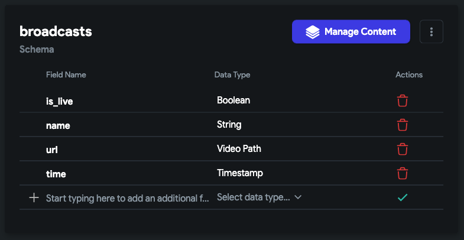

### 2. Building UI

Now, it's time to start building the UI. Here, we will build the UI for all the pages and the bottom
sheet. Let's see how to do that:

#### 2.1 BroadcastListing Page

On this page:

1. Add the **ListView** to show all broadcasts.

    * Inside the ListView, add
      the **Card** > **Row** > **Text** (to show stream name) and Icon (to indicate if the stream is live).

2. Add the **FloatingActionButton**
   to open a bottom sheet.

After adding, it should look similar to this:

<figure>
    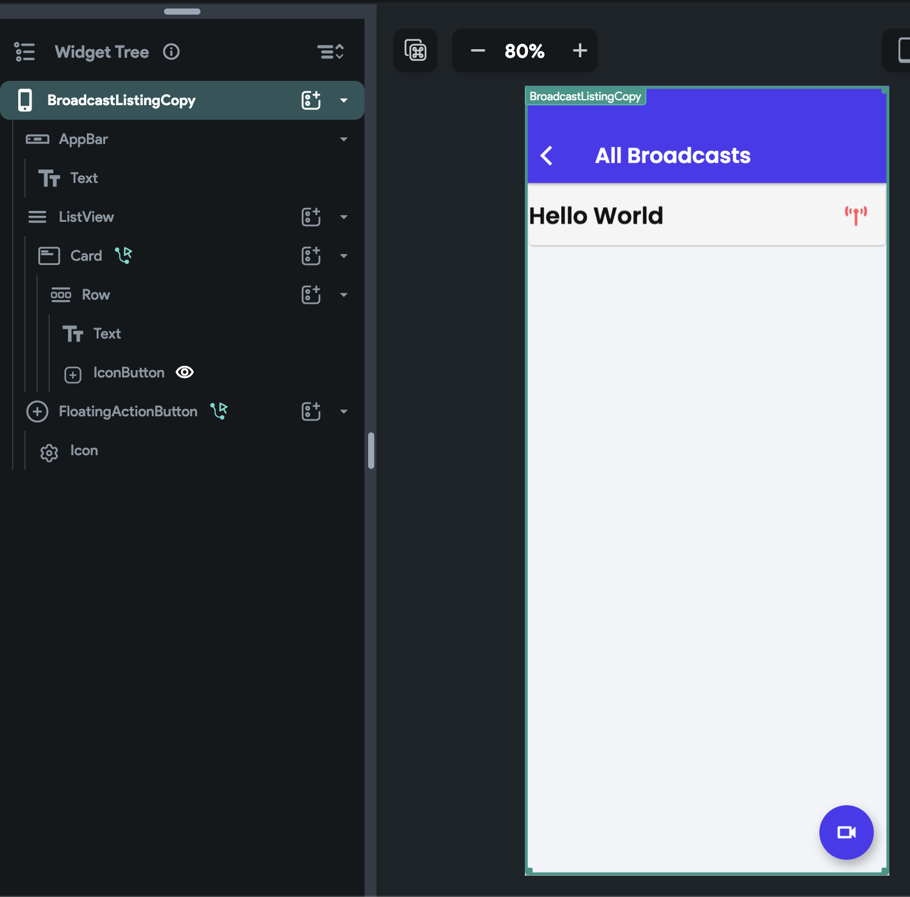
  <figcaption class="centered-caption">BroadcastListing Page</figcaption>
</figure>

#### 2.2 BroadcastName (BottomSheet Component)

This will be used to get the stream name from users.

Create a new component called *BroadcastName*which will be used as
a **Bottom sheet**. Inside the component, add a **TextField** and a **Button**.

It should look like this:

<figure>
    
  <figcaption class="centered-caption">BroadcastName (BottomSheet Component)</figcaption>
</figure>

#### 2.3 StartBroadcast Page

This page hosts the MuxBroadcast widget that is responsible for starting and stopping the live
broadcast.

To add the MuxBroadcast widget, drag the **MuxBroadcast** widget from the **Base Elements** tab (in
the Widget Panel) or add it directly from the widget tree.

Here's how it looks:

<figure>
    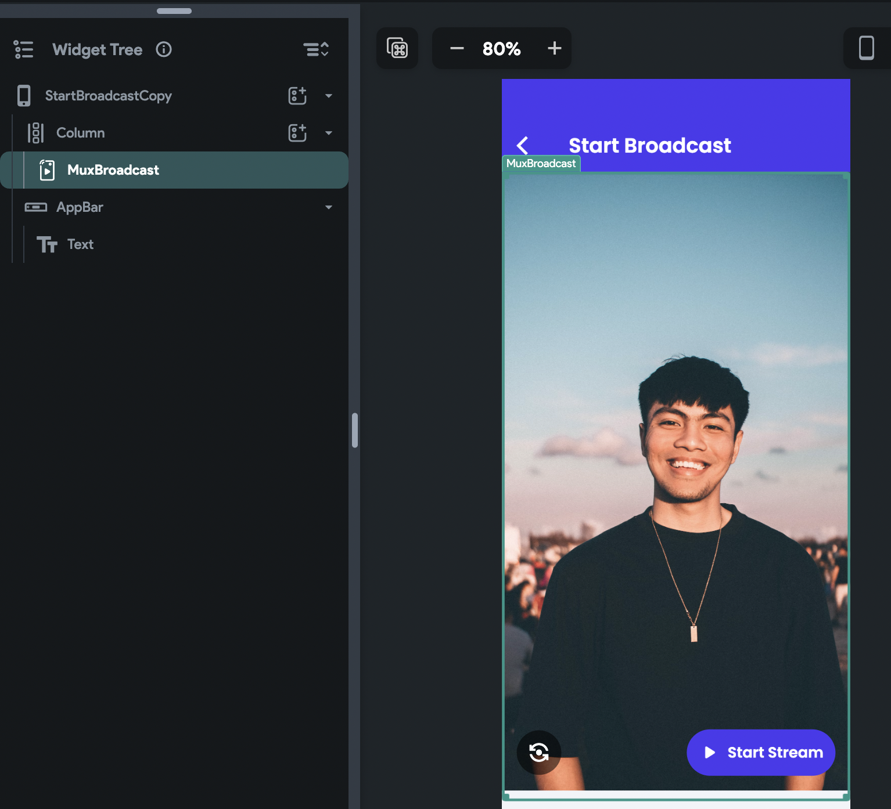
  <figcaption class="centered-caption">StartBroadcast Page</figcaption>
</figure>

#### 2.4 ViewBroadcast Page

This page hosts the **VideoPlayer** widget showing the live or past stream.

On this page, add the **VideoPlayer**
widget and remove its height and width (This will make it fullscreen).

<figure>
    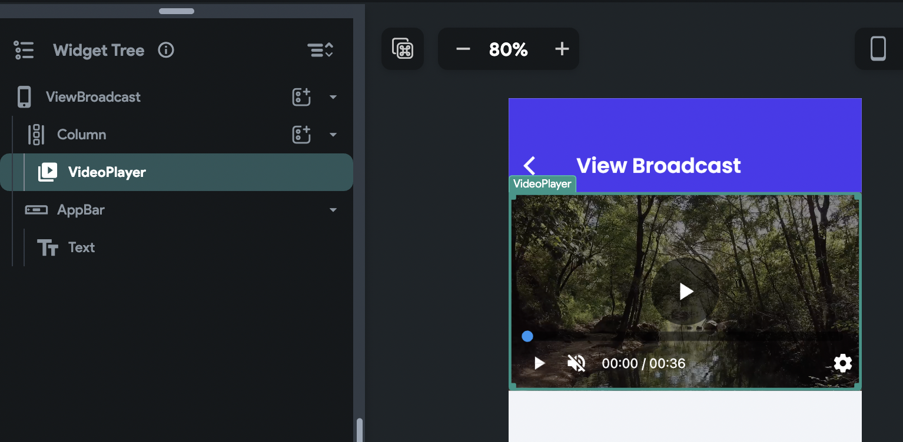
  <figcaption class="centered-caption">ViewBroadcast Page</figcaption>
</figure>

### 3. Retrieve broadcast list

Once the UI is ready, you can retrieve and display the broadcast listing from the Firestore
collection into ListView. Here you will display the list by the latest stream first and show/hide
the broadcast icon based on whether the stream is live.

To do so:

1. [Query a collection](../../../resources/control-flow/backend-logic/backend-query/query-collection.md)
   called *broadcasts* on a ListView.
2. Order the collection by *time* field.
3. [Add the conditional visibility](../../../resources/ui/widgets/widget-commonalities.md#visibility)
   on an icon (that indicates if the stream is live) based on the *is_live* field.

</img>>

### 4. Navigate to the StartBroadcast page

When you click the FloatingActionButton, you won't navigate straight to the StartBroadcast page.
Instead, you will first open the bottom sheet that will accept the broadcast name, and when a
button (inside the bottom sheet) is pressed, you'll navigate to the StartBroadcast page with a
broadcast name as a parameter.

To do so:

1. Select the FloatingActionButton and add
   an action to open the bottom sheet (createdin [4.2])

<figure>
    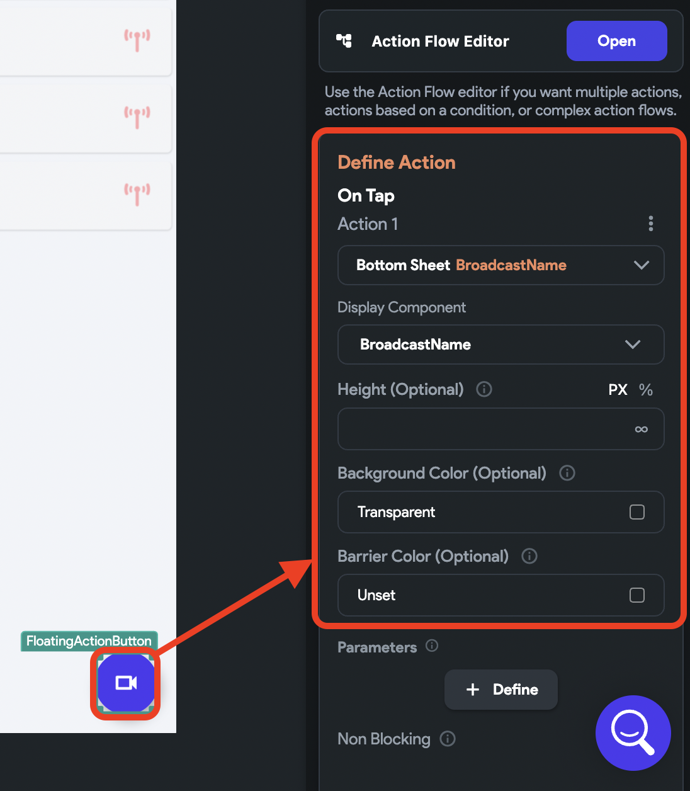
  <figcaption class="centered-caption">Action to open bottom sheet</figcaption>
</figure>

2. Now, on click of a button (inside the bottom sheet,) add
   an action to Navigate to the StartBroadcast page.

    * Inside this action, click on the **Define** button. This will open the StartBroadcast page,
      where you can define a parameter that will accept the stream name.
    * After defining the parameter, open this action again and pass its value **From Variable >
      Widget State > [TextField name]**.

3. Add one more action to dismiss the bottom sheet.

<figure>
    </img>>
  <figcaption class="centered-caption">Navigating StartBroadcast page</figcaption>
</figure>

### 5. Adding broadcast action (start and stop)

On the StartBroadcast page, you have the MuxBroadcast widget (already added in
step 4.3). You
can use this widget to add the following broadcast actions:

* **On Broadcast Start**: Triggers when you click on the start the broadcast button.
* **On Broadcast Stop**: Triggers when you click on the stop broadcast button.

We will use the **On Broadcast Start** to create a new document inside the *broadcast* collection
and **On Broadcast Stop** to update the same document to indicate the broadcast is ended.

To create a new document when the broadcast is started:

1. Select the **MuxBroadcast** widget from the widget tree or canvas area.

2. Select **Actions** from the Properties Panel (the right menu), and click **Open**. This will open
   an **Action flow Editor** in a new popup window.

3. Under the **On Broadcast Start:**

    - Add the Create Document action.
    - Set the collection to *broadcasts*.
    - Click on the **+ Add Fields** button and set the value of the field as per the following:
        - **is_live** > Specific Value > True.
        - **name** > From Variable > broadcastName (page parameter name).
        - **url** > From Variable > Widget State > Mux Playback URL (This holds the URL of the
          Livestream and is available when you add the MuxBroadcast widget).
        - **times** > Global Properties > Current Time.
    - Enter the **Action Output Variable Name** as *broadcastOutput* (This will be used to update
      this document in the next step).

<figure>
</img>>
  <figcaption class="centered-caption">Creating a document when a broadcast is started</figcaption>
</figure>

When the broadcast is stopped, you must update the same document for the *is_live* field with
False. To do so:

1. Select the **MuxBroadcast** widget from the widget tree or canvas area.
2. Select **Actions** from the Properties Panel (the right menu), and click **Open**. This will open
   an **Action flow Editor** in a new popup window.
3. Under the **On Broadcast Stop:**

    - Add
      the [Update Document](../../database/cloud-firestore/firestore-actions.md#update-document-action)
      action.
    - Set the reference to Action Outputs > broadcastOutput (action output variable name set in
      previous step) > Reference.
    - Click on the **+ Add Fields** button and set the **is_live** > Specific Value > False.

4. Also, add one more action to **Navigate Back**.

<figure>
    </img>
  <figcaption class="centered-caption">Updating a document when a broadcast is stopped</figcaption>
</figure>

### 6. Adding Mux APIs

If the broadcast is live, you can navigate straight to the ViewBroadcast page with the playback URL
and watch the live stream, but if the broadcast is ended, you can't use the same URL. Hence, you
must retrieve the URL of the ended stream.

To do that, first, you need to retrieve the live stream Id based on its current playback Id and then
use it to get the playback Id of the ended stream.

Here's the flow to retrieve playback Id of an ended stream:

<figure>
    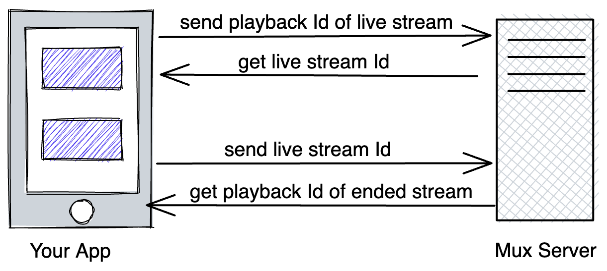
  <figcaption class="centered-caption">Flow to retrieve playback of an ended stream</figcaption>
</figure>

You can achieve this by adding the following two APIs to your project:

* [**getLiveStreamId**](https://docs.mux.com/api-reference/video#operation/get-asset-or-livestream-id): Returns live
  stream Id based on the current playback Id.
* [**getPastLiveStream**](https://docs.mux.com/api-reference/video#operation/list-assets): Returns
  playback id of ended stream based on the live stream Id.

:::info

* Learn more about adding [**APIs**](../../../resources/control-flow/backend-logic/api/rest-api.md) to your project.
* These APIs will be used in [**step 8**](#8-navigate-to-the-viewbroadcast-page).
  :::

Here's how both the APIs should look:

<figure>
    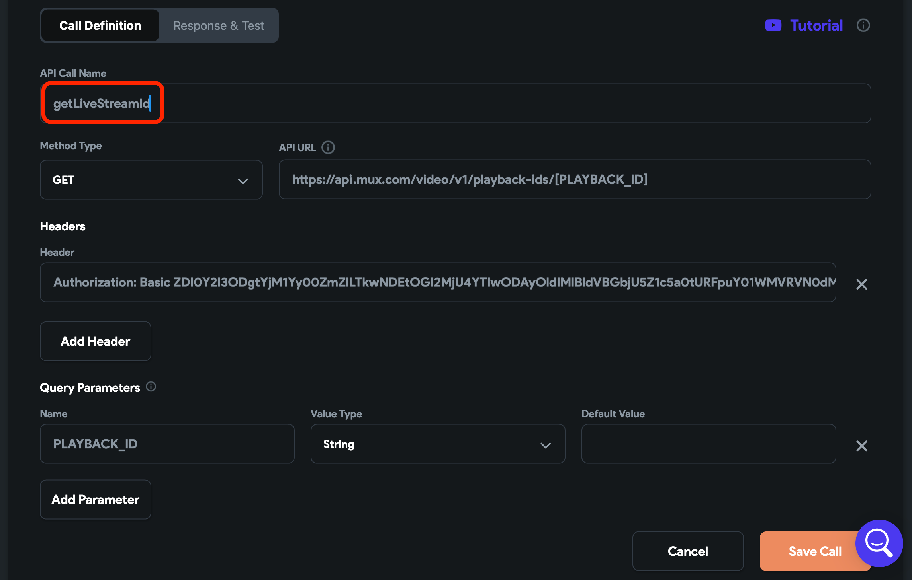
  <figcaption class="centered-caption">getLiveStreamId</figcaption>
</figure>

<figure>
    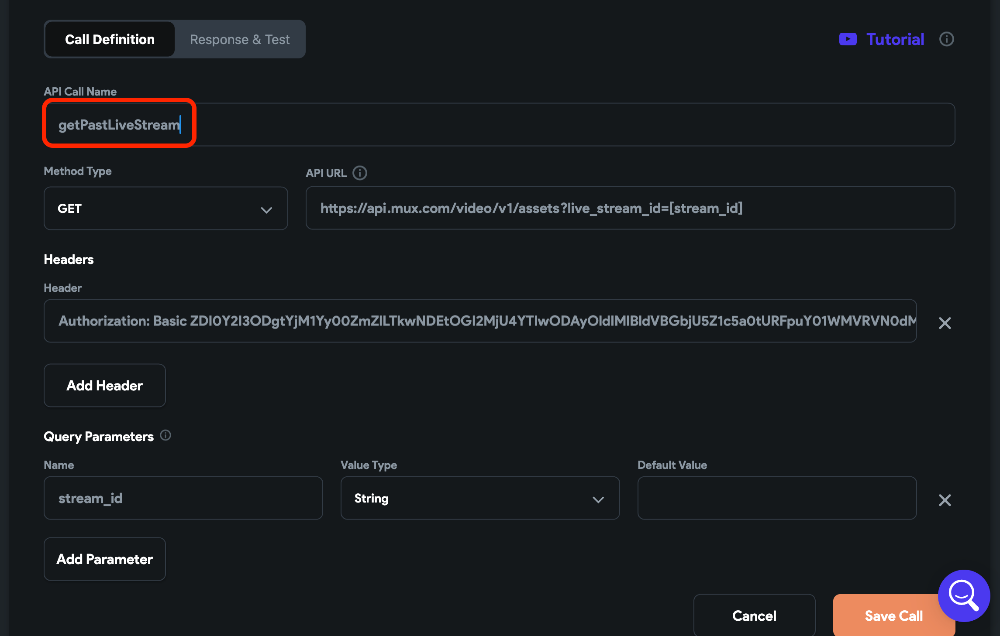
  <figcaption class="centered-caption">getPastLiveStream</figcaption>
</figure>

And here is the JSON path you can use to extract the required value.

* To retrieve live stream Id from **getLiveStreamId** API result,Use `$.data.object.id`
* To retrieve past Id from **getPastLiveStream** API result**,** Use `$.data[0].playback_ids[0].id`

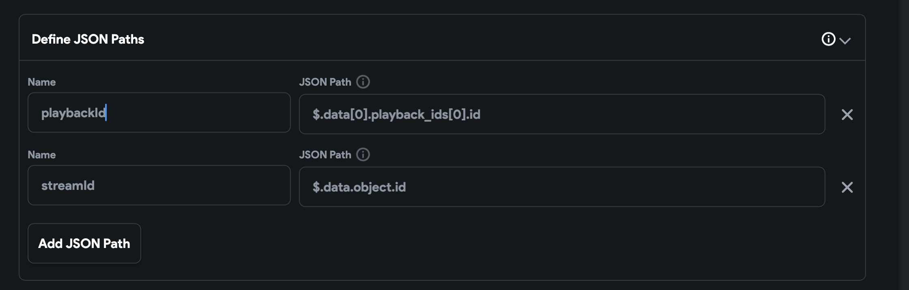

You can get the Authorization token by performing base64 encoding on your 'MUX_TOKEN_ID:
MUX_TOKEN_SECRET'. You can also use [this](https://www.base64encode.org/) online tool to do just
that.

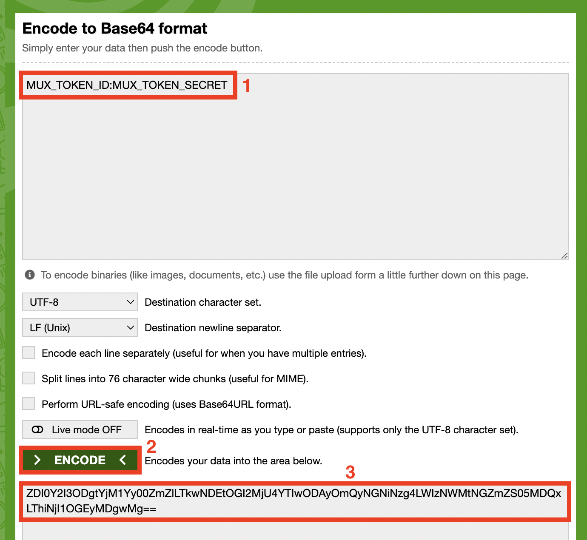

### 7. Adding Custom Functions

The typical live stream URL looks like this:

Copy

```
https://stream.mux.com/{PLAYBACK_ID}.m3u8
```

When you call the APIs created in the previous step, you will need to extract the playback Id from
the URL and create the URL back from the playback Id.

To achieve this, you
can [create two custom functions](../../../ff-concepts/adding-customization/custom-functions.md) that look
like the below:

1. getPlaybackIdFromUrl

<figure>
    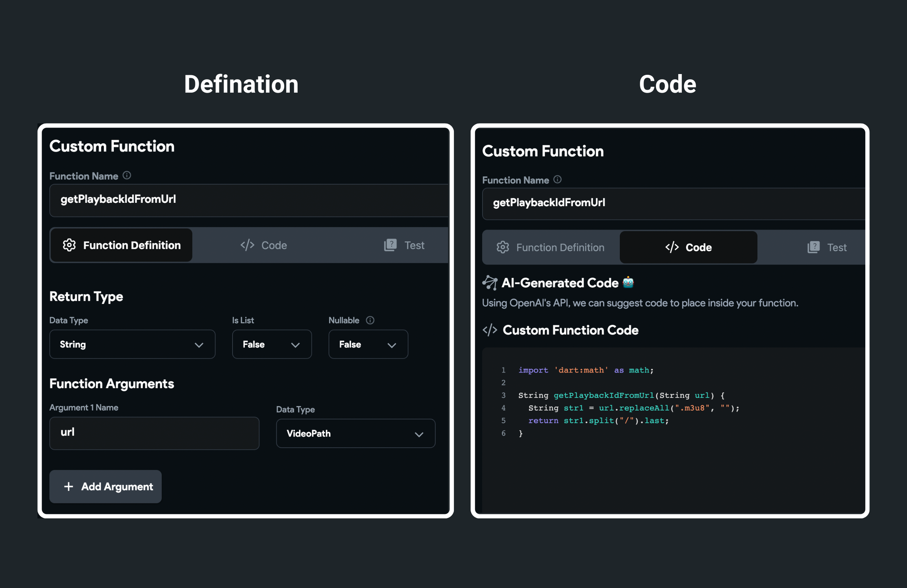
  <figcaption class="centered-caption">getPlaybackIdFromUrl</figcaption>
</figure>

2. createUrlFromPlaybackId

<figure>
    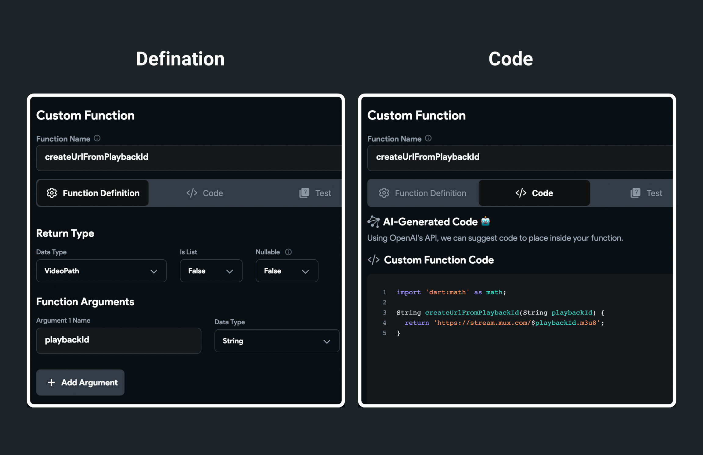
  <figcaption class="centered-caption">createUrlFromPlaybackId</figcaption>
</figure>

We will see how to use these functions in the next step.

### 8. Navigate to the ViewBroadcast page

On tapping the broadcast name card (inside the ListView), you will navigate to the ViewBroadcast
page and pass the URL of the broadcast. The URL you will pass depends on whether the broadcast is
live.

To navigate to the ViewBroadcast page and pass the URL of the live or past stream:

1. Select the Card widget from the widget tree or canvas area.
2. Open the action flow editor and click on the **+ Add Conditional Action**.
3. Select the **broadcasts Document > is_live**.
4. Under the **TRUE** section:

    * Add an action to navigate to the ViewBroadcast page. **Note**: While doing so, define the
      parameter **url** on the ViewBroadcast page. This will be used to pass the playback URL of
      the video.

5. Under the **FALSE** section:

    - First, add the **getLiveStreamId** API call, use the **getPlaybackIdFromUrl** custom function
      to pass the current playback Id of the stream, and save the response by providing the *
      *Action Output Variable Name**.
    - Next, add the **getPastLiveStream** API call and pass the live stream Id from the action
      output variable of a previous API call.
    - Finally, add an action to navigate to the ViewBroadcast page. **Note**: While doing so, use
      the **createUrlFromPlaybackId** custom function to pass the URL created using the playback
      Id (retrieved in the previous API call). Also, ensure you have defined the parameter **url**
      on the ViewBroadcast page.

:::info[CLONABLE APP]
Get the clonable version of this app [**here
**](https://app.flutterflow.io/project/my-live-stream-u7blmw).
:::

## Run & Test

To play the video on the ViewBroadcast widget, Select the VideoPlayer widget, set the Path from a
variable, and use the page parameter.

Now you can run the app and test your widget.

:::info
Mux Livestream can not be tested in Run Mode. Instead, you will need
to **test it on real device devices**.
:::

## Customizing MuxBroadcast

You can customize the appearance and behavior of this widget using the various properties available
under the [Properties Panel](../../../intro/ff-ui/builder.md#properties-panel).

### Show streaming view

On the canvas, when you add this widget, it shows the 'Before streaming' view (i.e., flip camera and
a start streaming button). To see how it will look when the stream is started, you can turn on this
option from the [Properties Panel](../../../intro/ff-ui/builder.md#properties-panel).

<figure>
    </img>
  <figcaption class="centered-caption">Show streaming view</figcaption>
</figure>

### Broadcast audio channel

This option allows you to decide the type of audio recording while you broadcast. You can choose
between **Mono** and **Stereo**. By default, it is set to stereo which can provide a better
listening experience.

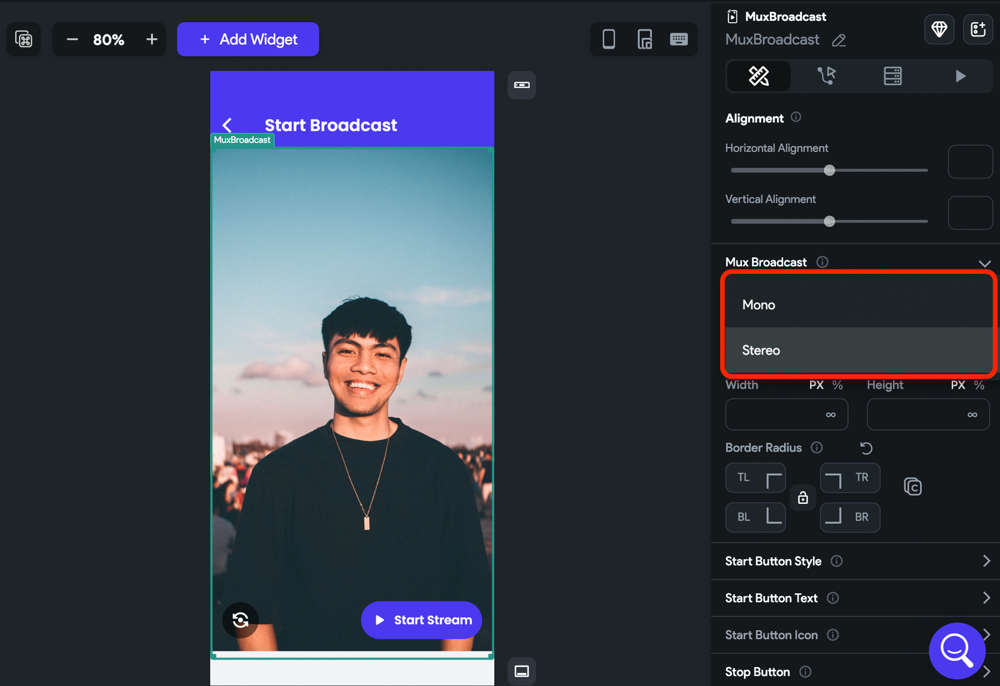

### Changing size

By default, this widget occupies all the available space (i.e. fullscreen). To change its size, you
can use the **Height** and **Width** property.

### Border Radius

To create a rounded border around this widget, use this property. Toggle the lock icon () to edit
all values together or individually.

<figure>
    </img>
  <figcaption class="centered-caption">Border Radius</figcaption>
</figure>

### Customizing start button

To customize a button that allows you to start a stream:

1. Select the **MuxBroadcast** widget and move to the properties panel.

2. To change the button's appearance such as size, color, elevation, and border, use the properties
   under the **Start Button Style** section.

3. To change the button's text, open the **Start Button Text** section and set the **Text**. You can
   also [customize the text](../../../resources/ui/widgets/basic-widgets/text.md#common-text-styling-properties) if
   needed.

4. To change the button's icon, open the **Start Button Icon** section and select the new icon. You
   can also change its **Size** and **Color**.

<figure>
    </img>
  <figcaption class="centered-caption">Customizing start button</figcaption>
</figure>

### Customizing stop button

To customize a button that allows you to stop a stream:

1. Find the **Stop Button** section. From here, you can change the icon, size, and color.

2. By default, the background color of the stop button is set to red. To change, use the *
   *Background Color** property.

<figure>
    </img>
  <figcaption class="centered-caption">Customizing stop button</figcaption>
</figure>

### Customizing the flip camera button

The flip camera button allows you to toggle the front and back camera of your device before you
start broadcasting.

To customize this button's appearance, open the **Flip Camera Button** section and use the property
such as **Icon**, **Icon size**, **Icon Color**, and **Background Color**.

<figure>
    </img>
  <figcaption class="centered-caption">Customizing the flip camera button</figcaption>
</figure>

### Customizing live indicator

The live indicator appears as soon as you start live streaming (at the top left side of the screen).

To customize the live indicator:

* To change its text (i.e. from LIVE to something else), open the **Live Text Style** section and
  set the **Text**. You can also [customize the text](../../../resources/ui/widgets/basic-widgets/text.md#common-text-styling-properties) if
  needed.
* To change the indicator appearance, open the **Live Container & Icon** section and use the
  property such as **Icon**, **Icon size**, **Icon Color**, **Background Color**, and **Border
  Radius**.

<figure>
    </img>
  <figcaption class="centered-caption">Customizing live indicator</figcaption>
</figure>

### Customizing duration indicator

The duration indicator appears as soon as you start live streaming (at the top right side of the
screen).

To customize the duration indicator:

1. Open the **Duration Text Style** section
   and [change its text style](../../../resources/ui/widgets/basic-widgets/text.md#common-text-styling-properties).
2. To change the indicator appearance, open the **Duration Container** section and use the property
    such as **Background Color** and **Border Radius**.

<figure>
    </img>
  <figcaption class="centered-caption">Customizing duration indicator</figcaption>
</figure>

Additionally, you can also add padding, alignment, show/hide this widget from the Properties Panel. 
