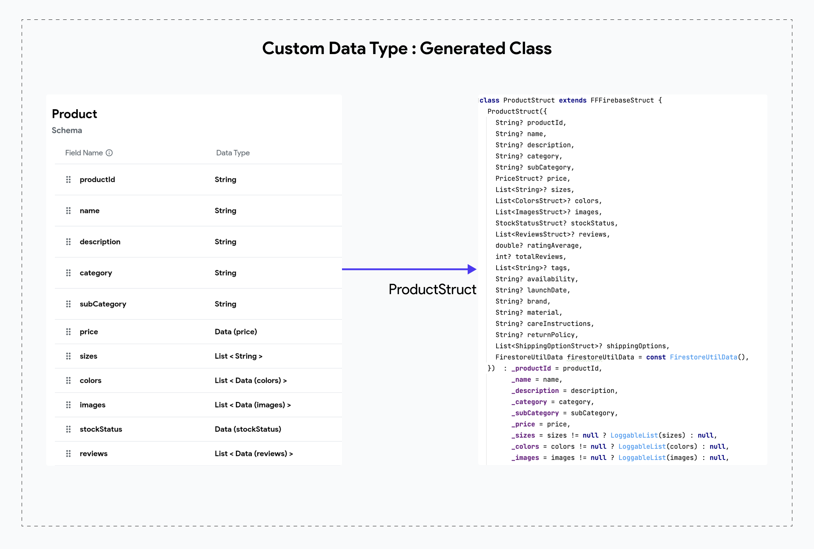

# DataTypeStruct class

:::info[Prerequisites]
This guide uses example of the generated code of the **[EcommerceFlow demo app](https://bit.ly/ff-docs-demo-v1)**. To view the generated code directly, check out the **[Github repository](https://github.com/FlutterFlow/sample-apps/tree/main/ecommerce_flow)**.
:::

When you create a custom data type in the FlutterFlow editor, a corresponding class is generated in the code to act as a structured container for your data, similar to a `Struct`. This class includes simple getters and setters for each field. For example, if your data type in FlutterFlow is named "Product", the generated class will be named `ProductStruct` and can be found in the `product_struct.dart` file.

