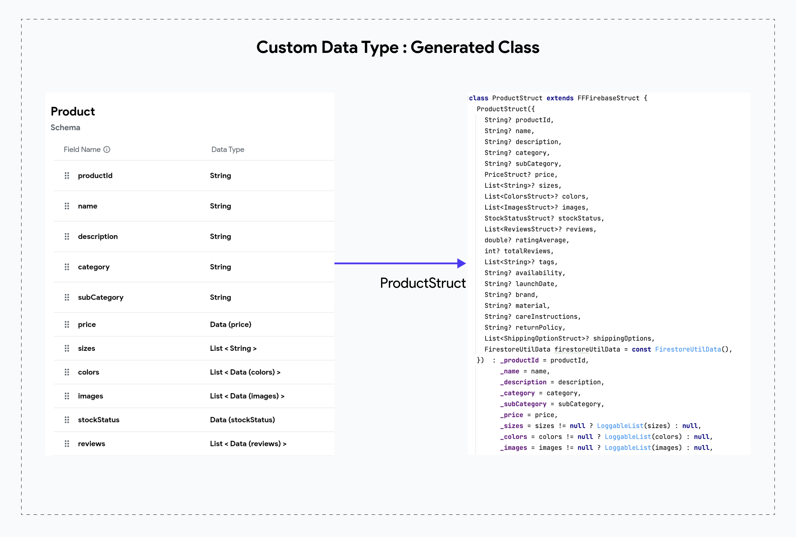

# DataTypeStruct class

:::info[Prerequisites]
This guide uses example of the generated code of the **[EcommerceFlow demo app](https://bit.ly/ff-docs-demo-v2)**. To view the generated code directly, check out the **[Github repository](https://github.com/FlutterFlow/sample-apps/tree/main/ecommerce_flow)**.
:::

When you create a custom data type in the FlutterFlow editor, FlutterFlow generates a corresponding Struct class under `lib/backend/schema/structs/`. For example, a data type named "Product" generates `ProductStruct` in `product_struct.dart`.

The generated class includes a constructor, typed field getters and setters, `has<Field>()` helpers, map and serializable-map conversion, equality support, and field-specific helpers where applicable. Numeric fields can receive increment helpers, while lists and nested Structs can receive update helpers. Firestore-specific conversion code is included only when the project uses Firestore.

## Related documentation

See [Component Model](/generated-code/component-model) for a related FlutterFlow workflow.
